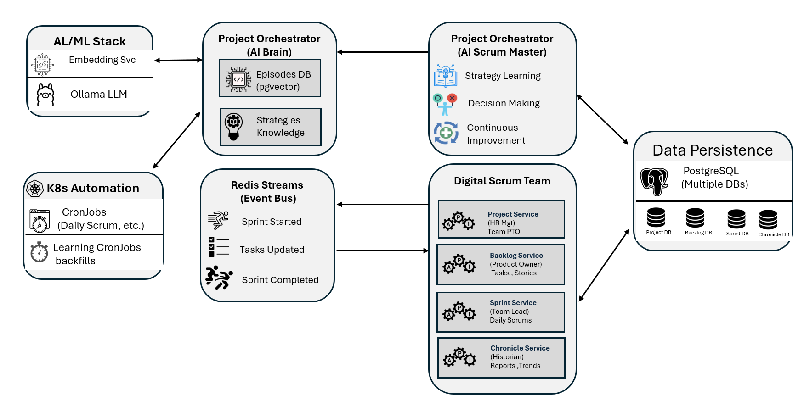

# Digital Scrum Master (DSM)

**An open-source Digital Scrum Master: an AI agent that runs your sprints end-to-end on Kubernetes.**

DSM is a production-grade microservices ecosystem where an intelligent AI agent orchestrates complete Agile workflows—from project kickoff through sprint execution to retrospectives—using REST APIs, Redis Streams, and a learning agent "brain."

Built for engineers exploring **agentic orchestration**, **event-driven microservices**, **Kubernetes-native applications**, and **AI in the SDLC**.


---

## The Problem DSM Solves

Most "AI project management" demos stop at generating tickets or chat interfaces. They don't actually *run* a sprint, make autonomous decisions, or learn from outcomes.

**DSM goes further:** It simulates a complete digital Scrum team with an AI that plans sprints, tracks daily progress, learns from retrospectives, and continuously improves its strategies. Because it's **API-driven by design**, DSM can easily integrate with real project management tools like **JIRA, Asana, Trello, and Monday.com**—calling their APIs to orchestrate projects and provide intelligent insights on live data.

**🤖 True Agentic Intelligence**  
Not just LLM wrappers—DSM's orchestrator uses episodic memory (pgvector), a strategy knowledge base, and continuous learning loops to make informed decisions and improve over time.

**🔄 Event-Driven Architecture at Scale**  
Hybrid REST + Redis Streams design demonstrates real-world event-driven patterns: asynchronous task updates, sprint events, and eventual consistency across services.

**☸️ Kubernetes-Native Infrastructure**  
Running on K8s isn't just deployment—it's the foundation for resilience, horizontal scaling, resource management, and production-grade patterns like Pod Disruption Budgets and health checks.

**🏗️ Production-Ready Patterns**  
Database-per-service, circuit breakers, structured logging, observability guidance, and comprehensive documentation make this a reference architecture, not a toy demo.

**🔌 Integration-Ready Design**  
RESTful APIs for every service mean DSM can connect to external systems—fetch real project data from JIRA, sync backlogs with Asana, or export insights to Monday.com.


---

## Key Features

**Digital Scrum Team as Microservices**
- **Project Service** (HR Manager): Master data for teams, roles, PTO, holidays
- **Backlog Service** (Product Owner): Manages product backlog and task prioritization
- **Sprint Service** (Team Lead): Runs sprint lifecycle and daily scrum simulations
- **Chronicle Service** (Historian): Archives reports and historical project data
- **Project Orchestrator** (AI Scrum Master): Learning agent with episodic memory and strategy evolution
- **Embedding Service** (Knowledge Processor): Generates vector embeddings for AI memory

**Agentic AI Orchestrator**
- Episodic memory using pgvector for semantic search ("What did I do in similar situations?")
- Strategy knowledge base that codifies successful patterns
- Continuous learning loop that analyzes outcomes and evolves strategies
- Performance tracking to measure and improve decision quality

**Hybrid Architecture**
- REST APIs for synchronous workflows (project creation, sprint planning)
- Redis Streams for asynchronous events (`TASK_UPDATED`, `SprintStarted`)
- Database-per-service pattern for autonomy and isolation
- Circuit breakers for resilience and graceful degradation

**Production Concerns**
- Comprehensive health checks (liveness + readiness probes)
- Structured JSON logging with correlation IDs
- Resource limits and requests for all services
- Pod Disruption Budgets for critical components
- Golden signals guidance for monitoring (latency, errors, traffic, saturation)

---

## Architecture at a Glance

DSM is built as a set of microservices running on Kubernetes, with an AI “Scrum Master” orchestrator, a digital Scrum team of services, and an agent brain backed by PostgreSQL + pgvector and Redis Streams.



For a deep dive into all diagrams (service dependencies, Kubernetes layout, agent brain, and flows), see:
- [Architecture Overview](docs/DSM_Architecture_Overview.md) - Complete technical architecture
- [Event Design](docs/DSM_Pragmatic_Event_Design_details.md) - Event-driven patterns

- 
---

## Quick Start (30-Minute Setup)

### Prerequisites
- Docker installed
- Local Kubernetes cluster (`kind`, `minikube`, or `Docker Desktop`)
- `kubectl` configured
- 8GB+ RAM available for the cluster

### Step 1: Clone the Repository
```bash
git clone https://github.com/vency-ai/agentic-scrum.git
cd agentic-scrum
```

### Step 2: Deploy Infrastructure
Create the namespace and deploy databases, Redis, and Ollama:
```bash
kubectl apply -f setups/00-namespace.yml
kubectl apply -f db/
kubectl apply -f agent-ai/ollama/
```

Wait for databases and Ollama to be ready:
```bash
kubectl wait --for=condition=ready pod -l app=project-db -n dsm --timeout=300s
kubectl wait --for=condition=ready pod -l app=ollama -n dsm --timeout=300s
```

### Step 3: Deploy Services
Deploy all microservices:
```bash
kubectl apply -f services/project-service/k8s/
kubectl apply -f services/backlog-service/k8s/
kubectl apply -f services/sprint-service/k8s/
kubectl apply -f services/chronicle-service/k8s/
kubectl apply -f services/project-orchestrator/k8s/
kubectl apply -f agent-ai/embedding-service/k8s/
```

### Step 4: Verify Deployment
Check that all services are running:
```bash
kubectl get pods -n dsm
```

Deploy a debug pod to test connectivity:
```bash
kubectl apply -f Debug-tools/debug-curl-pod.yml
kubectl exec -it debug-pod -n dsm -- curl -s http://project-orchestrator.dsm.svc.cluster.local/health/ready | jq
```

### Step 5: Run Your First Project
Trigger the orchestrator to create and run a complete project:
```bash
kubectl exec -it debug-pod -n dsm -- curl -X POST \
  http://project-orchestrator.dsm.svc.cluster.local/orchestrate/project/1 | jq
```

**What happens next:**
1. AI agent analyzes project requirements
2. Creates backlog with prioritized tasks
3. Plans and starts sprint
4. Daily scrums run automatically via CronJob
5. Sprint closes with retrospective analysis
6. Agent learns from outcomes and updates strategies

For detailed deployment steps and troubleshooting, see the [**Full Setup Guide**](docs/DSM_Setup_guide.md).

---

## Onboarding Path

**New to the project? Here's your learning path:**

1. **Start Here (5 min):** Read this README
2. **Understand Capabilities (10 min):** [Functional Overview](docs/DSM_Functional_Overview.md) - what DSM does and why
3. **Grasp Architecture (20 min):** [Architecture Overview](docs/DSM_Architecture_Overview.md) - services, flows, patterns
4. **Deploy Locally (30 min):** Follow Quick Start above
5. **Dive Deeper (as needed):**
   - **For Architects:** [Data Architecture](docs/DSM_Data_Architecture.md), [Event Design](docs/DSM_Pragmatic_Event_Design.md)
   - **For AI Engineers:** [Agent Architecture](docs/crs/CR_Agent_Architecture_Design.md), [Strategy Learning](docs/crs/CR_Agent_Strategy_Layer.md)
   - **For DevOps/SRE:** [Deployment Guide](docs/DSM_Deployment_Operations.md), [Resilience Patterns](docs/DSM_Resilience_Patterns.md)
   - **For Developers:** [Service Specifications](docs/DSM_Service_Specifications.md), [API Reference](docs/DSM_Architecture_Overview.md#8-service-communication-reference)

**Recommended exploration order:**
- Week 1: Deploy and observe a full sprint lifecycle
- Week 2: Examine agent decision logs and strategy evolution
- Week 3: Modify a service or add custom strategies
- Week 4: Integrate with external APIs (JIRA/Asana simulation)

---

## Repository Structure
```
agentic-scrum/
├── docs/              # Complete architecture and design documentation
├── services/          # Core microservices (Project, Backlog, Sprint, Chronicle, Orchestrator)
├── agent-ai/          # AI components (Embedding Service, Ollama)
├── db/                # Database schemas, migrations, and K8s manifests
├── cronjobs/          # Kubernetes CronJobs for scheduled tasks
├── pdb/               # Pod Disruption Budgets for service resilience
├── scripts/           # Helper scripts for data operations and testing
├── Debug-tools/       # Debugging pods and tools for K8s cluster
└── setups/            # Initial cluster setup and namespace configs
```

---

## Real-World Integration Examples

**Connect to JIRA:**
```python
# Fetch live JIRA issues and let DSM plan the sprint
jira_tasks = jira_api.get_project_issues(project_key="PROJ")
dsm_response = requests.post(
    "http://orchestrator/orchestrate/project/1",
    json={"external_tasks": jira_tasks}
)
```

**Sync with Asana:**
```python
# Push DSM sprint insights back to Asana
sprint_summary = requests.get("http://chronicle/notes/sprint_retrospective/1").json()
asana_api.create_task(
    project_id="12345",
    name="Sprint 1 Retrospective",
    notes=sprint_summary["insights"]
)
```

DSM's API-first design means you can plug it into any workflow.

---
---

##  Kubernetes Role in DSM

Kubernetes isn't just a deployment platform—it's integral to DSM's architecture:

- **High Availability:** Multi-replica services with Pod Disruption Budgets ensure critical components (Sprint Service) stay operational during updates
- **Resource Isolation:** Explicit CPU/memory limits prevent resource contention between AI workloads (Ollama) and core services
- **Self-Healing:** Liveness and readiness probes automatically restart unhealthy pods and stop routing traffic to degraded services
- **Scalability:** Stateless services can horizontally scale based on load; StatefulSets provide stable identities for databases
- **Service Discovery:** Built-in DNS enables seamless service-to-service communication without hardcoded IPs
- **Declarative Infrastructure:** GitOps-ready manifests make the entire system reproducible and versionable 
>This makes DSM a realistic example of cloud-native AI orchestration, not just a Docker Compose experiment.
---
## Status and Roadmap

### ✅ Current Capabilities (v2.0)
- Full microservice stack on Kubernetes
- Agentic orchestrator with episodic memory and strategy learning
- Event-driven Sprint ↔ Backlog synchronization
- Circuit breakers for critical dependencies
- Comprehensive health checks and structured logging
- Multi-replica services with Pod Disruption Budgets

### 🚀 Roadmap 
- Move to event-first architecture (command/event pattern, saga orchestration)
-  Multi-agent personas (separate AI roles for PO/SM/Dev)
-  API Gateway with authentication and rate limiting
-  Advanced observability (distributed tracing, custom dashboards)

See the [**Project Roadmap**](docs/ROADMAP.md) for detailed plans.

---

## Who Should Use DSM?

**Perfect for:**
- **Platform Engineers** building AI-native infrastructure
- **Architects** designing event-driven microservices
- **AI/ML Engineers** exploring agentic systems and RAG patterns
- **DevOps Teams** learning Kubernetes-native application patterns
- **Technical Leaders** seeking reference architectures for AI orchestration

**Not (yet) for:**
- Production project management (this is a learning/reference system)
- Non-technical users (requires K8s and software engineering knowledge)
- Teams needing plug-and-play tools without customization

---

## Documentation Hub

### 🏗️ Core Architecture
- [Functional Overview](docs/DSM_Functional_Overview.md) - Capabilities and use cases
- [Architecture Overview](docs/DSM_Architecture_Overview.md) - Complete technical architecture
- [Data Architecture](docs/DSM_Data_Architecture.md) - Database schemas and models
- [Event Design](docs/DSM_Pragmatic_Event_Design.md) - Event-driven patterns

### 🤖 AI & Intelligence
- [Agent Architecture](docs/crs/CR_Agent_Architecture_Design.md) - Learning agent brain
- [Strategy Layer](docs/crs/CR_Agent_Strategy_Layer.md) - How strategies evolve
- [Memory System](docs/crs/CR_Agent_Memory_System.md) - Episodic memory with pgvector

### 🚀 Operations
- [Deployment Guide](docs/DSM_Deployment_Operations.md) - Production deployment patterns
- [Resilience Patterns](docs/DSM_Resilience_Patterns.md) - Circuit breakers and fault tolerance
- [Service Specifications](docs/DSM_Service_Specifications.md) - Complete API reference

---

## Contributing

We welcome contributions from the community! Whether it's bug reports, feature requests, documentation improvements, or code contributions, your input helps make DSM better.

**How to contribute:**
1. **Report Issues:** Use [GitHub Issues](https://github.com/vency-ai/agentic-scrum/issues) for bugs, questions, or feature requests
2. **Submit Pull Requests:** Fork the repo, create a feature branch, and submit a PR with a clear description
3. **Improve Documentation:** Fix typos, clarify explanations, or add missing examples
4. **Share Use Cases:** Tell us how you're using or adapting DSM

**Before submitting large changes:**
- Open an issue to discuss your proposal
- Reference relevant design docs from the `docs/` directory
- Ensure your changes align with the project's architectural principles

---

## License

This project is licensed under the **MIT License** - see the [LICENSE](LICENSE) file for details.

You're free to use, modify, and distribute DSM for personal, educational, or commercial purposes.

---

## Connect & Learn More

- **GitHub Repository:** [github.com/vency-ai/agentic-scrum](https://github.com/vency-ai/agentic-scrum)
- **Documentation:** [docs/DSM_Architecture_Overview.md](docs/DSM_Architecture_Overview.md)
- **Project Roadmap:** [docs/ROADMAP.md](docs/ROADMAP.md)
- **Author:** Vency Varghese

**Questions or feedback?** Open an issue or start a discussion on GitHub.

---

*Built with ❤️ by engineers who believe AI agents should do more than just chat.*
