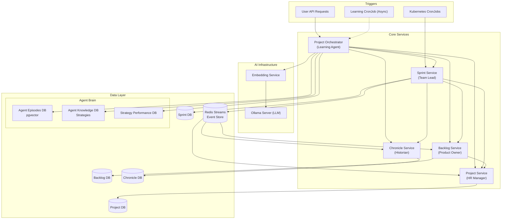
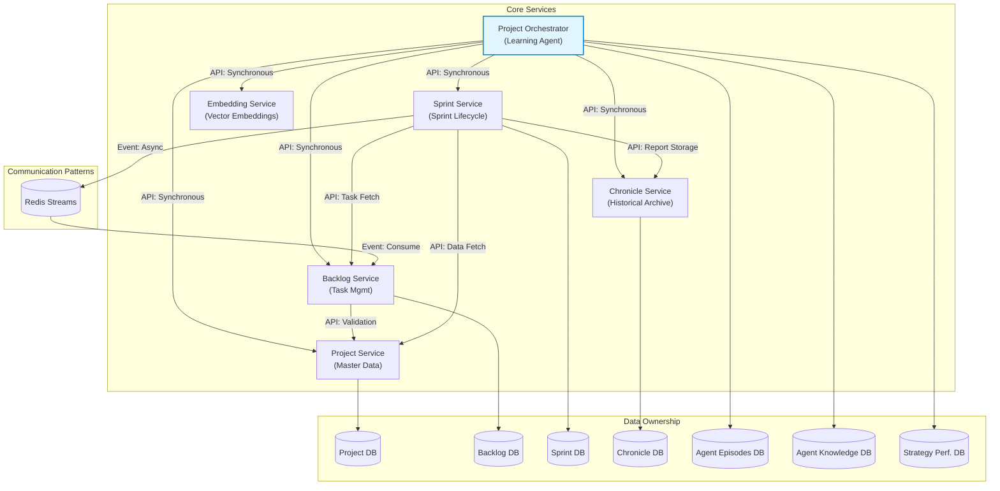
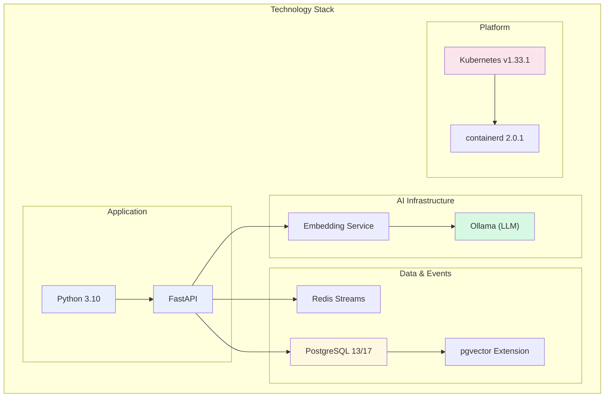
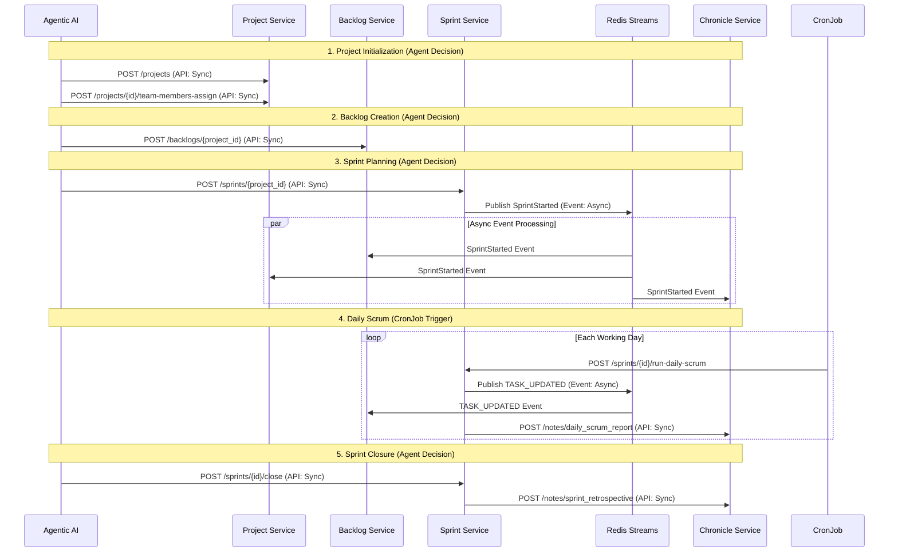
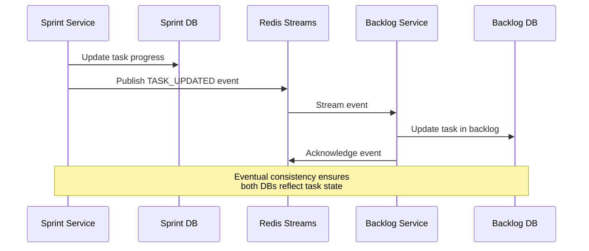
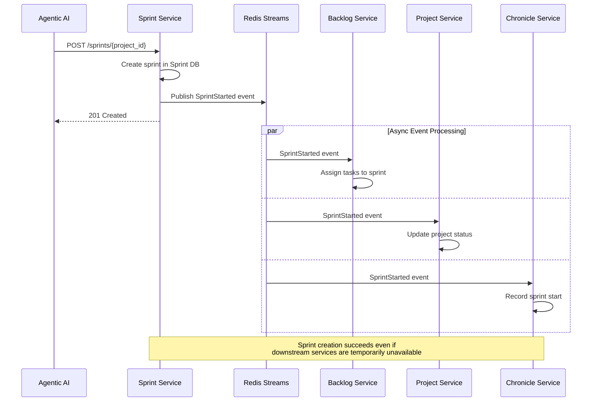
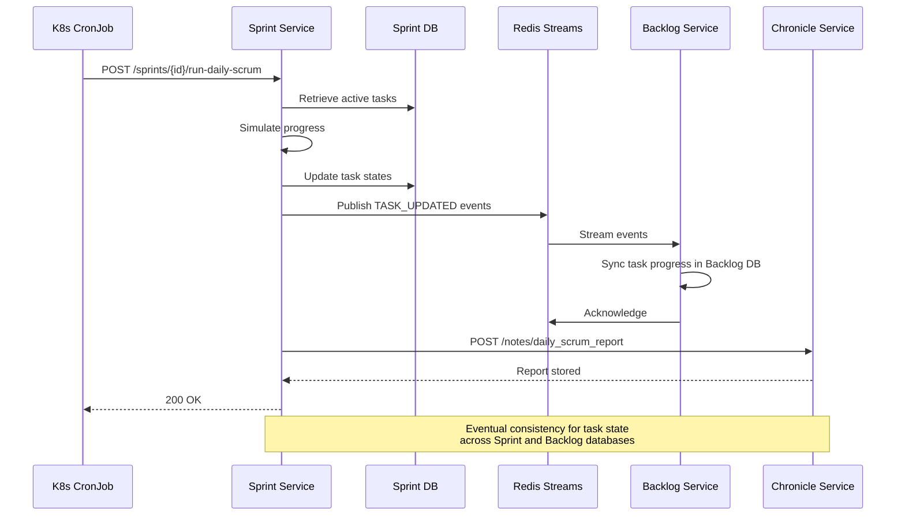
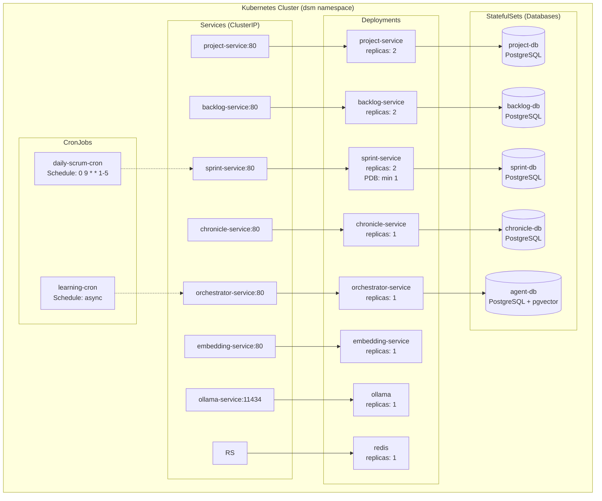
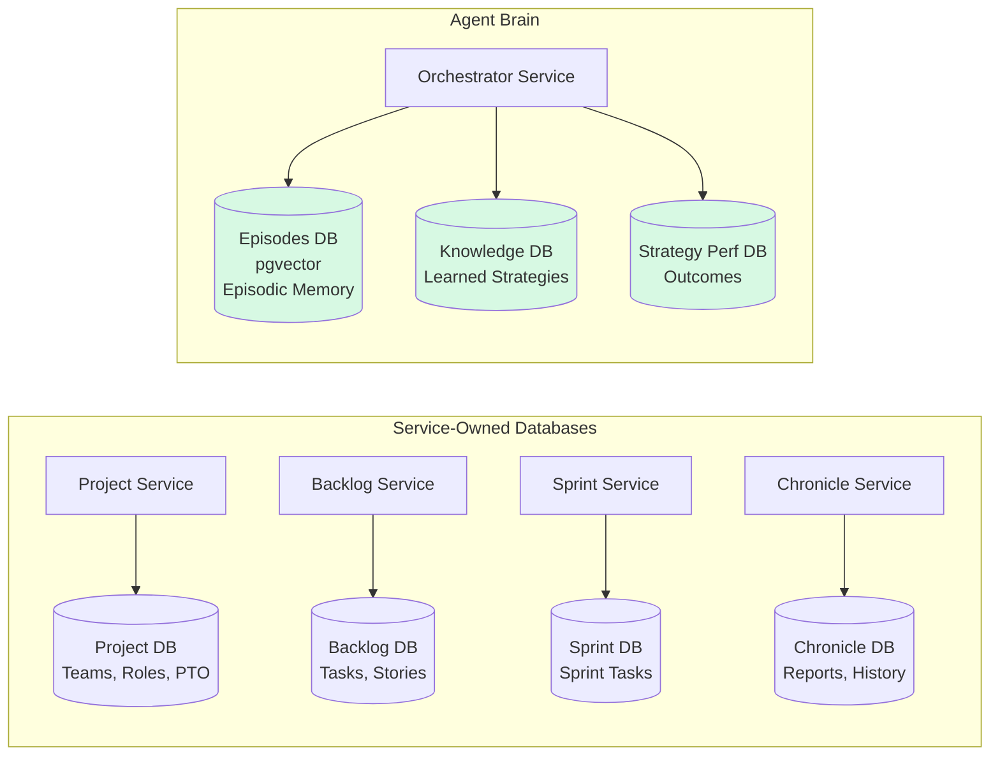
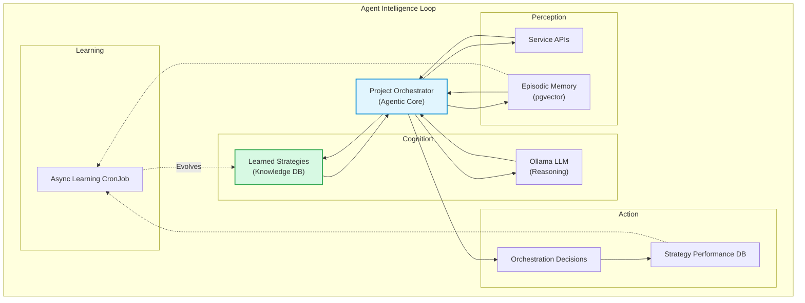

# DSM Architecture Overview

**Version:** 2.0  
**Last Updated:** November 27, 2025  
**Status:** Living Document

---

## How to Read This Document

**For Architects & Technical Leads:** Focus on sections 2-3 (Vision, System Architecture), 6 (Architectural Principles), and 11 (Data Architecture).

**For Developers:** Start with section 3.4 (Service Overviews), 7 (Communication Flows), and 9 (API Endpoints).

**For SRE/Operations:** Prioritize sections 10 (Kubernetes), 12 (Scalability), 13 (Observability), and 14 (Resilience).

**For Product/Business:** Review sections 1 (Overview), 2 (Vision), and 5 (Functional Flow).

---

## Table of Contents

- [DSM Architecture Overview](#dsm-architecture-overview)
  - [How to Read This Document](#how-to-read-this-document)
  - [Table of Contents](#table-of-contents)
  - [1. Overview](#1-overview)
  - [2. Vision \& Strategic Direction](#2-vision--strategic-direction)
  - [3. System Architecture](#3-system-architecture)
    - [3.1. The Digital Scrum Team (Service Landscape)](#31-the-digital-scrum-team-service-landscape)
    - [3.2. Current vs Target Architecture](#32-current-vs-target-architecture)
    - [3.3. High-Level System Diagram](#33-high-level-system-diagram)
    - [3.4. Service Dependency Graph](#34-service-dependency-graph)
    - [3.5. Service Overviews](#35-service-overviews)
      - [Project Service (HR Manager)](#project-service-hr-manager)
      - [Backlog Service (Product Owner)](#backlog-service-product-owner)
      - [Sprint Service (Team Lead)](#sprint-service-team-lead)
      - [Chronicle Service (Historian)](#chronicle-service-historian)
      - [Project Orchestrator (The AI Scrum Master)](#project-orchestrator-the-ai-scrum-master)
      - [Embedding Service (Knowledge Processor)](#embedding-service-knowledge-processor)
  - [4. Technical Stack](#4-technical-stack)
  - [5. Functional Flow: The Project Lifecycle](#5-functional-flow-the-project-lifecycle)
  - [6. Architectural Principles](#6-architectural-principles)
    - [6.1. Database-per-Service Pattern](#61-database-per-service-pattern)
    - [6.2. API-Driven Communication](#62-api-driven-communication)
    - [6.3. Event-Driven Architecture](#63-event-driven-architecture)
    - [6.4. Service Communication Matrix](#64-service-communication-matrix)
  - [7. Communication Flow Examples](#7-communication-flow-examples)
    - [7.1. Sprint Planning Flow (Event-Driven)](#71-sprint-planning-flow-event-driven)
    - [7.2. Daily Scrum Flow](#72-daily-scrum-flow)
  - [8. Service Communication Reference](#8-service-communication-reference)
    - [8.1. API Endpoints](#81-api-endpoints)
    - [8.2. Event Catalog](#82-event-catalog)
  - [9. Kubernetes Architecture](#9-kubernetes-architecture)
    - [9.1. Deployment Overview](#91-deployment-overview)
    - [9.2. Resource Configuration](#92-resource-configuration)
    - [9.3. High Availability](#93-high-availability)
  - [10. Data Architecture](#10-data-architecture)
    - [10.1. Database Distribution](#101-database-distribution)
    - [10.2. Database Design Principles](#102-database-design-principles)
  - [11. Scalability \& Performance](#11-scalability--performance)
    - [11.1. Horizontal Scaling Patterns](#111-horizontal-scaling-patterns)
    - [11.2. Performance Optimization](#112-performance-optimization)
  - [12. Observability \& Operations](#12-observability--operations)
    - [12.1. Golden Signals for DSM](#121-golden-signals-for-dsm)
    - [12.2. Logging \& Tracing](#122-logging--tracing)
    - [12.3. Operational Runbooks](#123-operational-runbooks)
  - [13. Security \& Access Control](#13-security--access-control)
    - [13.1. Current Security Posture](#131-current-security-posture)
    - [13.2. Future Enhancements](#132-future-enhancements)
  - [14. Resilience Patterns](#14-resilience-patterns)
    - [14.1. Circuit Breaker Implementation](#141-circuit-breaker-implementation)
    - [14.2. Event-Driven Resilience](#142-event-driven-resilience)
  - [15. Agent Intelligence Architecture](#15-agent-intelligence-architecture)
    - [15.1. The Agent Brain](#151-the-agent-brain)
    - [15.2. Key Capabilities](#152-key-capabilities)
  - [16. Roadmap \& Feature Status](#16-roadmap--feature-status)
  - [17. Related Documentation](#17-related-documentation)
    - [Core Architecture](#core-architecture)
    - [Service Documentation](#service-documentation)
    - [Agentic Intelligence](#agentic-intelligence)
    - [Deployment Guides](#deployment-guides)
    - [Operations](#operations)

---

## 1. Overview

The **DSM (Digital Scrum Master)** is an AI-driven microservices ecosystem that intelligently automates the Agile Software Development Life Cycle (SDLC). Built to run entirely on Kubernetes, it simulates a complete digital Scrum team where AI agents orchestrate project management from inception through sprint execution and retrospective analysis.

**Key Characteristics:**
- **Agentic orchestration:** An intelligent AI agent drives decisions based on learned strategies and historical context
- **Event-driven architecture:** Asynchronous communication via Redis Streams ensures resilience and scalability
- **Microservices-based:** Five core services with database-per-service isolation
- **Cloud-native:** Kubernetes-first design with containerized deployments
- **Learning system:** Continuously evolves strategies based on project outcomes

This is a functional simulation demonstrating how AI can autonomously manage complex project workflows through API-driven orchestration.

[Back to Top](#table-of-contents)

---

## 2. Vision & Strategic Direction

The DSM is evolving toward a **multi-persona agentic system** where AI personas collaborate as a complete digital Scrum team. The ultimate goal is creating a sophisticated digital representation of an Agile team with:

- **Autonomous decision-making** based on learned strategies and historical patterns
- **Multi-agent collaboration** simulating Product Owners, Scrum Masters, and Development Teams
- **Continuous learning** from outcomes to refine planning and execution strategies
- **Event-first architecture** enabling true decoupling and independent service evolution

The system's APIs serve as "tools" for the intelligent agent, demonstrating a blueprint for AI-orchestrated project management at scale.

[Back to Top](#table-of-contents)

---

## 3. System Architecture

### 3.1. The Digital Scrum Team (Service Landscape)

The DSM architecture models a collaborative digital Scrum team, where each service represents a specialized team member with distinct responsibilities:

| Service | Role | Primary Responsibility |
|---------|------|------------------------|
| **Project Orchestrator** | The AI Scrum Master | Intelligent decision-making, strategy learning, and workflow orchestration |
| **Project Service** | The HR Manager | Source of truth for projects, teams, roles, and employee availability (calendars, PTO) |
| **Backlog Service** | The Product Owner | Manages the master product backlog and task prioritization |
| **Sprint Service** | The Team Lead | Manages sprint lifecycle from planning through daily execution to closure |
| **Chronicle Service** | The Historian | Archives all project activities, reports, and historical records for analysis |
| **Embedding Service** | The Knowledge Processor | Converts textual data into vector embeddings for AI memory and semantic search |

**Design Pillars:**
1. **Modularity:** Each service is independently deployable and scalable
2. **Autonomy:** Database-per-service ensures clear boundaries
3. **Resilience:** Circuit breakers and event-driven patterns enable graceful degradation
4. **Intelligence:** AI-driven orchestration with continuous learning from outcomes

### 3.2. Current vs Target Architecture

**Current State (Hybrid Model):**
- **Synchronous APIs** for direct service-to-service communication (request-response)
- **Event-driven** for task updates and sprint events (asynchronous broadcast)
- Sprint Service owns daily scrum execution
- Orchestrator makes centralized decisions via API calls

**Target State (Event-First Model):**
- **Event-first** for all major workflows (project kickoff, sprint planning, daily scrum)
- **Command/Event pattern** with clear intent separation
- **Saga pattern** for distributed transactions
- **CQRS** for read/write optimization
- Fully decoupled services reacting to domain events

> **Note:** For detailed target architecture, see [DSM_Pragmatic_Event_Design.md](DSM_Pragmatic_Event_Design.md)

### 3.3. High-Level System Diagram

### 3.4. Service Dependency Graph

### 3.5. Service Overviews

#### Project Service (HR Manager)
**Responsibilities:** Master data source for projects, teams, roles, and employee availability  
**Dependencies:** None (self-contained)  
**Key APIs:** `/projects/{project_id}`, `/projects/{project_id}/team-members`, `/calendar/holidays`  
**Resilience:** Tier-1 service; dependencies protect interactions via circuit breakers

#### Backlog Service (Product Owner)
**Responsibilities:** Manages product backlog; synchronizes task status via events  
**Dependencies:** Project Service (validation), Redis Streams (TASK_UPDATED events)  
**Key APIs:** `/backlogs/{project_id}`, `/tasks/{task_id}`  
**Resilience:** Single-service circuit breaker for Project Service calls

#### Sprint Service (Team Lead)
**Responsibilities:** Manages complete sprint lifecycle; simulates daily work progress  
**Dependencies:** Project Service, Backlog Service, Chronicle Service, Redis Streams  
**Key APIs:** `/sprints/{project_id}`, `/sprints/{sprint_id}/run-daily-scrum`  
**Resilience:** Multi-service circuit breaker pattern; Pod Disruption Budgets (PDB)

#### Chronicle Service (Historian)
**Responsibilities:** Historical archive for all reports and project activities  
**Dependencies:** Receives data from Sprint Service and Project Orchestrator via API  
**Key APIs:** `/notes/daily_scrum_report`, `/notes/sprint_retrospective`  
**Resilience:** Dependencies protect interactions via circuit breakers

#### Project Orchestrator (The AI Scrum Master)
**Responsibilities:** Learning agent that autonomously analyzes data, applies learned strategies, and continuously improves decision-making  
**Dependencies:** All core services, Embedding Service, Agent Brain databases  
**Key APIs:** `/orchestrate/project/{project_id}`, `/orchestrate/intelligence/strategies`  
**Resilience:** Comprehensive multi-service circuit breaker pattern; graceful degradation

#### Embedding Service (Knowledge Processor)
**Responsibilities:** Lightweight proxy to Ollama for generating vector embeddings  
**Dependencies:** Ollama Server  
**Key APIs:** `/embed`, `/embed/batch`  
**Resilience:** Stateless; health checks monitor Ollama connection

[Back to Top](#table-of-contents)

---

## 4. Technical Stack

| Layer | Technology | Purpose |
|-------|-----------|---------|
| **Language** | Python 3.10 | Application development |
| **API Framework** | FastAPI | RESTful APIs with automatic OpenAPI docs |
| **Database** | PostgreSQL 13/17 | ACID-compliant relational storage |
| **Vector Search** | pgvector | Semantic search for AI memory |
| **Event Streaming** | Redis Streams | Asynchronous event-driven communication |
| **LLM Platform** | Ollama | Self-hosted LLM inference |
| **Orchestration** | Kubernetes v1.33.1 | Container orchestration and scaling |
| **Container Runtime** | containerd 2.0.1 | Container execution |
| **Configuration** | ConfigMaps/Secrets | Environment and credential management |

**Host Environment:**
- OS: Ubuntu 24.04.2 LTS
- Kernel: 6.11.0

[Back to Top](#table-of-contents)

---

## 5. Functional Flow: The Project Lifecycle

The DSM simulates the following end-to-end Agile workflow, orchestrated by the AI agent:

**Flow Breakdown:**

1. **Initialization** *(Agent → API → Sync)*  
   Kubernetes Jobs populate databases; agent initializes project and assigns team

2. **Backlog Creation** *(Agent → API → Sync)*  
   Agent calls Backlog Service to aggregate all project tasks

3. **Sprint Planning** *(Agent → API/Event → Hybrid)*  
   Agent creates sprint; Sprint Service publishes `SprintStarted` event for async processing

4. **Daily Scrum** *(CronJob → API/Event → Hybrid)*  
   Scheduled CronJob triggers daily work simulation; Sprint Service publishes `TASK_UPDATED` events

5. **Sprint Closure** *(Agent → API → Sync)*  
   Agent closes sprint; Sprint Service generates retrospective report

[Back to Top](#table-of-contents)

---

## 6. Architectural Principles

### 6.1. Database-per-Service Pattern

**Principle:** Each core service owns its dedicated PostgreSQL database, ensuring data isolation and service autonomy.

**Benefits:**
- Independent scaling and schema evolution
- Clear service boundaries
- Fault isolation (database failure affects only one service)
- Technology flexibility per service

**Implementation:** No direct database access across services; all data exchange via APIs or events.

> **Detailed Documentation:** See [DSM_Data_Architecture.md](DSM_Data_Architecture.md#6-database-per-service-architecture-implementation)

### 6.2. API-Driven Communication

**Principle:** All synchronous inter-service communication uses RESTful APIs with no direct database access.

**Implementation:**
- FastAPI for all service endpoints
- Kubernetes DNS for service discovery (`http://service-name.dsm.svc.cluster.local`)
- Comprehensive error handling and retry logic
- Circuit breakers for graceful degradation
- Health checks at `/health/ready` and `/health/live`

### 6.3. Event-Driven Architecture

**Principle:** Asynchronous communication via Redis Streams for decoupled, scalable interactions ensuring eventual consistency.

**Key Patterns:**
- **Event Publishers:** Sprint Service broadcasts `TASK_UPDATED` and `SprintStarted` events
- **Event Store:** Redis Streams maintains event history and delivery guarantees
- **Event Consumers:** Backlog Service consumes events for task synchronization
- **Consumer Groups:** Ensure exactly-once processing and load distribution

**Event Flow Example:**

### 6.4. Service Communication Matrix

| Service | Depends On | Communication Method |
|---------|-----------|---------------------|
| **Project Service** | None | Self-contained |
| **Backlog Service** | Project Service, Redis | API (validation), Events (TASK_UPDATED) |
| **Sprint Service** | Project, Backlog, Chronicle, Redis | API (data fetch), Events (publish) |
| **Chronicle Service** | Sprint, Orchestrator | API (receive reports) |
| **Orchestrator** | All services, Embedding, Agent DBs | API (orchestration), Direct DB (memory/strategies) |
| **Embedding Service** | Ollama | API (proxy) |

[Back to Top](#table-of-contents)

---

## 7. Communication Flow Examples

### 7.1. Sprint Planning Flow (Event-Driven)

### 7.2. Daily Scrum Flow

[Back to Top](#table-of-contents)

---

## 8. Service Communication Reference

### 8.1. API Endpoints

**Project Service:**
- `GET /projects/{project_id}` – Retrieve project details
- `GET /projects/{project_id}/team-members` – Get team roster
- `GET /calendar/holidays` – Get holiday calendar
- `GET /projects/{project_id}/calendar/pto` – Get team PTO
- `GET /health/ready` – Readiness probe

**Backlog Service:**
- `GET /backlogs/{project_id}` – Retrieve backlog items
- `GET /backlogs/{project_id}/tasks` – Get project tasks
- `PUT /tasks/{task_id}` – Update task status
- `GET /health/ready` – Readiness probe

**Sprint Service:**
- `POST /sprints/{project_id}` – Create new sprint
- `POST /sprints/{sprint_id}/run-daily-scrum` – Trigger daily scrum
- `GET /sprints/{sprint_id}` – Retrieve sprint details
- `GET /health/ready` – Readiness probe

**Chronicle Service:**
- `POST /notes/daily_scrum_report` – Store daily scrum report
- `POST /notes/sprint_retrospective` – Store retrospective
- `GET /notes/daily_scrum_report` – Retrieve daily reports
- `GET /health/ready` – Readiness probe

**Embedding Service:**
- `POST /embed` – Generate single text embedding
- `POST /embed/batch` – Generate multiple embeddings

**Project Orchestrator:**
- `POST /orchestrate/project/{project_id}` – Trigger orchestration workflow
- `GET /orchestrate/intelligence/strategies` – Inspect learned strategies

### 8.2. Event Catalog

| Event | Publisher | Consumers | Payload |
|-------|-----------|-----------|---------|
| `SprintStarted` | Sprint Service | Backlog, Project, Chronicle | `{sprint_id, project_id, start_date, ...}` |
| `TASK_UPDATED` | Sprint Service | Backlog Service | `{task_id, new_status, progress, ...}` |

[Back to Top](#table-of-contents)

---

## 9. Kubernetes Architecture

### 9.1. Deployment Overview

### 9.2. Resource Configuration

All services have explicit resource requests and limits:

| Service | CPU Request | Memory Request | CPU Limit | Memory Limit |
|---------|-------------|----------------|-----------|--------------|
| Project Service | 250m | 256Mi | 500m | 512Mi |
| Backlog Service | 250m | 256Mi | 500m | 512Mi |
| Sprint Service | 500m | 512Mi | 1000m | 1Gi |
| Chronicle Service | 250m | 256Mi | 500m | 512Mi |
| Orchestrator | 500m | 512Mi | 1000m | 1Gi |
| Embedding Service | 250m | 256Mi | 500m | 512Mi |
| Ollama | 2000m | 4Gi | 4000m | 8Gi |

### 9.3. High Availability

**Pod Disruption Budgets (PDBs):**
- Sprint Service: `minAvailable: 1` (critical for daily operations)

**Multi-Replica Services:**
- Project, Backlog, Sprint Services: 2+ replicas for resilience

**Health Checks:**
- Liveness probes at `/health/live`
- Readiness probes at `/health/ready` (comprehensive dependency checks)
- Health check logs suppressed to reduce noise

[Back to Top](#table-of-contents)

---

## 10. Data Architecture

### 10.1. Database Distribution

### 10.2. Database Design Principles

1. **Database-per-Service:** Each service owns its schema and data lifecycle
2. **No Cross-DB Joins:** All data aggregation via APIs or events
3. **Eventual Consistency:** Event-driven synchronization for distributed state
4. **Schema Autonomy:** Services evolve schemas independently

> **Detailed Models:** See [DSM_Data_Architecture.md](DSM_Data_Architecture.md)

[Back to Top](#table-of-contents)

---

## 11. Scalability & Performance

### 11.1. Horizontal Scaling Patterns

**Stateless Services:**
- All application services are stateless and can scale horizontally
- Kubernetes HPA (Horizontal Pod Autoscaler) ready
- Load balancing via Kubernetes Services

**Stateful Components:**
- PostgreSQL databases use StatefulSets for stable network identities
- Redis Streams support consumer groups for parallel event processing

### 11.2. Performance Optimization

**Strategies:**
- Connection pooling for database access
- Event batching for Redis Streams
- Circuit breakers prevent cascading failures and reduce load
- Health check log suppression reduces I/O overhead
- Resource limits prevent resource contention

**Caching:**
- Redis used for event streaming (not traditional caching currently)
- Future: Add Redis caching layer for frequently accessed data

[Back to Top](#table-of-contents)

---

## 12. Observability & Operations

### 12.1. Golden Signals for DSM

**Latency:**
- API response times (p50, p95, p99)
- Event processing lag (time from publish to consume)

**Error Rate:**
- HTTP 5xx responses per service
- Circuit breaker open/half-open states
- Event processing failures

**Traffic:**
- Requests per second per service
- Event throughput in Redis Streams

**Saturation:**
- Database connection pool utilization
- CPU/memory usage per pod
- Redis memory usage

### 12.2. Logging & Tracing

**Structured Logging:**
- JSON format for all logs
- Correlation IDs for request tracing
- Health check logs suppressed to reduce noise

**Health Checks:**
- `/health/live` – Liveness probe (is service running?)
- `/health/ready` – Readiness probe (is service ready to serve traffic? checks dependencies)

### 12.3. Operational Runbooks

**Common Failure Scenarios:**

| Scenario | Detection | Response |
|----------|-----------|----------|
| Service unhealthy | Readiness probe fails | K8s stops routing; pod restarts if liveness fails |
| Circuit breaker open | Service logs, metrics | Dependent service degrades gracefully; investigate root cause |
| Redis unavailable | Event processing stalls | Services continue API operations; events queue until recovery |
| Database connection exhausted | Connection timeout errors | Check connection pool config; scale DB or tune limits |

**Tier-1 Services (Critical):**
- Sprint Service (has PDB, multi-replica)
- Project Service (foundational data)

[Back to Top](#table-of-contents)

---

## 13. Security & Access Control

### 13.1. Current Security Posture

**Network Security:**
- Internal cluster communication only (ClusterIP services)
- No external ingress configured
- Services communicate via Kubernetes DNS

**Data Security:**
- Database credentials stored in Kubernetes Secrets
- No database access outside owning service
- Connection strings injected via environment variables

**Authentication & Authorization:**
- Currently: Internal cluster services (no auth between services)
- Future: Implement service mesh with mTLS for service-to-service auth

### 13.2. Future Enhancements

- **API Gateway:** Add ingress with authentication for external access
- **Service Mesh:** Istio/Linkerd for mTLS and fine-grained access control
- **Secrets Management:** External vault integration (e.g., HashiCorp Vault)
- **Audit Logging:** Track all orchestration decisions and data access

[Back to Top](#table-of-contents)

---

## 14. Resilience Patterns

### 14.1. Circuit Breaker Implementation

DSM implements circuit breakers to prevent cascading failures and enable graceful degradation.

**Coverage:**
- **Backlog Service:** Single-service breaker for Project Service calls
- **Sprint Service:** Multi-service breaker for Project, Backlog, Chronicle calls
- **Orchestrator:** Comprehensive multi-service breaker for all dependencies

**States:**
1. **Closed:** Normal operation, requests flow through
2. **Open:** Failure threshold exceeded, requests fail fast
3. **Half-Open:** Test recovery by allowing limited requests

**Benefits:**
- Prevents cascading failures
- Enables partial functionality during dependency outages
- Reduces load on struggling services

> **Detailed Implementation:** See [DSM_Resilience_Patterns.md](DSM_Resilience_Patterns.md)

### 14.2. Event-Driven Resilience

**Eventual Consistency:**
- Events stored in Redis Streams survive consumer failures
- Consumer groups ensure exactly-once processing
- Services can replay events after recovery

**Decoupling:**
- Sprint creation succeeds even if downstream consumers are unavailable
- Task updates propagate asynchronously to Backlog Service

[Back to Top](#table-of-contents)

---

## 15. Agent Intelligence Architecture

### 15.1. The Agent Brain

The Project Orchestrator operates as a **Learning Agent** with a dedicated "brain" architecture:

### 15.2. Key Capabilities

**1. Episodic Memory (pgvector):**
- Stores rich context of past decisions and outcomes
- Enables semantic search: "What did I do in similar situations?"
- Vector embeddings generated by Embedding Service

**2. Strategic Knowledge Base:**
- Codifies successful patterns as versioned strategies
- High-confidence strategies applied first (override raw pattern analysis)
- Continuously refined based on performance feedback

**3. Continuous Learning:**
- Async learning loop analyzes outcomes
- Generates new strategies from successful episodes
- Updates strategy confidence scores

**4. AI-Powered Reasoning:**
- Local Ollama LLM generates natural language explanations
- Non-blocking advisory for transparency

> **Detailed Architecture:** See [CR_Agent_Architecture_Design.md](CR_Agent_Architecture_Design.md)

[Back to Top](#table-of-contents)

---

## 16. Roadmap & Feature Status
The DSM project is under active development. The system has a robust set of foundational features, including a fully operational agentic orchestrator with learning capabilities, a resilient microservice>

For a detailed breakdown of recently completed milestones and the future development plan, please refer to the official project roadmap:

- **[Project Roadmap](ROADMAP.md)**

[Back to Top](#table-of-contents)

---

## 17. Related Documentation

### Core Architecture
- **[Functional Overview](DSM_Functional_Overview.md)** - A high-level description of the system's capabilities and use cases.
- **[DSM_Data_Architecture.md](DSM_Data_Architecture.md)** – Detailed database schemas and data models
- **[DSM_Resilience_Patterns.md](DSM_Resilience_Patterns.md)** – Circuit breaker implementation details
- **[DSM_Pragmatic_Event_Design.md](DSM_Pragmatic_Event_Design.md)** – Target event-first architecture

### Service Documentation
- **[DSM_Project_Orchestration_Service_Architecture.md](DSM_Project_Orchestration_Service_Architecture.md)** – Detailed Architecture of Orchestration Service
- **[DSM_Service_Specifications.md](DSM_Service_Specifications.md)** – All Service endpoints
  
### Agentic Intelligence
- **[CR_Agent_Architecture_Design.md](CR_Agent_Architecture_Design.md)** – Deep dive on agent brain architecture
- **[CR_Agent_Strategy_Layer.md](CR_Agent_Strategy_Layer.md)** – Strategy learning implementation
- **[CR_Agent_Memory_System.md](CR_Agent_Memory_System.md)** – Episodic memory with pgvector

 ### Deployment Guides      
 - **[Deployment & Operations](DSM_Deployment_Operations.md)** - Kubernetes manifests, testing strategies, and monitoring

### Operations
- **[Kubernetes_Deployment_Guide.md](Kubernetes_Deployment_Guide.md)** – Deployment procedures
- **[Observability_Guide.md](Observability_Guide.md)** – Monitoring and logging setup

[Back to Top](#table-of-contents)

---

**Document Changelog:**
- **v2.0 (Nov 2025):** Major restructure for clarity; added security section, operational runbooks, golden signals
- **v1.3 (Aug 2025):** Added agent learning architecture; event-driven sprint planning
- **v1.2 (Jul 2025):** Health check optimization; comprehensive readiness probes
- **v1.1 (Jun 2025):** Circuit breaker patterns; database-per-service completion
- **v1.0 (May 2025):** Initial architecture documentation
