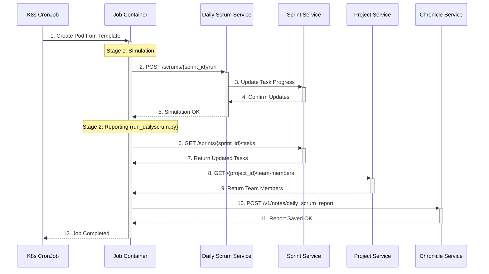

# Design: Unified Daily Scrum Orchestration Job

**Document Status:** `DRAFT`
**Version:** `1.0`
**Last Updated:** `2025-08-30`

## 1. Overview

This document provides a detailed functional and technical design for the unified Daily Scrum Orchestration Job. The primary purpose of this job is to automate the daily scrum process by first simulating task progress for a given sprint and then generating a historical report based on that new data.

This new design consolidates two previously separate and uncoordinated jobs into a single, reliable, and atomic Kubernetes CronJob. This unification ensures that the daily reports accurately reflect the simulated progress for that day, streamlining the entire process and making it more robust.

## 2. Goals and Objectives

*   **Unify Scrum Functions**: Combine the task progress simulation and the daily scrum reporting into a single Kubernetes CronJob.
*   **Ensure Correct Execution Order**: Guarantee that the progress simulation is triggered and completes successfully *before* the reporting script is executed.
*   **Improve Reliability**: Create a single source of truth for daily scrum automation, making the process more robust and easier to troubleshoot.
*   **Simplify Operations**: Remove the need to manage and schedule two separate CronJobs for a single logical process.

## 3. Functional Design

### 3.1. Core Functionality

The Daily Scrum Job performs two primary functions in a strict sequence:

1.  **Task Progress Simulation**: The job initiates a process that mimics the daily work done on tasks within a specific sprint. The simulation logic resides in the `daily-scrum-service` and applies a randomized progress percentage to each task that is currently in progress.
2.  **Daily Scrum Reporting**: After the simulation is complete, the job gathers data from various microservices to compile a comprehensive daily scrum report. This report includes summary metrics (e.g., total tasks, completed tasks) and individual task updates. The final report is then sent to the `chronicle-service` for historical record-keeping.

### 3.2. Automated Workflow

The job executes the following workflow automatically based on its schedule:

1.  **Job Trigger**: The Kubernetes CronJob controller initiates a new job at the scheduled time (e.g., 2:00 PM UTC, Monday-Friday).
2.  **Simulation Invocation**: The first step in the job's container is to send a `POST` request to the `daily-scrum-service` API, triggering the task progress simulation for the configured `SPRINT_ID`.
3.  **Simulation Execution**: The `daily-scrum-service` receives the request and updates the progress of all active tasks for that sprint in the `sprint-service` database.
4.  **Reporting Script Execution**: Upon successful completion of the simulation API call, the job proceeds to execute the `run_dailyscrum.py` Python script.
5.  **Data Aggregation**: The script calls various services to gather the necessary data:
    *   It fetches the updated task list and a task summary from the `sprint-service`.
    *   It retrieves team member information from the `project-service`.
6.  **Report Generation**: The script processes the aggregated data to construct a detailed daily scrum report payload.
7.  **Report Submission**: The script sends the final report payload via a `POST` request to the `chronicle-service`, which stores it as a historical note.
8.  **Job Completion**: The job finishes its execution and the pod terminates.

# Design: Unified Daily Scrum Orchestration Job

**Document Status:** `DRAFT`
**Version:** `1.0`
**Last Updated:** `2025-08-30`

## 1. Overview

This document provides a detailed functional and technical design for the unified Daily Scrum Orchestration Job. The primary purpose of this job is to automate the daily scrum process by first simulating task progress for a given sprint and then generating a historical report based on that new data.

This new design consolidates two previously separate and uncoordinated jobs into a single, reliable, and atomic Kubernetes CronJob. This unification ensures that the daily reports accurately reflect the simulated progress for that day, streamlining the entire process and making it more robust.

## 2. Goals and Objectives

*   **Unify Scrum Functions**: Combine the task progress simulation and the daily scrum reporting into a single Kubernetes CronJob.
*   **Ensure Correct Execution Order**: Guarantee that the progress simulation is triggered and completes successfully *before* the reporting script is executed.
*   **Improve Reliability**: Create a single source of truth for daily scrum automation, making the process more robust and easier to troubleshoot.
*   **Simplify Operations**: Remove the need to manage and schedule two separate CronJobs for a single logical process.

## 3. Functional Design

### 3.1. Core Functionality

The Daily Scrum Job performs two primary functions in a strict sequence:

1.  **Task Progress Simulation**: The job initiates a process that mimics the daily work done on tasks within a specific sprint. The simulation logic resides in the `daily-scrum-service` and applies a randomized progress percentage to each task that is currently in progress.
2.  **Daily Scrum Reporting**: After the simulation is complete, the job gathers data from various microservices to compile a comprehensive daily scrum report. This report includes summary metrics (e.g., total tasks, completed tasks) and individual task updates. The final report is then sent to the `chronicle-service` for historical record-keeping.

### 3.2. Automated Workflow

The job executes the following workflow automatically based on its schedule:

1.  **Job Trigger**: The Kubernetes CronJob controller initiates a new job at the scheduled time (e.g., 2:00 PM UTC, Monday-Friday).
2.  **Simulation Invocation**: The first step in the job's container is to send a `POST` request to the `daily-scrum-service` API, triggering the task progress simulation for the configured `SPRINT_ID`.
3.  **Simulation Execution**: The `daily-scrum-service` receives the request and updates the progress of all active tasks for that sprint in the `sprint-service` database.
4.  **Reporting Script Execution**: Upon successful completion of the simulation API call, the job proceeds to execute the `run_dailyscrum.py` Python script.
5.  **Data Aggregation**: The script calls various services to gather the necessary data:
    *   It fetches the updated task list and a task summary from the `sprint-service`.
    *   It retrieves team member information from the `project-service`.
6.  **Report Generation**: The script processes the aggregated data to construct a detailed daily scrum report payload.
7.  **Report Submission**: The script sends the final report payload via a `POST` request to the `chronicle-service`, which stores it as a historical note.
8.  **Job Completion**: The job finishes its execution and the pod terminates.

### 3.3. Data and Reporting Logic

#### 3.3.1. Selective Task Simulation

The task progress simulation is designed to mimic a real-world scenario and therefore does not update every task in the sprint. The logic is as follows:
*   The `daily-scrum-service` retrieves all tasks for the sprint from the `sprint-service`.
*   It filters this list to exclude any tasks that are already 100% complete.
*   Progress is only simulated and applied to the remaining **active (incomplete) tasks**. This ensures that the simulation is logical and efficient.

#### 3.3.2. Report Date vs. Task Timestamp

It is important to distinguish between the two timestamps involved in the reporting process:
*   **Task `created_at` Timestamp**: Each individual task update within the final report has its own precise timestamp. This marks the exact moment that specific task's progress was simulated and logged.
*   **Report `report_date`**: The overall report stored in the `chronicle-service` is associated with a single `report_date`. This date represents the day the entire daily scrum job was executed, not the timestamp of any individual task update.

#### 3.3.3. Report Retrieval

The historical daily scrum reports are stored in the `chronicle-service` and can be retrieved via its API. The primary endpoint for this is `GET /v1/notes/daily_scrum_report`.

The API allows for filtering by `sprint_id`, `project_id`, or a specific `daily_scrum_date`.

**Example `curl` command:**
To retrieve the report for a specific sprint on a specific date, you would use a command like this:
```bash
curl "http://chronicle-service.dsm.svc.cluster.local/v1/notes/daily_scrum_report?sprint_id=GEM-001-S01&daily_scrum_date=2025-08-30" | jq
```
This command will return a single, aggregated JSON object containing all the individual reports that were logged for that sprint on that day.

### 3.4. Workflow Sequence Diagram



### 3.5. Diagram Explanation

The sequence diagram above illustrates the end-to-end workflow of the Unified Daily Scrum Job.

1.  **Job Initialization**: The process begins when the Kubernetes CronJob controller creates a new pod based on the job's template at the scheduled time.
2.  **Trigger Simulation**: The first action within the Job Container is to send a `POST` request to the `daily-scrum-service` to start the simulation.
3.  **Update Task Progress**: The `daily-scrum-service` orchestrates the simulation by interacting with the `sprint-service` to update the `progress_percentage` for tasks in the sprint.
4.  **Confirm Updates**: The `sprint-service` confirms that the task updates have been successfully persisted.
5.  **Simulation OK**: The `daily-scrum-service` returns a success message to the Job Container, completing Stage 1.
6.  **Get Task Data**: The container's reporting script (`run_dailyscrum.py`) begins Stage 2 by requesting the latest task data from the `sprint-service`.
7.  **Return Updated Tasks**: The `sprint-service` returns the list of tasks, which now includes the progress made during the simulation.
8.  **Get Project Data**: The script then queries the `project-service` to get supplementary data, such as the list of team members.
9.  **Return Team Members**: The `project-service` responds with the requested project data.
10. **Submit Report**: The script aggregates all the collected data and sends the final report in a `POST` request to the `chronicle-service`.
11. **Report Saved**: The `chronicle-service` saves the report to its database and returns a success confirmation.
12. **Job Completion**: With all steps completed successfully, the job finishes, and the container terminates.

## 4. Technical Design

### 4.1. Architecture

The architecture is centered around a single Kubernetes CronJob (`run-dailyscrum`) that orchestrates the entire workflow. This job runs a container with a shell script that executes the two main stages sequentially. The use of `set -e` in the shell command ensures that the reporting script will not run if the simulation stage fails, making the entire operation atomic.

This is a significant improvement over the previous fragmented, two-job system, simplifying the operational architecture and removing race conditions.

### 4.2. Key Components

#### 4.2.1. Kubernetes CronJob (`cjb_dailyscrum.yml`)

*   **Kind**: `CronJob`
*   **Schedule**: `0 14 * * 1-5` (2:00 PM UTC, Mon-Fri)
*   **Concurrency Policy**: `Allow` (default)
*   **Restart Policy**: `Never`
*   **Key Configuration**:
    *   **Container Image**: `python:3.10`
    *   **Environment Variables**: `PROJECT_ID`, `SPRINT_ID`, and service URLs are injected into the container to configure the job for a specific project and sprint.
    *   **Command**: A multi-line shell command is used as the container's entry point.

**Command Breakdown:**
```shell
set -e
# Stage 1: Simulation
echo "--- Triggering Daily Scrum Simulation ---"
curl -X POST -f "http://daily-scrum-service.dsm.svc.cluster.local/scrums/${SPRINT_ID}/run"
echo "--- Simulation Triggered Successfully ---"

# Stage 2: Reporting
echo "--- Starting Daily Scrum Reporting ---"
apt-get update -y && pip3 install pandas requests
python3 /app/run_dailyscrum.py
echo "--- Reporting Job Finished ---"
```

#### 4.2.2. `run_dailyscrum.py` Script

This Python script acts as the reporting orchestrator. Its logic is as follows:
1.  Reads environment variables (`PROJECT_ID`, `SPRINT_ID`, service URLs) to get its context.
2.  Calls the `sprint-service` to get the list of tasks and a summary for the sprint.
3.  Calls the `project-service` to get team member data.
4.  Constructs a JSON payload for the `chronicle-service`.
5.  Sends the payload to the `chronicle-service`'s `/v1/notes/daily_scrum_report` endpoint.

### 4.3. Service Interactions (API Calls)

The job interacts with the following internal services:

| Source Component | Target Service | Endpoint & Method | Purpose |
| :--- | :--- | :--- | :--- |
| **CronJob Container** | `daily-scrum-service` | `POST /scrums/{sprint_id}/run` | To trigger the task progress simulation. |
| `run_dailyscrum.py` | `sprint-service` | `GET /sprints/{sprint_id}/tasks` | To retrieve the latest task details after simulation. |
| `run_dailyscrum.py` | `sprint-service` | `GET /sprints/{sprint_id}/task-summary` | To get summary metrics for the report. |
| `run_dailyscrum.py` | `project-service` | `GET /projects/{project_id}/team-members` | To get team member information. |
| `run_dailyscrum.py` | `chronicle-service` | `POST /v1/notes/daily_scrum_report` | To submit the final daily scrum report for storage. |

### 4.4. Error Handling and Reliability

*   **Atomicity**: The `set -e` command in the container's entry point ensures that the job will exit immediately if the `curl` command to trigger the simulation fails. This prevents the reporting script from running with stale or incorrect data.
*   **Job Retries**: The `jobTemplate` is configured with `backoffLimit: 4`, meaning Kubernetes will attempt to retry a failed job up to 4 times before marking it as failed.
*   **History**: The CronJob keeps a history of the last 3 successful and 3 failed jobs for easier debugging and auditing.

## 5. Deployment and Operations

### 5.1. Prerequisites

Before deploying the CronJob, ensure the following components are running and accessible within the Kubernetes cluster:
*   All dependent microservices: `daily-scrum-service`, `sprint-service`, `project-service`, and `chronicle-service`.
*   A ConfigMap named `run-dailyscrum` must exist, containing the `run_dailyscrum.py` script. This ConfigMap is mounted as a volume into the job's pod.

### 5.2. Configuration

The CronJob is configured via the `cjb_dailyscrum.yml` manifest. The most critical configuration is done through environment variables, which determine the target for the daily scrum run.

*   `PROJECT_ID`: The ID of the project to run the scrum for (e.g., "GEM-001").
*   `SPRINT_ID`: The ID of the specific sprint to simulate and report on (e.g., "GEM-001-S01").

These values must be updated in the manifest to target different sprints.

### 5.3. Deployment

To deploy or update the CronJob, apply the manifest using `kubectl`.

**Command:**
```bash
kubectl apply -f services/daily-scrum-jobs/cjb_dailyscrum.yml
```

### 5.4. Verification and Manual Trigger

After deployment, you can verify the CronJob's status and manually trigger it for immediate testing.

1.  **Check CronJob Status**:
    ```bash
    kubectl get cronjob run-dailyscrum -n dsm
    ```

2.  **Manually Trigger the Job**:
    To test the job without waiting for the schedule, create a new Job directly from the CronJob template.
    ```bash
    kubectl create job --from=cronjob/run-dailyscrum -n dsm manual-scrum-run-$(date +%s)
    ```

3.  **Monitor Job and Pod Logs**:
    Inspect the logs of the pod created by the job to confirm that both the simulation and reporting stages execute successfully.
    ```bash
    # Get the name of the most recent pod created by the job
    POD_NAME=$(kubectl get pods -n dsm -l job-name=manual-scrum-run-xxxx -o jsonpath='{.items[0].metadata.name}')

    # View the logs
    kubectl logs -f $POD_NAME -n dsm
    ```
    The logs should show the output from both the `curl` command and the `run_dailyscrum.py` script, as seen in the "Sample Log Output" section.

## 6. Appendix

### 6.1. Sample Job Manifest (`cjb_dailyscrum.yml`)

```yaml
apiVersion: batch/v1
kind: CronJob
metadata:
  name: run-dailyscrum
  namespace: dsm
spec:
  schedule: "0 14 * * 1-5"
  successfulJobsHistoryLimit: 3
  failedJobsHistoryLimit: 3
  jobTemplate:
    spec:
      backoffLimit: 4
      template:
        spec:
          containers:
          - image: python:3.10
            name: run-dailyscrum
            command:
              - "/bin/sh"
              - "-c"
              - |-
                  set -e
                  echo "--- Triggering Daily Scrum Simulation ---"
                  curl -X POST -f "http://daily-scrum-service.dsm.svc.cluster.local/scrums/${SPRINT_ID}/run"
                  echo "--- Simulation Triggered Successfully ---"

                  echo "--- Starting Daily Scrum Reporting ---"
                  apt-get update -y
                  apt-get install -y tree
                  pip3 install pandas Flask requests
                  tree /app
                  env
                  python3 /app/run_dailyscrum.py
                  echo "--- Reporting Job Finished ---"
            env:
            - name: PROJECT_ID
              value: "GEM-001"
            - name: SPRINT_ID
              value: "GEM-001-S01"
            # ... other env vars
          restartPolicy: Never
```

### 6.2. Sample Log Output

The following logs demonstrate the successful two-stage execution of the job.

**Stage 1: Simulation**
```
--- Triggering Daily Scrum Simulation ---
  % Total    % Received % Xferd  Average Speed   Time    Time     Time  Current
                                 Dload  Upload   Total   Spent    Left  Speed
100   816  100   816    0     0   1748      0 --:--:-- --:--:-- --:--:--  1751
{"message":"Daily scrum simulation completed for sprint GEM-001-S01","tasks_updated_count":10,"updates":[{"task_id":"GEM-001-TASK001","progress_made":"20%","new_status":"20%"},...]}
--- Simulation Triggered Successfully ---
```

**Stage 2: Reporting**
```
--- Starting Daily Scrum Reporting ---
2025--08-30 14:58:46,119 - INFO - --- Starting Daily Scrum Orchestration Job ---
2025-08-30 14:58:46,119 - INFO - Project ID: GEM-001, Sprint ID: GEM-001-S01
2025-08-30 14:58:46,119 - INFO - Step 1: Gathering summary metrics...
2025-08-30 14:58:46,185 - INFO - Successfully retrieved 10 tasks for sprint GEM-001-S01
2025-08-30 14:58:46,185 - INFO - Step 3: Constructing and posting individual reports...
2025-08-30 14:58:46,328 - INFO - Successfully created daily scrum report entry: {'message': 'Daily scrum report recorded successfully', 'note_id': '6cecd8f0-4d4a-41ce-8875-1e90c992af70'}
2025-08-30 14:58:46,328 - INFO - --- Daily Scrum Orchestration Job Finished ---
```


## 4. Technical Design

### 4.1. Architecture

The architecture is centered around a single Kubernetes CronJob (`run-dailyscrum`) that orchestrates the entire workflow. This job runs a container with a shell script that executes the two main stages sequentially. The use of `set -e` in the shell command ensures that the reporting script will not run if the simulation stage fails, making the entire operation atomic.

This is a significant improvement over the previous fragmented, two-job system, simplifying the operational architecture and removing race conditions.

### 4.2. Key Components

#### 4.2.1. Kubernetes CronJob (`cjb_dailyscrum.yml`)

*   **Kind**: `CronJob`
*   **Schedule**: `0 14 * * 1-5` (2:00 PM UTC, Mon-Fri)
*   **Concurrency Policy**: `Allow` (default)
*   **Restart Policy**: `Never`
*   **Key Configuration**:
    *   **Container Image**: `python:3.10`
    *   **Environment Variables**: `PROJECT_ID`, `SPRINT_ID`, and service URLs are injected into the container to configure the job for a specific project and sprint.
    *   **Command**: A multi-line shell command is used as the container's entry point.

**Command Breakdown:**
```shell
set -e
# Stage 1: Simulation
echo "--- Triggering Daily Scrum Simulation ---"
curl -X POST -f "http://daily-scrum-service.dsm.svc.cluster.local/scrums/${SPRINT_ID}/run"
echo "--- Simulation Triggered Successfully ---"

# Stage 2: Reporting
echo "--- Starting Daily Scrum Reporting ---"
apt-get update -y && pip3 install pandas requests
python3 /app/run_dailyscrum.py
echo "--- Reporting Job Finished ---"
```

#### 4.2.2. `run_dailyscrum.py` Script

This Python script acts as the reporting orchestrator. Its logic is as follows:
1.  Reads environment variables (`PROJECT_ID`, `SPRINT_ID`, service URLs) to get its context.
2.  Calls the `sprint-service` to get the list of tasks and a summary for the sprint.
3.  Calls the `project-service` to get team member data.
4.  Constructs a JSON payload for the `chronicle-service`.
5.  Sends the payload to the `chronicle-service`'s `/v1/notes/daily_scrum_report` endpoint.

### 4.3. Service Interactions (API Calls)

The job interacts with the following internal services:

| Source Component | Target Service | Endpoint & Method | Purpose |
| :--- | :--- | :--- | :--- |
| **CronJob Container** | `daily-scrum-service` | `POST /scrums/{sprint_id}/run` | To trigger the task progress simulation. |
| `run_dailyscrum.py` | `sprint-service` | `GET /sprints/{sprint_id}/tasks` | To retrieve the latest task details after simulation. |
| `run_dailyscrum.py` | `sprint-service` | `GET /sprints/{sprint_id}/task-summary` | To get summary metrics for the report. |
| `run_dailyscrum.py` | `project-service` | `GET /projects/{project_id}/team-members` | To get team member information. |
| `run_dailyscrum.py` | `chronicle-service` | `POST /v1/notes/daily_scrum_report` | To submit the final daily scrum report for storage. |

### 4.4. Error Handling and Reliability

*   **Atomicity**: The `set -e` command in the container's entry point ensures that the job will exit immediately if the `curl` command to trigger the simulation fails. This prevents the reporting script from running with stale or incorrect data.
*   **Job Retries**: The `jobTemplate` is configured with `backoffLimit: 4`, meaning Kubernetes will attempt to retry a failed job up to 4 times before marking it as failed.
*   **History**: The CronJob keeps a history of the last 3 successful and 3 failed jobs for easier debugging and auditing.

## 5. Appendix

### 5.1. Sample Job Manifest (`cjb_dailyscrum.yml`)

```yaml
apiVersion: batch/v1
kind: CronJob
metadata:
  name: run-dailyscrum
  namespace: dsm
spec:
  schedule: "0 14 * * 1-5"
  successfulJobsHistoryLimit: 3
  failedJobsHistoryLimit: 3
  jobTemplate:
    spec:
      backoffLimit: 4
      template:
        spec:
          containers:
          - image: python:3.10
            name: run-dailyscrum
            command:
              - "/bin/sh"
              - "-c"
              - |-
                  set -e
                  echo "--- Triggering Daily Scrum Simulation ---"
                  curl -X POST -f "http://daily-scrum-service.dsm.svc.cluster.local/scrums/${SPRINT_ID}/run"
                  echo "--- Simulation Triggered Successfully ---"

                  echo "--- Starting Daily Scrum Reporting ---"
                  apt-get update -y
                  apt-get install -y tree
                  pip3 install pandas Flask requests
                  tree /app
                  env
                  python3 /app/run_dailyscrum.py
                  echo "--- Reporting Job Finished ---"
            env:
            - name: PROJECT_ID
              value: "GEM-001"
            - name: SPRINT_ID
              value: "GEM-001-S01"
            # ... other env vars
          restartPolicy: Never
```

### 5.2. Sample Log Output

The following logs demonstrate the successful two-stage execution of the job.

**Stage 1: Simulation**
```
--- Triggering Daily Scrum Simulation ---
  % Total    % Received % Xferd  Average Speed   Time    Time     Time  Current
                                 Dload  Upload   Total   Spent    Left  Speed
100   816  100   816    0     0   1748      0 --:--:-- --:--:-- --:--:--  1751
{"message":"Daily scrum simulation completed for sprint GEM-001-S01","tasks_updated_count":10,"updates":[{"task_id":"GEM-001-TASK001","progress_made":"20%","new_status":"20%"},...]}
--- Simulation Triggered Successfully ---
```

**Stage 2: Reporting**
```
--- Starting Daily Scrum Reporting ---
2025--08-30 14:58:46,119 - INFO - --- Starting Daily Scrum Orchestration Job ---
2025-08-30 14:58:46,119 - INFO - Project ID: GEM-001, Sprint ID: GEM-001-S01
2025-08-30 14:58:46,119 - INFO - Step 1: Gathering summary metrics...
2025-08-30 14:58:46,185 - INFO - Successfully retrieved 10 tasks for sprint GEM-001-S01
2025-08-30 14:58:46,185 - INFO - Step 3: Constructing and posting individual reports...
2025-08-30 14:58:46,328 - INFO - Successfully created daily scrum report entry: {'message': 'Daily scrum report recorded successfully', 'note_id': '6cecd8f0-4d4a-41ce-8875-1e90c992af70'}
2025-08-30 14:58:46,328 - INFO - --- Daily Scrum Orchestration Job Finished ---
```
