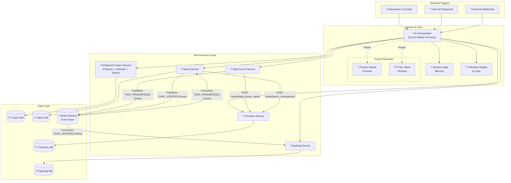

# DSM (Digital Scrum Master) - Kubernetes Jobs Documentation

## Overview of the DSM System

The DSM (Digital Scrum Master) project is a sophisticated, agent-driven simulation of the Agile Software Development Life Cycle (SDLC), orchestrated by an Agentic AI system. It models the journey of a software project from initial setup and team staffing through sprint planning, daily work simulation, and progress tracking. The system is built as a set of interconnected microservices deployed on Kubernetes, with various Kubernetes Jobs and CronJobs automating critical processes and initial data setup.

### High-Level Architecture

The DSM system is a Kubernetes-native, microservices-based simulation of the Agile SDLC, orchestrated by an Agentic AI. The architecture is designed for modularity, autonomy, and event-driven communication.



### Overall Project Setup Flow

To set up the entire DSM project from scratch, the following sequence of Kubernetes operations is typically followed. This document details the specific Jobs and their roles in each step.

```mermaid
graph TD
    A[Start: Deploy Kubernetes Namespace] --> B[Deploy Core Infrastructure<br/>(Redis, PostgreSQL Instances)]
    B --> C[Run Database Schema Setup & Migration Jobs]
    C --> D[Deploy Microservices<br/>(Project, Backlog, Sprint, Daily Scrum, Chronicle)]
    D --> E[Run Initial Data Setup Jobs<br/>(Populate Services with Sample Data)]
    E --> F[Deploy Automated Ceremony & Orchestration Jobs<br/>(CronJobs for Daily Scrum, Orchestrator)]
    F --> G[End: System Ready for Operation]
```

## Table of Contents
1. [Kubernetes Namespace & Core Infrastructure Setup](#1-kubernetes-namespace--core-infrastructure-setup)
2. [Database Schema Setup & Migration Jobs](#2-database-schema-setup--migration-jobs)
3. [Microservice Deployment](#3-microservice-deployment)
4. [Initial Data Setup Jobs](#4-initial-data-setup-jobs)
5. [Automated Ceremony & Orchestration Jobs](#5-automated-ceremony--orchestration-jobs)
6. [Testing, Validation, and Debugging](#6-testing-validation-and-debugging)

---

## 1. Kubernetes Namespace & Core Infrastructure Setup

This section outlines the foundational Kubernetes resources required before deploying any DSM services or jobs. These steps ensure the necessary networking and data storage components are in place, with all deployments now configured with explicit resource requests and limits for improved stability and performance.

### 1.1 Kubernetes Namespace - `ns-dsm.yml`

**Functional Overview:** This manifest creates the dedicated Kubernetes namespace `dsm` where all DSM components (pods, services, jobs, etc.) will reside. This provides logical isolation for the application.

**Type:** Namespace Manifest
**Purpose:** Creates the `dsm` namespace.

### 1.2 Redis Deployment - `redis/redis-deployment.yml` & `redis/redis-service.yml`

**Functional Overview:** Redis is a crucial component for the DSM system's event-driven architecture. It acts as the central event store for task progress updates, enabling asynchronous communication between services.

**Type:** Deployment & Service
**Purpose:** Deploys and exposes the Redis instance.

### 1.3 PostgreSQL Database Deployments

**Functional Overview:** The DSM system adheres to a "database-per-service" pattern, meaning each core microservice has its own dedicated PostgreSQL database instance. This ensures data isolation, independent scaling, and clear ownership.

#### 1.3.1 Main PostgreSQL Database (for shared utilities/initial setup)
*   `postgres/postgres-secret.yml`
*   `postgres/postgres-config.yml`
*   `postgres/postgres-pg-hba-config.yml`
*   `postgres/postgres-pvc.yml`
*   `postgres/postgres-deployment.yml`
*   `postgres/postgres-service.yml`

**Type:** Secret, ConfigMap, PVC, Deployment, Service
**Purpose:** Deploys a central PostgreSQL instance, primarily used for initial setup jobs that create the service-specific databases.

#### 1.3.2 Service-Specific PostgreSQL Databases

*   `postgres-project/postgres-project-deployment.yml` & `postgres-project/postgres-project-service.yml`
*   `postgres-backlog/postgres-backlog-deployment.yml` & `postgres-backlog/postgres-backlog-service.yml`
*   `postgres-sprint/postgres-sprint-deployment.yml` & `postgres-sprint/postgres-sprint-service.yml`
*   `postgres-chronicle/postgres-chronicle-secret.yml`, `postgres-chronicle/postgres-chronicle-config.yml`, `postgres-chronicle/postgres-chronicle-pvc.yml`, `postgres-chronicle/postgres-chronicle-deployment.yml`, `postgres-chronicle/postgres-chronicle-service.yml`

**Type:** Deployments, Services, Secrets, ConfigMaps, PVCs
**Purpose:** Deploys dedicated PostgreSQL instances for the Project, Backlog, Sprint, and Chronicle Services, respectively. Each instance will host its service's specific database.

---

## 2. Database Schema Setup & Migration Jobs

These Kubernetes Jobs are responsible for creating the actual databases within the PostgreSQL instances and applying the necessary SQL schema migrations. They ensure that each service's database has the correct tables and structure before the services themselves are deployed.

### Summary

This phase establishes the data foundation for each microservice. It's crucial that these jobs complete successfully before proceeding to service deployments, as the services depend on the existence and correct schema of their respective databases.

### 2.1 Create Project Database Job - `create-project-db-job.yml`

**Functional Overview:** This job creates the `project_db` database and applies its schema, including tables for projects, teams, roles, PTO, and US holidays. It also handles the initial population of US holiday data from a `us-holiday.json` file, including logic to adjust holidays falling on weekends.

**Type:** Job
**Purpose:** Creates the `project_db` database and applies its schema, including enhanced holiday data management.

**Technical Details:**
- **Image:** `postgres:13`
- **Key Features:**
  - Waits for the PostgreSQL service to be ready.
  - Creates the `project_db` database.
  - Applies SQL migration scripts for project-related tables.
  - Populates `us_holidays` table from `us-holiday.json` with `type` classification and weekend adjustment logic.
- **Related CRs:** `CR_consolidate_project_and_enhance_calendar_services.md`

### 2.2 Create Backlog Database Job - `create-backlog-db-job.yml`

**Functional Overview:** This job creates the `backlog_db` database and applies its schema, setting up the foundation for task and story management.

**Type:** Job
**Purpose:** Creates the `backlog_db` database and applies its schema.

**Technical Details:**
- **Image:** `postgres:13`
- **Key Features:**
  - Creates the `backlog_db` database.
  - Applies SQL migration scripts for backlog-related tables (e.g., `tasks`, `stories`).

### 2.3 Create Sprint Database Job - `postgres/migrations/create-sprint-tables-job.yml`

**Functional Overview:** This job creates the `sprint_db` database and applies its schema, establishing tables for sprint lifecycle management and local task progress tracking within sprints.

**Type:** Job
**Purpose:** Creates the `sprint_db` database and applies its schema.

**Technical Details:**
- **Image:** `postgres:13`
- **Key Features:**
  - Creates the `sprint_db` database.
  - Applies `create_sprint_tables.sql` script to set up schema.

### 2.4 Create Chronicle Database Job - `create-chronicle-db-job.yml`

**Functional Overview:** This job sets up the `chronicle_db` database and applies its schema, which includes tables for both daily scrum reports and structured sprint retrospective reports. This centralizes all historical reporting data.

**Type:** Job
**Purpose:** Creates the `chronicle_db` database and sets up tables for daily scrum and sprint retrospective reports.

**Technical Details:**
- **Image:** `postgres:13`
- **Key Features:**
  - Creates the `chronicle_db` database.
  - Applies SQL migration scripts for `chronicle_notes` (for daily scrums) and `sprint_retrospectives` tables.
- **Related CRs:** `CR_chronicle_reporting_and_daily_scrum_enhancement.md`

### 2.5 Drop Daily Scrum Updates Job - `drop-daily-scrum-updates-job.yml`

**Functional Overview:** This job is a schema migration job specifically designed to remove the `daily_scrum_updates` table from the `sprint_db`. This is a cleanup step reflecting the architectural change where daily scrum reports are now centralized in the Chronicle Service.

**Type:** Job
**Purpose:** Removes the `daily_scrum_updates` table from the `sprint_db` as part of a schema migration.

**Technical Details:**
- **Image:** `postgres:13`
- **Key Features:**
  - Applies `drop_daily_scrum_updates_table.sql` script.
- **Related CRs:** `CR_chronicle_reporting_and_daily_scrum_enhancement.md`

---

## 3. Microservice Deployment

Once the core infrastructure and database schemas are in place, the next step is to deploy the actual microservices. Each service runs as a Kubernetes Deployment and is exposed via a Kubernetes Service.

### Summary

This phase brings the core application logic online. Each service is configured with explicit resource requests and limits, connects to its dedicated database, and communicates with other services via their exposed APIs or Redis Streams.

### 3.1 Enhanced Project Service - `services/project-service/k8s/deployment.yml` & `service.yml`

**Functional Overview:** This is the foundational service that manages all project-related data, team management, and calendar operations (including enhanced holiday data). It consolidates functionality previously handled by separate Calendar and Team Management Services.

**Type:** Deployment & Service
**Purpose:** Deploys and exposes the unified Project Management service.

**Technical Details:**
- **Deployment Strategy:** Utilizes a ConfigMap-based deployment. Source code and dependencies are copied from a ConfigMap to an `emptyDir` volume by an `initContainer`, and Python dependencies are installed into a virtual environment within that volume. The main container then runs the FastAPI application from this virtual environment.
- **Health Checks:** Implements comprehensive `startupProbe` (using `/health/ready` to check PostgreSQL connectivity) and a lightweight `readinessProbe` (using `/health`). Uvicorn access logs for health check endpoints (`/health`, `/health/ready`) are filtered to reduce log noise.
- **Consolidates:** Functionality from deprecated Calendar Service and Team Management Service.
- **Manages:** Projects, teams, roles, designations, team assignments, holiday calendars, and PTO tracking.
- **Related CRs:** `CR_consolidate_project_and_enhance_calendar_services.md`, `CR_comprehensive_service_observability_enhancement.md`

### 3.2 Backlog Service - `services/backlog-service/k8s/deployment.yml` & `service.yml`

**Functional Overview:** The Backlog Service is responsible for managing the master task backlog for each project. It acts as the central repository for all project tasks and synchronizes task progress updates by consuming `TASK_UPDATED` events from Redis Streams.

**Type:** Deployment & Service
**Purpose:** Deploys and exposes the Backlog Management service.

**Technical Details:**
- **Deployment Strategy:** Utilizes a ConfigMap-based deployment. Source code and dependencies are copied from a ConfigMap to an `emptyDir` volume by an `initContainer`, and Python dependencies are installed into a virtual environment within that volume. The main container then runs the FastAPI application from this virtual environment.
- **Health Checks:** Implements comprehensive `startupProbe` (using `/health/ready` to check PostgreSQL, Redis, and `project-service` connectivity) and a lightweight `readinessProbe` (using `/health`). Uvicorn access logs for health check endpoints (`/health`, `/health/ready`) are filtered to reduce log noise.
- **Consumes:** `TASK_UPDATED` events from Redis Streams to synchronize task progress.
- **Related CRs:** `CR_sync_backlog_task_progress-event.md` (supersedes `CR_sync_backlog_task_progress.md`), `CR_comprehensive_service_observability_enhancement.md`

### 3.3 Sprint Service - `services/sprint-service/k8s/deployment.yml` & `service.yml`

**Functional Overview:** The Sprint Service manages the complete lifecycle of sprints, including planning, task assignment, and progress tracking. It consumes `TASK_PROGRESSED` events from Redis, updates its local task state, and then publishes `TASK_UPDATED` events back to Redis for the Backlog Service to consume. It also handles automated sprint closure and generates retrospective reports to the Chronicle Service. For enhanced resilience and high availability, the Sprint Service is deployed with multiple replicas and protected by a Pod Disruption Budget (PDB).

**Type:** Deployment & Service
**Purpose:** Deploys and exposes the Sprint Management service.

**Technical Details:**
- **Deployment Strategy:** Utilizes a ConfigMap-based deployment. Source code and dependencies are copied from a ConfigMap to an `emptyDir` volume by an `initContainer`, and Python dependencies are installed into a virtual environment within that volume. The main container then runs the FastAPI application from this virtual environment.
- **Health Checks:** Implements comprehensive `startupProbe` (using `/health/ready` to check PostgreSQL, Redis, `project-service`, `backlog-service`, and `chronicle-service` connectivity) and a lightweight `readinessProbe` (using `/health`). Uvicorn access logs for health check endpoints (`/health`, `/health/ready`) are filtered to reduce log noise.
- **Replicas:** Deployed with multiple replicas (e.g., 2) for high availability.
- **Pod Disruption Budget (PDB):** Configured with a PDB to ensure a minimum number of available pods during voluntary disruptions.
- **Consumes:** `TASK_PROGRESSED` events from Redis Streams.
- **Publishes:** `TASK_UPDATED` events to Redis Streams.
- **Integrates with:** Chronicle Service for retrospective reports.
- **Handles:** Automated sprint closure, including moving uncompleted tasks back to the backlog with proper `sprint_id` clearing.
- **Related CRs:** `CR_chronicle_reporting_and_daily_scrum_enhancement.md`, `CR_automated_sprint_closure_with_backlog_fix.md`, `CR_sync_backlog_task_progress-event.md`, `CR_scaling_sprint_service_pdb.md`, `CR_comprehensive_service_observability_enhancement.md`

### 3.4 Daily Scrum Service - `services/daily-scrum-service/k8s/deployment.yml` & `service.yml`

**Functional Overview:** The Daily Scrum Service simulates daily work progress and team updates within active sprints. It publishes `TASK_PROGRESSED` events to Redis Streams and sends daily scrum reports directly to the Chronicle Service.

**Type:** Deployment & Service
**Purpose:** Deploys and exposes the Daily Scrum simulation service.

**Technical Details:**
- **Deployment Strategy:** Utilizes a ConfigMap-based deployment. Source code and dependencies are copied from a ConfigMap to an `emptyDir` volume by an `initContainer`, and Python dependencies are installed into a virtual environment within that volume. The main container then runs the FastAPI application from this virtual environment.
- **Health Checks:** Implements comprehensive `startupProbe` (using `/health/ready` to check its dependencies, if any, as per CR, though not explicitly listed for this service in the CR's API changes section, it's implied by "all core services") and a lightweight `readinessProbe` (using `/health`). Uvicorn access logs for health check endpoints (`/health`, `/health/ready`) are filtered to reduce log noise.
- **Publishes:** `TASK_PROGRESSED` events to Redis Streams.
- **Sends reports to:** Chronicle Service.
- **Related CRs:** `CR_chronicle_reporting_and_daily_scrum_enhancement.md`, `CR_comprehensive_service_observability_enhancement.md`

### 3.5 Chronicle Service - `services/chronicle-service/k8s/deployment.yml` & `service.yml`

**Functional Overview:** The Chronicle Service is the central repository for all historical records and important notes, including structured sprint retrospective reports and daily scrum reports. It provides an API for other services to store and retrieve these immutable records.

**Type:** Deployment & Service
**Purpose:** Deploys and exposes the Historical Reporting service.

**Technical Details:**
- **Deployment Strategy:** Utilizes a ConfigMap-based deployment. Source code and dependencies are copied from a ConfigMap to an `emptyDir` volume by an `initContainer`, and Python dependencies are installed into a virtual environment within that volume. The main container then runs the FastAPI application from this virtual environment.
- **Health Checks:** Implements comprehensive `startupProbe` (using `/health/ready` to check PostgreSQL connectivity) and a lightweight `readinessProbe` (using `/health`). Uvicorn access logs for health check endpoints (`/health`, `/health/ready`) are filtered to reduce log noise.
- **Stores:** Structured sprint retrospectives and daily scrum reports.
- **Receives reports from:** Sprint Service and Daily Scrum Service.
- **Related CRs:** `CR_chronicle_reporting_and_daily_scrum_enhancement.md`, `CR_comprehensive_service_observability_enhancement.md`

---

## 4. Initial Data Setup Jobs

These Kubernetes Jobs are responsible for populating the newly deployed microservices with initial sample data. This is crucial for getting a functional DSM environment ready for operation and simulation.

### Summary

This phase ensures that the services have a baseline of data (projects, tasks, etc.) to work with, allowing for immediate testing and simulation of Scrum ceremonies.

### 4.1 Project Setup Job - `setups/project-setup/k8s/project-setup-job.yml`

**Functional Overview:** This job initializes the Enhanced Project Service with sample projects, teams, designations, roles, and related configurations. It also plays a key role in loading and processing the `us-holiday.json` data into the `project_db`.

**Type:** Job
**Purpose:** Initializes the Project Service with foundational data, including enhanced holiday information.

**Technical Details:**
- **Loads:** Sample projects, teams, roles, and holiday data.
- **Processes:** `us-holiday.json` to populate the `us_holidays` table, applying weekend adjustment logic.
- **Related CRs:** `CR_consolidate_project_and_enhance_calendar_services.md`

### 4.2 Backlog Setup Job - `setups/backlog-setup/k8s/backlog-setup-job.yml`

**Functional Overview:** This job initializes the Backlog Service with sample backlog items, tasks, and stories for various projects. It ensures that there's a populated backlog for sprint planning.

**Type:** Job
**Purpose:** Initializes the Backlog Service with sample tasks and stories.

### 4.3 Sprint Setup Job - `setups/sprint-setup/k8s/sprint-setup-job.yml`

**Functional Overview:** This job initializes the Sprint Service with sample sprints and configurations. It prepares the environment for sprint planning and execution.

**Type:** Job
**Purpose:** Initializes the Sprint Service with sample sprint data.

### 4.4 Daily Scrum Setup Job - `projects/daily-scrum-setup/k8s/daily-scrum-setup-job.yml`

**Functional Overview:** This job initializes the Daily Scrum Service by creating sample daily scrum updates. It does this by calling the Daily Scrum Service API, which then sends these updates to the Chronicle Service for historical record-keeping.

**Type:** Job
**Purpose:** Creates sample daily scrum updates via the Daily Scrum Service API.

**Technical Details:**
- **Interacts with:** Daily Scrum Service API.
- **Resulting data stored in:** Chronicle Service.
- **Related CRs:** `CR_chronicle_reporting_and_daily_scrum_enhancement.md`

---

## 5. Automated Ceremony & Orchestration Jobs

These jobs automate various Scrum ceremonies and orchestrate the overall SDLC workflow within the DSM system. They are typically configured as CronJobs for scheduled execution or as one-off Jobs for specific triggers.

### Summary

This phase brings the automated "Scrum Master" functionality to life, simulating daily work, planning sprints, and managing sprint closures.

### 5.1 Daily Scrum CronJob - `projects/cjb_dailyscrum.yml` (and Project-Specific Variants)

**Functional Overview:** This CronJob automatically triggers the daily scrum orchestration on a schedule. It executes the `run_dailyscrum.py` script, which acts as an orchestrator. The script gathers all necessary data—team member counts from the Project Service and task summaries from the Sprint Service—before constructing and sending detailed daily scrum reports, enriched with summary metrics, to the Chronicle Service.

**Type:** CronJob
**Purpose:** Automatically runs the daily scrum orchestration on a schedule.

**Technical Details:**
- **Schedule:** Configurable (e.g., `*/2 * * * *` for testing, or daily for production).
- **Executes:** `run_dailyscrum.py` script.
- **Orchestration Flow:**
  1. Calls `Project Service` (`GET /projects/{id}/team-members`) to get team size.
  2. Calls `Sprint Service` (`GET /sprints/{id}/task-summary`) to get task statistics.
  3. Calls `Chronicle Service` (`POST /notes/daily_scrum_report`) multiple times, once for each team member's update, embedding the summary metrics in each call.
- **Stateless Operation**: The job's YAML manifest has been updated to remove persistent volume mounts. The script is fully API-driven and does not require file system access, making the job stateless and more robust.
- **Project-Specific Variants:** `projects/cjb_dailyscrum-APO009.yml`, `projects/cjb_dailyscrum-NEX005.yml`, `projects/cjb_dailyscrum-TEST001.yml`, `projects/cjb_dailyscrum-TIT007.yml`, `projects/cjb_dailyscrum-ZEP010.yml`
- **Related CRs:** `CR_enhance_daily_scrum_report_with_summary.md`

### 5.2 Daily Scrum Service CronJob - `services/daily-scrum-service/k8s/cronjob.yml`

**Functional Overview:** This is an alternative CronJob for triggering daily scrum simulations. It uses `curl` to interact with the Sprint Service API to find active sprints and then triggers daily scrums for those sprints via the Daily Scrum Service.

**Type:** CronJob
**Purpose:** Triggers daily scrum simulations for active sprints.

**Technical Details:**
- **Schedule:** Configurable (e.g., `0 14,0 * * *` for 8 AM and 6 PM CST).
- **Uses:** `curl` to interact with Sprint Service and Daily Scrum Service APIs.

### 5.3 Sprint Planning Job - `projects/cjb_sprint_planning.yml`

**Functional Overview:** This is a one-time job that initiates sprint planning for a specified project. It calls the Sprint Service API to create a new sprint, which then assigns tasks from the backlog to the new sprint.

**Type:** Job
**Purpose:** Initiates sprint planning for a project.

### 5.4 Complete Sprint Tasks Job - `complete-sprint-tasks-job.yml`

**Functional Overview:** This job is primarily used for testing sprint closure workflows. It marks all tasks in a specific sprint as 100% complete, preparing the sprint for formal closure by the orchestrator or a manual trigger.

**Type:** Job
**Purpose:** Marks all tasks in a sprint as complete (useful for testing sprint closure).

**Technical Details:**
- **Interacts with:** Sprint Service API to update task progress.
- **Context:** Often used in conjunction with automated sprint closure processes.

### 5.5 DSM Orchestrator Job - `orchestrator-job.yml`

**Functional Overview:** This job represents the core automation logic of the DSM system, acting as an intelligent agent that manages the Scrum process lifecycle. It orchestrates the entire DSM workflow, including automated sprint closure, managing project backlogs, starting new sprints when none are active, and running daily scrums. It leverages the fixed backlog task update logic to ensure data consistency.

**Type:** Job
**Purpose:** Orchestrates the entire DSM workflow, including automated sprint closure and management.

**Workflow:**
1.  Retrieves all projects from Project Service.
2.  Ensures each project has a populated backlog.
3.  Checks for active sprints.
4.  If an active sprint exists, runs daily scrum.
5.  If no active sprint, starts a new one.
6.  Manages automated sprint closure, leveraging the fixed backlog task update logic.

**Technical Details:**
- **Image:** `python:3.10-slim`
- **Key Features:**
  - Interacts with all major services (Project, Backlog, Sprint, Daily Scrum, Chronicle).
  - Manages project backlogs.
  - Starts new sprints when none are active.
  - Runs daily scrums for active sprints.
  - Implements automated sprint closure.
  - Comprehensive error handling and logging.
- **Related CRs:** `CR_automated_sprint_closure_with_backlog_fix.md`

---

## 6. Testing, Validation, and Debugging

### 6.1 Testing and Validation Strategy
This section provides tools and commands for developers and operators to diagnose issues, confirm system behavior, and validate the end-to-end functionality of the DSM system.

### 6.2 Validation Commands

#### 6.2.1 Health Checks
Verify that all services are running and healthy, including their comprehensive readiness probes and log filtering:
```bash
# Check all pods
kubectl get pods -n dsm

# Check all services
kubectl get svc -n dsm

# Test lightweight health endpoints (/health)
# This endpoint is used for the Kubernetes readinessProbe and confirms the service process is running.
# Its access logs are filtered to reduce noise.
kubectl exec testapp-pod -n dsm -- curl -s http://project-service.dsm.svc.cluster.local/health
kubectl exec testapp-pod -n dsm -- curl -s http://backlog-service.dsm.svc.cluster.local/health
kubectl exec testapp-pod -n dsm -- curl -s http://sprint-service.dsm.svc.cluster.local/health
kubectl exec testapp-pod -n dsm -- curl -s http://daily-scrum-service.dsm.svc.cluster.local/health
kubectl exec testapp-pod -n dsm -- curl -s http://chronicle-service.dsm.svc.cluster.local/health
kubectl exec testapp-pod -n dsm -- curl -s http://test-log-app.dsm.svc.cluster.local/health

# Test comprehensive readiness endpoints (/health/ready)
# This endpoint is used for the Kubernetes startupProbe and performs checks against all critical external dependencies (e.g., PostgreSQL, Redis, other services).
# Its access logs are also filtered to reduce noise.
kubectl exec testapp-pod -n dsm -- curl -s http://project-service.dsm.svc.cluster.local/health/ready | jq
kubectl exec testapp-pod -n dsm -- curl -s http://backlog-service.dsm.svc.cluster.local/health/ready | jq
kubectl exec testapp-pod -n dsm -- curl -s http://sprint-service.dsm.svc.cluster.local/health/ready | jq
kubectl exec testapp-pod -n dsm -- curl -s http://daily-scrum-service.dsm.svc.cluster.local/health/ready | jq
kubectl exec testapp-pod -n dsm -- curl -s http://chronicle-service.dsm.svc.cluster.local/health/ready | jq
kubectl exec testapp-pod -n dsm -- curl -s http://test-log-app.dsm.svc.cluster.local/health/ready | jq
```

#### 6.2.2 Database Connectivity
Verify database connections:
```bash
# Test database connectivity
kubectl exec -it testapp-pod -n dsm -- python3 -c "
import psycopg2
conn = psycopg2.connect(
    host='project-db',
    database='project_db',
    user='dsm_user',
    password='dsm_password'
)
print('Database connection successful')
conn.close()
"
```

#### 6.2.3 End-to-End Testing
Test complete workflows:
```bash
# Create a project
kubectl exec testapp-pod -n dsm -- curl -X POST \
  -H "Content-Type: application/json" \
  -d '{"id": "TEST-001", "name": "Test Project", "description": "Test project", "status": "active"}' \
  http://project-service.dsm.svc.cluster.local/projects

# Create a sprint
kubectl exec testapp-pod -n dsm -- curl -X POST \
  -H "Content-Type: application/json" \
  -d '{"sprint_name": "Test Sprint", "duration_weeks": 2}' \
  http://sprint-service.dsm.svc.cluster.local/sprints/TEST-001

# Run daily scrum
kubectl exec testapp-pod -n dsm -- curl -X POST \
  http://daily-scrum-service.dsm.svc.cluster.local/scrums/TEST-001-S01/run

# Get all backlog summaries
kubectl exec testapp-pod -n dsm -- curl http://backlog-service.dsm.svc.cluster.local/backlogs/summary

# Get enhanced list of projects with their sprints
kubectl exec testapp-pod -n dsm -- curl http://sprint-service.dsm.svc.cluster.local/sprints/list_projects | jq

# Run daily scrum
kubectl exec testapp-pod -n dsm -- curl -X POST \
  http://daily-scrum-service.dsm.svc.cluster.local/scrums/TEST-001-S01/run

# Get daily scrum updates for a sprint (from Chronicle Service)
# Get daily scrum updates for a sprint (from Chronicle Service)
kubectl exec testapp-pod -n dsm -- curl http://chronicle-service.dsm.svc.cluster.local/notes/daily_scrum_report?sprint_id=TEST-001-S01 | jq

# Get structured sprint retrospective report (from Chronicle Service)
kubectl exec testapp-pod -n dsm -- curl http://chronicle-service.dsm.svc.cluster.local/notes/sprint_retrospective?sprint_id=TEST-001-S05 | jq
```


### 6.3 Task Progress Synchronization Testing

Verify that task progress updates are properly synchronized between Sprint Service and Backlog Service via Redis Streams:

```bash
# 1. Check active sprint and tasks (replace CHR006-S02 with your active sprint ID)
kubectl exec testapp-pod -n dsm -- curl -X GET http://sprint-service.dsm.svc.cluster.local/sprints/active
kubectl exec testapp-pod -n dsm -- curl -X GET http://sprint-service.dsm.svc.cluster.local/sprints/CHR006-S02/tasks

# 2. Manually trigger a task progress update for a non-completed task (e.g., CHR006-TASK005 to 90%)
#    Replace CHR006-TASK005 and the percentage as needed based on your sprint-db content.
kubectl exec -it testapp-pod -n dsm -- curl -X POST -H "Content-Type: application/json" -d '{"progress_percentage": 90}' http://sprint-service.dsm.svc.cluster.local/tasks/CHR006-TASK005/progress

# 3. Verify Sprint DB has updated progress
#    Get the sprint-db pod name first: kubectl get pods -n dsm -l app=postgres-sprint -o jsonpath='{.items[0].metadata.name}'
kubectl exec -it -n dsm sprint-db-76cc956954-dx5z2 -- env PGPASSWORD=dsm_password psql -h sprint-db -U dsm_user -d sprint_db -c "SELECT task_id, status, progress_percentage FROM tasks WHERE task_id = 'CHR006-TASK005';"

# 4. Verify Backlog DB is synchronized with same progress
#    Get the backlog-db pod name first: kubectl get pods -n dsm -l app=backlog-db -o jsonpath='{.items[0].metadata.name}'
kubectl exec -it -n dsm backlog-db-99cd57d77-xcfsq -- env PGPASSWORD=dsm_password psql -h backlog-db -U dsm_user -d backlog_db -c "SELECT task_id, status, progress_percentage FROM tasks WHERE task_id = 'CHR006-TASK005';"

# 5. Verify Backlog Service API reflects synchronized data
kubectl exec testapp-pod -n dsm -- curl -X GET http://backlog-service.dsm.svc.cluster.local/backlogs/CHR006/summary | jq

# 6. Check Sprint Service logs for published TASK_UPDATED events
#    Get the sprint-service pod name first: kubectl get pods -n dsm -l app=sprint-service -o jsonpath='{.items[0].metadata.name}'
kubectl logs -n dsm sprint-service-5b98d84d8c-x6mq5 --tail=50 | grep "Published TASK_UPDATED event from update_task_progress"

# 7. Check Backlog Service logs for consumed TASK_UPDATED events
#    Get the backlog-service pod name first: kubectl get pods -n dsm -l app=backlog-service -o jsonpath='{.items[0].metadata.name}'
kubectl logs -n dsm backlog-service-555ffbbd59-9s5qd --tail=50 | grep -E "Processing TASK_UPDATED|Successfully updated task in backlog from event"
```

**Expected Results:**
- Sprint DB and Backlog DB should show identical progress_percentage values for updated tasks.
- Tasks with progress > 0% should have status = 'in_progress' in both Sprint DB and Backlog DB (unless 100%, then 'completed').
- Sprint Service logs should show successful publication of `TASK_UPDATED` events to Redis Streams.
- Backlog Service logs should show successful consumption of `TASK_UPDATED` events from Redis Streams and subsequent database updates.
- Backlog Service API (`/backlogs/{project_id}/summary`) should reflect correct task counts by status.


### 6.4 Debugging Jobs
These jobs are utility jobs used for debugging, testing, and verifying the functionality of various DSM components and inter-service communication. They are not part of the regular operational workflow but are invaluable during development and troubleshooting.

#### 6.3.1 Debug Daily Scrum Job - `debug-daily-scrum-job.yml`
**Functional Overview:** This job helps debug daily scrum functionality by testing API connectivity and response parsing for daily scrum workflows. It retrieves active sprint IDs from the Sprint Service for verification.
**Type:** Job
**Purpose:** Debugs daily scrum functionality and API connectivity.

#### 6.3.2 Debug Sprint Status Job - `debug-sprint-status-job.yml`
**Functional Overview:** This job is used to debug sprint status retrieval from the Sprint Service. It retrieves sprints for a specific project to verify service functionality and API connectivity.
**Type:** Job
**Purpose:** Debugs sprint status retrieval from the Sprint Service.

#### 6.3.3 Debug Curl Sed Job - `debug-curl-sed-job.yml`
**Functional Overview:** This job is a utility for debugging `curl` and `sed` command usage, particularly for JSON parsing operations. It tests different methods of extracting data (like sprint IDs) from JSON responses.
**Type:** Job
**Purpose:** Debugs `curl` and `sed` command usage for JSON parsing.

#### 6.3.4 Debug Python JSON Parse Job - `debug-python-json-parse-job.yml`
**Functional Overview:** This job helps debug Python-based JSON parsing and API interactions within the DSM system. It uses the Python `requests` library for API calls to test connectivity and task retrieval/completion workflows with detailed error handling.
**Type:** Job
**Purpose:** Debugs Python-based JSON parsing and API interactions.

#### 6.3.5 Backlog DB Check Job - `backlog-db-check-job.yml`
**Functional Overview:** This job verifies the connectivity to the Backlog database and inspects its table structure. It lists tables in the `backlog_db` to confirm the schema and ensures database accessibility.
**Type:** Job
**Purpose:** Verifies backlog database connectivity and table structure.

### 6.4 Troubleshooting

#### 6.4.1 Common Issues
- **Database Connection Issues**: Verify database pods are running, secrets are correct, and service endpoints are available.
- **Setup Job Failures**: Check job logs, ensure database schemas exist, and verify service dependencies are running.
- **API Communication Issues**: Verify service endpoints, check service health, and review network policies.

#### 6.4.2 Debugging Commands
```bash
# Check all resources in the namespace
kubectl get all -n dsm

# Tail logs for a specific deployment
kubectl logs -f deployment/<service-name> -n dsm

# Check events, sorted by the last timestamp
kubectl get events -n dsm --sort-by='.lastTimestamp'
```

#### 6.4.3 Reset and Recovery
If the system is in an inconsistent state, a full reset might be necessary:
```bash
# 1. Delete all jobs and deployments
kubectl delete jobs,deployments --all -n dsm

# 2. Delete all services (except databases)
kubectl delete svc project-service backlog-service sprint-service daily-scrum-service -n dsm

# 3. Reapply manifests in the correct order
```
