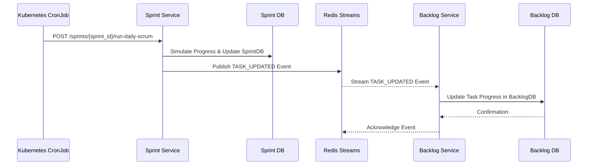
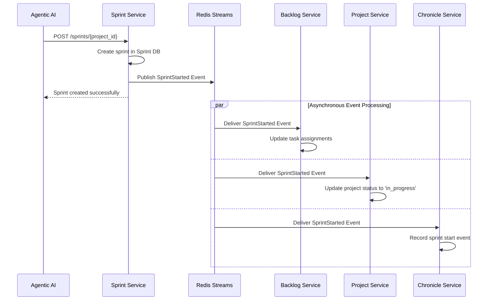
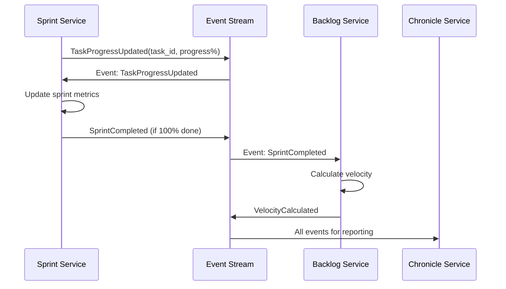

# DSM Pragmatic Event-Driven Architecture: Current State & Future Vision

## 1. Current Architecture: A Hybrid Model

### 1.1 Context & Current State
As described in the main `DSM_Architecture_Overview.md`, the DSM system currently operates on a **hybrid communication model**. This model pragmatically blends synchronous, direct API calls for most orchestration workflows with asynchronous, event-driven communication for specific, decoupled processes.

This document clarifies the event-driven aspects of the *current* architecture and outlines the strategic vision for a more comprehensive, event-first future.

The primary challenges of a purely API-driven system—such as tight service coupling, cascading failures, and testing complexity—have been partially mitigated by introducing events for key workflows.

### 1.2 Core Philosophy
- **Pragmatism Over Purity**: Use event-driven patterns where they provide the most immediate value in resilience and decoupling, without forcing a full rewrite of the existing API-based system.
- **Simplicity First**: Leverage the existing Redis Streams infrastructure, which is simple to operate and sufficient for the current scale.
- **Future-Ready**: The current implementation provides a solid foundation to evolve towards a more fully event-driven system as requirements grow.

## 2. Implemented Event-Driven Workflows

The current architecture uses Redis Streams to handle two key business events, which has successfully decoupled services and improved resilience in critical process flows.

**Note on Service Deprecation**: The `Daily Scrum Service` has been deprecated. Its responsibilities, including the simulation of work and publishing of task progress, have been absorbed by the **`Sprint Service`**. All diagrams and descriptions have been updated to reflect this.

### 2.1 Implemented Domain Events

| Event | Producer | Consumers | Purpose | Status |
|---|---|---|---|---|
| `TASK_UPDATED` | **Sprint Service** | Backlog Service | Asynchronously synchronize task progress from the sprint view to the master backlog. | ✅ Implemented |
| `SprintStarted` | **Sprint Service** | Backlog, Project, Chronicle | Decouple the sprint creation process, allowing downstream services to react asynchronously. | ✅ Implemented |

### 2.2 Task Progress Synchronization Workflow

This workflow ensures that the master backlog is kept up-to-date with work happening inside a sprint without tightly coupling the `Sprint Service` and `Backlog Service`.

**Benefits Realized**:
- **Resilience**: If the `Backlog Service` is temporarily down, the daily scrum simulation in the `Sprint Service` can still complete successfully. The backlog will catch up once it recovers.
- **Decoupling**: The `Sprint Service` no longer needs to know about the `Backlog Service`'s API for task updates.

### 2.3 Sprint Planning Workflow (Event-Driven)

This workflow decouples the creation of a sprint from the various updates that need to happen across the system in response.

**Benefits Realized**:
- **Improved User Experience**: The API call to create a sprint returns immediately without waiting for all downstream services to process the request.
- **Enhanced Resilience**: Sprint creation succeeds even if the `Project Service` or `Chronicle Service` is temporarily unavailable.

## 3. Implementation Status

### Phase 1: Foundational Event Flows ✅ **COMPLETED**
- ✅ Redis Streams infrastructure is operational.
- ✅ `TASK_UPDATED` event workflow is in production, published by the `Sprint Service`.
- ✅ `SprintStarted` event workflow is in production.
  - ✅ `Sprint Service` publishes the event.
  - ✅ `Backlog Service`, `Project Service`, and `Chronicle Service` all consume the event successfully.
- ✅ Existing API endpoints remain fully functional, ensuring backward compatibility.

## 4. Future Enhancements: The Path to an Event-First Architecture

This section outlines the strategic vision for extending event-driven patterns across the DSM ecosystem. These planned enhancements aim to further increase resilience, testability, and scalability.

### 4.1 Proposed Future Domain Events

| Event | Producer | Consumers | Purpose |
|---|---|---|---|
| `SprintCompleted` | Sprint Service | Backlog, Project | Update velocity, trigger retrospectives, and update project status. |
| `VelocityCalculated` | Backlog Service | Project, Analytics | Propagate new performance metrics for project health monitoring. |
| `ProjectStatusChanged` | Project Service | All Services | Ensure all parts of the system have a consistent view of a project's status. |

### 4.2 Target Architecture: Daily Scrum Workflow

The future vision for the daily scrum workflow would also include the `SprintCompleted` event, creating a fully event-driven cycle.

### 4.3 Future Implementation Phases

#### Phase 2: Extended Event Workflows (Pending)
- ⏳ **Implement `SprintCompleted` Event**:
  - `Sprint Service` to publish the event upon sprint closure.
  - `Backlog Service` to consume it to finalize tasks and calculate velocity.
  - `Project Service` to consume it to update project status.
- ⏳ **Implement `VelocityCalculated` Event**:
  - `Backlog Service` to publish the event after calculating new metrics.
  - `Project Service` to consume it for project health and status updates.

#### Phase 3: Event Observability and Reliability (Pending)
- **Event Monitoring Dashboard**: Create visibility into event processing latency, consumer group lag, and error rates.
- **Event Replay Capability**: Implement a simple mechanism to replay events for failure recovery.
- **Dead Letter Handling**: Establish a pattern for handling events that repeatedly fail processing.

## 5. Long-Term Evolution Path

### 5.1 Strategic Architectural Evolution
This event-driven design provides a clear path for the DSM system to evolve from a POC to a production-ready platform without requiring complete rebuilds.

### 5.2 Near-term Enhancements (6-12 months)
- **Event Schema Registry**: Formalize event contracts to prevent breaking changes.
- **Saga Pattern Implementation**: For complex multi-service workflows that require transactional consistency.
- **Event Versioning**: Allow event schemas to evolve without breaking consumers.

### 5.3 Long-term Migration (1-2 years)
- **Apache Kafka Migration**: When event volume or operational requirements outgrow Redis Streams.
- **Event Sourcing Implementation**: For a complete audit trail and time-travel query capabilities.
- **CQRS Pattern**: Separate read and write models to optimize for complex analytics queries.