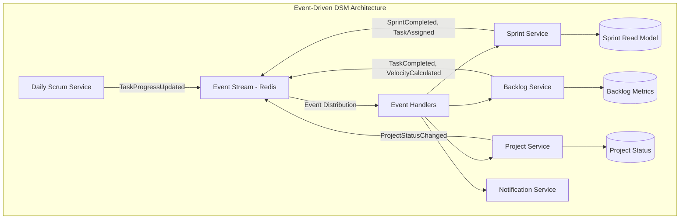
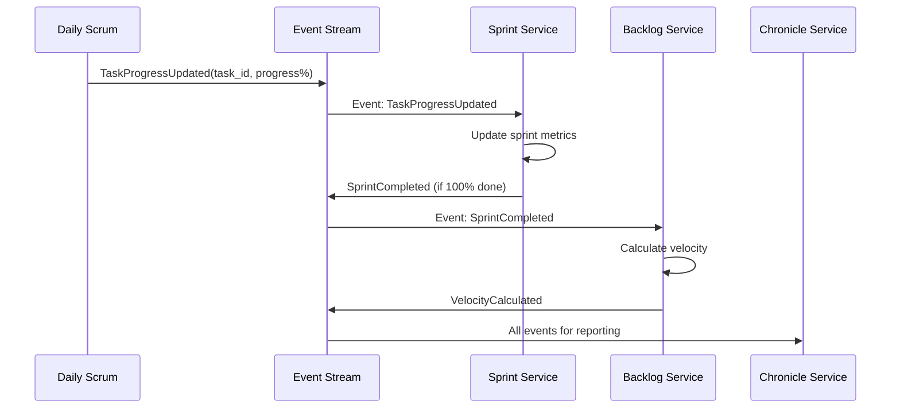
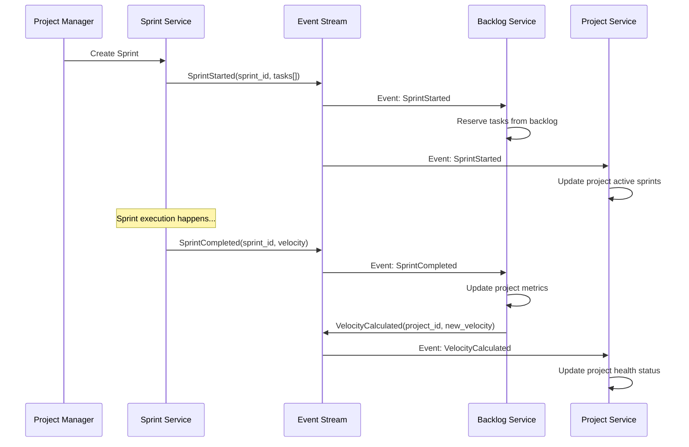
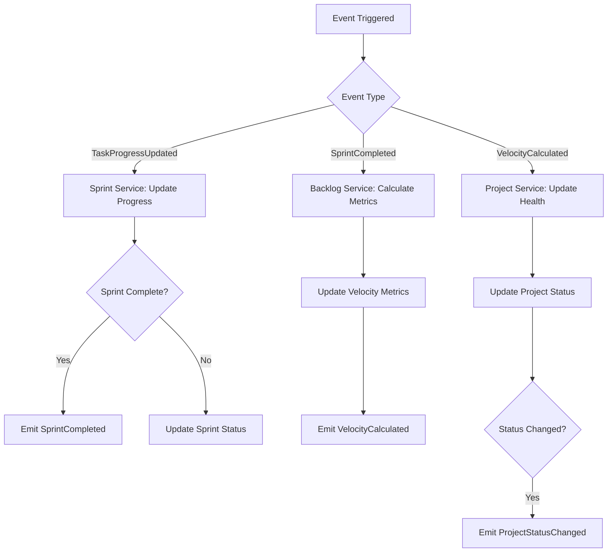

# DSM Pragmatic Event-Driven Architecture

## Design Principles for POC

### Context & Strategic Intent
The DSM system represents a pragmatic evolution from the current architecture described in the DSM_Architecture_Overview. Rather than implementing a full-blown Event Sourcing system with complex aggregates and CQRS patterns, this design focuses on maximizing the event-driven benefits while maintaining the simplicity appropriate for a POC environment.

Currently, the DSM system uses a **hybrid communication model** - direct API calls for most interactions and Redis Streams specifically for task progress synchronization. This event-driven design extends that pattern by making events the **primary communication mechanism** for all business workflows, while preserving the existing service boundaries and data ownership patterns.

The key insight is that many of the system's challenges stem from tight coupling between services through direct API calls. By shifting to an event-first approach, we can achieve better resilience, easier testing, and clearer separation of concerns without the complexity overhead of full Event Sourcing.

### Current Architecture Challenges
From the existing DSM_Architecture_Overview, several pain points become evident:
- **Service Dependencies**: Sprint Service depends on both Project and Backlog services via direct API calls
- **Cascading Failures**: When one service fails, it can block entire workflows
- **Testing Complexity**: Integration testing requires all services to be running
- **Workflow Rigidity**: Changes to business processes require coordinating updates across multiple services

### Core Philosophy
- **Simplicity First**: Use Redis Streams, avoid over-engineering while solving real architectural problems
- **Event-Driven Workflows**: Business processes trigger cascading events rather than requiring orchestrated API call sequences
- **Loose Coupling**: Services communicate via events, reducing runtime dependencies
- **Future-Ready**: Design allows natural evolution to Kafka/full Event Sourcing when scale demands it

## Architecture Overview

### From Hybrid to Event-First Communication
The current DSM architecture employs a hybrid communication model where services primarily communicate through direct API calls, with Redis Streams used specifically for task progress updates. This design represents an evolution toward an **event-first architecture** where business events drive most inter-service communication.

This transition addresses key architectural challenges identified in the current system:
1. **Dependency Chains**: Currently, sprint planning requires the Sprint Service to make synchronous calls to both Project and Backlog services, creating a dependency chain that can fail at any point
2. **Tight Coupling**: Services must know about each other's API contracts and availability
3. **Workflow Brittleness**: Business processes span multiple services, making error handling and rollback complex

### Event-Driven Transformation Strategy
Rather than reimplementing the entire system, this design leverages the existing Redis Streams infrastructure to extend event-driven patterns to more business workflows. The transformation follows these principles:

**Preserve Service Boundaries**: Each service maintains its current database ownership and business responsibilities, ensuring minimal disruption to existing functionality.

**Events as Business Language**: Instead of thinking in terms of API calls, workflows are expressed as sequences of business events that naturally reflect Agile ceremonies and processes.

**Evolutionary Path**: Services can be migrated to event-driven communication incrementally, allowing mixed API and event communication during the transition.



### Benefits of Event-Driven Architecture for DSM
This architectural shift provides several concrete benefits for the DSM system:

**Resilience**: If the Backlog Service is temporarily unavailable, sprint planning can still proceed. The Backlog Service will eventually process the `SprintStarted` event when it comes back online, maintaining data consistency.

**Testability**: Services can be tested in isolation using event fixtures, eliminating the need for complex integration test setups with multiple running services.

**Agentic AI Compatibility**: The event-driven model aligns perfectly with the DSM's agentic vision. The AI orchestrator can trigger high-level business events and let the system handle the detailed coordination, rather than managing complex API call sequences.

**Natural Audit Trail**: Every business action generates events, providing a complete log of system activity without additional infrastructure.

## Event Types & Workflows

### Domain Event Design Philosophy
The event types are designed to directly model the Agile ceremonies and business processes described in the DSM_Architecture_Overview. Each event represents a significant business occurrence that other services need to know about, rather than technical implementation details.

The event catalog is intentionally minimal, focusing only on events that drive cross-service coordination. This prevents event proliferation while ensuring all critical business workflows remain decoupled and resilient.

### Event-to-Business Process Mapping
Understanding how events map to actual Agile ceremonies helps architects see the practical value:

- **TaskProgressUpdated**: Represents the daily work progress that occurs during sprints, triggered by the Daily Scrum Service's simulation
- **SprintCompleted**: Signals the end of a sprint ceremony, allowing multiple services to react (update velocity, trigger retrospectives, etc.)
- **TaskCompleted**: Can be triggered by multiple sources (sprint work, direct updates) and ensures all services maintain consistent task status
- **VelocityCalculated**: Enables data-driven sprint planning and project health monitoring across services

### Core Domain Events
| Event | Producer | Consumers | Purpose |
|-------|----------|-----------|---------|
| `TaskProgressUpdated` | Daily Scrum | Sprint, Backlog | Track sprint progress |
| `SprintCompleted` | Sprint Service | Backlog, Project | Update velocity, status |
| `TaskCompleted` | Sprint/Daily Scrum | Backlog, Project | Mark completion |
| `SprintStarted` | Sprint Service | Project, Chronicle | Sprint lifecycle |
| `VelocityCalculated` | Backlog Service | Project, Analytics | Performance metrics |
| `ProjectStatusChanged` | Project Service | All Services | Status synchronization |

### Event Schema Design Rationale
The simplified event structure balances expressiveness with maintainability:

```
{
  event_id: uuid,           // Enables idempotency and deduplication
  event_type: string,       // Routing and handler selection
  aggregate_id: string,     // Entity this event relates to (task_id, sprint_id, project_id)
  payload: { ... },         // Domain-specific data, kept flexible for evolution
  timestamp: iso_datetime,  // Event ordering and debugging
  correlation_id: uuid      // Trace related events across services
}
```

**Design Decisions Explained**:
- **Single aggregate_id field**: Simplifies event handling logic compared to separate entity type fields
- **Flexible payload**: Allows event schema evolution without infrastructure changes
- **Optional correlation_id**: Enables tracing complex workflows without making it mandatory for simple events
- **No event versioning**: Appropriate for POC scale, can be added later when schema evolution becomes necessary

## Functional Workflows

### Workflow Design Philosophy
These workflows demonstrate how the event-driven architecture transforms the existing DSM business processes. Instead of the current model where services orchestrate complex API call sequences, business events trigger natural cascading reactions across services.

Each workflow is designed to be **resilient by default** - if a service is temporarily unavailable, events wait in Redis Streams until the service recovers, ensuring no data is lost and eventual consistency is maintained.

### 1. Daily Scrum Task Progress Workflow

This workflow replaces the current direct API orchestration described in the DSM_Architecture_Overview's "Daily Scrum Flow" with a more resilient event-driven approach.

**Current Challenge**: The existing workflow requires the Daily Scrum Service to coordinate directly with Sprint and Backlog services, creating tight coupling and potential points of failure.

**Event-Driven Solution**: The Daily Scrum Service simply publishes progress events and lets the system handle coordination asynchronously.



**Workflow Steps:**
1. Daily Scrum updates task progress → publishes `TaskProgressUpdated`
2. Sprint Service consumes event → recalculates sprint completion
3. If sprint complete → publishes `SprintCompleted`
4. Backlog Service consumes → updates project velocity
5. Chronicle Service logs all events for audit

**Benefits Over Current Approach**:
- **Failure Resilience**: If Backlog Service is down, sprint calculations still proceed
- **Performance**: No blocking API calls between services
- **Extensibility**: New services (like notification systems) can easily consume the same events

### 2. Sprint Lifecycle Workflow

This workflow demonstrates how major Agile ceremonies can be orchestrated through events rather than API call chains.

**Architectural Insight**: In the current DSM system, sprint planning requires the Sprint Service to make synchronous calls to Project Service (for team info) and Backlog Service (for available tasks). This creates a rigid dependency chain. The event-driven approach allows each service to contribute to sprint planning independently.



**Workflow Steps:**
1. Sprint created → `SprintStarted` published
2. Backlog reserves tasks, Project tracks active sprint
3. Sprint runs with task progress events
4. Sprint completion triggers velocity calculation
5. Project health status updated based on velocity

**Why This Improves the Current Architecture**:
- **Service Independence**: Backlog and Project services can react to sprint events independently
- **Data Consistency**: Each service maintains its own consistent view through event processing
- **Scalability**: Services can process events at their own pace without blocking others

### 3. Cross-Service Synchronization Pattern

This pattern shows how complex business logic can be distributed across services through events, replacing the need for central orchestration.



**Distributed Business Logic Explained**:
Rather than having a central service that knows all business rules, each service embeds the business logic relevant to its domain. The Sprint Service knows when a sprint is complete, the Backlog Service knows how to calculate velocity, and the Project Service knows how to assess project health. Events coordinate these distributed decisions without tight coupling.

## Service Integration Patterns

### Evolution from Current Architecture
The current DSM system uses a **database-per-service pattern** with services communicating primarily through direct API calls. This integration pattern preserves those architectural benefits while extending event-driven communication to reduce coupling and improve resilience.

The key insight is that we can maintain the existing service boundaries and data ownership while changing how services coordinate their activities. Each service continues to own its database and business logic, but instead of making direct API calls for coordination, they publish and consume business events.

### Event Bus Pattern (Redis Streams)

**Why Redis Streams for POC Scale**:
The choice of Redis Streams over more complex event platforms like Kafka is deliberate for the POC context. Redis Streams provides the core event streaming capabilities needed for the DSM system while being operationally simpler:

- **Consumer Groups**: Multiple instances of a service can process events in parallel without duplicate processing
- **Guaranteed Delivery**: Events are persisted until acknowledged by consumers
- **Event Ordering**: Natural ordering within the stream ensures events are processed in sequence
- **Backpressure Handling**: Consumers can process events at their own pace
- **Simple Operations**: No complex cluster management or schema registries required

**Stream Design**:
- **Single Stream**: `dsm:events` - all domain events flow through one stream for simplicity
- **Consumer Groups**: Each service has its own consumer group (e.g., `sprint-service`, `backlog-service`)
- **Event Routing**: Services filter events by `event_type` to process only relevant events
- **Failure Recovery**: Redis Stream automatic retry on consumer failure ensures no event loss

### Service Responsibilities in Event-Driven Model

Understanding how each service's responsibilities change helps architects see the practical implications of the event-driven transformation.

#### Daily Scrum Service - Pure Event Producer
**Current Role**: Makes API calls to retrieve task data, then publishes progress events
**New Role**: Focuses purely on business logic (work simulation) and event publishing
**Benefit**: Simplified service with no external dependencies, making it highly reliable and testable

#### Sprint Service - Event Hub
**Current Role**: Coordinates with Project and Backlog services via API calls for sprint planning
**New Role**: Consumes task progress events, maintains sprint state, publishes sprint lifecycle events
**Benefit**: Becomes the authoritative source for sprint state while reducing external dependencies

#### Backlog Service - Metrics Calculator
**Current Role**: Provides task data to other services via API calls
**New Role**: Maintains master task list, calculates velocity metrics from sprint completion events
**Benefit**: Can focus on its core competency (backlog management) without being constantly queried by other services

#### Project Service - Status Aggregator
**Current Role**: Provides project and team data to other services
**New Role**: Maintains project metadata, aggregates status from velocity and sprint events
**Benefit**: Becomes a true master data service without tight coupling to operational services

## Data Consistency Strategy

### Understanding Consistency Trade-offs in DSM Context
The current DSM architecture already accepts some level of eventual consistency - the Redis Streams used for task progress updates don't guarantee immediate consistency across Sprint and Backlog databases. This event-driven design extends that pattern while making the consistency model more explicit and manageable.

**Why Eventual Consistency Works for DSM**:
The Agile methodology that DSM simulates is inherently designed for eventual consistency. Sprint planning doesn't require real-time backlog updates, and daily scrums can tolerate slight delays in cross-service synchronization. This makes the DSM domain well-suited for event-driven architecture.

### Eventually Consistent Model
**Consistency Boundaries**: Each service maintains strong consistency within its own database using ACID transactions. Cross-service consistency is achieved through event processing, which may have small delays but ensures all services eventually reach the same state.

**Practical Examples**:
- When a task is completed in a sprint, the Sprint Service immediately updates its database (strong consistency), then publishes an event. The Backlog Service processes this event shortly after (eventual consistency)
- During sprint planning, the Sprint Service can proceed with available tasks even if the Backlog Service is temporarily processing other updates

**Business Impact**: The delay between services typically measures in milliseconds to seconds, which is imperceptible for DSM's simulation use cases but provides significant benefits in resilience and scalability.

### Conflict Resolution
**Optimistic Processing**: Services process events in the order they receive them from Redis Streams. The FIFO nature of Redis Streams ensures consistent event ordering across all consumers.

**Idempotent Handlers**: Event handlers are designed to be safely retried. If the same event is processed multiple times (due to failures), it produces the same result without corruption.

**Compensation Patterns**: For the POC, manual correction handles edge cases. In production evolution, automated compensation events could be implemented (e.g., `TaskProgressReverted` events to handle corrections).

### Event Ordering Strategy
**Per-Entity Ordering**: Events affecting the same task, sprint, or project maintain strict order through Redis Streams' key-based partitioning. Using the `aggregate_id` as the Redis key ensures all events for a specific entity are processed in order.

**Cross-Entity Consistency**: Events affecting different entities can be processed in parallel without ordering constraints, improving system throughput.

**Timestamp Correlation**: Each event includes a timestamp for debugging and audit purposes, though business logic doesn't depend on timestamps for ordering.

## Implementation Approach

### Migration Strategy from Current DSM Architecture
This implementation approach recognizes that the DSM system already has working services with established APIs and data models. Rather than a complete rewrite, this strategy enables incremental adoption of event-driven patterns while maintaining system stability.

The migration leverages the fact that Redis Streams is already deployed and working in the current DSM system for task progress updates. This provides a solid foundation for extending event-driven communication to other workflows.

### Phase 1: Basic Event Flow ✅ **COMPLETED**
**Current Implementation Status**:
- ✅ Redis Streams infrastructure operational
- ✅ Task progress events (`TASK_PROGRESSED` and `TASK_UPDATED`) working
- ✅ Basic event consumers in Sprint and Backlog services
- ✅ **SprintStarted event implementation completed** (August 2025)
  - ✅ Sprint-service publishes SprintStarted events to dsm:events stream
  - ✅ Backlog-service consumes SprintStarted events with RedisConsumer
  - ✅ Project-service consumes SprintStarted events with event handler
  - ✅ Chronicle-service consumes SprintStarted events with event handler
  - ✅ Missing `publish_event` utility function implemented and deployed

**Achievement**: The SprintStarted event workflow represents the first complete implementation of the event-driven architecture described in this document. All consuming services are operational and processing events successfully.

### Phase 2: Extended Event Workflows
**Implementation Status**:
- ✅ **Sprint Lifecycle Events - SprintStarted**: Fully implemented and operational
  - Sprint-service publishes events after successful sprint creation
  - Backlog-service updates task assignments asynchronously
  - Project-service updates project status to 'in_progress'
  - Chronicle-service records sprint start events for audit trail
- ⏳ **Sprint Lifecycle Events - SprintCompleted**: Available for implementation
- ⏳ **Cross-Service Synchronization Events**: Ready for next phase
  - `VelocityCalculated` events for project health monitoring
  - `ProjectStatusChanged` events for better status propagation

**Backward Compatibility**: ✅ Confirmed - Existing API endpoints remain functional alongside event-driven patterns, enabling safe incremental migration.

**Current Architecture Benefits Realized**:
- **Resilience**: Sprint creation succeeds even if downstream services are temporarily unavailable
- **Decoupling**: Sprint-service no longer blocks on synchronous calls to all consumers
- **Event Audit Trail**: Complete event history available in Redis streams for debugging and analysis
- **Extensibility**: New consumers can easily subscribe to SprintStarted events without service modifications

### Phase 3: Event Observability and Reliability
**Event Monitoring Dashboard**:
Create visibility into event flows to help operations teams understand system behavior and troubleshoot issues. Key metrics include event processing latency, consumer group lag, and error rates.

**Event Replay Capability**:
Implement simple event replay for recovering from failures or fixing data inconsistencies. This provides operational safety during the learning phase of event-driven architecture.

**Dead Letter Handling**:
Establish patterns for handling events that repeatedly fail processing, ensuring they don't block the entire event stream while allowing for manual investigation and resolution.

## Future Evolution Path

### Strategic Architectural Evolution
This event-driven design provides a clear path for the DSM system to evolve from a POC to a production-ready platform without requiring complete rebuilds. The design decisions made for simplicity at POC scale can be enhanced incrementally as requirements grow.

The evolution path recognizes that successful POCs often become production systems, so architectural choices should support growth rather than requiring replacement.

### Near-term Enhancements (6-12 months)
**Event Schema Registry**: As the number of events and consuming services grows, formalizing event contracts becomes valuable for preventing breaking changes and enabling safer evolution.

**Saga Pattern Implementation**: Complex multi-service workflows (like end-to-end project lifecycle management) can benefit from saga orchestration to handle failures and ensure data consistency across long-running processes.

**Event Versioning**: When event schemas need to evolve, versioning strategies allow old and new consumers to coexist during migration periods.

### Long-term Migration (1-2 years)
**Apache Kafka Migration**: When event volume or operational requirements outgrow Redis Streams' capabilities, Kafka provides enterprise-grade event streaming with features like:
- Horizontal partitioning for massive scale
- Longer event retention for compliance and analytics
- Schema registry integration for governance
- Multi-datacenter replication for disaster recovery

**Event Sourcing Implementation**: Full event sourcing provides complete audit trails and time-travel query capabilities. This is particularly valuable for DSM's analytics and reporting requirements, enabling questions like "What was the project status on a specific date?"

**CQRS Pattern**: Separating read and write models optimizes for different access patterns - complex analytics queries vs. operational updates.

### Migration Strategy - Preserving Investment
**Strangler Fig Pattern**: New features can be built using advanced patterns while legacy functionality continues operating with current approaches. This prevents the "big bang" migrations that often fail.

**Event Bridge Architecture**: Kafka can consume from Redis Streams during transition, allowing gradual migration of consumers without service disruption.

**Read Model Evolution**: Event-driven architecture naturally supports evolving read models for different use cases without affecting core business logic.

### Technology Evolution Benefits
**Future-Proofing Investment**: The event-driven patterns learned in the POC apply directly to production-scale technologies, meaning team expertise and business logic don't need to be rebuilt.

**Vendor Independence**: Event contracts abstract away the underlying technology, making it possible to switch from Redis to Kafka to cloud-native event platforms without changing business logic.

**Cloud-Native Ready**: Event-driven architectures align well with cloud-native platforms and serverless computing models that may become relevant as the system scales.

## Benefits for POC

### Immediate Architectural Benefits
**Loose Coupling with Maintained Functionality**: The event-driven approach delivers the primary benefit of reduced coupling without sacrificing the existing DSM functionality. Services can evolve independently while the system continues to provide the same Agile simulation capabilities.

**Async Processing for Better User Experience**: The current DSM system can experience delays when services need to coordinate multiple API calls (like during sprint planning). Event-driven processing eliminates these blocking operations, making the system more responsive to the Project Orchestration Service.

**Built-in Audit Trail**: The Redis Streams naturally capture every business event, providing comprehensive audit capabilities without additional infrastructure. This is particularly valuable for the DSM's Chronicle Service, which can consume all events for historical analysis.

**Simplified Scalability**: Adding new capabilities (like notification systems, analytics engines, or additional AI personas) becomes trivial - they simply subscribe to relevant events without requiring changes to existing services.

### POC-Specific Advantages
**Testing Simplification**: One of the biggest advantages for POC development is improved testability. Instead of requiring all services to be running for integration tests, developers can test services in isolation using event fixtures. This dramatically reduces the complexity of the development environment.

**Feature Development Velocity**: New features can be developed by simply adding event handlers, without coordinating changes across multiple services. For example, adding a notification system for sprint completions requires only a new event consumer, not changes to the Sprint Service.

**Natural Data Pipeline**: The event stream provides a real-time data pipeline that can feed analytics, reporting, and future ML capabilities without additional ETL processes. This aligns perfectly with the DSM's goal of providing insights into Agile processes.

**Debugging and Observability**: The complete event log provides unprecedented visibility into system behavior. When issues occur, developers can trace the exact sequence of events that led to the problem, making debugging much more straightforward than with API-based architectures.

### Strategic Future-Proofing Benefits
**Technology Independence**: The event contracts abstract away the underlying technology stack. The business logic encoded in event types and handlers can be preserved even when migrating from Redis Streams to Kafka or cloud-native event platforms.

**Microservices Evolution Path**: The event-driven architecture provides a natural path toward true microservices. Each service becomes genuinely independent, communicating only through well-defined business events rather than shared databases or API dependencies.

**Analytics and AI Foundation**: The event stream becomes the foundation for advanced analytics and AI capabilities. Historical event data can train machine learning models for predictive analytics (like sprint success probability), and real-time event processing can enable intelligent automation.

**Organizational Scaling**: As the DSM concept proves successful and potentially expands beyond POC, the event-driven architecture supports organizational scaling. Different teams can own different services and event types without tight coordination, enabling parallel development.

## Monitoring & Observability

### Event-Driven Monitoring Strategy
Monitoring an event-driven system requires different approaches than traditional API-based architectures. The distributed nature of event processing means that understanding system health requires visibility into event flows, not just individual service metrics.

**Why Traditional Monitoring Isn't Enough**: In the current DSM architecture, monitoring focuses on API response times and database performance. With event-driven architecture, the critical metrics shift to event processing latency, consumer group lag, and cross-service event correlation.

### Event Metrics for Operational Excellence
**Event Throughput Per Type**: Understanding which events are most frequent helps with capacity planning and identifies the most critical event flows. For DSM, `TaskProgressUpdated` events will likely be highest volume, while `SprintCompleted` events are less frequent but more business-critical.

**Event Processing Latency**: Measures the time from event publication to processing completion. This metric helps identify bottlenecks and ensures the system meets performance expectations for eventual consistency.

**Failed Event Handling**: Tracks events that fail processing, including retry counts and ultimate dead letter queue placement. This metric is crucial for maintaining data consistency and identifying systemic issues.

**Consumer Group Lag**: Shows how far behind each service is in processing events. High lag indicates capacity issues or service problems that could affect business operations.

### Business Metrics Through Event Analysis
The event stream provides unprecedented visibility into business processes that would be difficult to measure in API-based architectures.

**Sprint Completion Rate**: Analyzing `SprintStarted` vs `SprintCompleted` events provides insights into sprint success patterns and can identify projects or teams that struggle with sprint execution.

**Average Task Cycle Time**: Tracking events from `TaskAssigned` to `TaskCompleted` reveals bottlenecks in the development process and helps optimize team productivity.

**Team Velocity Trends**: `VelocityCalculated` events over time show whether teams are improving, stagnating, or declining in productivity, enabling proactive intervention.

**Project Health Indicators**: Cross-correlating various event types provides early warning signs of project issues, like teams consistently missing sprint goals or tasks getting stuck in certain states.

### Debugging Support Through Event Correlation
**Event Timeline Visualization**: Tools can reconstruct the complete timeline of events for any entity (task, sprint, project), making it easy to understand what happened and when.

**Correlation ID Tracing**: Following correlation IDs through the event stream shows how a single business action (like starting a daily scrum) triggers cascading events across multiple services.

**Cross-Service Impact Analysis**: When a service experiences issues, event correlation can quickly identify which other services and business processes might be affected, enabling faster incident response.

**Event Replay for Root Cause Analysis**: The ability to replay events from a specific point in time allows developers to reproduce issues and test fixes without affecting production data.
