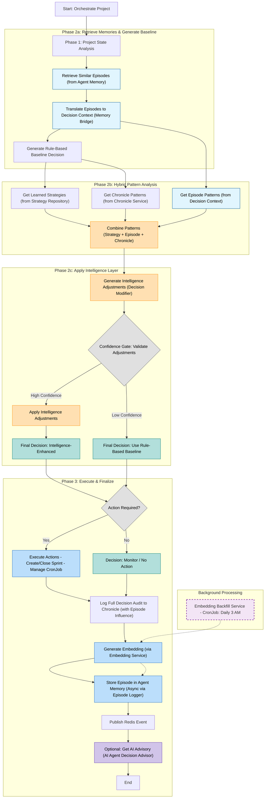

# Project Orchestration Service: Current Architecture & Design Specification

## 1. Executive Summary

This document presents the current architecture and design specification for the **Project Orchestration Service** within the Digital Scrum Master (DSM) ecosystem. The service implements intelligent project orchestration, demonstrating how rule-based automation enhances traditional project management workflows.

**Current Status**: ✅ **Production Ready** (Version 1.0.20)
**Architecture Maturity**: **A** (Learning Agent)
**Last Updated**: November 4, 2025

### 1.1 Service Overview

The Project Orchestration Service is a **stateless microservice** that acts as an intelligent coordinator for the entire DSM ecosystem. It has evolved into a **"Learning Agent,"** which not only analyzes historical data but **actively extracts, refines, and applies its own decision-making strategies based on high-confidence historical patterns and real-world outcomes**. This transforms it into a dynamic, self-improving system that continuously learns from experience to optimize project outcomes. It demonstrates the practical application of AI-driven automation through:

- **Intelligent Project State Analysis**: Multi-service data aggregation augmented with deep historical context.
- **Strategy-Driven Decision Making**: A hybrid approach where baseline decisions are rule-based but can be automatically overridden by high-confidence, learned strategies, which are continuously optimized based on their performance.
- **Dynamic Kubernetes Resource Management**: On-demand CronJob generation, deployment, self-healing, and automatic cleanup.
- **Transparent & Auditable Integration**: Comprehensive logging and event publishing for audit trails, detailing the initial rule-based decision, any strategy-driven modifications, and the performance of applied strategies.

The recent introduction of the `agent_memory` database (CR_Agent_01) and the `Embedding Service` (CR_Agent_02) provided the foundation for a true agent-based system. With the completion of CR_Agent_04_03, the orchestrator's integration with this new AI infrastructure is now complete, enabling episodic and semantic memory with vector-based similarity search for advanced learning and reasoning capabilities. The **Strategy Evolution Layer** (CR_Agent_06) further enhances this by enabling the system to automatically extract, generate, and optimize reusable strategies from successful past experiences.

The Project Orchestration Service now includes foundational AI-readiness capabilities beyond pure rule-based automation. API responses feature enriched fields capturing historical project insights, nuanced intelligence recommendations, confidence scoring, and similarity analysis with comparable projects. Decisions explicitly indicate their source—either "rule_based_only", "intelligence_enhanced", or "strategy_enhanced"—providing transparency in the decision-making process. Additionally, an **AI Agent Decision Advisor** has been introduced, providing natural language review and recommendations for orchestration decisions, further enhancing transparency and explainability. These additions demonstrate the system's preparedness for progressive AI augmentation while maintaining stable core orchestration logic.

### 1.2 Architectural Principles

The service is built upon four core architectural principles:

1.  **Autonomous Orchestration**: Autonomous decision-making based on environmental perception and goal achievement.
2.  **Event-Driven Communication**: Asynchronous messaging with eventual consistency guarantees.
3.  **Kubernetes-Native Design**: Cloud-native deployment patterns with operational excellence.
4.  **Decision Transparency**: Full auditability of how and why decisions, especially intelligence-driven ones, are made.

### 1.3 Key Innovation Areas

- **Dynamic Workflow Generation**: Real-time CronJob manifest creation based on project requirements.
- **Intelligence-Driven Decision Modification**: The ability to override rule-based logic with high-confidence, evidence-based adjustments.
- **Confidence-Based Gating**: A safety mechanism to ensure that AI-driven modifications are only applied when supported by strong historical evidence.
- **Production-Grade Resilience**: Comprehensive health checks and error handling.

## 2. Detailed System Architecture

### 2.1 High-Level Architecture with Full Episode Memory Integration

The architecture has been significantly enhanced with a **Memory Bridge** that fully integrates episodic memory into the decision-making pipeline. This enables the system to learn from experience by retrieving similar historical episodes, translating them into actionable context, and combining them with existing statistical patterns to inform current decisions.

The data flow is split into a synchronous (fast-path) for decision-making and an asynchronous (non-blocking) path for episode storage.

```mermaid
graph TB
    subgraph "API Layer"
        API[Orchestration API<br>POST /orchestrate/project/id]
    end

    subgraph "Enhanced Decision Engine - Decision Workflow"
        DE[Decision Orchestrator<br>Coordinates Full Workflow]

        subgraph "Step 1: Strategy & Memory Retrieval"
            SR[Strategy Repository<br>Query Learned Strategies]
            ER[Episode Retriever<br>Vector Similarity Search]
            EC[Episode Cache<br>TTL: 1 hour]
        end

        subgraph "Step 2: Memory Translation"
            MB[Memory Bridge<br>Episode → Decision Context]
            EPA[Episode Pattern Analyzer<br>Extract Success Patterns]
        end

        subgraph "Step 3: Enhanced Pattern Analysis"
            PE[Pattern Engine<br>ENHANCED with Strategies]
            Chronicle[Chronicle Analytics<br>Historical Patterns]
            Combine[Pattern Combiner<br>Strategy + Episode + Chronicle Weights]
        end

        subgraph "Step 4: Intelligence Decision"
            DM[Decision Modifier<br>ENHANCED with Strategy Context]
            CG[Confidence Gate<br>Validates Adjustments]
        end

        subgraph "Step 5: Response Enhancement"
            RB[Response Builder<br>Adds Strategy & Episode Metadata]
        end
    end

    subgraph "AI Agent Advisory Layer"
        AA[AI Agent Decision Advisor<br>OllamaAdvisor Service]
        OS_ADVISOR[Ollama Server<br>llama3.2:latest]
    end

    subgraph "Strategy Evolution Layer - NEW"
        SE[Strategy Evolver Service<br>Orchestrates Evolution]
        PE_EVOLVE[Pattern Extractor<br>From Episodes]
        SG[Strategy Generator<br>Creates Strategies]
        LO[Learning Optimizer<br>Tunes Confidence]
    end

    subgraph "Storage Layer"
        AMDB[(agent_memory DB<br>Episode & Strategy History)]
        SPL[(strategy_performance_log<br>Strategy Outcomes)]
        ChronicleDB[(chronicle_db<br>Project History)]
    end

    subgraph "AI Infrastructure Layer"
        ES[Embedding Service<br>Ollama Proxy Service]
        OS_EMBEDDING[Ollama Server<br>mxbai-embed-large]
        AMDC[Agent Memory DB Client<br>Pooled Connections]
        ESV[Embedding Service Validator<br>Health & Circuit Breaker]
        FFM[Feature Flag Manager<br>Config-driven Control]
        DQA[Data Quality Analyzer<br>Chronicle Data Baseline]
        PM[Prometheus Metrics<br>agent_memory_*, embedding_*]
    end

    subgraph "Async Episode Logging"
        EL[Episode Logger<br>Async Storage]
        EV[Episode Validator<br>Quality Scoring]
        EBS[Embedding Backfill Service<br>CronJob: Daily 3 AM]
    end

    %% === REQUEST FLOW ===
    API -->|"1. Orchestrate Request"| DE

    %% Step 1: Strategy & Memory Retrieval
    DE -->|"2. Get Applicable Strategies<br>Timeout: 100ms"| SR
    SR -->|"Query agent_knowledge"| AMDC
    AMDC -->|"Return Strategies"| SR
    SR -->|"Strategies or Empty"| DE

    DE -->|"3. Get Similar Episodes<br>Timeout: 300ms"| ER
    ER -->|"Check Cache"| EC
    EC -->|"Cache Miss"| AMDC
    AMDC -->|"Query"| AMDB
    AMDB -->|"Top 5 Episodes<br>Vector Similarity"| AMDC
    AMDC -->|"Return"| ER
    EC -->|"Cache Hit<br>Fast Return"| ER
    ER -->|"Episode List or Empty"| DE

    %% Step 2: Memory Translation
    DE -->|"4. Transform to Context"| MB
    MB -->|"Analyze Episodes"| EPA
    EPA -->|"Extract Success Rates<br>Common Decisions<br>Outcome Patterns"| MB
    MB -->|"Structured Decision Context"| DE

    %% Step 3: Enhanced Pattern Analysis
    DE -->|"5. Analyze with Strategy & Episode Context"| PE
    PE -->|"Query Chronicle Data"| Chronicle
    Chronicle -->|"Historical Patterns"| PE
    PE -->|"Combine Sources"| Combine
    Combine -->|"Weighted Patterns:<br>- Strategies (Weight)<br>- Episode Patterns (Weight)<br>- Chronicle Patterns (Weight)<br>- Combined Confidence"| PE
    PE -->|"Comprehensive Analysis"| DE

    %% Step 4: Generate Decision
    DE -->|"6. Generate Decision"| DM
    DM -->|"Use Strategy Insights + Episode + Chronicle Patterns"| DM
    DM -->|"Proposed Adjustments"| CG
    CG -->|"Validated Adjustments"| DM
    DM -->|"Final Decision + Strategy/Episode Influence Metadata"| DE

    %% Step 5: Build Response
    DE -->|"7. Build Enhanced Response"| RB

    %% AI Advisory Layer
    RB -->|"8. Optional: Get AI Advisory<br>Timeout: 120s"| AA
    AA -->|"Build Prompt"| AA
    AA -->|"Call Ollama API"| OS_ADVISOR
    OS_ADVISOR -->|"LLM Response"| AA
    AA -->|"Parse Advisory"| AA
    AA -->|"Return Advisory"| RB

    RB -->|"9. Add strategy_context, episode_context & ai_agent_advisory"| RB
    RB -->|"Complete Response"| API
    API -->|"10. Return &lt;500ms"| API

    %% Async Logging & Evolution Triggers
    DE -.->|"11. Log Episode (Async Background)"| EL
    EL -->|"Validate Quality"| EV
    EV -->|"Quality Score"| EL
    EL -.->|"Generate Embedding"| ES
    ES -->|"Call Ollama"| OS_EMBEDDING
    OS_EMBEDDING -->|"Return Embedding"| ES
    ES -.->|"Store New Episode"| AMDC
    AMDC -->|"Insert"| AMDB

    DE -.->|"12. Log Strategy Application (Async Background)"| AMDC
    AMDC -->|"Insert into strategy_performance_log"| SPL

    %% Fallback Flow (Embedding)
    ES -.->|"Timeout/Failure"| EL
    EL -.->|"Store without embedding<br>requires_embedding=true"| AMDC
    AMDC -->|"Insert"| AMDB

    %% Backfill Flow
    EBS -.->|"Query episodes needing embeddings"| AMDC
    AMDC -->|"Pending episodes"| EBS
    EBS -.->|"Generate embeddings batch"| ES
    ES -->|"Call Ollama"| OS_EMBEDDING
    OS_EMBEDDING -->|"Return Embeddings"| ES
    ES -.->|"Update episodes"| AMDC
    AMDC -->|"Update"| AMDB

    %% Strategy Evolution CronJob Flow
    CronJob_SE[Strategy Evolution CronJob<br>Daily 02:00 UTC] -->|"Trigger Evolution"| SE
    SE -->|"Query Episodes"| AMDB
    SE -->|"Extract Patterns"| PE_EVOLVE
    PE_EVOLVE -->|"Generate Strategies"| SG
    SG -->|"Store Strategies"| AMDB
    SE -->|"Optimize Strategies"| LO
    LO -->|"Query Performance Log"| SPL
    LO -->|"Update Strategies"| AMDB
    SE -->|"Publish STRATEGY_EVOLVED Event"| Redis

    %% Health Checks & Monitoring
    API -->|"Health Check"| ESV
    API -->|"Health Check"| AMDC
    API -->|"Health Check"| AA
    AA -->|"Check Ollama Status"| OS_ADVISOR
    AMDC -->|"Report Pool Status"| PM
    ESV -->|"Report Latency/State"| PM
    DQA -->|"Analyze"| ChronicleDB
    FFM -->|"Provide Config"| DE

    %% Chronicle Integration
    Chronicle -->|"Also queries"| ChronicleDB

    %% === CLASS STYLES ===
    classDef existing fill:#e8f5e8,stroke:#2e7d32,stroke-width:2px
    classDef enhanced fill:#fff9c4,stroke:#f57f17,stroke-width:2px
    classDef new fill:#e1f5fe,stroke:#01579b,stroke-width:3px
    classDef storage fill:#fff3e0,stroke:#ef6c00,stroke-width:2px
    classDef async fill:#f3e5f5,stroke:#7b1fa2,stroke-width:2px,stroke-dasharray: 5 5
    classDef ai_advisor fill:#D1C4E9,stroke:#5E35B1,stroke-width:1px,color:#000000
    classDef strategy_evolution fill:#E0F2F7,stroke:#00BCD4,stroke-width:2px

    class API,DE,DM,CG,RB existing
    class PE enhanced
    class ER,EC,EL,EV,MB,EPA new
    class AMDB,ChronicleDB,ES,OS_EMBEDDING,AMDC,ESV,FFM,DQA,PM storage
    class EBS async
    class AA,OS_ADVISOR ai_advisor
    class SE,PE_EVOLVE,SG,LO strategy_evolution
    class SR,SPL storage
    class CronJob_SE async
```


### 2.2 Implemented Components Explained

*   **Pattern Extractor**: A new service (`app/services/strategy/pattern_extractor.py`) that analyzes high-success episodes (outcome_quality > 0.85) to identify common decision patterns, team characteristics, and outcome correlations with statistical significance.
*   **Strategy Generator**: A new service (`app/services/strategy/strategy_generator.py`) that converts extracted patterns into formal, reusable strategy objects. These strategies include a name, description, applicability conditions (e.g., "5-person teams with declining velocity"), recommended actions (e.g., "reduce tasks by 25%"), a confidence score, and an evidence base.
*   **Strategy Repository**: A new service (`app/services/strategy/strategy_repository.py`) that manages the storage, retrieval, and versioning of learned strategies within the `agent_memory.agent_knowledge` table. It provides CRUD operations, tracks strategy performance metrics, and enables querying strategies by applicability context.
*   **Learning Optimizer**: A new service (`app/services/strategy/learning_optimizer.py`) responsible for the continuous improvement of strategies. It monitors the real-world outcomes of strategy-influenced decisions (via `strategy_performance_log`), updates strategy confidence scores based on success/failure, deprecates low-performing strategies (confidence < 0.3), and promotes high-performing ones.
*   **Strategy Evolver Service**: A new orchestrator service (`app/services/strategy_evolver.py`) that manages the entire strategy evolution workflow. It periodically (e.g., daily via CronJob) calls the Pattern Extractor to find patterns, invokes the Strategy Generator to create strategies, stores them via the Strategy Repository, and triggers the Learning Optimizer to refine existing strategies. It also publishes `STRATEGY_EVOLVED` events for audit trails.
*   **Decision Modifier**: **(Enhanced)** Translates raw pattern analysis into concrete, actionable adjustments. It now leverages the richer, combined insights from learned strategies, the Pattern Engine, and the Memory Bridge, allowing it to generate more nuanced, evidence-backed adjustments with detailed reasoning.
*   **Confidence Gate**: Acts as a quality control checkpoint. It validates proposed adjustments from the `Decision Modifier` against strict, configurable thresholds for confidence and supporting evidence. Only adjustments that pass this gate are applied.
*   **Pattern Engine**: **(Enhanced)** The central coordinator for all pattern analysis. It has been significantly enhanced to perform hybrid analysis, prioritizing learned strategies first. It directs the `Similarity Analyzer`, `Velocity Analyzer`, and `Success Detector` for Chronicle data, accepts structured episode context from the `Memory Bridge`, and now queries the `Strategy Repository` for applicable learned strategies. It uses an internal **Pattern Combiner** to intelligently merge these three sources (strategies, episodes, Chronicle) using a confidence-weighted aggregation, producing a single, comprehensive analysis for the `Decision Modifier`.
*   **Similarity Analyzer**: Identifies projects with similar characteristics by analyzing historical data from the `chronicle_db`.
*   **Velocity Analyzer**: Performs statistical analysis of a team's historical performance to identify velocity trends.
*   **Success Detector**: Analyzes historically successful projects to identify common patterns and success indicators.
*   **Chronicle Analytics Client**: A dedicated HTTP client for interacting with the Chronicle Service's analytics endpoints to retrieve **historical project patterns and aggregated data** from the `chronicle_db`.
*   **Agent Memory Client**: This client, fully implemented in `CR_Agent_03` and hardened with production-grade asynchronous connection pooling in `CR_Agent_04_01`, is responsible for all interactions with the `agent_memory` database and the `Embedding Service`. It comprises:
    *   **EmbeddingClient**: An HTTP client for the `Embedding Service` with connection pooling, retry logic, and error handling.
    *   **AgentMemoryStore**: A database interface for managing `agent_episodes` (episodic memory), including storing, retrieving, and performing vector similarity searches.
    *   **KnowledgeStore**: A database interface for managing `agent_knowledge` (semantic memory), enabling storage and retrieval of learned strategies.
    *   **WorkingMemory**: A database interface for `agent_working_memory`, handling session-based context.
    *   **EpisodeEmbedder**: A component that converts orchestration episodes into text representations and then uses the `EmbeddingClient` to generate vector embeddings.
    *   **AgentMemorySystem**: A unified facade providing a high-level interface for all agent memory operations.
    It manages storing and retrieving episodic memory (records of past decisions) and semantic memory (learned strategies). To enable vector similarity search, it **orchestrates the generation of text embeddings by calling the new Embedding Service** for any textual data before storage.
*   **Embedding Service Validator**: A health check and validation component that ensures the `Embedding Service` is operational, measures its latency, tests concurrent load handling, and implements circuit breaker patterns for resilience.
*   **Data Quality Analyzer**: A service that queries the `Chronicle Service` to establish baseline data completeness metrics and identifies projects suitable for historical backfill, generating a data quality report.
*   **Feature Flag System**: A configuration-based system for controlling agent memory capabilities, allowing for safe and gradual rollout of new features with environment variable and ConfigMap support.
*   **Configuration Manager**: A centralized component for managing all agent memory thresholds, timeouts, and operational parameters, typically configured via environment variables and Kubernetes ConfigMaps.
*   **CronJob Generator**: Dynamically creates Kubernetes CronJob manifests using a Jinja2 templating engine.
*   **Kubernetes Client**: Provides an interface to interact with the Kubernetes API to create, delete, and list CronJob resources.

*   **AI Agent Decision Advisor (OllamaAdvisor Service)**: A new, non-blocking advisory service that leverages the local Ollama LLM (`llama3.2:latest`) to provide natural language review and recommendations for orchestration decisions. It constructs prompts from the decision context, calls the Ollama API with a configurable timeout (e.g., 120s), parses the LLM response into structured advisory data (summary, recommendations, risk assessment), and enriches the API response. It operates as an optional, feature-flagged component with graceful degradation on failure, ensuring it never blocks the core orchestration workflow.

### 2.3 Service Integration Architecture
(No changes to this section)

## 3. How the Service Functions as an Orchestrator

The orchestrator mimics an intelligent agent's decision-making loop. Its intelligence is not a single monolithic model but a transparent, hybrid system combining robust business rules with data-driven, evidence-based overrides. All new agent memory and learning capabilities are controlled by a **Feature Flag System**, allowing for safe and gradual rollout and operational flexibility.

### Phase 1: Perceive (Project Analysis)
The service builds a "world model" of the project's current state by querying DSM microservices (its "sensors"), retrieving historical context from the Chronicle Service's analytics endpoints, and querying its own episodic memory for similar past decisions via the `Episode Retriever` (which now includes caching and strict timeouts). It also queries the **Strategy Repository** for any applicable learned strategies that match the current project context. This aggregated data forms a comprehensive snapshot for all subsequent reasoning.

### Phase 2: Reason (Strategy-Driven Decision Engine)
The orchestration workflow’s reasoning phase is augmented to include a strategy-driven decision mode which prioritizes learned strategies, then consults extended historical data and similarity analyses alongside classic rule sets. This hybrid approach includes confidence scoring to assess the reliability of each decision dynamically and decision source tagging to ensure consumers can distinguish pure rule-based outputs from those incorporating intelligence enhancements. The API responses provide enriched reporting of reasoning, warnings, and fallback availability, ensuring seamless coexistence of advanced augmentation without disruption to established automation processes.

This phase represents the core of the service's intelligence and has been significantly enhanced:

1.  **Generate Baseline Decision**: The `Enhanced Decision Engine` first applies its codified set of rules to the current project state to generate an initial, **rule-based decision**. This serves as a safe, reliable default.
2.  **Generate Intelligence Recommendations**: The engine then queries the `Pattern Engine` to analyze applicable learned strategies, historical data, and agent memory. The `Decision Modifier` translates these into potential **adjustments** (e.g., modify task count, change sprint duration).
3.  **Confidence Gating**: These proposed adjustments are passed to the `Confidence Gate`. Only adjustments that meet strict, predefined criteria for statistical confidence and quality of evidence (from strategies, episodes, or Chronicle) are approved. This prevents low-quality or risky modifications.
4.  **Apply Adjustments**: If any adjustments are approved by the gate, the `Decision Modifier` applies them to the baseline decision, creating a final, **strategy-enhanced decision**. If no adjustments pass the gate, the original rule-based decision is used.

The output of this phase is a transparent, actionable plan. The final decision package clearly documents the original rule-based recommendation, any intelligence adjustments that were applied, the confidence scores, and the supporting evidence, ensuring full auditability.

### Phase 3: Act (Orchestration and Execution)
With a final decision made (either rule-based or strategy-enhanced), the service acts upon its environment. This involves two primary actions:

1.  **Sprint Management**: Calling the **Sprint Service** API to create or close a sprint based on the final decision.
2.  **Automation Setup & Self-Healing**: Interacting with the **Kubernetes API** to dynamically generate, deploy, or delete a `CronJob` for the daily scrum process. This generated CronJob is configured to first trigger a daily scrum simulation on the Sprint Service (which updates task progress) and then proceed with daily scrum reporting to the Chronicle Service.

Finally, the service records its complete decision-making process. The high-level audit is logged in the **Chronicle Service**. The detailed context, reasoning, and outcome are prepared for storage in the **`agent_memory` database**. This is handled asynchronously by the **Episode Logger** (which includes quality validation and graceful fallback for embedding generation), utilizing the **Agent Memory Client** to send textual data to the **Embedding Service** to generate a vector embedding before storing the complete episode in the `agent_memory` database. Episodes stored without embeddings are automatically processed later by the **Embedding Backfill Service**. An event is also published to **Redis Streams**. Additionally, if enabled, the **AI Agent Decision Advisor** provides a natural language review and recommendations for the orchestration decision, which is then included in the API response. Crucially, if a learned strategy was applied, a `STRATEGY_APPLIED` event is published, and the application is logged in the `strategy_performance_log` table for continuous learning and optimization by the **Learning Optimizer**.

## 4. Functional Workflow Breakdown

The following diagram illustrates the orchestrator's complete decision-making workflow. It shows how the system now uses a true hybrid intelligence approach, where historical episodes and Chronicle data are combined *before* a final intelligence recommendation is made.

### Detailed Orchestration Workflow



**Functional Explanation of the Diagram**

This diagram illustrates the complete, hybrid decision-making workflow:

1.  **Project State Analysis**: The process starts by gathering all relevant data about the project from dependent services (Backlog, Sprint, Project).

2.  **Retrieve Memories & Generate Baseline (Phase 2a)**: The system retrieves and processes its episodic memory while simultaneously generating a safe, default decision.
    *   **Retrieve Similar Episodes**: The `Episode Retriever` queries the `agent_memory` database for past decisions in similar contexts.
    *   **Translate Episodes**: The new **`Memory Bridge`** component (introduced in CR_Agent_04_03) processes the raw episode data, analyzing it to extract success rates, common patterns, and key insights. This produces a structured **Decision Context**.
    *   **Generate Rule-Based Decision**: Concurrently, the system runs through its codified rule set to determine a **baseline decision** (e.g., "Create a new sprint with 8 tasks").

3.  **Hybrid Pattern Analysis (Phase 2b)**: This is the core of the new intelligence system. Instead of relying on a single source, the orchestrator now combines two streams of intelligence.
    *   **Get Chronicle Patterns**: The system queries the Chronicle Service for long-term statistical patterns and trends from historical projects.
    *   **Get Episode Patterns**: The system uses the Decision Context created by the `Memory Bridge` as a source of experiential patterns from its own direct past.
    *   **Combine Patterns**: The **`Pattern Combiner`** (inside the Pattern Engine) intelligently merges the Chronicle patterns and Episode patterns using a confidence-weighted algorithm. This produces a single, unified set of recommendations with higher accuracy.

4.  **Apply Intelligence Layer (Phase 2c)**: The combined patterns are now used to intelligently modify the baseline decision.
    *   **Generate Intelligence Adjustments**: The `Decision Modifier` uses the combined patterns to propose adjustments to the baseline (e.g., "Reduce task count from 8 to 6 based on episode and Chronicle data").
    *   **Confidence Gate**: The critical checkpoint evaluates the proposed adjustments against strict confidence and evidence thresholds.
    *   **Intelligence Path**: If confidence is high, the baseline decision is **modified**. The final decision is marked as `intelligence_enhanced`.
    *   **Rule-Based Path**: If confidence is low, the original **rule-based baseline decision is kept**, ensuring stability.

5.  **Execute & Finalize (Phase 3)**: Based on the final decision, the orchestrator executes actions, logs the complete audit trail to Chronicle (now including which episodes influenced the decision), and publishes a Redis event. The new decision is then stored asynchronously as a new episode for future learning.

## 5. Intelligence System Behavior Patterns

The intelligence system exhibits different behaviors based on the availability and quality of historical data. Understanding these patterns is crucial for functional testing and operational expectations.

### 5.1 Intelligence Decision Scenarios

#### **Scenario 1: Projects with Rich Historical Data**
- **Condition**: Project has similar projects with similarity_score > 0.70
- **Chronicle Service Response**: Valid similar projects with `optimal_task_count` values
- **Intelligence Behavior**:
  - DecisionModifier generates adjustments when difference > 2 tasks
  - ConfidenceGate validates against 0.50 threshold
  - Result: `decision_source: "intelligence_enhanced"` with populated `intelligence_adjustments`

#### **Scenario 2: New Projects (No Historical Data)**
- **Condition**: Newly created project with no sprint history
- **Chronicle Service Response**:
  - `500 Internal Server Error` for similar projects analysis
  - `404 Not Found` for sprint retrospective data
- **Intelligence Behavior**:
  - Pattern analysis returns empty `similar_projects: []`
  - System gracefully falls back to rule-based decisions
  - Result: `decision_source: "rule_based_only"` with `intelligence_adjustments: {}`

#### **Scenario 3: Low Confidence Scenarios**
- **Condition**: Historical data exists but confidence < 0.50
- **Intelligence Behavior**:
  - DecisionModifier may generate adjustments
  - ConfidenceGate rejects low-confidence modifications
  - Result: `decision_source: "rule_based_only"` with `intelligence_threshold_met: false`

#### **Scenario 4: Duration Adjustment Intelligence**
- **Condition**: Project has velocity confidence ≥ 0.5 with decreasing velocity trends
- **Chronicle Service Response**: Valid velocity trend data with declining performance patterns
- **Intelligence Behavior**:
  - DecisionModifier generates sprint duration modifications (e.g., 2→3 weeks)
  - Applied when velocity analysis shows decreasing performance with high confidence (≥0.87)
  - Result: `decision_source: "learning_enhanced"` with `sprint_duration_modification` in adjustments
  - Evidence includes similar projects analysis and velocity trend rationale

### 5.2 Operational Configuration

**Current Production Settings**:
- `confidence_threshold`: 0.50 (lowered from 0.75 for easier intelligence triggering)
- `similarity_threshold`: 0.70 (Chronicle Service similarity matching)
- `min_similar_projects`: 3 (minimum projects required for task count adjustments)
- `max_adjustment_percent`: 0.50 (maximum allowed adjustment percentage)
- `task_adjustment_difference_threshold`: 1 (lowered from 2 to trigger with smaller differences)
- `min_similarity_for_adjustment_proposal`: 0.3 (lowered from 0.5)
- `min_confidence_for_task_proposal`: 0.3 (lowered from 0.5)
- `min_velocity_confidence_for_scoring`: 0.3 (lowered from 0.5)
- `min_velocity_confidence_for_duration_adjustment`: 0.5 (NEW - lowered from 0.8 to enable duration adjustments)

**Decision Enhancement Modes**:
- `rule_based_only`: Disables all intelligence modifications
- `intelligence_enhanced`: Enables intelligence overrides when confidence criteria are met
- `hybrid`: Reserved for future advanced decision blending (not yet implemented)

### 5.3 Error Handling & Resilience

The intelligence system is designed with comprehensive error handling:

1. **Chronicle Service Unavailable**: Circuit breaker protection with graceful fallback to rule-based decisions
2. **Malformed Historical Data**: Data quality validator filters unreliable data points
3. **Network Timeouts**: Configurable timeout (10 seconds) with automatic retry mechanisms
4. **Invalid Project References**: Proper HTTP status codes (404) with descriptive error messages

## 6. API Specification

### `POST /orchestrate/project/{project_id}`
*   **Purpose**: Triggers the intelligence-driven orchestration workflow for a given project.
*   **Request Body**: (No changes)
*   **Response Body**: The response is now significantly enriched to provide a transparent audit of the decision-making process, including the direct influence of episodic memory.

    ```json
    {
      "project_id": "TEST-001",
      "decisions": {
        "create_new_sprint": true,
        "tasks_to_assign": 6,
        "sprint_duration_weeks": 2,
        "reasoning": "Rule-based: 8 tasks recommended. Episode memory: 3 similar past decisions averaged 6 tasks with 92% success rate. Intelligence adjustment applied.",
        "decision_source": "intelligence_enhanced",
        "rule_based_decision": {
          "tasks_to_assign": 8,
          "sprint_duration_weeks": 2
        },
        "intelligence_adjustments": {
          "task_count_modification": {
            "original_recommendation": 8,
            "intelligence_recommendation": 6,
            "applied_value": 6,
            "confidence": 0.82,
            "evidence_source": "3 similar episodes + 2 chronicle projects"
          }
        },
        "episode_context": { // Introduced in CR_Agent_04_03
          "episodes_retrieved": 3,
          "episodes_used_for_decision": 2,
          "average_episode_similarity": 0.78,
          "episode_influence_score": 0.65,
          "key_episode_insights": [
            "Similar projects with 6 tasks achieved 92% completion",
            "8+ task sprints showed 78% completion in similar contexts"
          ],
          "episodes_contributing": [
            {
              "episode_id": "uuid-123",
              "project_id": "PROJ-A",
              "similarity_score": 0.85,
              "outcome_quality": 0.92,
              "decision_summary": "Created sprint with 6 tasks, completed successfully"
            }
          ]
        }
      },
      "strategy_context": { // Introduced in CR_Agent_06
        "strategies_evaluated": 3,
        "strategies_applied": 1,
        "best_match_strategy": {
          "id": "uuid-123",
          "name": "Reduce Tasks for Declining Velocity",
          "confidence": 0.87,
          "applicability_score": 0.92
        },
        "fallback_to_episodes": false,
        "strategy_influence_weight": 0.85
      },
      "ai_agent_advisory": { // Introduced in CR_Agent_05
        "enabled": true,
        "model": "llama3.2:latest",
        "summary": "This decision appears well-justified based on historical data. The reduction from 8 to 6 tasks aligns with successful patterns from similar projects, where 6-task sprints achieved 92% completion rates. The intelligence adjustment demonstrates strong evidence-based reasoning.",
        "recommendations": [
          "Monitor velocity during first 3 days - if team exceeds expectations, consider adding 1-2 tasks mid-sprint",
          "This task count aligns with similar successful projects, reducing sprint failure risk"
        ],
        "risk_assessment": "Low",
        "generation_time_ms": 1250
      },
      "performance_metrics": {
        "total_orchestration": {
          "avg_duration_ms": 420
        },
        "episode_retrieval": {
          "duration_ms": 180,
          "cache_hit": false
        }
      }
    }
    ```

### `GET /orchestrate/project/{project_id}/status`
(No changes to this endpoint)

### `DELETE /orchestrate/project/{project_id}/cronjob/{cronjob_name}`
(No changes to this endpoint)

### New Intelligence Endpoints

*   **`GET /orchestrate/intelligence/strategies`**
    *   **Purpose**: Retrieve all active strategies or filter by context
    *   **Query Parameters**:
        - `team_size` (optional): Filter strategies applicable to specific team size
        - `min_confidence` (optional, default: 0.5): Minimum confidence threshold
        - `context` (optional): JSON string with applicability context
    *   **Response**:
        ```json
        {
          "strategies": [
            {
              "strategy_id": "uuid-123",
              "name": "Reduce Tasks for Declining Velocity",
              "description": "For 5-person teams with declining velocity, reduce task count by 25%",
              "confidence": 0.87,
              "applicability": {
                "team_size_range": [4, 6],
                "velocity_trend": "declining",
                "min_episodes_supporting": 5
              },
              "recommendation": {
                "action": "reduce_task_count",
                "adjustment_percent": 0.25,
                "rationale": "Historical data shows 87% success rate with this adjustment"
              },
              "performance": {
                "times_applied": 12,
                "success_rate": 0.87,
                "avg_improvement": 0.15
              },
              "created_at": "2025-10-15T10:30:00Z",
              "last_updated": "2025-11-01T08:45:00Z",
              "version": 2
            }
          ],
          "total_strategies": 8,
          "avg_confidence": 0.72
        }
        ```
    *   **Status Codes**: 200 (success), 500 (error)

*   **`POST /orchestrate/intelligence/strategies/evolve`**
    *   **Purpose**: Manually trigger strategy evolution (for testing; normally runs via CronJob)
    *   **Request**:
        ```json
        {
          "min_outcome_quality": 0.85,
          "lookback_days": 30,
          "min_episodes_per_pattern": 3
        }
        ```
    *   **Response**:
        ```json
        {
          "evolution_id": "uuid-456",
          "strategies_created": 3,
          "strategies_updated": 5,
          "strategies_deprecated": 1,
          "episodes_analyzed": 47,
          "patterns_extracted": 8,
          "execution_time_ms": 2340
        }
        ```
    *   **Status Codes**: 202 (accepted), 400 (invalid params), 500 (error)

*   **`GET /orchestrate/intelligence/strategies/{strategy_id}/performance`**
    *   **Purpose**: Retrieve detailed performance history for a specific strategy
    *   **Response**:
        ```json
        {
          "strategy_id": "uuid-123",
          "name": "Reduce Tasks for Declining Velocity",
          "current_confidence": 0.87,
          "performance_history": [
            {
              "date": "2025-10-15",
              "times_applied": 2,
              "success_rate": 1.0,
              "confidence": 0.75
            },
            {
              "date": "2025-10-22",
              "times_applied": 5,
              "success_rate": 0.8,
              "confidence": 0.82
            }
          ],
          "recent_applications": [
            {
              "project_id": "TEST-001",
              "sprint_id": "TEST-001-S03",
              "applied_at": "2025-10-28T14:20:00Z",
              "outcome": "success",
              "improvement_metric": 0.18
            }
          ]
        }
        ```
    *   **Status Codes**: 200 (success), 404 (strategy not found)

### `GET /orchestrate/intelligence/decision-impact/{project_id}`
*   **Purpose**: Track outcomes of intelligence-enhanced decisions vs. rule-based decisions for validation.
*   **Response**: Decision outcome analysis, success rate comparisons, and improvement metrics.
*   **Status Codes**: 200, 404 (project not found)

### `POST /orchestrate/project/{project_id}/decision-mode`
*   **Purpose**: Configure the decision enhancement level for a specific project or globally.
*   **Request Body**:
    ```json
    {
      "mode": "intelligence_enhanced",
      "confidence_threshold": 0.50,
      "enable_task_count_adjustment": true,
      "enable_sprint_duration_adjustment": true,
      "min_similar_projects": 3
    }
    ```
*   **Response**: Confirmation of the applied configuration.
*   **Status Codes**: 200, 400 (invalid configuration)

### `GET /orchestrate/intelligence/decision-audit/{project_id}`
*   **Purpose**: Retrieve the complete decision audit trail for a project, showing all intelligence modifications.
*   **Response**: A chronological decision history with rule-based vs. intelligence-enhanced comparisons.
*   **Status Codes**: 200, 404 (project not found)

(Other intelligence endpoints remain unchanged)

## 7. Production Implementation Status

### Current Deployment (Version 1.0.18)
- **Docker Image**: `myreg.agile-corp.org:5000/project-orchestrator:1.0.18`
- **Deployment Status**: ✅ Production Ready with Intelligence-Enhanced Decision Capabilities
- **Health Checks**: ✅ Operational (`/health`, `/health/ready` with agent memory checks)
- **Integration Testing**: ✅ Completed with all dependent services
- **Configuration**: Intelligence thresholds optimized for practical operational scenarios

### Recent Key Enhancements
1. **Automated Sprint Closure and CronJob Deletion** (September 2025)
   - ✅ Orchestrator now detects 100% task completion in active sprints.
   - ✅ Automatically triggers sprint closure via the Sprint Service.
   - ✅ Deletes the associated daily scrum CronJob upon sprint closure.
   - ✅ Significantly reduces manual overhead and maintains a cleaner Kubernetes environment.

2. **Holiday Awareness** (August 2025)
   - ✅ Orchestrator now performs detailed team availability assessment, considering holidays and other conflicts.
   - ✅ Reports availability conflicts as warnings in API responses and Chronicle records, without blocking sprint creation.
   - ✅ Enhances transparency and realism in automated sprint planning.

3. **Accurate Unassigned Task Reporting** (August 2025)
   - ✅ Project Analyzer now correctly consumes `unassigned_for_sprint_count` from the backlog service.
   - ✅ Enables more informed decision-making for sprint planning and task assignment.
   - ✅ `/orchestrate/project/{project_id}/status` endpoint accurately reflects backlog status.

4. **Self-Healing CronJob Creation** (August 2025)
   - ✅ Orchestrator now verifies existence of daily scrum CronJobs for active sprints.
   - ✅ Automatically recreates missing CronJobs to ensure process continuity.
   - ✅ Enhances system resiliency and reduces manual intervention.

5. **Chronicle Service Integration** (August 2025)
   - ✅ Flexible payload support implemented
   - ✅ Orchestration decisions recorded without placeholder data
   - ✅ `additional_data` field supports rich orchestration context

6. **Decision Engine Robustness** (September 2025)
   - ✅ Implemented safe handling for `None` values when accessing `sprint_id` from `current_active_sprint` in `decision_engine.py`.
   - ✅ Prevents `AttributeError` during orchestration when no active sprint is present.

7. **Logging Infrastructure** (Version 1.0.10)
   - ✅ Fixed double JSON encoding in structured logs
   - ✅ Improved log readability for monitoring and debugging
   - ✅ Proper structlog configuration with clean JSON output

8. **Service Integration Validation**
   - ✅ End-to-end testing completed with project `NEWPROJ02`
   - ✅ Validated orchestration workflow from analysis to action
   - ✅ Chronicle service properly records flexible orchestration payloads

9. **Intelligence-Driven Decision Modification** (September-October 2025)
   - ✅ The service can now **override its own rule-based decisions** with high-confidence, data-driven adjustments.
   - ✅ Implemented a `Decision Modifier` to generate adjustments and a `Confidence Gate` to ensure modifications are safe and evidence-based.
   - ✅ API responses now provide a full audit trail, showing the `rule_based_decision`, `intelligence_adjustments`, and final `decision_source`.
   - **Reference**: For a detailed breakdown of this feature's implementation, see the change request: [CR: Project Orchestrator - Intelligence-Driven Decision Enhancement V2](CR_Project_Orchestrator-Intelligence-Driven-Decision-Enhancement.md).

10. **Intelligence System Behavior Validation** (October 2025)
   - ✅ **Comprehensive Testing**: End-to-end workflow validation with new project creation and complete orchestration cycles.
   - ✅ **Fallback Logic Verification**: System gracefully handles new projects without historical data by falling back to rule-based decisions.
   - ✅ **Configuration Optimization**: Confidence threshold adjusted to 0.50 for broader testing and operational scenarios.
   - ✅ **Debug Capabilities**: Enhanced logging for decision modification pipeline troubleshooting and validation.

11. **Agent Memory Foundation & Validation** (October 2025)
    - ✅ Established a production-ready foundation for the agent memory system.
    - ✅ Implemented a production-grade asynchronous connection pool for the `agent_memory` database, with comprehensive health monitoring.
    - ✅ Hardened the `Embedding Service` integration with a circuit breaker, latency tracking, and health validation.
    - ✅ Deployed a dedicated Grafana dashboard for monitoring all agent memory components via new Prometheus metrics.
    - ✅ Integrated feature flags to allow for the safe, gradual rollout of future agent memory capabilities.

12. **Episode Storage & Retrieval (Episodic Memory)** (October 2025)
    - ✅ Implemented core episodic memory with Episode Logger, Retriever, and Validator.
    - ✅ Enabled asynchronous episode storage with graceful fallback for embedding generation.
    - ✅ Introduced vector similarity search for retrieving historical episodes with caching.
    - ✅ Deployed Embedding Backfill Service for automatic recovery of missing embeddings.
    - **Reference**: See change request: [CR_Agent_04_02: Episode Storage & Retrieval (Phase 1)](CR_Agent_04_02-Episode-Storage-n-Retrieval.md).

13. **Memory Storage Layer and Clients** (October 14, 2025)
    - ✅ Implemented the Python client libraries and storage interfaces for interacting with the `Embedding Service` and `agent_memory` database.
    - ✅ Developed `EmbeddingClient`, `AgentMemoryStore`, `KnowledgeStore`, `WorkingMemory`, `EpisodeEmbedder`, and `AgentMemorySystem` components.
    - ✅ Established a robust and performant memory storage layer, ready for integration into the decision engine.
    - **Reference**: See change request: [CR_Agent_03: Memory Storage Layer and Clients](CR_Agent_03_storage.md).

14. **Episode Memory Integration into Decision Pipeline** (October 2025)
    - ✅ Completed the integration of episodic memory into the Enhanced Decision Engine.
    - ✅ Introduced the Memory Bridge and Episode Pattern Analyzer for translating episodes into decision context.
    - ✅ Enhanced the Pattern Engine to combine episode-based patterns with Chronicle analytics using confidence weighting.
    - ✅ API responses now include transparent `episode_context` metadata, showing memory influence on decisions.
    - **Reference**: See change request: [CR_Agent_04_03: Episode Memory Integration into Decision Pipeline (Phase 1b)](CR_Agent_04_03_Episode-Memory-Integration.md).

15. **Intelligence Threshold Configuration Optimization** (October 26, 2025)
    - ✅ **Comprehensive Data Quality Investigation**: Resolved system-wide NULL retrospectives affecting 41 projects across 17 different DSM projects.
    - ✅ **Velocity Confidence Bug Fix**: Fixed hardcoded 0.8 threshold in decision_modifier.py that was preventing intelligence-enhanced decisions.
    - ✅ **Configuration Tuning**: Lowered multiple intelligence thresholds to practical operational levels:
      - `min_velocity_confidence_for_duration_adjustment`: 0.8 → 0.5
      - `min_similarity_for_adjustment_proposal`: 0.5 → 0.3
      - `min_confidence_for_task_proposal`: 0.5 → 0.3
      - `min_velocity_confidence_for_scoring`: 0.5 → 0.3
    - ✅ **Build/Push/Deploy Process**: Followed proper DSM deployment operations for all configuration changes.
    - **Impact**: Enables intelligence-enhanced decisions with duration adjustments (e.g., 2→3 weeks) based on velocity trend analysis.
    - **Reference**: See comprehensive RCA documents: `RCA_Velocity_Confidence_Intelligence_Enhancement_Fix.md` and `Data_Quality_Investigation_All_Projects_RCA.md`

16. **AI Agent Decision Advisor** (November 2025)
    - ✅ Implemented an optional AI Agent Decision Advisor using local Ollama LLM (`llama3.2:latest`).
    - ✅ Provides natural language summaries, recommendations, and risk assessments for orchestration decisions.
    - ✅ Integrated as a non-blocking, feature-flagged component with graceful degradation on failure.
    - ✅ Extended API responses with `ai_agent_advisory` field and health checks with `ollama_llm` status.
    - **Reference**: See change request: [CR_Agent_05: AI Agent Decision Advisor - Natural Language Orchestration Review](CR_Agent_05_AI_Decision_Advisor.md).

17. **Strategy Evolution Layer** (November 2025)
    - ✅ Implemented the Strategy Evolution Layer, enabling the orchestrator to automatically extract, refine, and apply its own decision-making strategies.
    - ✅ Introduced Pattern Extractor, Strategy Generator, Strategy Repository, Learning Optimizer, and Strategy Evolver Service.
    - ✅ Enhanced the Decision Engine to prioritize learned strategies and log strategy applications for continuous learning.
    - **Reference**: See change request: [CR_Agent_06: Agent Strategy Evolution - Learning from Experience](CR_Agent_06_Strategy_Evolution.md).

(Other enhancements remain as previously documented)

### Latest AI-Readiness Features
- **Hybrid Decision Mode (Rule-Based Plus Intelligence)**: The orchestrator effectively executes decisions sourced from either the traditional rule engine or intelligence enhancements based on configured confidence thresholds.
- **Extended API Payload**: The response schema was incrementally augmented to include fields for historical insights, velocity trends, risk indicators, confidence scores, and decision mode flags, with detailed reasoning that can trace back to the similarity analyses influencing a decision.
- **Robust Metadata and Logging**: Intelligence metadata and confidence measures are embedded into both structured logs and Chronicle payloads, ensuring full auditability and enabling advanced feedback-driven model evolution.
- **Shadow Advisory Readiness**: Though current orchestration logic remains rule-dominant, the system is architected to absorb advisory intelligence modules operating in passive shadow mode for future AI augmentation experiments.
- **Duration Adjustment Intelligence**: NEW capability to modify sprint durations based on velocity trend analysis, enabling adaptive project timeline management.

**Last Updated**: November 4, 2025

## 8. Conclusion

The Project Orchestration Service has evolved from a pattern-aware agent into a true **intelligence-driven orchestrator**. By implementing a hybrid decision-making model, it combines the reliability of rule-based logic with the adaptive power of data-driven insights. The core innovation is its ability to **safely override its own decisions** when strong historical evidence suggests a better course of action.

The confidence-based gating system ensures that this new capability enhances, rather than compromises, system stability. Full decision transparency is maintained through detailed audit trails in API responses and logs, making it clear precisely how and why a decision was made. This represents a significant step forward in creating a truly autonomous, self-improving system that delivers measurable improvements in project outcomes.

**Current Status**: The orchestrator is operationally ready for production workloads. Its new intelligence-driven capabilities have been verified, and it continues to integrate successfully with all dependent DSM services.

## 9. Reference Documents

This section provides links to key Change Request (CR) documents that have significantly shaped the architecture and functionality of the Project Orchestration Service.

- **[CR: Project Orchestrator - Intelligence-Driven Decision Enhancement V2](CR_Project_Orchestrator-Intelligence-Driven-Decision-Enhancement.md)**: This CR details the implementation of the intelligence-driven decision-making capability. It transformed the service from being merely pattern-aware to being able to modify its own rule-based decisions based on high-confidence historical patterns. The document covers the introduction of the Decision Modifier and Confidence Gate components, which allow the orchestrator to safely override its initial judgments to improve project outcomes.
- **[CR: Project Orchestrator - Externalize Intelligence Decision Thresholds](CR_PO_Externalize_Intelligence_Thresholds.md)**: This CR focuses on improving the tunability and transparency of the intelligence layer. It involved externalizing previously hardcoded "magic numbers" used in the decision-making logic into the central configuration file. This allows for real-time adjustments to the AI's behavior without requiring a new code deployment, enhancing operational control.
- **[CR_Agent_01: Database Infrastructure and pgvector Setup](CR_Agent_01_database.md)**: This CR establishes the foundational database infrastructure for the agent memory system. It details the creation of the `agent_memory` database, the enabling of the `pgvector` extension for vector similarity search, and the deployment of the complete schema for episodic, semantic, and working memory. This provides the essential storage layer for the agent's long-term memory capabilities.
- **[CR_Agent_02: Ollama-based Embedding Generation Service](CR_Agent_02_embedding_v2.md)**: This CR implements a lightweight microservice that acts as a proxy to a local Ollama server. This service is responsible for generating high-quality vector embeddings from text, which are essential for the agent's memory and semantic search capabilities. It provides a simple API for other services to convert text into vectors for storage and analysis.
- **[CR_Agent_03: Memory Storage Layer and Clients](CR_Agent_03_storage.md)**: This CR implements the Python client libraries and storage interfaces that enable the Project Orchestrator to interact with the embedding service (CR_Agent_02) and agent_memory database (CR_Agent_01). This includes HTTP clients for the embedding service, a database access layer for episodic, semantic, and working memory, and the episode embedding pipeline. This is a pure library development effort with no changes to the orchestration logic or API endpoints.
- **[CR_Agent_04_01: Agent Memory Foundation & Validation](CR_Agent_04_01_Memory-Foundation.md)**: This CR establishes the production-ready foundation for agent memory. It covers the validation of the Embedding Service, the implementation of a production-grade database connection pool for the `agent_memory` database, the deployment of comprehensive monitoring (Prometheus metrics and Grafana dashboards), and the setup of feature flags for safe rollouts. This work is purely infrastructure-focused and precedes any changes to the orchestration logic.
- **[CR_Agent_04_02: Episode Storage & Retrieval (Phase 1)](CR_Agent_04_02-Episode-Storage-n-Retrieval.md)**: This CR implements the core episodic memory capability, including the Episode Logger, Episode Retriever, Episode Validator, and Embedding Backfill Service, establishing the foundation for the orchestrator's learning from past experiences.
- **[CR_Agent_04_03: Episode Memory Integration into Decision Pipeline](CR_Agent_04_03_Episode-Memory-Integration.md)**: This CR details the complete integration of the episodic memory system into the decision-making pipeline. It introduces the **Memory Bridge** for translating episodes into decision context and enhances the **Pattern Engine** to combine episode-based patterns with Chronicle analytics, representing a significant evolution in the orchestrator's intelligence capabilities.
- **[CR_Agent_05: AI Agent Decision Advisor - Natural Language Orchestration Review](CR_Agent_05_AI_Decision_Advisor.md)**: This CR introduces the AI Agent Decision Advisor, leveraging local Ollama LLM for natural language review, recommendations, and risk assessment of orchestration decisions, enhancing transparency and explainability.
- **[CR_Agent_06: Agent Strategy Evolution - Learning from Experience](CR_Agent_06_Strategy_Evolution.md)**: This CR implements the Strategy Evolution Layer, enabling the orchestrator to automatically extract, refine, and apply its own decision-making strategies based on high-confidence historical patterns and real-world outcomes.

## 10. Comprehensive Functional Testing Guide

This section provides detailed test cases covering all aspects of the Project Orchestration Service workflow for functional testing and validation.

### 9.1 Core Orchestration Workflow Tests

#### **Test Case TC-001: New Project Creation & Sprint Planning**
**Objective**: Validate complete workflow for new projects without historical data

```bash
# Setup: Create new project
kubectl exec testapp-pod -n dsm -- curl -X POST -H "Content-Type: application/json" \
  -d '{"id": "FUNC-TEST-001", "name": "Functional Test Project", "description": "Complete workflow test", "status": "active"}' \
  http://project-service.dsm.svc.cluster.local/projects

# Setup: Create backlog tasks
kubectl exec testapp-pod -n dsm -- curl -X POST \
  http://backlog-service.dsm.svc.cluster.local:80/backlogs/FUNC-TEST-001

# Test: Execute orchestration
kubectl exec testapp-pod -n dsm -- curl -X POST -H "Content-Type: application/json" \
  -d '{"action": "analyze_and_orchestrate", "options": {"create_sprint_if_needed": true}}' \
  http://project-orchestrator.dsm.svc.cluster.local/orchestrate/project/FUNC-TEST-001
```

**Expected Results**:
- `create_new_sprint: true`
- `tasks_to_assign: 10`
- `decision_source: "rule_based_only"` (no historical data)
- `sprint_created: "FUNC-TEST-001-S01"`
- `intelligence_adjustments: {}` (empty)
- CronJob created: `run-dailyscrum-func-test-001-func-test-001-s01`

#### **Test Case TC-002: Existing Project with Active Sprint**
**Objective**: Validate behavior when sprint already exists

```bash
# Test: Orchestrate project with existing active sprint
kubectl exec testapp-pod -n dsm -- curl -X POST -H "Content-Type: application/json" \
  -d '{"action": "analyze_and_orchestrate", "options": {"create_sprint_if_needed": true}}' \
  http://project-orchestrator.dsm.svc.cluster.local/orchestrate/project/TEST-001
```

**Expected Results**:
- `create_new_sprint: false`
- `tasks_to_assign: 0`
- `reasoning: "Active sprint found with existing CronJob"`
- No new CronJob creation

#### **Test Case TC-003: Intelligence-Enhanced Decision (Historical Data Available)**
**Objective**: Validate intelligence modifications when historical data exists

```bash
# Test: Use project with historical similar projects
kubectl exec testapp-pod -n dsm -- curl -X POST -H "Content-Type: application/json" \
  -d '{"action": "analyze_and_orchestrate", "options": {"create_sprint_if_needed": true}}' \
  http://project-orchestrator.dsm.svc.cluster.local/orchestrate/project/VOY008
```

**Expected Results (when conditions met)**:
- `similar_projects.length > 0`
- `confidence_scores.overall_decision_confidence > 0.50`
- `intelligence_adjustments` populated if conditions met
- `decision_source: "intelligence_enhanced"` OR `"rule_based_only"` based on confidence

### 9.2 Intelligence System Validation Tests

#### **Test Case TC-004: Chronicle Service Integration**
**Objective**: Validate Chronicle Service data retrieval

```bash
# Test: Direct Chronicle Service similar projects query
kubectl exec testapp-pod -n dsm -- curl -s \
  "http://chronicle-service.dsm.svc.cluster.local/v1/analytics/projects/similar?reference_project_id=TEST-001&similarity_threshold=0.7" | jq
```

**Expected Results**:
- Array of similar projects with `optimal_task_count` values
- Each project includes: `similarity_score`, `completion_rate`, `key_success_factors`
- HTTP 200 response with valid JSON structure

#### **Test Case TC-005: Decision Modification Validation**
**Objective**: Validate decision modifier logic with controlled conditions

```bash
# Test: Force scenario with task count difference > 2
# (Requires setup with specific project conditions)

# Verify intelligence adjustment generation
kubectl logs -n dsm deployment/project-orchestrator --tail=100 | grep -E "(DECISION_MODIFIER|intelligence_adjustment)"
```

**Expected Results**:
- `intelligence_adjustments.task_count_modification` populated
- Adjustment shows `original_recommendation` vs `intelligence_recommendation`
- Confidence scores and rationale provided
- Debug logs show DecisionModifier execution

### 9.3 Error Handling & Resilience Tests

#### **Test Case TC-006: Chronicle Service Unavailable**
**Objective**: Validate graceful degradation when Chronicle Service is down

```bash
# Setup: Scale down Chronicle Service
kubectl scale deployment/chronicle-service --replicas=0 -n dsm

# Test: Execute orchestration
kubectl exec testapp-pod -n dsm -- curl -X POST -H "Content-Type: application/json" \
  -d '{"action": "analyze_and_orchestrate", "options": {"create_sprint_if_needed": true}}' \
  http://project-orchestrator.dsm.svc.cluster.local/orchestrate/project/FUNC-TEST-001

# Cleanup: Restore Chronicle Service
kubectl scale deployment/chronicle-service --replicas=1 -n dsm
```

**Expected Results**:
- System falls back to rule-based decisions gracefully
- Circuit breaker prevents cascading failures
- `decision_source: "rule_based_only"`
- HTTP 200 response (not error)
- Proper error logging without system crashes

#### **Test Case TC-007: Invalid Project Handling**
**Objective**: Validate error handling for non-existent projects

```bash
# Test: Orchestrate non-existent project
kubectl exec testapp-pod -n dsm -- curl -X POST -H "Content-Type: application/json" \
  -d '{"action": "analyze_and_orchestrate", "options": {"create_sprint_if_needed": true}}' \
  http://project-orchestrator.dsm.svc.cluster.local/orchestrate/project/NONEXISTENT-999
```

**Expected Results**:
- HTTP 404 or appropriate error response
- Descriptive error message in response body
- No system crashes or cascading failures

### 9.4 CronJob Management Tests

#### **Test Case TC-008: CronJob Lifecycle Management**
**Objective**: Validate CronJob creation, configuration, and cleanup

```bash
# After successful sprint creation, verify CronJob
kubectl get cronjobs -n dsm | grep FUNC-TEST-001

# Verify CronJob configuration
kubectl get cronjob run-dailyscrum-func-test-001-func-test-001-s01 -n dsm -o yaml
```

**Expected Results**:
- CronJob created with naming convention: `run-dailyscrum-{project}-{sprint}`
- Schedule: `"0 14 * * 1-5"` (weekdays at 2 PM)
- Proper labels: `project`, `sprint`, `team`
- Environment variables configured correctly
- ConfigMap volume mounts for `run_dailyscrum.py`

#### **Test Case TC-009: CronJob Execution Validation**
**Objective**: Validate CronJob execution and daily scrum workflow

```bash
# Manually trigger CronJob for immediate testing
kubectl create job --from=cronjob/run-dailyscrum-func-test-001-func-test-001-s01 manual-test-job -n dsm

# Monitor execution logs
kubectl logs -f job/manual-test-job -n dsm

# Cleanup test job
kubectl delete job manual-test-job -n dsm
```

**Expected Results**:
- Job executes without errors
- Sprint Service daily scrum simulation triggered
- Chronicle Service receives daily scrum report
- Python script executes successfully
- Proper dependency waiting and error handling

### 9.5 Health & Monitoring Tests

#### **Test Case TC-010: Health Check Validation**
**Objective**: Validate health check endpoints and dependency monitoring

```bash
# Basic health check
kubectl exec testapp-pod -n dsm -- curl -s http://project-orchestrator.dsm.svc.cluster.local/health

# Comprehensive readiness check
kubectl exec testapp-pod -n dsm -- curl -s http://project-orchestrator.dsm.svc.cluster.local/health/ready | jq
```

**Expected Results**:
- `/health` returns: `{"status": "ok"}`
- `/health/ready` returns a comprehensive dependency status, including specific checks for the new agent memory infrastructure.
- All external services show `"ok"` status: `project-service`, `backlog-service`, `sprint-service`, `chronicle-service`.
- `agent_memory_db` status is present and `"ok"`, showing pool connection status.
- `embedding-service` status is present and `"ok"`, showing latency and circuit breaker state.
- Redis connectivity validated.
- Example of new checks:
  ```json
  "agent_memory_db": {
    "status": "ok",
    "pool_status": {
      "pool_size": 5,
      "checked_in_connections": 5,
      "checked_out_connections": 0,
      "total_connections": 5
    }
  },
  "embedding-service": {
    "status": "ok",
    "latency_ms": 1250,
    "circuit_breaker_state": "closed"
  },
  "ollama_llm": { // Introduced in CR_Agent_05
    "status": "ok",
    "model": "llama3.2:latest",
    "service_url": "http://ollama-server.dsm.svc.cluster.local:11434"
  }
  ```

#### **Test Case TC-011: Performance Metrics Validation**
**Objective**: Validate performance monitoring and metrics collection

```bash
# Test performance metrics endpoint
kubectl exec testapp-pod -n dsm -- curl -s \
  "http://project-orchestrator.dsm.svc.cluster.local/orchestrate/intelligence/performance/metrics/TEST-001" | jq
```

**Expected Results**:
- Performance metrics for pattern analysis, decision modification, total orchestration
- Execution times within acceptable thresholds (<2000ms total orchestration)
- Success rate > 95%
- Component-level timing breakdown
- Resource usage metrics

### 9.6 Intelligence Configuration Tests

#### **Test Case TC-012: Decision Mode Configuration**
**Objective**: Validate intelligence configuration management

```bash
# Test: Configure rule-based only mode
kubectl exec testapp-pod -n dsm -- curl -X POST -H "Content-Type: application/json" \
  -d '{"mode": "rule_based_only", "confidence_threshold": 0.80}' \
  http://project-orchestrator.dsm.svc.cluster.local/orchestrate/project/TEST-001/decision-mode

# Test: Re-enable intelligence-enhanced mode
kubectl exec testapp-pod -n dsm -- curl -X POST -H "Content-Type: application/json" \
  -d '{"mode": "intelligence_enhanced", "confidence_threshold": 0.50}' \
  http://project-orchestrator.dsm.svc.cluster.local/orchestrate/project/TEST-001/decision-mode
```

**Expected Results**:
- Configuration changes accepted (HTTP 200)
- Subsequent orchestration respects new mode settings
- Rule-based only mode disables all intelligence modifications
- Configuration persistence across service restarts

### 9.7 End-to-End Integration Tests

#### **Test Case TC-013: Complete Workflow Integration**
**Objective**: Validate entire DSM ecosystem integration

```bash
# Execute complete workflow with monitoring
kubectl exec testapp-pod -n dsm -- curl -X POST -H "Content-Type: application/json" \
  -d '{"action": "analyze_and_orchestrate", "options": {"create_sprint_if_needed": true}}' \
  http://project-orchestrator.dsm.svc.cluster.local/orchestrate/project/FUNC-TEST-001

# Verify Redis event publication
kubectl exec -it redis -n dsm -- redis-cli XREAD STREAMS orchestration_events 0-0

# Verify Chronicle Service logging
kubectl exec testapp-pod -n dsm -- curl -s \
  "http://chronicle-service.dsm.svc.cluster.local/v1/notes/decision_audit?project_id=FUNC-TEST-001" | jq
```

**Expected Results**:
- Complete orchestration workflow execution
- Events published to Redis streams
- Decision audit logged to Chronicle Service
- All service integrations functional
- No errors in any service logs

### 9.8 Test Execution Guidelines

**Pre-Test Setup**:
1. Ensure all DSM services are running and healthy
2. Verify testapp-pod exists in dsm namespace: `kubectl get pods -n dsm | grep testapp`
3. Check baseline system state: `kubectl get all -n dsm`

**Test Execution Best Practices**:
1. Run tests in sequence to avoid conflicts
2. Clean up test resources after each test case
3. Monitor service logs during test execution
4. Verify system returns to stable state after tests

**Test Data Cleanup**:
```bash
# Clean up test projects and resources
kubectl delete cronjobs -n dsm -l project=FUNC-TEST-001
kubectl exec testapp-pod -n dsm -- curl -X DELETE http://project-service.dsm.svc.cluster.local/projects/FUNC-TEST-001
```

This comprehensive testing guide ensures thorough validation of all Project Orchestration Service capabilities, from basic workflow execution to advanced intelligence-driven decision making and error handling scenarios.

---

**Document Status**: ✅ **Complete - Production Architecture Specification with Comprehensive Testing Guide**
**Version**: 1.0.18 (Current Implementation)
**Last Updated**: October 26, 2025
