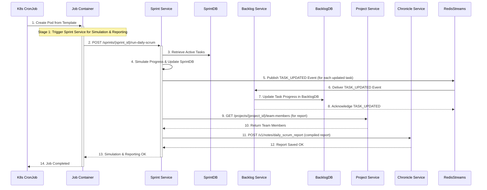
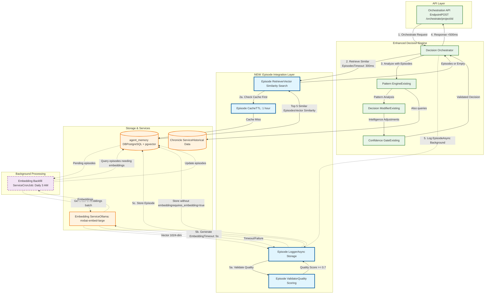
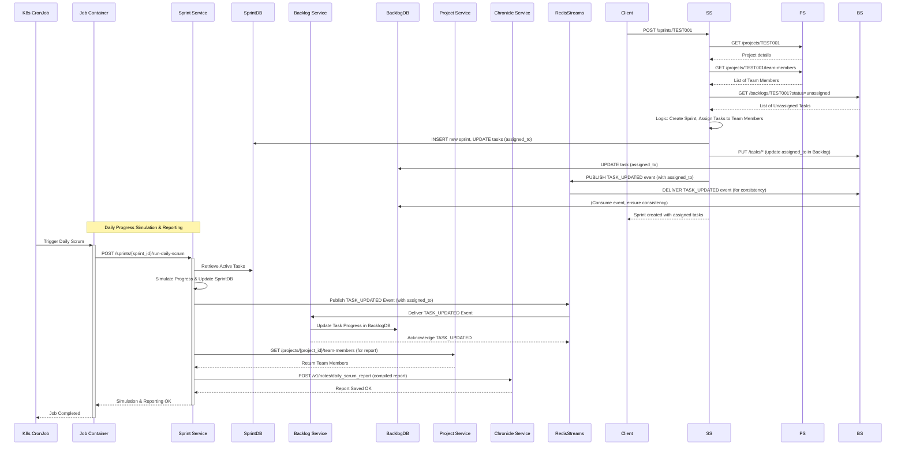

# DSM Service Specifications

## Overview

This document provides detailed specifications for all DSM (Digital Scrum Master) microservices, including API endpoints, data models, dependencies, and implementation details. For system architecture, deployment procedures, and current status, see the related documentation:

- **[Architecture Overview](DSM_Architecture_Overview.md)** - System architecture, communication patterns, and design principles
- **[Data Architecture](DSM_Data_Architecture.md)** - Detailed data models, database schemas, and ERDs for all services
- **[Deployment & Operations](DSM_Deployment_Operations.md)** - Kubernetes manifests, testing strategies, and monitoring
- **[Service Status Report](DSM_Service_Status_Report.md)** - Current implementation status and testing results

## Table of Contents
1. [Project Service (Projects + Calendar + Teams)](#1-project-service-projects--calendar--teams)
2. [Backlog Service](#2-backlog-service)
3. [Sprint Service](#3-sprint-service)
4. [Daily Scrum Service](#4-daily-scrum-service)
5. [Chronicle Service](#5-chronicle-service)
6. [Project Orchestration Service](#6-project-orchestrator-service)
7. [Scrum Ceremonies and Workflows](#7-scrum-ceremonies-and-workflows)
8. [System Architecture Patterns](#8-system-architecture-patterns)
9. [Implementation and Testing Patterns](#9-implementation-and-testing-patterns)

## 1. Project Service (Projects + Calendar + Teams)

### 1.1 Service Overview

The Project Service is a core microservice in the DSM system, acting as the single source of truth for all project-related data, team management, and calendar operations. Previously split across three separate services (Project, Calendar, and Team Management), this unified service now provides a consolidated API for managing projects, team assignments, holiday calendars, and PTO tracking. It exposes a comprehensive, API-driven interface for other services while ensuring data integrity through a dedicated PostgreSQL database.

**Note:** There is a known issue with API parsing for some `POST` endpoints in the Project Service (e.g., `POST /projects/{project_id}/team-members-assign`, `POST /employees`). For details and resolution, refer to [CR_project-service_api-parsing-fix.md](CR_project-service_api-parsing-fix.md).

### 1.2 Architecture

- **Deployment**: This service is deployed using a Docker image from a private registry, following the containerization strategy. For details on resource management and health check implementation, refer to the **[Common Service Deployment Strategy](DSM_Deployment_Operations.md#30-common-service-deployment-strategy)** section in the Deployment & Operations Guide.
- **API Framework**: FastAPI with automatic OpenAPI documentation
- **Design Pattern**: Layered architecture with clear separation between API, business logic, and data access
- **Database**: Dedicated PostgreSQL database for complete data ownership.
- **Database Connection Pooling**: Utilizes a `psycopg2` connection pool to manage database connections efficiently, reducing latency and resource overhead.
- **Configuration**: Kubernetes Secrets and ConfigMaps for credentials and settings

#### Architecture Diagram
For a high-level overview of the system architecture, please refer to the **[DSM Architecture Overview](DSM_Architecture_Overview.md#1.2-high-level-architecture-diagram)**.

### 1.3 API Endpoints

#### Health & Status
- **GET /health**
  - **Purpose**: Lightweight health check endpoint for Kubernetes liveness probes. Confirms the service process is running.
  - **Response**: `{"status": "ok"}`
  - **Status Codes**: 200 (healthy)

- **GET /health/ready**
  - **Purpose**: Comprehensive readiness probe. Validates connectivity to critical dependencies (e.g., PostgreSQL).
  - **Response**: `200 OK` with a JSON body detailing the "ok" status of each dependency if all checks pass. `503 Service Unavailable` with a JSON body detailing which dependency check failed.
    ```json
    {
        "service": "project-service",
        "status": "ready" | "not_ready",
        "database": "ok" | "error",
        "timestamp": "YYYY-MM-DDTHH:MM:SS.ffffff"
    }
    ```
  - **Status Codes**: 200 (ready), 503 (not ready)

#### Project Management
- **POST /projects**
  - **Purpose**: Creates a new project in the system
  - **Request Body**:
    ```json
    {
      "id": "TEST001",
      "name": "Test Project",
      "description": "A project created via API.",
      "status": "inactive"
    }
    ```
  - **Response**: Success message with project ID
  - **Status Codes**: 201 (created), 400 (validation error), 409 (conflict)

- **GET /projects**
  - **Purpose**: Lists all projects in the database
  - **Query Parameters**:
    - `limit` (optional): Maximum number of results
    - `offset` (optional): Pagination offset
  - **Response**: Array of project objects
  - **Status Codes**: 200 (success)

- **GET /projects/{project_id}**
  - **Purpose**: Retrieves details for a single project by ID
  - **Path Parameters**: `project_id` - Unique project identifier
  - **Response**: Project object with full details
  - **Status Codes**: 200 (found), 404 (not found)

- **PUT /projects/{project_id}/status**
  - **Purpose**: Marks a project as active or inactive
  - **Path Parameters**: `project_id` - Unique project identifier
  - **Request Body**:
    ```json
    {
      "status": "active"
    }
    ```
  - **Response**: Success message with project ID and new status
  - **Status Codes**: 200 (updated), 400 (validation error), 404 (not found)

#### Team Management
- **GET /teams**
  - **Purpose**: Retrieves all teams/employees from the database
  - **Response**: Array of team member objects
  - **Status Codes**: 200 (success)

- **GET /employees/{employee_id}**
  - **Purpose**: Retrieves details for a specific employee
  - **Path Parameters**: `employee_id` - Unique employee identifier
  - **Response**: Employee object with full details
  - **Status Codes**: 200 (found), 404 (not found)

- **POST /projects/{project_id}/team-members-assign**
  - **Purpose**: Assigns team members to a project
  - **Path Parameters**: `project_id` - Unique project identifier
  - **Request Body**:
    ```json
    {
      "employee_ids": ["E001", "E002", "E003"]
    }
    ```
  - **Response**: Success message
  - **Status Codes**: 200 (assigned), 404 (project not found)

- **GET /projects/{project_id}/team-members**
  - **Purpose**: Retrieves team members assigned to a project
  - **Path Parameters**: `project_id` - Unique project identifier
  - **Response**: Object with project ID and array of team members
  - **Status Codes**: 200 (success), 404 (project not found)

#### Calendar Management
- **GET /calendar/holidays**
  - **Purpose**: Retrieves all US holidays from the calendar
  - **Response**: Array of holiday objects with date and name
  - **Status Codes**: 200 (success)

- **GET /projects/{project_id}/calendar/pto**
  - **Purpose**: Retrieves PTO calendar for project team members
  - **Path Parameters**: `project_id` - Unique project identifier
  - **Response**: Array of PTO entries for the project team
  - **Status Codes**: 200 (success)

- **POST /projects/{project_id}/calendar/pto**
  - **Purpose**: Adds a PTO entry for a team member
  - **Path Parameters**: `project_id` - Unique project identifier
  - **Query Parameters**: `employee_id` - Employee identifier
  - **Request Body**:
    ```json
    {
      "start_date": "2024-12-25",
      "end_date": "2024-12-26",
      "reason": "Christmas holiday"
    }
    ```
  - **Response**: PTO entry with generated ID
  - **Status Codes**: 201 (created), 404 (employee/project not found)

- **GET /projects/{project_id}/availability/check**
  - **Purpose**: Checks team availability for a date range
  - **Path Parameters**: `project_id` - Unique project identifier
  - **Query Parameters**:
    - `start_date` - Start date (YYYY-MM-DD)
    - `end_date` - End date (YYYY-MM-DD)
  - **Response**: Availability status with conflicts
  - **Status Codes**: 200 (success)

### 1.4 Data Models

For detailed information on data models, database schema, and entity-relationship diagrams, please refer to the **[Project Service Data Architecture](DSM_Data_Architecture.md#1-enhanced-project-service-data-architecture)** section in the Data Architecture document.

### 1.5 Dependencies & Communication

For detailed information on service dependencies and communication patterns, refer to the **[Service Dependencies & Communication Patterns](DSM_Architecture_Overview.md#7-service-dependencies--communication-patterns)** section in the Architecture Overview.

### 1.6 Testing Examples

For `curl` command examples for the Project Service, refer to the **[API Testing Examples](DSM_Deployment_Operations.md#52-api-testing-examples)** section in the Deployment & Operations Guide.


---

## 2. Backlog Service

### 2.1 Service Overview

The Backlog Service is a crucial microservice responsible for managing the master task backlog for each project. It acts as the central repository for all project tasks, enabling other services to retrieve and update task statuses. The service ensures centralized, transactional, and API-driven backlog management.

### 2.2 Architecture

- **Deployment**: This service is deployed using a Docker image from a private registry, following the containerization strategy. For details on resource management and health check implementation, refer to the **[Common Service Deployment Strategy](DSM_Deployment_Operations.md#30-common-service-deployment-strategy)** section in the Deployment & Operations Guide.
- **API Framework**: FastAPI with comprehensive error handling
- **Design Pattern**: Domain-driven design with task aggregates
- **Database**: Dedicated PostgreSQL database for task and story management.
- **Database Connection Pooling**: Utilizes a `psycopg2` connection pool to manage database connections efficiently, reducing latency and resource overhead.
- **Integration**: API calls to Project Service for validation

#### Architecture Diagram
For a high-level overview of the system architecture, please refer to the **[DSM Architecture Overview](DSM_Architecture_Overview.md#1.2-high-level-architecture-diagram)**.

### 2.3 API Endpoints

#### Health & Status
- **GET /health**
  - **Purpose**: Lightweight health check endpoint for Kubernetes liveness probes. Confirms the service process is running.
  - **Response**: `{"status": "ok"}`
  - **Status Codes**: 200 (healthy)

- **GET /health/ready**
  - **Purpose**: Comprehensive readiness probe. Validates connectivity to critical dependencies (e.g., PostgreSQL, Redis, Project Service).
  - **Response**: `200 OK` with a JSON body detailing the "ok" status of each dependency if all checks pass. `503 Service Unavailable` with a JSON body detailing which dependency check failed.
    ```json
    {
        "service": "backlog-service",
        "status": "ready" | "not_ready",
        "database": "ok" | "error",
        "redis": "ok" | "error",
        "external_apis": {
            "project_service": "ok" | "error"
        },
        "timestamp": "YYYY-MM-DDTHH:MM:SS.ffffff"
    }
    ```
  - **Status Codes**: 200 (ready), 503 (not ready)

#### Backlog Management
- **POST /backlogs/{project_id}**
  - **Purpose**: Generates initial task backlog for a project
  - **Path Parameters**: `project_id` - Target project identifier
  - **Process**: Calls Project Service to verify project, then creates sample tasks
  - **Response**: Message with task count
  - **Status Codes**: 201 (created), 404 (project not found), 500 (generation error)

- **GET /backlogs/{project_id}**
  - **Purpose**: Retrieves current task list for a project
  - **Path Parameters**: `project_id` - Target project identifier
  - **Query Parameters**:
    - `status` (optional): Filter tasks by status
    - `assigned_to` (optional): Filter by assignee
  - **Response**: Array of task objects
  - **Status Codes**: 200 (success), 404 (project not found)

- **GET /backlogs/summary**
  - **Purpose**: Retrieves a summary of all backlogs for all projects.
  - **Response**: Array of project summary objects, each including `project_id`, `total_tasks`, and `status_counts`.
  - **Status Codes**: 200 (success), 500 (database error)

- **GET /backlogs/{project_id}/summary**
  - **Purpose**: Returns summary statistics for project backlog
  - **Path Parameters**: `project_id` - Target project identifier
  - **Response**: Summary object with counts and statistics
  - **Status Codes**: 200 (success), 404 (project not found)

#### Task Management
- **PUT /tasks/{task_id}**
  - **Purpose**: Updates task status, progress, or other details (used for Sprint Service synchronization)
  - **Path Parameters**: `task_id` - Unique task identifier
  - **Request Body**: TaskUpdate model with partial updates
    ```json
    {
      "status": "in_progress",
      "progress_percentage": 75,
      "assigned_to": "E001"
    }
    ```
  - **Use Cases**:
    - Manual task updates via API
    - **Automatic synchronization from Sprint Service** during sprint planning (for `assigned_to`) and daily scrum updates (for `status`, `progress_percentage`).
  - **Response**: Success confirmation
  - **Status Codes**: 200 (updated), 404 (not found), 422 (validation error)

### 2.4 Data Models

For detailed information on data models, database schema, and entity-relationship diagrams, please refer to the **[Backlog Service Data Architecture](DSM_Data_Architecture.md#2-backlog-service-data-architecture)** section in the Data Architecture document.

### 2.5 Dependencies & Communication

For detailed information on service dependencies and communication patterns, refer to the **[Service Dependencies & Communication Patterns](DSM_Architecture_Overview.md#7-service-dependencies--communication-patterns)** section in the Architecture Overview.

### 2.6 Testing Examples

For `curl` command examples for the Backlog Service, refer to the **[API Testing Examples](DSM_Deployment_Operations.md#52-api-testing-examples)** section in the Deployment & Operations Guide.


---

## 3. Sprint Service

### 3.1 Service Overview

The Sprint Service is a critical microservice responsible for managing the complete lifecycle of sprints for each project. It handles sprint planning, **including automatic task assignment to team members**, progress tracking, and coordinates with both Project and Backlog Services to orchestrate sprint workflows. **Crucially, it now also consolidates the daily scrum task progress simulation and reporting logic.** To ensure high availability and resilience, the Sprint Service is deployed with multiple replicas and protected by a Pod Disruption Budget (PDB).

### 3.2 Architecture

- **Deployment**: Deployed with multiple replicas and configured with a Pod Disruption Budget (PDB) for high availability. This service is deployed using a Docker image from a private registry, following the containerization strategy. For details on resource management and health check implementation, refer to the **[Common Service Deployment Strategy](DSM_Deployment_Operations.md#30-common-service-deployment-strategy)** section in the Deployment & Operations Guide.
- **API Framework**: FastAPI with comprehensive integration capabilities
- **Design Pattern**: Aggregate pattern for sprint management
- **Database**: Dedicated PostgreSQL database for sprint data.
- **Database Connection Pooling**: Utilizes a `psycopg2` connection pool to manage database connections efficiently, reducing latency and resource overhead.
- **Event Processing**: Redis Streams consumer for real-time updates

#### Architecture Diagram
For a high-level overview of the system architecture, please refer to the **[DSM Architecture Overview](DSM_Architecture_Overview.md#1.2-high-level-architecture-diagram)**.

### 3.3 API Endpoints

#### Health & Status
- **GET /health**
  - **Purpose**: Lightweight health check endpoint for Kubernetes liveness probes. Confirms the service process is running.
  - **Response**: `{"status": "ok"}`
  - **Status Codes**: 200 (healthy)

- **GET /health/ready**
  - **Purpose**: Comprehensive readiness probe. Validates connectivity to critical dependencies (e.g., PostgreSQL, Redis, Project Service, Backlog Service, Chronicle Service).
  - **Response**: `200 OK` with a JSON body detailing the "ok" status of each dependency if all checks pass. `503 Service Unavailable` with a JSON body detailing which dependency check failed.
    ```json
    {
        "service": "sprint-service",
        "status": "ready" | "not_ready",
        "database": "ok" | "error",
        "redis": "ok" | "error",
        "external_apis": {
            "project_service": "ok" | "error",
            "backlog_service": "ok" | "error",
            "chronicle_service": "ok" | "error"
        },
        "timestamp": "YYYY-MM-DDTHH:MM:SS.ffffff"
    }
    ```
  - **Status Codes**: 200 (ready), 503 (not ready)

#### Sprint Management
- **POST /sprints/{project_id}**
  - **Purpose**: Starts a new sprint for a project
  - **Path Parameters**: `project_id` - Target project identifier
  - **Request Body**:
    ```json
    {
      "sprint_name": "Sprint 1",
      "duration_weeks": 2
    }
    ```
  - **Process**:
    1. Validates project via Project Service.
    2. **Checks for unassigned tasks from Backlog Service. If none are found, sprint creation is aborted.**
    3. Retrieves team members for the project via Project Service.
    4. Creates sprint and assigns tasks to the sprint. For each task, it checks for an existing `assigned_to` value from the backlog; if present, it retains it, otherwise, it assigns a team member (e.g., using a round-robin strategy).
    5. Updates task assignments in Backlog Service.
    6. **(NEW)** Generates and sends a "Sprint Planning" report to the Chronicle Service, including sprint details and planned tasks. This call is non-blocking and resilient to Chronicle Service unavailability.
  - **Response**: Sprint details with assigned tasks
  - **Status Codes**: 201 (created), 404 (project not found), **409 (conflict - no unassigned tasks or sprint already in progress)**, 500 (creation error)

- **GET /sprints/{sprint_id}**
  - **Purpose**: Retrieves comprehensive sprint details
  - **Path Parameters**: `sprint_id` - Unique sprint identifier
  - **Response**: Sprint object with tasks and progress
  - **Status Codes**: 200 (found), 404 (not found)

- **GET /sprints/by-project/{project_id}**
  - **Purpose**: Lists all sprints for a project
  - **Path Parameters**: `project_id` - Target project identifier
  - **Query Parameters**:
    - `status` (optional): Filter by sprint status (e.g., `in_progress` for active sprints, `completed`).
    - `limit` (optional): Pagination limit
  - **Response**: Array of sprint summaries
  - **Status Codes**: 200 (success)

- **GET /sprints/active**
  - **Purpose**: Retrieves the ID of the first active sprint found.
  - **Response**: `{"sprint_id": "<active-sprint-id>"}` or 404 if none.
  - **Status Codes**: 200 (found), 404 (not found)

- **GET /sprints/list_projects**
  - **Purpose**: Retrieves a list of unique project IDs that have associated sprints.
  - **Response**: Array of project IDs (strings)
  - **Status Codes**: 200 (success)

- **GET /sprints/{sprint_id}/tasks**
  - **Purpose**: Retrieves all tasks for a specific sprint.
  - **Path Parameters**: `sprint_id` - Unique sprint identifier
  - **Response**: Array of task objects, each including an `assigned_to` field.
      ```json
      [
        {
          "task_id": "TASK001",
          "title": "Example Task",
          "status": "assigned_to_sprint",
          "sprint_id": "PROJ001-S01",
          "progress_percentage": 0,
          "assigned_to": "E001"
        }
      ]
      ```
  - **Status Codes**: 200 (success), 404 (sprint not found)

- **POST /sprints/{sprint_id}/close**
  - **Purpose**: Initiates the closure process for a specified sprint.
  - **Path Parameters**: `sprint_id` (string) - The ID of the sprint to close.
  - **Request Body**: None
  - **Response**:
    ```json
    {
      "message": "Sprint closure initiated.",
      "sprint_id": "SPRINT_ID",
      "status_updated_to": "completed" | "closed_with_pending_tasks",
      "completed_tasks_count": 0,
      "uncompleted_tasks_moved_to_backlog_count": 0,
      "retrospective_report_id": "UUID_OF_REPORT"
    }
    ```
  - **Status Codes**:
    - `200 OK`: Closure process successfully initiated/completed.
    - `404 Not Found`: Sprint not found.
    - `409 Conflict`: Sprint is not in `in_progress` status.
    - `500 Internal Server Error`: General processing error.

#### Task Progress Management
- **POST /tasks/{task_id}/progress**
  - **Purpose**: Updates task progress within a sprint and synchronizes with Backlog Service
  - **Path Parameters**: `task_id` - Unique task identifier
  - **Request Body**:
    ```json
    {
      "status": "in_progress",
      "progress_percentage": 50
    }
    ```
  - **Process**:
    1. Updates task progress in Sprint database
    2. Publishes `TASK_UPDATED` events (including `assigned_to` employee ID) to Redis Streams for asynchronous synchronization with the Backlog Service.
    3. Auto-determines status: `in_progress` if progress > 0%, `completed` if progress >= 100%
  - **Response**: Updated task progress confirmation
  - **Status Codes**: 200 (updated), 404 (not found), 422 (validation error)
  - **Error Handling**: Logs but continues on Backlog Service API failures

- **GET /sprints/{sprint_id}/task-summary**
  - **Purpose**: (New) Provides a summary of task statistics for a given sprint, including total, completed, and pending tasks.
  - **Path Parameters**: `sprint_id` - Unique sprint identifier
  - **Response**:
    ```json
          "total_tasks": 25,
      "completed_tasks": 10,
      "pending_tasks": 15
    }
  - **Status Codes**: 200 (success), 404 (sprint not found)

- **POST /sprints/{sprint_id}/run-daily-scrum**
  - **Purpose**: Initiates the daily scrum simulation and reporting process for a specified sprint. This endpoint now encapsulates the entire daily scrum logic, including task progress simulation, updating the local database, publishing `TASK_UPDATED` events, fetching team data from the Project Service, compiling the daily report, and submitting it to the Chronicle Service.
  This endpoint is typically called by the daily scrum cronjob orchestrated by the Project Orchestration Service.
  - **Path Parameters**: `sprint_id` - Unique sprint identifier.  The identifier of the sprint for which to run the daily scrum simulation.
  - **Request Body**: (No request body is typically required for this trigger, as the service itself will determine task updates.)
  - **Response**:
    ```json
    {
      "message": "Daily scrum simulation and reporting initiated successfully.",
      "sprint_id": "SPRINT_ID",
      "updated_tasks_count": 5,
      "report_id": "UUID_OF_REPORT"
    }
    ```
  - **Status Codes**: 200 (success), 404 (sprint not found), 500 (simulation/reporting error)
    ```
  - **Status Codes**: 200 (success), 404 (sprint not found)

### 3.4 Data Models

For detailed information on data models, database schema, and entity-relationship diagrams, please refer to the **[Sprint Service Data Architecture](DSM_Data_Architecture.md#3-sprint-service-data-architecture)** section in the Data Architecture document.

### 3.5 Event Processing

#### Redis Streams Integration
The Sprint Service consumes events from the `daily_scrum_events` stream to process task progress updates asynchronously.

**Event Consumer Configuration**:
```python
# Consumer group: sprint_service_group
# Stream: daily_scrum_events
# Event types: TASK_PROGRESSED, TASK_UPDATED (now includes assigned_to)
```

#### TASK_UPDATED Event Schema (Published by Sprint Service)
```json
{
  "event_id": "uuid-generated-id",
  "event_type": "TASK_UPDATED",
  "timestamp": "2025-09-09T10:30:00Z",
  "aggregate_id": "TASK001",
  "aggregate_type": "Task",
  "event_data": {
    "task_id": "TASK001",
    "project_id": "PROJ001",
    "sprint_id": "PROJ001-S01",
    "status": "assigned_to_sprint",
    "progress_percentage": 0,
    "updated_at": "2025-09-09T10:30:00Z",
    "assigned_to": "E001"
  },
  "metadata": {
    "source_service": "SprintService",
    "correlation_id": "uuid-generated-id"
  }
}
```

**Event Processing Flow**:
```mermaid
    sequenceDiagram
        participant K8s CronJob
        participant Job Container
        participant Sprint Service
        participant SprintDB
        participant Backlog Service
        participant BacklogDB
        participant Project Service
        participant Chronicle Service
        participant RedisStreams

        K8s CronJob->>+Job Container: 1. Create Pod from Template

        Note over Job Container: Stage 1: Trigger Sprint Service for Simulation & Reporting
        Job Container->>+Sprint Service: 2. POST /sprints/{sprint_id}/run-daily-scrum
        Sprint Service->>SprintDB: 3. Retrieve Active Tasks
        Sprint Service->>Sprint Service: 4. Simulate Progress & Update SprintDB
        Sprint Service->>RedisStreams: 5. Publish TASK_UPDATED Event (for each updated task)
        RedisStreams->>Backlog Service: 6. Deliver TASK_UPDATED Event
        Backlog Service->>BacklogDB: 7. Update Task Progress in BacklogDB
        Backlog Service-->>RedisStreams: 8. Acknowledge TASK_UPDATED

        Sprint Service->>Project Service: 9. GET /projects/{project_id}/team-members (for report)
        Project Service-->>Sprint Service: 10. Return Team Members
        Sprint Service->>Chronicle Service: 11. POST /v1/notes/daily_scrum_report (compiled report)
        Chronicle Service-->>Sprint Service: 12. Report Saved OK
        Sprint Service-->>-Job Container: 13. Simulation & Reporting OK

        Job Container-->>-K8s CronJob: 14. Job Completed
    ```


### 3.6 Dependencies & Communication

For detailed information on service dependencies and communication patterns, refer to the **[Service Dependencies & Communication Patterns](DSM_Architecture_Overview.md#7-service-dependencies--communication-patterns)** section in the Architecture Overview.

### 3.7 Testing Examples

For `curl` command examples for the Sprint Service, refer to the **[API Testing Examples](DSM_Deployment_Operations.md#52-api-testing-examples)** section in the Deployment & Operations Guide.

---

## 4. Daily Scrum Service

### 4.1 Service Overview

The Daily Scrum Service is a specialized microservice whose primary role in daily scrum simulation has been **deprecated and absorbed by the Sprint Service**. Its `POST /scrums/{sprint_id}/run` endpoint is now deprecated.

### 4.2 Architecture

- **Deployment**: This service is deployed using a Docker image from a private registry, following the containerization strategy. For details on resource management and health check implementation, refer to the **[Common Service Deployment Strategy](DSM_Deployment_Operations.md#30-common-service-deployment-strategy)** section in the Deployment & Operations Guide.
- **API Framework**: FastAPI optimized for event publishing
- **Design Pattern**: Event sourcing with publish-only operations
- **Event Store**: Redis Streams for reliable event delivery
- **Database**: Does not own a database for task progress; sends daily scrum reports to Chronicle Service.

#### Architecture Diagram
For a high-level overview of the system architecture, please refer to the **[DSM Architecture Overview](DSM_Architecture_Overview.md#1.2-high-level-architecture-diagram)**.

### 4.3 API Endpoints

#### Health & Status
- **GET /health**
  - **Purpose**: Health check with Redis connectivity validation
  - **Response**: `{"status": "ok", "redis": "connected"}`
  - **Status Codes**: 200 (healthy), 503 (unhealthy)

#### Daily Scrum Operations
- **POST /scrums/{sprint_id}/run**
  - **Purpose**: Executes daily scrum simulation for a sprint
  - **Path Parameters**: `sprint_id` - Target sprint identifier
  - **Process**:
    1. Retrieves active tasks for the sprint *from the Sprint Service*.
    2. Simulates team member progress updates.
    3. Publishes TASK_PROGRESSED events to Redis.
    4. The Sprint Service (consumer) updates task progress in its database based on these events and publishes `TASK_UPDATED` events.
  - **Response**: Simulation summary with event count
  - **Status Codes**: 200 (completed), 404 (sprint not found), 500 (simulation error)

### 4.4 Data Models

For detailed information on data models, please refer to the **[Daily Scrum Service Data Architecture](DSM_Data_Architecture.md#4-daily-scrum-service-data-architecture)** section in the Data Architecture document.

### 4.5 Event Publishing & Redis Integration

#### Event Schema
```json
{
  "event_id": "uuid-generated-id",
  "event_type": "TASK_PROGRESSED",
  "timestamp": "2025-07-28T10:30:00Z",
  "sprint_id": "TEST001-S01",
  "task_id": "TEST001-TASK002",
  "progress_made": 25,
  "new_total_progress": 75,
  "employee_id": "E001",
  "yesterday_work": "Worked on task X",
  "today_work": "Will work on task Y",
  "impediments": "No impediments"
}
```

#### Redis Streams Configuration
- **Stream Name**: `daily_scrum_events`
- **Event Types**: `TASK_PROGRESSED`, `DAILY_SCRUM_UPDATE`
- **Retention**: Events retained for 7 days
- **Consumer Groups**: `sprint_service_group` (for Sprint Service), `backlog_service_group` (for Backlog Service - indirectly via `TASK_UPDATED` events)

#### Event Publishing Flow


### 4.6 Dependencies & Communication


For detailed information on service dependencies and communication patterns, refer to the **[Service Dependencies & Communication Patterns](DSM_Architecture_Overview.md#7-service-dependencies--communication-patterns)** section in the Architecture Overview.

### 4.7 Testing Examples

For `curl` command examples for the Daily Scrum Service, refer to the **[API Testing Examples](DSM_Deployment_Operations.md#52-api-testing-examples)** section in the Deployment & Operations Guide.

---

## 5. Chronicle Service

### 5.1 Service Overview

The Chronicle Service is a dedicated microservice responsible for storing historical records and important notes within the DSM system. Its primary function is to act as a persistent repository for various types of "chronicles," including structured sprint retrospective reports and daily scrum reports, ensuring that key historical data is preserved and accessible. It provides an API-driven interface for other services to create and retrieve these notes.

### 5.2 Architecture

- **Deployment**: This service is deployed using a Docker image from a private registry, following the containerization strategy. For details on resource management and health check implementation, refer to the **[Common Service Deployment Strategy](DSM_Deployment_Operations.md#30-common-service-deployment-strategy)** section in the Deployment & Operations Guide.
- **API Framework**: FastAPI (inferred, consistent with other services)
- **Design Pattern**: Simple CRUD operations for note management
- **Database**: Dedicated PostgreSQL database for storing notes.
- **Database Connection Pooling**: Utilizes a `psycopg2` connection pool to manage database connections efficiently, reducing latency and resource overhead.
- **Configuration**: Kubernetes Secrets and ConfigMaps for credentials and settings

#### Architecture Diagram
For a high-level overview of the system architecture, please refer to the **[DSM Architecture Overview](DSM_Architecture_Overview.md#1.2-high-level-architecture-diagram)**.

### 5.3 API Endpoints

#### Health & Status
- **GET /health**
  - **Purpose**: Lightweight health check endpoint for Kubernetes liveness probes. Confirms the service process is running.
  - **Response**: `{"status": "ok"}`
  - **Status Codes**: 200 (healthy)

- **GET /health/ready**
  - **Purpose**: Comprehensive readiness probe. Validates connectivity to critical dependencies (e.g., PostgreSQL).
  - **Response**: `200 OK` with a JSON body detailing the "ok" status of each dependency if all checks pass. `503 Service Unavailable` with a JSON body detailing which dependency check failed.
    ```json
    {
        "service": "chronicle-service",
        "status": "ready" | "not_ready",
        "database": "ok" | "error",
        "timestamp": "YYYY-MM-DDTHH:MM:SS.ffffff"
    }
    ```
  - **Status Codes**: 200 (ready), 503 (not ready)

#### Note Management
- **POST /v1/notes/sprint_retrospective**
  - **Purpose**: Creates a new sprint retrospective note.
  - **Request Body**:
    ```json
    {
      "sprint_id": "NEX005-S02",
      "project_id": "NEX005",
      "sprint_name": "New Sprint for PHE001",
      "start_date": "2025-09-02",
      "end_date": "2025-09-16",
      "duration_weeks": 2,
      "what_went_well": "Team collaborated well under pressure.",
      "what_could_be_improved": "Better backlog grooming needed.",
      "action_items": [
        {"description": "Schedule backlog refinement earlier.", "status": "open"}
      ],
      "facilitator_id": "EMP1234",
      "attendees": ["EMP1234", "EMP4567", "EMP7890"],
      "tasks_summary": [
        {
          "description": "Build UI for dashboard",
          "status": "open",
          "task_id": "TEST-002-TASK001",
          "employee_id": "E001",
          "progress_percentage": 0
        },
        {
          "description": "Build UI for dashboard",
          "status": "close",
          "employee_id": "E002",
          "task_id": "TEST-002-TASK002",
          "progress_percentage": 100
        }
      ]
    }
    ```
  - **Response**: Success message with the ID of the created note.
  - **Status Codes**: 200 (created), 400 (validation error), 500 (internal error)

- **POST /v1/notes/sprint_planning**
  - **Purpose**: Creates a new sprint planning note.
  - **Request Body**:
    ```json
    {
      "sprint_id": "NEX005-S02",
      "project_id": "NEX005",
      "sprint_name": "New Sprint for NEX005",
      "sprint_goal": "Complete all assigned tasks for the NEX005 project.",
      "start_date": "2025-09-16",
      "end_date": "2025-09-30",
      "duration_weeks": 2,
      "planned_tasks": [
        "NEX005-TASK010",
        "NEX005-TASK011"
      ]
    }
    ```
  - **Response**: Success message with the ID of the created note.
  - **Status Codes**: 201 (created), 400 (validation error), 500 (internal error)

- **GET /v1/notes/sprint_planning**
  - **Purpose**: Retrieves one or more sprint planning reports.
  - **Query Parameters**:
    - `project_id` (optional, string): Filters reports for a specific project.
    - `sprint_id` (optional, string): Filters for a single sprint report.
  - **Response**: A JSON array of sprint planning report objects.
  - **Status Codes**: 200 (Success), 404 (Not Found), 500 (Internal Server Error).
  - **Example Response**:
    ```json
    [
      {
        "note_id": "df00534b-3780-49e1-928f-080ff05f63ef",
        "sprint_id": "TIT007-S14",
        "project_id": "TIT007",
        "sprint_name": "New Sprint for TIT007",
        "sprint_goal": "Complete all assigned tasks for the TIT007 project.",
        "start_date": "2025-09-17",
        "end_date": "2025-10-01",
        "duration_weeks": 2,
        "planned_tasks": [
          "TIT007-TASK008",
          "TIT007-TASK009",
          "TIT007-TASK010",
          "TIT007-TASK007",
          "TIT007-TASK001",
          "TIT007-TASK006",
          "TIT007-TASK002",
          "TIT007-TASK003",
          "TIT007-TASK004",
          "TIT007-TASK005"
        ],
        "created_at": "2025-09-17T18:45:00.123456Z"
      }
    ]
    ```


- **POST /v1/notes/daily_scrum_report**
  - **Purpose**: Records a daily scrum update as a historical note. The request body now includes an optional `summary_metrics` object containing aggregated sprint statistics, and the individual employee reports are nested within the `reports` object.
  - **Request Body**:
    ```json
    {
      "project_id": "PROJ001",
      "sprint_id": "PROJ001-S01",
      "report_date": "2025-08-03",
      "summary": "Daily stand-up for sprint PROJ001-S01. 2 tasks had progress simulated.",
      "summary_metrics": {
        "total_team_members": 8,
        "total_tasks": 25,
        "completed_tasks": 10,
        "pending_tasks": 15
      },
      "reports": {
        "2025-08-03": [
          {
            "assigned_to": "EMP001",
            "tasks": [
              {
                "id": "TASK001",
                "yesterday_work": "Completed task X.",
                "today_work": "Will start task Y.",
                "impediments": "None.",
                "created_at": "2025-08-03T10:00:00.000000"
              }
            ]
          }
        ]
      }
    }
    ```
  - **Response**: Success message with the ID of the created note.
  - **Status Codes**: 201 (created), 400 (validation error), 500 (internal error)

- **GET /v1/notes/daily_scrum_report**
  - **Purpose**: Retrieves daily scrum reports for a given sprint or project, grouped by date. The response now includes the `summary_metrics` object at the top level.
  - **Query Parameters**:
    - `sprint_id` (optional): Filter by sprint ID.
    - `project_id` (optional): Filter by project ID.
    - `daily_scrum_date` (optional): Filter by a specific daily scrum date (YYYY-MM-DD).
  - **Response**: A JSON object containing grouped daily scrum reports.
    ```json
    {
      "project_id": "CHR006",
      "sprint_id": "CHR006-S02",
      "created_at": "2025-08-09T10:00:00Z",
      "summary": "No Holiday or PTO reported for this daily stand-up",
      "summary_metrics": {
        "total_team_members": 8,
        "total_tasks": 25,
        "completed_tasks": 10,
        "pending_tasks": 15
      },
      "reports": {
        "2025-08-07": [
          {
            "employee_id": "employee-001",
            "tasks": [
              {
                "id": "d2471d04-40b2-468a-b500-477f4d9781c1",
                "yesterday_work": "Worked on CHR006-TASK007 and completed 6% of it.",
                "today_work": "Continuing work on CHR006-TASK007 to reach 100% completion.",
                "impediments": "Encountered a minor blocker with external dependency.",
                "created_at": "2025-08-07T00:00:02.364644"
              }
            ]
          }
        ]
      }
    }
    ```
  - **Status Codes**: 200 (success), 404 (not found)

- **GET /v1/notes/sprint_retrospective**
  - **Purpose**: Retrieves sprint retrospective reports for a given sprint or project.
  - **Query Parameters**:
    - `sprint_id` (optional): Filter by sprint ID.
    - `project_id` (optional): Filter by project ID.
  - **Response**: Array of sprint retrospective report objects, including `sprint_name`, `start_date`, `end_date`, `duration_weeks`, and `tasks_summary` fields.
    ```json
    [
      {
        "retrospective_id": "d93e9d00-4aec-4ff2-acac-29cdd9b91b6b",
        "sprint_id": "TEST-002-S03",
        "project_id": "TEST-002",
        "sprint_name": "New Sprint for PHE001",
        "start_date": "2025-09-02",
        "end_date": "2025-09-16",
        "duration_weeks": 2,
        "what_went_well": "Successfully completed 10 tasks.",
        "what_could_be_improved": "Continue current practices.",
        "action_items": [
          {
            "description": "Review 10 tasks that were completed.",
            "status": "open"
          }
        ],
        "facilitator_id": "EMP_FACILITATOR",
        "attendees": [
          "EMP_ATTENDEE_1",
          "EMP_ATTENDEE_2"
        ],
        "tasks_summary": [
          {
            "description": "Build UI for dashboard",
            "status": "open",
            "task_id": "TEST-002-TASK001",
            "employee_id": "E001",
            "progress_percentage": 0
          },
          {
            "description": "Build UI for dashboard",
            "status": "close",
            "employee_id": "E002",
            "task_id": "TEST-002-TASK002",
            "progress_percentage": 100
          },
          {
            "description": "Build UI for dashboard",
            "status": "in-progress",
            "employee_id": "E003",
            "task_id": "TEST-002-TASK003",
            "progress_percentage": 60
          }
        ],
        "created_at": "2025-09-12T12:10:32.250943+00:00"
      }
    ]
    ```
  - **Status Codes**: 200 (success), 404 (not found)

#### Analytics Endpoints
- **GET /v1/analytics/metrics/summary**
  - **Purpose**: Provides a system-wide summary of key analytics metrics across all projects.
  - **Response**: A JSON object containing aggregated metrics.
    ```json
    {
      "total_projects": 16,
      "total_sprints": 48,
      "total_daily_scrum_reports": 154,
      "total_retrospectives": 48,
      "total_action_items": 220,
      "overall_system_health": "Good",
      "summary_analysis": "Aggregated metrics across all DSM projects, providing a high-level overview of activity and historical data."
    }
    ```
  - **Status Codes**: 200 (success), 404 (no metrics found), 500 (internal error)

- **GET /v1/analytics/project/{project_id}/patterns**
  - **Purpose**: Extracts historical patterns and key insights for a specific project based on its daily scrums and sprint retrospectives.
  - **Path Parameters**: `project_id` - Unique project identifier.
  - **Response**: A JSON object containing various patterns and analysis summaries.
    ```json
    {
      "project_id": "AEG003",
      "daily_scrum_count": 10,
      "retrospective_count": 5,
      "total_tasks_completed_in_daily_scrums": 8,
      "common_retrospective_action_items": {
        "Improve sprint planning accuracy": 2,
        "Refine definition of done": 1
      },
      "patterns_analysis_summary": "Detailed analysis of project patterns based on daily scrums and retrospectives."
    }
    ```
  - **Status Codes**: 200 (success), 404 (project not found), 500 (internal error)

- **GET /v1/analytics/project/{project_id}/velocity**
  - **Purpose**: Calculates and provides team velocity trends for a specific project over its sprints.
  - **Path Parameters**: `project_id` - Unique project identifier.
  - **Response**: A JSON object containing velocity data per sprint and average velocity.
    ```json
    {
      "project_id": "AEG003",
      "velocity_trend_data": [
        {
          "sprint_id": "AEG003-S01",
          "start_date": "2025-01-01",
          "end_date": "2025-01-15",
          "completed_tasks": 7
        },
        {
          "sprint_id": "AEG003-S02",
          "start_date": "2025-01-16",
          "end_date": "2025-01-30",
          "completed_tasks": 9
        }
      ],
      "average_velocity": 8.0,
      "velocity_analysis": "Analysis of tasks completed per sprint over time."
    }
    ```
  - **Status Codes**: 200 (success), 404 (project not found), 500 (internal error)

- **GET /v1/analytics/project/{project_id}/impediments**
  - **Purpose**: Analyzes common impediments reported in sprint retrospectives for a specific project and their frequency/status.
  - **Path Parameters**: `project_id` - Unique project identifier.
  - **Response**: A JSON object detailing impediment frequency and status counts.
    ```json
    {
      "project_id": "AEG003",
      "impediment_frequency": {
        "External dependency delays": 3,
        "Lack of clear requirements": 2
      },
      "impediment_status_counts": {
        "External dependency delays": {
          "open": 1,
          "closed": 2
        },
        "Lack of clear requirements": {
          "open": 2
        }
      },
      "impediment_analysis_summary": "Analysis of common impediments and their resolution status."
    }
    ```
  - **Status Codes**: 200 (success), 404 (project not found), 500 (internal error)

- **GET /v1/analytics/projects/similar**
  - **Purpose**: Identifies projects with similar characteristics based on historical data, such as common impediments or task patterns.
  - **Query Parameters**:
    - `reference_project_id` (required): The ID of the project to compare against.
    - `similarity_threshold` (optional): A float value (0.0-1.0) to filter similar projects. Defaults to 0.7.
  - **Response**: A list of JSON objects, each representing a similar project with its similarity score.
    ```json
    [
      {
        "project_id": "SIMILAR-PROJ001",
        "similarity_score": 0.85
      },
      {
        "project_id": "SIMILAR-PROJ002",
        "similarity_score": 0.78
      }
    ]
    ```
  - **Status Codes**: 200 (success), 400 (invalid parameters), 404 (no similar projects found), 500 (internal error)


#### GET /v1/analytics/decisions/impact/{project_id}
*   **Purpose**: Retrieves aggregated historical decision audit records and their associated sprint/project outcomes for a given project within a specified time range. This endpoint correlates `orchestration_decision_audit` events (logged via dedicated `POST /v1/notes/decision_audit` endpoint) with `sprint_retrospective` or other outcome-tracking events.
*   **Path Parameters**: `project_id` - The identifier of the project for which to retrieve the decision impact report.
*   **Query Parameters**:
    *   `start_date`: Optional (ISO 8601 format, e.g., `2025-09-01`). Defaults to 30 days prior.
    *   `end_date`: Optional (ISO 8601 format, e.g., `2025-09-30`). Defaults to current date.
*   **Response**: A JSON object containing aggregated decision impact data.
    ```json
    {
      "time_period": {
        "start_date": "2025-09-03T20:44:05.320416",
        "end_date": "2025-10-03T20:44:05.320416"
      },
      "total_decisions_analyzed": 4,
      "intelligence_enhanced_decisions": 2,
      "rule_based_decisions": 2,
      "intelligence_completion_rate_avg": 0.925,
      "rule_based_completion_rate_avg": 0.775,
      "completion_rate_improvement_percent": 19.35,
      "task_efficiency_improvement_percent": 0.0,
      "resource_utilization_improvement_percent": 0.0,
      "details": [
        {
          "audit_id": "uuid-of-decision-audit-1",
          "project_id": "PROJ-001",
          "sprint_id": "PROJ-001-S01",
          "decision_source": "intelligence_enhanced",
          "completion_rate": 0.9,
          "success": true,
          "timestamp": "2025-09-10T10:00:00Z"
        },
        {
          "audit_id": "uuid-of-decision-audit-2",
          "project_id": "PROJ-002",
          "sprint_id": "PROJ-002-S01",
          "decision_source": "rule_based_only",
          "completion_rate": 0.75,
          "success": false,
          "timestamp": "2025-09-12T11:00:00Z"
        }
      ]
    }
    ```
*   **Status Codes**: 200 (Success), 400 (Invalid parameters), 404 (Project not found).

### 5.4 Data Models

For detailed information on data models, database schema, and entity-relationship diagrams, please refer to the **[Chronicle Service Data Architecture](DSM_Data_Architecture.md#4-chronicle-service-data-architecture)** section in the Data Architecture document.

The Chronicle Service primarily uses the following Pydantic models for its API endpoints, which correspond to the data stored in its database tables.

- **`DailyScrumReportNote`**: This model is used to create new daily scrum reports. The `reports` field, which contains the detailed task updates, is stored in the `additional_data` JSONB column of the `chronicle_notes` table. The `summary_metrics` are stored in the `summary_metrics` JSONB column.

- **`SprintRetrospectiveNote`**: This model is used for creating sprint retrospective notes. The main retrospective data is stored in the `sprint_retrospectives` table. The `action_items` and `attendees` are stored in the `retrospective_action_items` and `retrospective_attendees` tables, respectively, with foreign keys linking back to the `sprint_retrospectives` table. The `tasks_summary` is stored as a JSONB column in the `sprint_retrospectives` table.

**Database Tables:**
*   **`chronicle_notes`**: Stores various types of notes, including daily scrum reports, sprint planning notes, and other general notes. It uses a flexible schema with `additional_data` and `summary_metrics` JSONB columns to accommodate different data structures.
*   **`sprint_retrospectives`**: Contains the main information about sprint retrospectives.
*   **`retrospective_action_items`**: Stores action items related to a sprint retrospective.
*   **`retrospective_attendees`**: Stores the list of attendees for a sprint retrospective.

### 5.5 Dependencies & Communication


For detailed information on service dependencies and communication patterns, including the Service Communication Matrix, refer to the **[Service Dependencies & Communication Patterns](DSM_Architecture_Overview.md#7-service-dependencies--communication-patterns)** section in the Architecture Overview.

### 5.6 Testing Examples

For `curl` command examples for the Chronicle Service, refer to the **[API Testing Examples](DSM_Deployment_Operations.md#52-api-testing-examples)** section in the Deployment & Operations Guide.


---
## 6. Project Orchestration Service

### 6.1 Service Overview

The Project Orchestration Service is an **intelligence-driven microservice** that acts as the AI coordinator for the DSM system. It has evolved beyond simple automation to a service that **actively learns from its own past decisions**. It provides a RESTful API that analyzes project state, generates a baseline rule-based decision, and then enhances that decision by retrieving and analyzing similar historical episodes from its own **episodic memory**. This hybrid approach, combining reliable rule-based logic with adaptive, memory-driven intelligence, ensures both safety and continuous improvement.

Every decision made by the orchestrator is captured as a complete "episode" and stored asynchronously in the `agent_memory` database, creating a rich history of context, reasoning, and actions. This allows the agent to perform semantic similarity searches to find relevant past experiences that inform and improve current decision-making.

### 6.2 Architecture

- **Deployment**: This service is deployed using a Docker image from a private registry, following the containerization strategy. For details on resource management and health check implementation, refer to the **[Common Service Deployment Strategy](DSM_Deployment_Operations.md#30-common-service-deployment-strategy)** section in the Deployment & Operations Guide.
- **API Framework**: FastAPI with comprehensive error handling and structured logging
- **Design Pattern**: Multi-layer architecture with clear separation between API, business logic, and infrastructure
- **Database**: While the service itself is stateless, it relies critically on the `agent_memory` PostgreSQL database (with the pgvector extension) for its core intelligence features, including the storage and retrieval of decision episodes.
- **Integration**: API-driven communication with all existing services (Project, Backlog, Sprint, Chronicle) and the Embedding Service.
- **Kubernetes Integration**: Direct interaction with the Kubernetes API for CronJob management.

#### Architecture Diagram
For a high-level overview of the system architecture, please refer to the **[DSM Architecture Overview](DSM_Architecture_Overview.md#1.2-high-level-architecture-diagram)**.

The following diagram illustrates the high-level architecture, including the new Episode Integration Layer responsible for memory storage and retrieval.



For a more detailed component breakdown, please refer to the **[DSM Project Orchestration Service Architecture](DSM_Project_Orchestration_Service_Architecture.md#21-high-level-component-architecture)**. The foundational infrastructure for its agent memory capabilities is detailed in **[CR_Agent_04_01: Agent Memory Foundation & Validation](CR_Agent_04_01_Memory-Foundation.md)**, and the episode storage/retrieval architecture is detailed in **[CR_Agent_04_02: Episode Storage & Retrieval](CR_Agent_04_02-Episode-Storage-n-Retrieval.md)**.
### 6.3 API Endpoints

#### Health & Status
- **GET /health**
  - **Purpose**: Lightweight health check endpoint for Kubernetes liveness probes. Confirms the service process is running.
  - **Response**: `{"status": "ok"}`
  - **Status Codes**: 200 (healthy)

- **GET /health/ready**
  - **Purpose**: Comprehensive readiness probe validating connectivity to all critical dependencies, including downstream DSM services and the new agent memory infrastructure.
  - **Response**: `200 OK` with a JSON body detailing the status of each dependency. The check now includes detailed status for the `agent_memory_db` (connection pool metrics) and the `embedding-service` (latency and circuit breaker state). Returns `503 Service Unavailable` if any critical check fails.
  - **Example Response**:
    ```json
    {
      "status": "ok",
      "services": {
        "project-service": {"status": "ok"},
        "backlog-service": {"status": "ok"},
        "sprint-service": {"status": "ok"},
        "chronicle-service": {"status": "ok"},
        "agent_memory_db": {
          "status": "ok",
          "pool_status": {
            "pool_size": 5,
            "checked_in_connections": 3,
            "checked_out_connections": 2,
            "total_connections": 5
          }
        },
        "embedding-service": {
          "status": "ok",
          "latency_ms": 1250,
          "circuit_breaker_state": "closed"
        }
      }
    }
    ```
  - **Status Codes**: 200 (ready), 503 (not ready)

#### Orchestration Management
- **POST /orchestrate/project/{project_id}**
  - **Purpose**: Triggers the intelligence-driven orchestration workflow for a specific project. The workflow now includes retrieving similar historical episodes from the `agent_memory` database to inform the current decision-making process. After a decision is made and returned, the complete decision "episode" is asynchronously logged to the database for future learning. The workflow now includes retrieving similar historical episodes from the `agent_memory` database to inform the current decision-making process. After a decision is made and returned, the complete decision "episode" is asynchronously logged to the database for future learning.
  - **Path Parameters**: `project_id` - Target project identifier.
  - **Request Body**:
    ```json
    {
        "action": "analyze_and_orchestrate",
        "options": {
            "create_sprint_if_needed": true,
            "assign_tasks": true,
            "create_cronjob": true, # If true, a Kubernetes CronJob will be created to run daily scrum reporting and trigger task progress simulation via the Sprint Service.
            "schedule": "0 14 * * 1-5",
            "sprint_duration_weeks": 2,
            "max_tasks_per_sprint": 10
        }
    }
    ```
  - **Response**: A detailed JSON object providing a full audit of the decision-making process, including the initial rule-based decision and any intelligence-driven overrides.
    ```json
    {
      "project_id": "TEST-001",
      "analysis": {
        "backlog_tasks": 15,
        "unassigned_tasks": 8,
        "active_sprints": 0,
        "team_size": 5,
        "historical_context": { ... }
      },
      "decisions": {
        "create_new_sprint": true,
        "tasks_to_assign": 6,
        "sprint_duration_weeks": 2,
        "reasoning": "Rule-based analysis: 8 tasks recommended. Intelligence override: Historical analysis of 3 similar projects (avg similarity 0.78, confidence 0.82) shows 6-task sprints achieve 92% completion vs 78% for 8+ task sprints. Applied intelligence adjustment.",
        "decision_source": "intelligence_enhanced",
        "rule_based_decision": {
          "tasks_to_assign": 8,
          "sprint_duration_weeks": 2,
          "reasoning": "Standard calculation: 8 unassigned tasks / 5 team members = 1.6 tasks per person, rounded up to 2 weeks duration"
        },
        "intelligence_adjustments": {
          "task_count_modification": {
            "original_recommendation": 8,
            "intelligence_recommendation": 6,
            "applied_value": 6,
            "confidence": 0.82,
            "evidence_source": "3 similar projects analysis",
            "expected_improvement": "14% higher completion rate",
            "evidence_details": {
              "similar_projects_used": ["PROJ-A", "PROJ-B", "PROJ-C"]
            }
          },
          "sprint_duration_modification": {
            "original_recommendation": 2,
            "intelligence_recommendation": 2,
            "applied_value": 2,
            "confidence": 0.75,
            "evidence_source": "velocity trend analysis",
            "rationale": "Current team velocity supports 2-week duration"
          }
        },
        "confidence_scores": {
          "overall_decision_confidence": 0.79,
          "intelligence_threshold_met": true,
          "minimum_threshold": 0.75
        }
      },
      "actions_taken": ["Created sprint TEST-001-S01 with 6 intelligence-optimized tasks"],
      "performance_metrics": { ... },
      "intelligence_metadata": {
        "decision_mode": "intelligence_enhanced",
        "modifications_applied": 1
      }
    }
    ```
  - **Status Codes**: 200 (orchestration completed), 404 (project not found), 500 (orchestration error)

- **GET /orchestrate/project/{project_id}/status**
  - **Purpose**: Retrieves current orchestration status for a project, including historical trends and predictive insights
  - **Path Parameters**: `project_id` - Target project identifier
  - **Response**:
    ```json
    {
        "project_id": "TEST-001",
        "last_analysis": "2025-01-20T10:30:00Z",
        "current_sprint": null,
        "sprint_status": "no active sprint",
        "backlog_status": {
            "total_tasks": 10,
            "unassigned": 10,
            "in_progress": 0,
            "completed": 0
        },
        "cronjobs": [],
        "historical_trends": {
            "avg_sprint_duration": 12.8,
            "completion_rate": 0.84,
            "velocity_trend": "stable"
        },
        "predictive_insights": {
            "overall_risk": 0.25,
            "sprint_failure_probability": 0.15
        }
    }
    ```
  - **Status Codes**: 200 (success), 404 (project not found)

#### CronJob Management
- **DELETE /orchestrate/project/{project_id}/cronjob/{cronjob_name}**
  - **Purpose**: Removes a specific cronjob for a project
  - **Path Parameters**:
    - `project_id` - Target project identifier
    - `cronjob_name` - Name of the cronjob to delete
  - **Response**:
    ```json
    {
        "message": "CronJob run-dailyscrum-test001-s09 deleted successfully",
        "cronjob_name": "run-dailyscrum-test001-s09"
    }
    ```
  - **Status Codes**: 200 (deleted), 404 (cronjob not found)

### Intelligence Endpoints

- **GET /orchestrate/intelligence/data-quality/{project_id}**
  - **Purpose**: Assess historical data availability and quality for a project.
  - **Path Parameters**: `project_id` - Unique project identifier.
  - **Response**: Data completeness metrics and recommendations.
    ```json
    {
      "project_id": "TEST-001",
      "data_quality_report": {
        "data_available": true,
        "historical_sprints": null,
        "avg_completion_rate": null,
        "common_team_velocity": null,
        "data_quality_score": 0.78,
        "observation_note": "Basic historical patterns retrieved. Impediment data also available.",
        "recommendations": null
      },
      "recommendations": [
        "Insufficient sprint history. Run more sprints to generate richer historical data.",
        "Average completion rate not available. Ensure tasks are being marked as completed.",
        "Team velocity data not available. Ensure sprint tasks are being tracked and completed."
      ]
    }
    ```
  - **Status Codes**: 200 (success), 404 (project not found)


- **GET /orchestrate/intelligence/decision-impact/{project_id}**
  - **Purpose**: Tracks and compares the outcomes of intelligence-enhanced decisions versus purely rule-based ones.
  - **Response**: A report comparing success rates and other improvement metrics.
  - **Status Codes**: 200, 404

- **POST /orchestrate/project/{project_id}/decision-mode**
  - **Purpose**: Configures the level of intelligence enhancement for a project (e.g., `rule_based_only`, `intelligence_enhanced`).
  - **Request Body**:
    ```json
    {
      "mode": "intelligence_enhanced",
      "confidence_threshold": 0.75,
      "enable_task_count_adjustment": true,
      "enable_sprint_duration_adjustment": true
    }
    ```
  - **Response**: Confirmation of the applied configuration.
  - **Status Codes**: 200, 400

- **GET /orchestrate/intelligence/decision-audit/{project_id}**
  - **Purpose**: Retrieves a complete, chronological audit trail of all decisions made for a project, showing the rule-based vs. intelligence-enhanced comparisons.
  - **Response**: A list of decision audit records.
  - **Status Codes**: 200, 404

- **GET /orchestrate/intelligence/patterns/similar-projects/{project_id}**
  - **Purpose**: Provides a detailed analysis of projects similar to the specified one.
  - **Response**: Comprehensive similarity analysis.
  - **Status Codes**: 200, 404, 422

- **GET /orchestrate/intelligence/patterns/velocity-trends/{project_id}**
  - **Purpose**: Provides team velocity analysis and trend identification.
  - **Response**: Velocity patterns and trends.
  - **Status Codes**: 200, 404

- **GET /orchestrate/intelligence/data-quality/{project_id}**
  - **Purpose**: Assesses the historical data availability and quality for a project.
  - **Response**: Data completeness metrics and recommendations.
  - **Status Codes**: 200, 404
- **GET /orchestrate/intelligence/project/{project_id}/insights**
  - **Purpose**: Detailed historical analysis and predictions for a specific project without triggering orchestration actions.
  - **Path Parameters**: `project_id` - Unique project identifier.
  - **Response**: A JSON object containing historical patterns, similar projects, and risk analysis.
    ```json
    {
      "project_id": "TEST-001",
      "historical_context": {
        "project_patterns": {
          "avg_sprint_duration": 12.8,
          "completion_rate": 0.84,
          "velocity_trend": "stable",
          "common_impediments": ["dependency_delays", "scope_creep"]
        },
        "similar_projects": [
          {
            "project_id": "PROJ-456",
            "similarity_score": 0.78,
            "success_rate": 0.92,
            "lessons_learned": ["early_integration_testing", "daily_stakeholder_sync"]
          }
        ],
        "risk_assessment": {
          "overall_risk": 0.25,
          "sprint_failure_probability": 0.15,
          "capacity_overload_risk": 0.18,
          "confidence": 0.82
        }
      },
      "intelligence_metadata": {
        "historical_data_points": 45,
        "similar_projects_analyzed": 3,
        "prediction_confidence": 0.82,
        "data_freshness_hours": 2
      }
    }
    ```
  - **Status Codes**: 200 (success), 404 (project not found)

- **GET /orchestrate/intelligence/models/health**
  - **Purpose**: Health check for the intelligence components and data freshness.
  - **Response**: A JSON object detailing the model status, cache health, and Chronicle Service connectivity.
    ```json
    {
      "intelligence_status": "healthy",
      "cache_status": "healthy",
      "chronicle_service_connectivity": "ok",
      "data_freshness_hours": 2,
      "model_last_updated": "2025-09-19T10:00:00Z"
    }
    ```
  - **Status Codes**: 200 (healthy), 503 (intelligence services degraded)

### 6.4 Data Models

The Project Orchestration Service is stateless and does not maintain its own database. It relies on data from other services, particularly leveraging Chronicle Service analytics endpoints for historical data and utilizing in-memory caching for performance optimization. It generates temporary analysis results.

### 6.5 Dependencies & Communication

The orchestrator integrates with existing services using their established APIs.

#### 6.5.1 Inter-Service Dependencies

1. **Project Service**:
   - `GET /projects/{project_id}` - Validate project existence and status
   - `GET /projects/{project_id}/team-members` - Get team size and composition

2. **Backlog Service**:
   - `GET /backlogs/{project_id}` - Get all tasks for project
   - `GET /backlogs/{project_id}/summary` - Get task statistics and unassigned count

3. **Sprint Service**:
   - `GET /sprints/by-project/{project_id}` - Get existing sprints for project
   - `GET /sprints/active` - Check for active sprints
   - `POST /sprints/{project_id}` - Create new sprints with task assignments

4. **Chronicle Service**:
   - `POST /v1/notes/daily_scrum_report` - Record orchestration decisions and actions
   - `GET /v1/analytics/project/{project_id}/patterns` - Retrieve historical project patterns
   - `GET /v1/analytics/projects/similar` - Find similar projects for comparative analysis
   - `GET /v1/analytics/project/{project_id}/velocity` - Get project velocity trends
   - `GET /v1/analytics/project/{project_id}/impediments` - Analyze common project impediments

5. **Kubernetes API**:
   - Direct interaction for CronJob creation, management, and deletion

For detailed information on service dependencies and communication patterns, refer to the **[Service Dependencies & Communication Patterns](DSM_Architecture_Overview.md#7-service-dependencies--communication-patterns)** section in the Architecture Overview.

### 6.6 Testing Examples

For `curl` command examples for the Project Orchestration Service, refer to the **[API Testing Examples](DSM_Deployment_Operations.md#52-api-testing-examples)** section in the Deployment & Operations Guide.

---
## 7. Embedding Service

### 7.1 Service Overview

The Embedding Service is a lightweight, stateless microservice that acts as a proxy to the internal Ollama server. Its primary function is to generate high-quality, 1024-dimensional vector embeddings from text using the `mxbai-embed-large` model. These embeddings are crucial for the agent's memory and semantic search capabilities, enabling the Project Orchestrator to perform similarity searches on its episodic memory stored in the `agent_memory` database.

### 7.2 Architecture

- **Deployment**: Deployed as a stateless, scalable containerized application.
- **API Framework**: FastAPI.
- **Design Pattern**: A simple proxy that forwards requests to the Ollama server. It is designed to be lightweight and efficient.
- **Dependencies**: Relies on the internal Ollama server being available with the required model loaded.

### 7.3 API Endpoints

#### Embedding Generation
- **POST /embed**
  - **Purpose**: Generate a vector embedding for a single text input.
  - **Request Body**:
    ```json
    {
      "text": "Project TEST-001: 10 backlog tasks, team size 5, velocity 2.5"
    }
    ```
  - **Response**:
    ```json
    {
      "embedding": [0.123, -0.456, 0.789, ...],
      "dimensions": 1024,
      "model": "mxbai-embed-large:latest",
      "generation_time_ms": 245
    }
    ```
  - **Status Codes**: 200 (success), 400 (invalid input), 503 (Ollama unavailable)

- **POST /embed/batch**
  - **Purpose**: Generate vector embeddings for a batch of text inputs.
  - **Request Body**:
    ```json
    {
      "texts": [
        "Project TEST-001: context...",
        "Project TEST-002: context..."
      ]
    }
    ```
  - **Response**:
    ```json
    {
      "embeddings": [
        [0.123, -0.456, ...],
        [0.234, -0.567, ...]
      ],
      "count": 2,
      "dimensions": 1024,
      "model": "mxbai-embed-large:latest",
      "total_time_ms": 687
    }
    ```
  - **Status Codes**: 200 (success), 400 (invalid input), 503 (Ollama unavailable)

#### Health & Monitoring
- **GET /health**
  - **Purpose**: Health check endpoint for Kubernetes probes, verifying connectivity to the Ollama server.
  - **Response**:
    ```json
    {
      "status": "healthy",
      "ollama_available": true
    }
    ```
  - **Status Codes**: 200 (healthy), 503 (unhealthy)

- **GET /metrics**
  - **Purpose**: Provides performance metrics for monitoring.
  - **Response**:
    ```json
    {
      "total_requests": 1523,
      "avg_latency_ms": 1180.25,
      "p95_latency_ms": 2189.49,
      "ollama_errors": 2
    }
    ```
  - **Status Codes**: 200

---

## 8. Scrum Ceremonies and Workflows

### 8.1 Sprint Planning Ceremony

The Sprint Planning ceremony is a critical event in the Scrum framework where the team decides on the work to be accomplished in the upcoming sprint. In the DSM system, this ceremony is automated and triggered by a single API call. The `sprint-service` orchestrates this process, creating a new sprint and populating it with tasks from the product backlog.

#### 8.1.1 Workflow

The automated Sprint Planning ceremony follows these steps:

1. **Trigger**: An external actor (like a user or an automated agent) sends a `POST` request to the `sprint-service` to initiate a new sprint for a specific project.
2. **Project Verification**: The `sprint-service` communicates with the `project-service` to ensure the specified project exists and is valid.
3. **Task Selection**: The `sprint-service` then queries the `backlog-service` to retrieve a list of all tasks for the project that are in an `unassigned` state.
4. **Sprint Creation**: A new sprint is created in the `sprint-service`'s database with a unique ID, a name, and defined start and end dates.
5. **Task Assignment**: The `sprint-service` retrieves the list of available team members from the `project-service`. For each selected unassigned task, it checks if the task already has an `assigned_to` value from the backlog.
    *   If an `assigned_to` value is present, that existing team member is retained for the task.
    *   Only if `assigned_to` is `None` (or empty) is the round-robin assignment logic applied to assign a new team member from the project's team.
    The `sprint-service` then assigns these tasks to the newly created sprint, updates its own internal state to include these tasks with their (potentially retained or newly assigned) `assigned_to` employee ID, and also calls back to the `backlog-service` to update the status of those tasks to `assigned_to_sprint` and populate the `assigned_to` field.

#### 8.1.2 Key Components

- **Sprint Service**: The primary orchestrator of the Sprint Planning ceremony.
- **Project Service**: Provides project information for validation.
- **Backlog Service**: The source of all product backlog items (tasks).
- **`unassigned` status**: The key status that makes a task eligible to be pulled into a new sprint.

#### 8.1.3 API Call

The entire Sprint Planning ceremony is triggered by the following `curl` command:

```bash
?
```

#### 8.1.4 Example (Using `curl` from a Pod)

Here is a complete example of how to initiate Sprint Planning for the `TEST-001` project by executing `curl` from an existing pod:

```bash
kubectl exec -it testapp-pod -n dsm -- curl -X POST -H "Content-Type: application/json" -d
'{'
    "sprint_name": "New Sprint With Tasks",
    "duration_weeks": 2
}' http://sprint-service.dsm.svc.cluster.local/sprints/TEST-001 | jq
```

#### 8.1.5 Example (Using a Kubernetes Job)

For automated or scheduled sprint planning, a Kubernetes Job can be used. A job definition `cjb_sprint_planning.yml` has been created in the `projects/` directory. This job uses an environment variable `PROJECT_ID` to specify the project for which sprint planning should be initiated.

To run the sprint planning job for `TEST-001`:

1. **Inspect the Job Definition** (Optional):
   ```bash
   cat projects/cjb_sprint_planning.yml
   ```

2. **Apply the Job Manifest**:
   ```bash
   kubectl apply -f cronjobs/cjb_sprint_planning.yml
   ```

3. **Monitor the Job**:
   ```bash
   kubectl get job sprint-planning-job -n dsm
   ```

4. **View Job Logs** (after the job completes or fails):
   ```bash
   # Get the pod name associated with the job
   POD_NAME=$(kubectl get pods -l job-name=sprint-planning-job -n dsm -o jsonpath='{.items[0].metadata.name}')
   kubectl logs $POD_NAME -n dsm
   ```

   *Note: If a sprint is already in progress for the specified `PROJECT_ID`, the service will return a message indicating this.*

#### 8.1.6 Expected Outcome

If successful, the `sprint-service` will return a JSON response confirming the creation of the new sprint, indicating the number of tasks assigned, and implicitly confirming that tasks have been assigned to team members.

```json
{
  "message": "Sprint 'New Sprint With Tasks' started successfully for project TEST-001",
  "sprint_id": "TEST-001-S01",
  "assigned_tasks_count": 8
}
```

### 8.2 Daily Scrum Ceremony

The Daily Scrum ceremony is now fully automated and consolidated within the `Sprint Service`. A Kubernetes CronJob directly triggers the `Sprint Service` to perform daily task progress simulation and reporting.

#### 8.2.1 Workflow

1.  **Scheduled Execution**: A Kubernetes CronJob (`run-dailyscrum`) runs on a predefined schedule (typically daily).
2.  **Direct Trigger**: The CronJob directly calls the `Sprint Service`'s `POST /sprints/{sprint_id}/run-daily-scrum` endpoint.
3.  **Sprint Service Orchestration**: The `Sprint Service` then handles the entire daily scrum logic:
    *   Retrieves its own active sprint tasks.
    *   Simulates team member progress updates.
    *   Updates task progress in its local database.
    *   Publishes `TASK_UPDATED` events to Redis Streams.
    *   Fetches team data from the `Project Service`.
    *   Compiles the daily scrum report.
    *   Submits the final daily scrum report to the `Chronicle Service`.
4.  **Event Publishing**: `TASK_UPDATED` events are published to Redis Streams for other services (e.g., Backlog Service) to consume, ensuring eventual consistency.
5.  **Report Archival**: The comprehensive daily scrum report is archived in the `Chronicle Service`.


---
## 9. System Architecture Patterns

### 9.1 API Communication Flow



### 9.2 Data Consistency Patterns

#### 9.2.1 Eventual Consistency via Events
```python
async def handle_task_progress_event(event: dict):
    """Process task progress event for eventual consistency"""
    try:
        # Update local sprint database
        await update_task_progress_in_sprint_db(
            task_id=event["task_id"],
            progress=event["new_total_progress"]
        )

        # Publish TASK_UPDATED event for Backlog Service
        await publish_task_updated_event(event)

    except Exception as e:
        logger.error(f"Failed to process event: {e}")
        # Dead letter queue or retry logic here
```

#### 9.2.2 Saga Pattern for Distributed Transactions
```python
class SprintCreationSaga:
    def __init__(self, project_id: str, sprint_data: dict):
        self.project_id = project_id
        self.sprint_data = sprint_data
        self.steps = []

    async def execute(self):
        try:
            # Step 1: Validate project
            project = await self.validate_project()
            self.steps.append(("validate_project", project))

            # Step 2: Reserve tasks
            tasks = await self.reserve_tasks()
            self.steps.append(("reserve_tasks", tasks))

            # Step 3: Create sprint
            sprint = await self.create_sprint(tasks)
            self.steps.append(("create_sprint", sprint))

            return sprint

        except Exception as e:
            await self.compensate()
            raise

    async def compensate(self):
        """Rollback completed steps in reverse order"""
        for step_name, step_data in reversed(self.steps):
            try:
                await self.rollback_step(step_name, step_data)
            except Exception as e:
                logger.error(f"Compensation failed for {step_name}: {e}")
```

### 9.3 Error Handling and Resilience Patterns

#### 9.3.1 Circuit Breaker Implementation

The DSM system implements circuit breakers to protect against cascading failures in service-to-service communication. This pattern is used in services that make frequent calls to other services, such as:

- **Backlog Service**: Protects calls to Project Service
- **Project Orchestrator Service**: Protects calls to Project, Backlog, Sprint, and Chronicle Services
- **Sprint Service**: Protects calls to Project, Backlog, and Chronicle Services

**Standard Configuration:**

A custom circuit breaker implementation is used to handle service-to-service communication. It is configured to open the circuit after a certain number of failures within a time window, and it will remain open for a specified duration before transitioning to a half-open state to test for recovery.

**Conceptual Example:**
```python
# Conceptual example of a circuit breaker implementation
class CustomCircuitBreaker:
    def __init__(self, error_threshold, success_threshold, timeout):
        # ... initialization logic ...

    async def execute(self, async_function, *args, **kwargs):
        if self.is_open():
            raise CircuitBreakerOpenException("Circuit is open")

        try:
            result = await async_function(*args, **kwargs)
            self.record_success()
            return result
        except Exception as e:
            self.record_failure()
            raise e

# Usage with an async function
async def call_some_service(project_id: str):
    try:
        # The circuit breaker wraps the service call
        return await circuit_breaker.execute(
            some_service_client.get, f"/projects/{project_id}"
        )
    except CircuitBreakerOpenException:
        logger.error("Circuit breaker is open for Some Service")
        raise HTTPException(status_code=503, detail="Some Service is temporarily unavailable")

```

**Benefits:**
- **Fail-Fast**: Immediate error response instead of hanging connections
- **Automatic Recovery**: Self-healing mechanism that retests failed services
- **Resource Conservation**: Prevents exhaustion of HTTP client pools
- **Graceful Degradation**: Services continue with reduced functionality when dependencies fail

#### 9.3.2 Graceful Degradation
```python
def get_project_info_with_fallback(project_id: str) -> dict:
    try:
        # Try to get from Project Service
        response = call_project_service(project_id)
        if response:
            return response
    except Exception as e:
        logger.warning(f"Project Service unavailable: {e}")

    # Fallback to cached data or default values
    return {
        "id": project_id,
        "name": "Unknown Project",
        "description": "Project information unavailable"
    }
```

---
## 10. Implementation and Testing Patterns

### 10.1 Service Integration Patterns

#### 10.1.1 API-Driven Service Communication

```python
class ServiceClient:
    def __init__(self, service_url: str, timeout: int = 30):
        self.service_url = service_url
        self.timeout = timeout
        self.session = httpx.AsyncClient(timeout=timeout)

    async def get(self, endpoint: str) -> dict:
        """Make GET request to service"""
        try:
            response = await self.session.get(f"{self.service_url}{endpoint}")
            response.raise_for_status()
            return response.json()
        except httpx.HTTPStatusError as e:
            logger.error(f"HTTP error for {endpoint}: {e.response.status_code}")
            raise
        except Exception as e:
            logger.error(f"Request failed for {endpoint}: {e}")
            raise

    async def post(self, endpoint: str, data: dict) -> dict:
        """Make POST request to service"""
        try:
            response = await self.session.post(f"{self.service_url}{endpoint}", json=data)
            response.raise_for_status()
            return response.json()
        except httpx.HTTPStatusError as e:
            logger.error(f"HTTP error for {endpoint}: {e.response.status_code}")
            raise
        except Exception as e:
            logger.error(f"Request failed for {endpoint}: {e}")
            raise
```

#### 10.1.2 Event-Driven Communication

```python
class RedisEventPublisher:
    def __init__(self, redis_url: str):
        self.redis_client = redis.from_url(redis_url)

    def publish_event(self, stream_name: str, event_data: dict):
        """Publish event to Redis Stream"""
        try:
            event_id = self.redis_client.xadd(
                stream_name,
                event_data,
                maxlen=1000  # Keep last 1000 events
            )
            logger.info(f"Published event {event_id} to stream {stream_name}")
            return event_id
        except Exception as e:
            logger.error(f"Failed to publish event to {stream_name}: {e}")
            raise

class RedisEventConsumer:
    def __init__(self, redis_url: str, consumer_group: str):
        self.redis_client = redis.from_url(redis_url)
        self.consumer_group = consumer_group

    def consume_events(self, stream_name: str, consumer_name: str):
        """Consume events from Redis Stream"""
        try:
            # Create consumer group if it doesn't exist
            try:
                self.redis_client.xgroup_create(stream_name, self.consumer_group, id='0')
            except redis.ResponseError as e:
                if "BUSYGROUP" not in str(e):
                    raise

            # Read events
            events = self.redis_client.xreadgroup(
                self.consumer_group,
                consumer_name,
                {stream_name: '>'}, # Read new messages
                count=10,
                block=1000
            )

            return events
        except Exception as e:
            logger.error(f"Failed to consume events from {stream_name}: {e}")
            raise
```

### 10.2 Database Patterns

#### 10.2.1 Connection Pooling

All core services implement a singleton pattern for managing a `psycopg2` connection pool, ensuring efficient reuse of database connections. This minimizes the overhead of establishing a new connection for each request.

```python
from psycopg2 import pool
import os
import structlog

logger = structlog.get_logger()

class DatabasePool:
    _instance = None

    def __new__(cls):
        if cls._instance is None:
            cls._instance = super(DatabasePool, cls).__new__(cls)
            cls._instance._initialize_pool()
        return cls._instance

    def _initialize_pool(self):
        db_host = os.getenv("POSTGRES_HOST", "postgres")
        db_name = os.getenv("POSTGRES_DB")
        db_user = os.getenv("POSTGRES_USER")
        db_password = os.getenv("POSTGRES_PASSWORD")

        db_config = {
            "host": db_host,
            "database": db_name,
            "user": db_user,
            "password": db_password
        }

        try:
            self.pool = pool.SimpleConnectionPool(
                minconn=1,
                maxconn=20, # Adjust maxconn based on expected load
                **db_config
            )
            logger.info("Database connection pool initialized.")
        except Exception as e:
            logger.error("Failed to initialize database connection pool.", error=str(e))
            raise

    def get_connection(self):
        """Acquires a connection from the pool."""
        try:
            return self.pool.getconn()
        except Exception as e:
            logger.error("Failed to get connection from pool.", error=str(e))
            raise

    def put_connection(self, conn):
        """Returns a connection to the pool."""
        if conn:
            self.pool.putconn(conn)

    def close_all_connections(self):
        """Closes all connections in the pool."""
        if self.pool:
            self.pool.closeall()
            logger.info("Database connection pool closed.")

# Global instance used by services
db_pool = DatabasePool()

# Example usage in an endpoint
def get_data_from_db():
    conn = None
    try:
        conn = db_pool.get_connection()
        with conn.cursor() as cursor:
            cursor.execute("SELECT * FROM my_table;")
            return cursor.fetchall()
    finally:
        if conn:
            db_pool.put_connection(conn)
```

#### 8.2.2 Migration Management

```python
class MigrationManager:
    def __init__(self, db_connection):
        self.db_connection = db_connection

    def create_migrations_table(self):
        """Create migrations tracking table"""
        query = """
        CREATE TABLE IF NOT EXISTS migrations (
            id SERIAL PRIMARY KEY,
            version VARCHAR(50) UNIQUE NOT NULL,
            description TEXT,
            applied_at TIMESTAMP DEFAULT CURRENT_TIMESTAMP
        );
        """
        self.execute_query(query)

    def apply_migration(self, version: str, description: str, sql: str):
        """Apply a database migration"""
        try:
            # Apply the migration
            self.execute_query(sql)

            # Record the migration
            self.execute_query(
                "INSERT INTO migrations (version, description) VALUES (%s, %s)",
                (version, description)
            )

            logger.info(f"Applied migration {version}: {description}")
        except Exception as e:
            logger.error(f"Migration {version} failed: {e}")
            raise
```

### 10.3 Testing Patterns

#### 10.3.1 Unit Testing Patterns

```python
import pytest
import httpx
from unittest.mock import Mock, patch
from fastapi.testclient import TestClient

class TestServiceIntegration:
    """Test service integration patterns"""

    @pytest.fixture
    def mock_redis_client(self):
        """Mock Redis client for testing"""
        with patch('redis.Redis') as mock_redis:
            mock_redis.return_value.xadd.return_value = "test-event-id"
            yield mock_redis

    @pytest.pytest.fixture
    def mock_httpx_client(self):
        """Mock HTTP client for testing"""
        with patch('httpx.AsyncClient') as mock_client:
            mock_response = Mock()
            mock_response.json.return_value = {"status": "ok"}
            mock_response.raise_for_status.return_value = None
            mock_client.return_value.__aenter__.return_value.get.return_value = mock_response
            yield mock_client

    async def test_service_communication(self, mock_httpx_client):
        """Test service-to-service communication"""
        client = ServiceClient("http://test-service")
        result = await client.get("/health")
        assert result["status"] == "ok"

    def test_event_publishing(self, mock_redis_client):
        """Test event publishing to Redis"""
        publisher = RedisEventPublisher("redis://localhost")
        event_id = publisher.publish_event("test-stream", {"data": "test"})
        assert event_id == "test-event-id"
```

#### 10.3.2 Integration Testing

```python
class TestEndToEndWorkflow:
    """Test end-to-end workflow scenarios"""

    def test_sprint_creation_workflow(self):
        """Test complete sprint creation workflow"""
        # 1. Create project
        project_response = self.create_project("TEST-001", "Test Project")
        assert project_response.status_code == 201

        # 2. Add tasks to backlog
        task_response = self.add_task_to_backlog("TEST-001", "Test Task")
        assert task_response.status_code == 201

        # 3. Create sprint
        sprint_response = self.create_sprint("TEST-001", "Test Sprint", 2)
        assert sprint_response.status_code == 201

        # 4. Verify task assignment
        tasks = self.get_sprint_tasks("TEST-001-S01")
        assert len(tasks) > 0

        # 5. Run daily scrum
        scrum_response = self.run_daily_scrum("TEST-001-S01")
        assert scrum_response.status_code == 200
```

---
## Related Documentation

- **[Episode Storage and Retrival Specifications](CR_Agent_04_02-Episode-Storage-n-Retrieval.md )** - Detailed Episode Storage and Retrival implementations

- **[Related Documentation section in the DSM Architecture Overview](DSM_Architecture_Overview.md#related-documentation)** - For a comprehensive list of related documentation, refer to the.

This service specifications document provides the detailed technical foundation for implementing, integrating, and maintaining the DSM microservices ecosystem.
