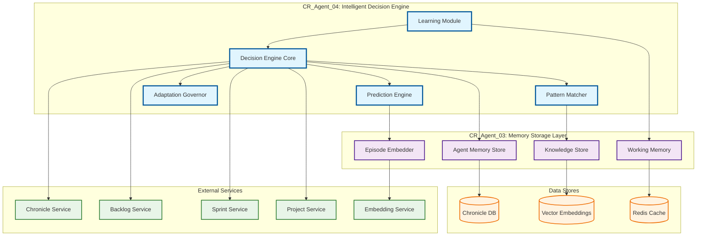
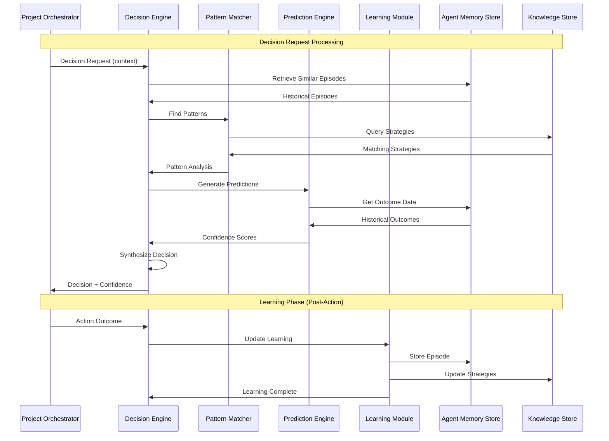
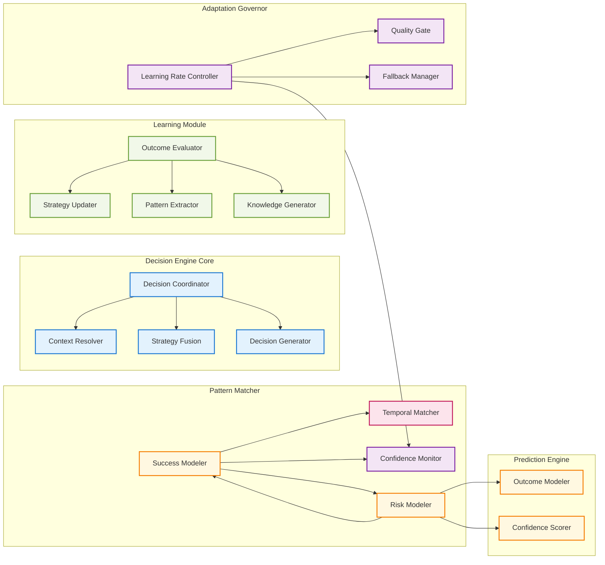

# Change Request: CR_Agent_04 - Intelligent Decision Engine with Adaptive Learning

## Executive Summary

**CR ID:** CR_Agent_04  
**Priority:** High  
**Category:** Enhancement - Intelligent System Evolution  
**Estimated Effort:** 6-8 weeks  
**Dependencies:** CR_Agent_03 (Memory Storage Layer)  

CR_Agent_04 introduces an Intelligent Decision Engine that leverages the memory system established in CR_Agent_03 to enable adaptive learning and decision-making capabilities. This enhancement transforms the project orchestrator from a rule-based system into an intelligent agent that learns from past experiences and continuously improves its decision-making process.

## Business Justification

### Current State Limitations
- **Static Rule-Based Decisions**: Current system relies on hardcoded decision trees
- **No Learning Capability**: Repeated mistakes without adaptation
- **Limited Context Awareness**: Decisions made in isolation without historical context
- **Manual Tuning Required**: Performance optimization requires manual intervention

### Proposed Benefits
- **Adaptive Learning**: System improves performance based on historical outcomes
- **Context-Aware Decisions**: Leverages past episodes for better decision-making
- **Autonomous Optimization**: Self-improving performance without manual intervention
- **Predictive Capabilities**: Proactive identification of potential issues
- **Reduced Manual Oversight**: Intelligent automation reduces operational burden

### ROI Impact
- **Development Velocity**: 25-40% improvement in sprint planning accuracy
- **Resource Optimization**: 30% reduction in over/under-allocated sprints
- **Quality Improvement**: 20% reduction in failed deployments through better risk assessment
- **Operational Efficiency**: 50% reduction in manual decision tuning

## Technical Architecture

### High-Level Architecture



#### Architecture Diagram Explanation

The **High-Level Architecture** diagram illustrates the integration between CR_Agent_04 components and the existing CR_Agent_03 memory system:

**CR_Agent_04 Components (Blue)**:
- **Decision Engine Core**: Central orchestrator that coordinates all decision-making activities
- **Learning Module**: Processes outcomes and adapts strategies based on experience
- **Pattern Matcher**: Identifies similarities between current situations and historical episodes
- **Prediction Engine**: Forecasts outcomes and assesses risks for different decision options
- **Adaptation Governor**: Controls learning processes and ensures system stability

**CR_Agent_03 Integration (Purple)**:
- **Agent Memory Store**: Provides historical episode data for pattern matching and learning
- **Knowledge Store**: Stores and manages learned strategies and patterns
- **Working Memory**: Caches recent decisions and context for fast access
- **Episode Embedder**: Converts episodes to vector embeddings for semantic similarity

**Data Flow**:
1. Decision requests flow through the Decision Engine Core
2. Pattern Matcher queries historical episodes via Agent Memory Store
3. Learning Module updates strategies in Knowledge Store based on outcomes
4. All components leverage the vector embeddings for semantic analysis

### Decision Engine Workflow



#### Workflow Diagram Explanation

The **Decision Engine Workflow** sequence diagram shows the complete decision-making and learning cycle:

**Decision Request Processing Phase**:
1. **Context Gathering**: Project Orchestrator sends decision request with current context
2. **Historical Analysis**: Decision Engine retrieves similar episodes from memory store
3. **Pattern Recognition**: Pattern Matcher identifies relevant strategies and patterns
4. **Prediction Generation**: Prediction Engine assesses likely outcomes and confidence levels
5. **Decision Synthesis**: All inputs are combined to generate final decision with confidence score

**Learning Phase (Post-Action)**:
1. **Outcome Collection**: Actual results are reported back to Decision Engine
2. **Learning Update**: Learning Module processes outcomes to update strategies
3. **Memory Update**: New episode is stored and strategies are refined
4. **Continuous Improvement**: System becomes more accurate with each iteration

**Key Interactions**:
- **Memory Store**: Provides historical context and stores new learning
- **Knowledge Store**: Manages strategy database and receives updates
- **Bidirectional Learning**: Both successful and failed outcomes contribute to learning

### Detailed Component Architecture



#### Detailed Component Architecture Explanation

The **Detailed Component Architecture** diagram breaks down each major module into its constituent components:

**Decision Engine Core (Light Blue)**:
- **Decision Coordinator**: Orchestrates the entire decision-making process
- **Context Resolver**: Extracts relevant context from current situation and historical data
- **Strategy Fusion**: Combines multiple strategies into coherent decision recommendations
- **Decision Generator**: Creates final decisions with confidence metrics and alternatives

**Learning Module (Light Green)**:
- **Outcome Evaluator**: Assesses the quality and success of decisions made
- **Strategy Updater**: Modifies existing strategies based on learning from outcomes
- **Pattern Extractor**: Identifies new patterns from successful and failed episodes
- **Knowledge Generator**: Creates new strategies from discovered patterns

**Pattern Matcher (Pink)**:
- **Similarity Matcher**: Compares current situation to historical episodes using multiple dimensions
- **Temporal Matcher**: Recognizes time-based patterns in project lifecycles
- **Context Matcher**: Evaluates contextual similarity between situations
- **Result Matcher**: Correlates outcomes with situational patterns

**Prediction Engine (Orange)**:
- **Risk Modeler**: Identifies and quantifies potential risks for different decisions
- **Success Modeler**: Predicts probability of success for each decision option
- **Outcome Modeler**: Models expected outcomes with uncertainty quantification
- **Confidence Scorer**: Generates confidence metrics for predictions

**Adaptation Governor (Purple)**:
- **Learning Rate Controller**: Dynamically adjusts learning speed based on performance
- **Quality Gate**: Ensures learning quality and prevents degradation
- **Fallback Manager**: Manages safe fallback to rule-based decisions when needed
- **Confidence Monitor**: Tracks and adjusts confidence thresholds for optimal performance

## Implementation Phases

### Phase 1: Decision Engine Core (Weeks 1-2)
**Objective**: Establish basic intelligent decision-making capability

**Components**:
- **Decision Coordinator**: Central orchestration of decision process
- **Context Resolver**: Extract and process decision context
- **Strategy Fusion**: Combine multiple strategies into coherent decisions
- **Decision Generator**: Generate final decisions with confidence metrics

**Key Features**:
- Integration with existing memory system
- Basic pattern matching for similar historical episodes
- Simple confidence scoring based on historical success rates
- Fallback to rule-based decisions when confidence is low

**Deliverables**:
- `decision_engine_core.py` - Main decision coordination
- `context_resolver.py` - Context extraction and processing
- `strategy_fusion.py` - Multi-strategy combination logic
- `decision_generator.py` - Decision generation with confidence
- Unit tests and integration tests
- Performance benchmarks

### Phase 2: Learning Module (Weeks 2-3)
**Objective**: Enable the system to learn from outcomes and adapt strategies

**Components**:
- **Outcome Evaluator**: Assess the quality of decision outcomes
- **Strategy Updater**: Modify strategies based on learning
- **Pattern Extractor**: Identify new patterns from experience
- **Knowledge Generator**: Create new strategies from patterns

**Key Features**:
- Automated outcome quality assessment
- Strategy confidence adjustment based on results
- New pattern detection from successful/failed episodes
- Dynamic strategy creation and retirement

**Deliverables**:
- `outcome_evaluator.py` - Outcome quality assessment
- `strategy_updater.py` - Strategy evolution logic
- `pattern_extractor.py` - Pattern detection algorithms
- `knowledge_generator.py` - New strategy generation
- Learning performance metrics and monitoring

### Phase 3: Pattern Matcher Enhancement (Weeks 3-4)
**Objective**: Advanced pattern recognition and similarity analysis

**Components**:
- **Similarity Matcher**: Multi-dimensional similarity analysis
- **Temporal Matcher**: Time-series pattern recognition
- **Context Matcher**: Contextual similarity assessment
- **Result Matcher**: Outcome pattern correlation

**Key Features**:
- Vector embeddings for semantic similarity
- Temporal pattern recognition for project lifecycle phases
- Multi-dimensional context comparison
- Outcome correlation analysis for strategy effectiveness

**Deliverables**:
- `similarity_matcher.py` - Advanced similarity algorithms
- `temporal_matcher.py` - Time-series pattern analysis
- `context_matcher.py` - Contextual similarity scoring
- `result_matcher.py` - Outcome correlation analysis
- Pattern matching performance optimization

### Phase 4: Prediction Engine (Weeks 4-5)
**Objective**: Predictive capabilities for proactive decision-making

**Components**:
- **Risk Modeler**: Identify and quantify potential risks
- **Success Modeler**: Predict likelihood of success
- **Outcome Modeler**: Model expected outcomes
- **Confidence Scorer**: Generate prediction confidence metrics

**Key Features**:
- Risk assessment based on historical patterns
- Success probability modeling
- Expected outcome prediction with uncertainty quantification
- Confidence-based decision weighting

**Deliverables**:
- `risk_modeler.py` - Risk assessment algorithms
- `success_modeler.py` - Success probability modeling
- `outcome_modeler.py` - Outcome prediction logic
- `confidence_scorer.py` - Confidence calculation
- Predictive accuracy metrics and validation

### Phase 5: Adaptation Governor (Weeks 5-6)
**Objective**: Intelligent control of learning and adaptation processes

**Components**:
- **Learning Rate Controller**: Dynamic learning rate adjustment
- **Quality Gate**: Ensure learning quality and prevent degradation
- **Fallback Manager**: Safe fallback to rule-based decisions
- **Confidence Monitor**: Monitor and adjust confidence thresholds

**Key Features**:
- Adaptive learning rate based on performance
- Quality gates to prevent negative learning
- Intelligent fallback when confidence is insufficient
- Dynamic confidence threshold adjustment

**Deliverables**:
- `learning_rate_controller.py` - Learning rate adaptation
- `quality_gate.py` - Learning quality assurance
- `fallback_manager.py` - Safe fallback mechanisms
- `confidence_monitor.py` - Confidence tracking and adjustment
- Adaptation performance monitoring

### Phase 6: Integration & Testing (Weeks 6-8)
**Objective**: Full system integration, testing, and performance optimization

**Key Activities**:
- End-to-end integration testing
- Performance optimization and tuning
- Load testing and scalability validation
- Security review and hardening
- Documentation and training materials

**Deliverables**:
- Complete integrated system
- Performance benchmarks and optimization
- Comprehensive test suite
- Security audit report
- Deployment documentation
- Training materials for operations team

## Technical Specifications

### API Design

#### Decision Request Interface
```python
@dataclass
class DecisionRequest:
    project_id: str
    context: Dict[str, Any]
    decision_type: str  # "sprint_planning", "task_assignment", "resource_allocation"
    constraints: Optional[Dict[str, Any]] = None
    override_confidence_threshold: Optional[float] = None

@dataclass
class DecisionResponse:
    decision: Dict[str, Any]
    confidence: float
    reasoning: Dict[str, Any]
    alternatives: List[Dict[str, Any]]
    learning_context: Dict[str, Any]
```

#### Learning Interface
```python
@dataclass
class OutcomeReport:
    episode_id: UUID
    actual_outcome: Dict[str, Any]
    outcome_quality: float  # 0.0 to 1.0
    feedback: Optional[Dict[str, Any]] = None
    timestamp: datetime = field(default_factory=datetime.utcnow)
```

### Configuration Management

```yaml
# decision_engine_config.yaml
decision_engine:
  confidence_threshold: 0.7
  fallback_enabled: true
  learning_enabled: true
  
learning:
  initial_learning_rate: 0.1
  min_learning_rate: 0.01
  max_learning_rate: 0.5
  quality_gate_threshold: 0.6
  
pattern_matching:
  similarity_threshold: 0.8
  max_similar_episodes: 10
  embedding_dimensions: 384
  
prediction:
  risk_threshold: 0.3
  success_threshold: 0.7
  confidence_decay: 0.1
```

### Performance Requirements

| Metric | Target | Measurement |
|--------|---------|-------------|
| Decision Response Time | < 2 seconds | 95th percentile |
| Learning Cycle Time | < 5 seconds | Average per episode |
| Pattern Matching Accuracy | > 85% | Against validated test set |
| Prediction Accuracy | > 80% | Success rate prediction |
| Memory Usage | < 1GB | Peak memory consumption |
| Database Query Performance | < 500ms | 95th percentile |

### Security Considerations

1. **Data Privacy**: Sensitive project information encrypted at rest and in transit
2. **Access Control**: Role-based access to decision engine capabilities
3. **Audit Trail**: Complete logging of all decisions and learning activities
4. **Fallback Security**: Secure fallback to rule-based decisions when learning fails
5. **Model Integrity**: Protection against adversarial learning inputs

## Integration Points

### Memory System Integration (CR_Agent_03)
- **AgentMemoryStore**: Episode storage and retrieval for decision context
- **KnowledgeStore**: Strategy storage and management
- **WorkingMemory**: Real-time decision context caching
- **EpisodeEmbedder**: Semantic similarity for pattern matching

### External Services Integration
- **Chronicle Service**: Historical analytics and outcome tracking
- **Backlog Service**: Task prioritization and estimation
- **Sprint Service**: Sprint planning and resource allocation
- **Project Service**: Project context and constraints

### Monitoring & Observability
- **Decision Metrics**: Response time, confidence scores, accuracy
- **Learning Metrics**: Strategy evolution, pattern discovery rate
- **Performance Metrics**: Resource utilization, query performance
- **Business Metrics**: Sprint success rate, velocity improvement

## Risk Assessment & Mitigation

### High Risks
1. **Learning Divergence**: System learns incorrect patterns
   - **Mitigation**: Quality gates and confidence thresholds
   
2. **Performance Degradation**: Complex decisions impact response time
   - **Mitigation**: Caching, query optimization, fallback mechanisms
   
3. **Data Quality Issues**: Poor quality training data affects learning
   - **Mitigation**: Data validation, outlier detection, manual review processes

### Medium Risks
1. **Integration Complexity**: Complex integration with existing systems
   - **Mitigation**: Phased rollout, comprehensive testing
   
2. **Operational Overhead**: Increased monitoring and maintenance needs
   - **Mitigation**: Automated monitoring, clear operational procedures

### Low Risks
1. **User Adoption**: Resistance to AI-driven decisions
   - **Mitigation**: Transparency in decision-making, gradual transition

## Success Criteria

### Technical Success Metrics
- [ ] Decision engine responds within 2 seconds for 95% of requests
- [ ] Pattern matching achieves >85% accuracy on test dataset
- [ ] Learning module successfully adapts strategies based on outcomes
- [ ] System maintains >99.9% availability during normal operations
- [ ] All security requirements met and validated

### Business Success Metrics
- [ ] 25% improvement in sprint planning accuracy within 3 months
- [ ] 20% reduction in failed deployments within 6 months  
- [ ] 30% reduction in manual decision overrides within 3 months
- [ ] Positive feedback from development teams (>4.0/5.0 satisfaction)
- [ ] ROI positive within 6 months of deployment

## Deployment Strategy

### Environment Progression
1. **Development**: Full feature development and unit testing
2. **Staging**: Integration testing with production-like data
3. **Canary**: Limited production deployment (10% of decisions)
4. **Production**: Full production deployment with monitoring

### Rollback Plan
- Immediate fallback to rule-based decisions if confidence drops below threshold
- Database rollback capabilities for learning model state
- Configuration-based feature flags for rapid disablement
- Automated alerts for performance degradation

## Resource Requirements

### Development Team
- **Tech Lead**: 1.0 FTE - Architecture and technical leadership
- **Senior Engineers**: 2.0 FTE - Core development
- **ML Engineer**: 1.0 FTE - Learning algorithms and optimization
- **QA Engineer**: 0.5 FTE - Testing and validation
- **DevOps Engineer**: 0.5 FTE - Infrastructure and deployment

### Infrastructure
- **Compute**: Additional 4 CPU cores, 8GB RAM for decision engine
- **Storage**: 50GB additional storage for learning models
- **Database**: Enhanced connection pool for increased query load
- **Monitoring**: Extended monitoring for decision metrics

### Timeline
**Total Duration**: 8 weeks  
**Development**: 6 weeks  
**Testing & Integration**: 2 weeks  
**Deployment**: Phased over 4 weeks post-development

## Conclusion

CR_Agent_04 represents a significant evolution of our project orchestration system from rule-based automation to intelligent, adaptive decision-making. By leveraging the memory foundation established in CR_Agent_03, we can create a system that continuously learns and improves, providing substantial business value through improved accuracy, reduced manual oversight, and enhanced operational efficiency.

The phased implementation approach ensures manageable risk while delivering incremental value throughout the development cycle. The comprehensive architecture supports both immediate needs and future extensibility, positioning the system for continued evolution as our understanding of intelligent automation grows.

---

**Document Control**
- **Version**: 1.0
- **Author**: System Architect
- **Review Date**: TBD
- **Approval**: TBD