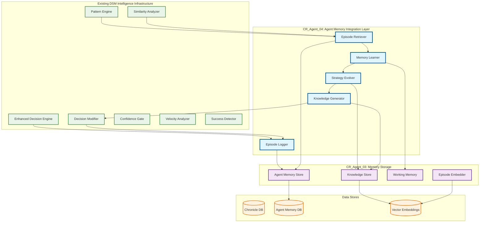
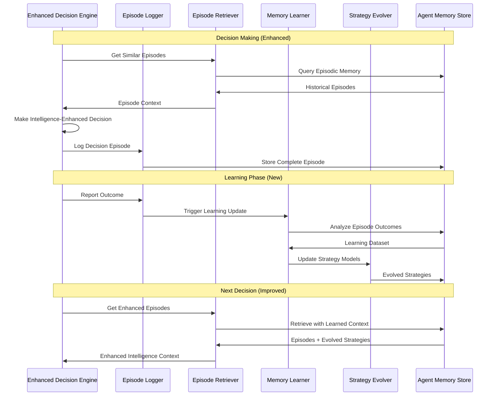
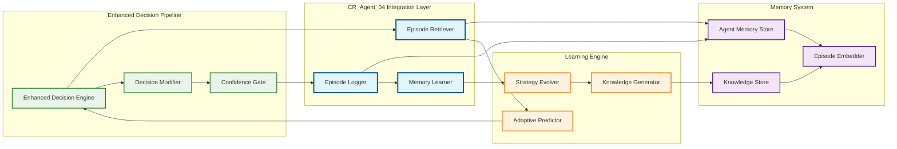
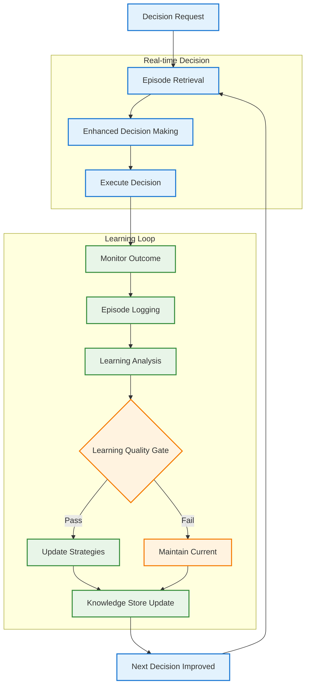

# Change Request: CR_Agent_04 - Agent Memory Integration & Advanced Learning Layer

## Executive Summary

**CR ID:** CR_Agent_04  
**Priority:** High  
**Category:** Enhancement - Agent Memory Integration  
**Estimated Effort:** 3-4 weeks  
**Dependencies:** CR_Agent_03 (Memory Storage Layer), DSM Intelligence Infrastructure v1.0.37  

CR_Agent_04 completes the intelligent agent evolution by integrating the existing CR_Agent_03 memory system with the current DSM intelligence infrastructure. Rather than rebuilding existing capabilities, this CR focuses on the specific gaps that will transform the current pattern-matching system into a true learning agent with episodic memory and adaptive strategy evolution.

## Current State Analysis

### ✅ **Already Implemented in DSM v1.0.37**
- **Intelligence-Driven Decision Engine**: Enhanced decision engine with confidence-based overrides
- **Pattern Matching**: Similarity, velocity, and success analyzers with Chronicle Service integration
- **Decision Modification**: Ability to override rule-based decisions with high-confidence adjustments
- **Confidence Gating**: Safety mechanisms ensuring only reliable intelligence modifications are applied
- **Historical Analysis**: Statistical analysis of past projects for decision enhancement
- **Fallback Mechanisms**: Graceful degradation to rule-based decisions when confidence is low

### 🔲 **Critical Gaps - CR_Agent_04 Focus Areas**
1. **Agent Memory Integration**: `agent_memory` database exists but not integrated with decision pipeline
2. **Episodic Learning**: No structured storage/retrieval of decision episodes for learning
3. **Strategy Evolution**: Pattern recognition exists but doesn't create new strategies
4. **Cross-Project Learning**: Limited to project similarity, no global organizational learning
5. **Adaptive Model Learning**: Statistical analysis vs true ML-based learning and adaptation

## Technical Architecture - Incremental Enhancements

### Integration Architecture



### Learning Workflow Enhancement



## Implementation Focus Areas

### Phase 1: Agent Memory Integration (Week 1)
**Objective**: Connect existing intelligence pipeline with agent memory system

**New Components**:
- **Episode Logger**: Captures complete decision episodes for storage
- **Episode Retriever**: Queries agent memory for decision context
- **Memory Bridge**: Connects DSM intelligence with CR_Agent_03 memory

**Integration Points**:
```python
# Enhanced Decision Engine integration
class EnhancedDecisionEngine:
    def __init__(self):
        # Existing components
        self.pattern_engine = PatternEngine()
        self.decision_modifier = DecisionModifier()
        
        # NEW: Agent Memory integration
        self.episode_logger = EpisodeLogger()
        self.episode_retriever = EpisodeRetriever()
    
    async def make_decision(self, project_context):
        # NEW: Get episodic context
        episodes = await self.episode_retriever.get_similar_episodes(project_context)
        
        # Existing intelligence pipeline
        patterns = await self.pattern_engine.analyze(project_context)
        decision = await self.decision_modifier.generate_decision(patterns, episodes)
        
        # NEW: Log complete episode
        await self.episode_logger.log_episode(project_context, decision, patterns)
        
        return decision
```

**Deliverables**:
- `episode_logger.py` - Episode capture and storage
- `episode_retriever.py` - Memory-based context retrieval
- `memory_bridge.py` - Integration layer
- Updated decision engine with memory integration

### Phase 2: Strategy Evolution Engine (Week 2)
**Objective**: Enable the system to evolve strategies based on outcomes

**New Components**:
- **Strategy Evolver**: Adapts strategies based on episode outcomes
- **Knowledge Generator**: Creates new strategies from successful patterns
- **Learning Optimizer**: Optimizes learning parameters

**Key Features**:
- Strategy confidence adjustment based on actual outcomes
- New strategy generation from successful episode clusters
- Strategy retirement when consistently unsuccessful
- Cross-project strategy transfer

**Implementation Example**:
```python
class StrategyEvolver:
    async def evolve_strategies(self, outcomes_batch):
        for episode in outcomes_batch:
            strategy_id = episode.applied_strategy
            outcome_quality = episode.outcome_quality
            
            # Update strategy confidence
            await self.update_strategy_confidence(strategy_id, outcome_quality)
            
            # Generate new strategies from high-success episodes
            if outcome_quality > 0.85:
                await self.extract_new_strategies(episode)
            
            # Retire consistently poor strategies
            if await self.should_retire_strategy(strategy_id):
                await self.retire_strategy(strategy_id)
```

**Deliverables**:
- `strategy_evolver.py` - Strategy adaptation logic
- `knowledge_generator.py` - New strategy creation
- `learning_optimizer.py` - Learning parameter tuning
- Strategy evolution metrics and monitoring

### Phase 3: Advanced Learning Models (Week 3)
**Objective**: Implement ML-based learning beyond statistical pattern matching

**New Components**:
- **Memory Learner**: ML models for outcome prediction
- **Adaptive Predictor**: Context-aware success prediction
- **Learning Validator**: Validates learning quality

**ML Integration**:
```python
class MemoryLearner:
    def __init__(self):
        self.outcome_predictor = OutcomePredictor()
        self.strategy_recommender = StrategyRecommender()
        self.confidence_calibrator = ConfidenceCalibrator()
    
    async def learn_from_episodes(self, episodes):
        # Train outcome prediction models
        features = self.extract_features(episodes)
        outcomes = self.extract_outcomes(episodes)
        
        await self.outcome_predictor.update(features, outcomes)
        await self.strategy_recommender.update(features, outcomes)
        
        # Calibrate confidence based on actual vs predicted outcomes
        await self.confidence_calibrator.update(episodes)
```

**Deliverables**:
- `memory_learner.py` - ML-based learning engine
- `adaptive_predictor.py` - Advanced prediction models
- `learning_validator.py` - Learning quality assurance
- ML model management and versioning

### Phase 4: Cross-Project Intelligence (Week 4)
**Objective**: Enable global organizational learning across all projects

**New Components**:
- **Global Knowledge Manager**: Cross-project pattern aggregation
- **Organizational Learner**: Team and organizational pattern recognition
- **Intelligence Synthesizer**: Combines project-specific and global intelligence

**Global Learning Features**:
- Team velocity patterns across multiple projects
- Organizational success factors and anti-patterns
- Technology stack performance correlations
- Resource allocation optimization patterns

**Deliverables**:
- `global_knowledge_manager.py` - Cross-project intelligence
- `organizational_learner.py` - Organizational pattern recognition
- `intelligence_synthesizer.py` - Multi-level intelligence combination
- Global intelligence dashboards and metrics

## Enhanced API Specification

### New Memory-Enhanced Response Format
```json
{
  "project_id": "TEST-001",
  "decisions": {
    "decision_source": "memory_enhanced",
    "episodic_context": {
      "similar_episodes_used": 5,
      "episode_confidence": 0.87,
      "learned_strategies_applied": ["velocity_optimization", "team_capacity_adjustment"]
    },
    "strategy_evolution": {
      "new_strategies_discovered": 1,
      "strategies_updated": 2,
      "confidence_improvements": {"task_sizing": 0.12}
    },
    "learning_metadata": {
      "prediction_accuracy": 0.89,
      "learning_confidence": 0.78,
      "organizational_patterns_applied": ["high_performing_teams", "technology_stack_correlation"]
    }
  }
}
```

### New Intelligence Endpoints

#### `GET /orchestrate/memory/episodes/{project_id}`
- **Purpose**: Retrieve stored episodes for a project with learning context
- **Response**: Episodes with evolved strategies and outcome analysis

#### `POST /orchestrate/memory/learn`
- **Purpose**: Trigger learning update from recent outcomes
- **Response**: Learning progress and strategy evolution summary

#### `GET /orchestrate/intelligence/organizational-patterns`
- **Purpose**: Access global organizational learning insights
- **Response**: Cross-project patterns and recommendations

## Success Metrics - Incremental Improvements

### Learning Effectiveness Metrics
- **Episode Storage Rate**: >95% of decisions stored as structured episodes
- **Strategy Evolution Rate**: New strategies generated weekly from successful patterns
- **Prediction Accuracy**: >90% accuracy for outcome predictions within 3 months
- **Cross-Project Learning**: Evidence of knowledge transfer between projects

### Intelligence Enhancement Metrics
- **Decision Quality**: 15-20% improvement in decision outcome scores
- **Learning Speed**: Faster adaptation to new project types and team configurations
- **Strategy Diversity**: Increased variety of successful strategies in knowledge base
- **Global Intelligence**: Organizational patterns contributing to 30%+ of decisions

### Integration Success Metrics
- **Memory Integration**: 100% decision pipeline using agent memory
- **Backward Compatibility**: No disruption to existing intelligence features
- **Performance**: <500ms additional latency for memory operations
- **Reliability**: >99.9% availability during learning operations

## Risk Mitigation - Incremental Approach

### Low-Risk Integration Strategy
1. **Phase-by-Phase Rollout**: Each phase builds incrementally on previous
2. **Feature Flags**: All new capabilities controllable via configuration
3. **Parallel Operation**: New memory features run alongside existing intelligence
4. **Gradual Cutover**: Progressive migration from pattern-matching to memory-based learning

### Technical Safeguards
- **Learning Quality Gates**: Prevent degradation of decision quality during learning
- **Rollback Capabilities**: Ability to disable memory features and revert to current system
- **Performance Monitoring**: Continuous monitoring of latency and resource usage
- **Data Validation**: Comprehensive validation of episode data and learned strategies

## Resource Requirements

### Development Resources
- **Senior Engineer**: 1.0 FTE - Memory integration and learning algorithms
- **ML Engineer**: 0.5 FTE - Advanced learning models and validation
- **Integration Engineer**: 0.5 FTE - DSM system integration and testing

### Infrastructure Enhancement
- **Compute**: Additional 2 CPU cores, 4GB RAM for learning processes
- **Storage**: 20GB additional storage for episode data and models
- **Database**: Enhanced connection pooling for agent_memory database access

### Timeline
**Total Duration**: 4 weeks  
**Development**: 3 weeks  
**Integration & Testing**: 1 week  
**Rollout**: Phased over 2 weeks

## Implementation Architecture Diagrams

### Component Integration Detail



#### Component Integration Explanation

**Enhanced Decision Pipeline Integration (Green)**:
The existing DSM intelligence components (Enhanced Decision Engine, Decision Modifier, Confidence Gate) remain unchanged but gain new integration points with the agent memory system.

**CR_Agent_04 Integration Layer (Blue)**:
- **Episode Logger**: Captures complete decision episodes including context, reasoning, actions, and outcomes
- **Episode Retriever**: Provides memory-based context by querying similar historical episodes
- **Memory Learner**: Orchestrates the learning process from stored episodes

**Learning Engine (Orange)**:
- **Strategy Evolver**: Adapts existing strategies based on outcome feedback
- **Knowledge Generator**: Creates new strategies from successful episode patterns
- **Adaptive Predictor**: ML-based prediction models that improve over time

**Memory System Integration (Purple)**:
The existing CR_Agent_03 memory components are fully integrated into the decision pipeline for the first time.

### Learning Feedback Loop



#### Learning Feedback Loop Explanation

**Real-time Decision Phase**:
1. **Episode Retrieval**: System queries agent memory for similar past episodes
2. **Enhanced Decision Making**: Current DSM intelligence enhanced with episodic context
3. **Execute Decision**: Decision implemented in DSM ecosystem

**Learning Loop Phase**:
1. **Monitor Outcome**: Track actual results of implemented decisions
2. **Episode Logging**: Store complete episode with context and outcome
3. **Learning Analysis**: Analyze patterns and strategy effectiveness
4. **Learning Quality Gate**: Ensure learning improvements meet quality standards
5. **Update Strategies**: Evolve strategies based on successful patterns
6. **Knowledge Store Update**: Persist learned improvements for future decisions

The feedback loop ensures continuous improvement while maintaining system stability through quality gates.

## Conclusion

CR_Agent_04 represents a focused, incremental enhancement that completes the transformation of DSM from pattern-matching to true agent-based learning. By building on the robust intelligence infrastructure already in place, this CR delivers maximum value with minimal risk.

The key innovation is not replacing existing capabilities but integrating them with episodic memory and adaptive learning. This creates a system that not only recognizes patterns but learns from experience, evolves strategies, and improves decision-making across the entire organization.

**Implementation Benefits**:
- **Immediate Value**: Leverages existing intelligence investment
- **Minimal Risk**: Incremental enhancement with rollback capabilities  
- **Maximum Learning**: True adaptive intelligence with memory-based improvement
- **Organizational Scale**: Cross-project knowledge sharing and learning

The result is a genuinely intelligent orchestrator that gets smarter with every decision, transforming from a sophisticated pattern-matcher into a learning agent that drives continuous improvement across all DSM projects.

---

**Document Control**
- **Version**: 2.0 (Revised Focus)
- **Author**: System Architect
- **Based On**: DSM Project Orchestration Service Architecture v1.0.37
- **Review Date**: TBD
- **Approval**: TBD