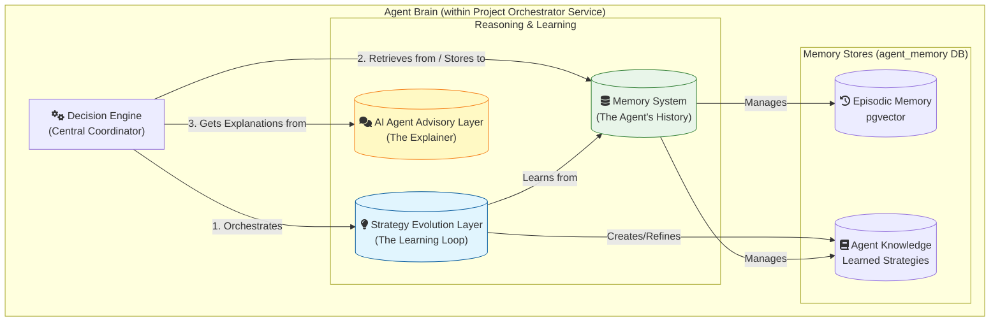
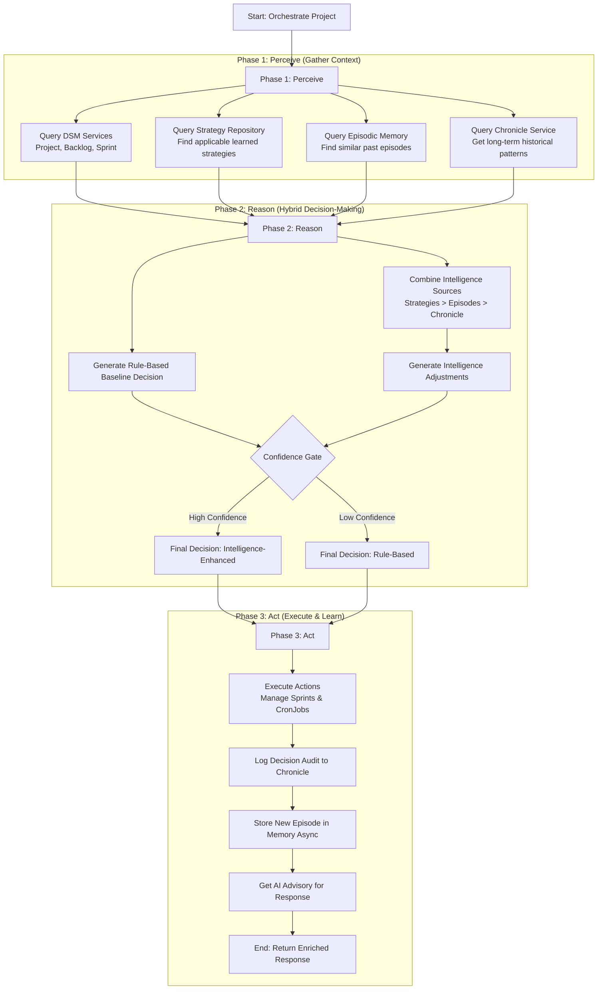

# CR: Agent Architecture Design - The "Brain" of the Orchestrator

## 1. Overview

This document provides a detailed architectural overview of the "Learning Agent" brain that powers the **Project Orchestration Service**. The agent brain represents a significant evolution from a rule-based coordinator to a dynamic, self-improving system capable of learning from experience to optimize project outcomes.

The core objective of this architecture is to create a transparent, auditable, and continuously improving intelligence layer that combines the reliability of codified rules with the adaptability of machine learning and AI. This "brain" enables the orchestrator to perceive its environment, reason based on experience and learned knowledge, and act to achieve its goals, mimicking the decision-making loop of an intelligent agent.

## 2. Architectural Principles

The agent's architecture is founded on four key principles:

1.  **Autonomous Orchestration**: The agent is designed to make decisions autonomously by perceiving the state of the SDLC environment and selecting actions that best achieve project goals.
2.  **Learning from Experience**: The agent's primary directive is to learn. Every decision and its outcome are recorded as an "episode," forming a rich history that the agent uses to extract patterns and generate reusable strategies.
3.  **Decision Transparency**: The agent's reasoning must be fully transparent and auditable. API responses and logs provide a clear trail of the rule-based logic, any intelligence-driven modifications, and the specific strategies or historical episodes that influenced a decision.
4.  **Graceful Augmentation**: AI and learning capabilities are designed as enhancements, not replacements, for the core rule-based logic. The system is built to be resilient, gracefully falling back to safe, deterministic behavior if intelligence components fail or lack sufficient confidence.

## 3. Core Components of the Agent Brain

The agent's brain is not a single monolithic model but a modular system of interconnected components, each with a distinct responsibility.

### 3.1. The Decision Engine
The **Decision Engine** is the central coordinator of the agent's brain. It orchestrates the entire decision-making workflow. Its key feature is a **hybrid intelligence** approach:
1.  It first generates a safe, **rule-based baseline decision**.
2.  It then queries the Memory System and Strategy Evolution Layer for intelligence enhancements.
3.  A **Confidence Gate** evaluates the proposed adjustments, applying them only if they meet strict, evidence-based criteria.
This ensures that every decision is both reliable and adaptive.

### 3.2. The Memory System
The agent's memory is its history of past actions and their outcomes, forming the foundation for all learning. It is composed of two distinct types:
-   **Episodic Memory**: Stores detailed records of every orchestration "episode" (the context, decision, and outcome). It uses the `pgvector` extension to enable powerful semantic search, allowing the agent to find historically similar situations.
-   **Semantic Memory (Agent Knowledge)**: Stores the agent's explicit, learned knowledge in the form of **Strategies**. This is the agent's "playbook" of what has worked in the past, extracted and refined from episodic memory.

For a detailed breakdown, see **[CR_Agent_Memory_System.md](CR_Agent_Memory_System.md)**.

### 3.3. The Strategy Evolution Layer
This is the agent's active learning mechanism. It runs a continuous improvement loop that transforms raw experience (episodic memory) into explicit knowledge (strategies). Its components work together to:
1.  **Extract Patterns** from successfully completed sprints.
2.  **Generate Strategies** from these patterns.
3.  **Store and Version** these strategies in the Agent Knowledge repository.
4.  **Optimize Strategies** over time by analyzing their real-world performance.

For a detailed breakdown, see **[CR_Agent_Strategy_Layer.md](CR_Agent_Strategy_Layer.md)**.

### 3.4. The AI Agent Advisory Layer
This component acts as the agent's "explainer." It uses a local Large Language Model (LLM) to translate the technical details of an orchestration decision into a human-readable, natural language summary. It provides:
-   A plain-English summary of the decision and its reasoning.
-   Actionable recommendations.
-   A high-level risk assessment.

This layer is crucial for **Decision Transparency**, making the agent's thought process accessible to all stakeholders, not just engineers.

## 4. Decision-Making Workflow: Perceive, Reason, Act

The agent's brain follows a classic intelligent agent loop, which has been enhanced with the new learning and memory components.

1.  **Perceive**: The agent gathers a complete "world model" of the project's state. This now includes not just real-time data from other services, but also its own internal context from the **Strategy Repository** and **Episodic Memory**.

2.  **Reason**: This is the core of the agent's intelligence. The **Pattern Engine** performs a hybrid analysis, prioritizing intelligence sources in order of reliability:
    1.  **Learned Strategies**: High-confidence, pre-validated plays are considered first.
    2.  **Episodic Memory**: Direct past experience is consulted next.
    3.  **Chronicle Patterns**: Long-term statistical data is used for broader context.
    The `Decision Modifier` proposes adjustments to the baseline, but the `Confidence Gate` ensures only high-quality, evidence-backed changes are applied.

3.  **Act**: The agent executes the final decision. Critically, this phase now closes the learning loop. The entire decision process—context, reasoning, actions, and eventual outcome—is packaged and stored asynchronously as a new **episode** in the agent's memory, ensuring it learns from every action it takes.

## 5. Integration with DSM Ecosystem

The agent brain is encapsulated within the **Project Orchestration Service**. It acts as the central intelligence hub, consuming data from all other DSM services and using its reasoning capabilities to direct their actions, primarily through API calls to the Sprint Service. Its interactions are designed to be resilient, with circuit breakers and graceful fallbacks to ensure the stability of the entire ecosystem.

## 6. Related Documentation

-   **[CR_Agent_Memory_System.md](CR_Agent_Memory_System.md)**: A deep dive into the agent's episodic memory and use of pgvector.
-   **[CR_Agent_Strategy_Layer.md](CR_Agent_Strategy_Layer.md)**: A detailed look at the strategy learning and evolution implementation.
-   **[DSM_Project_Orchestration_Service_Architecture.md](DSM_Project_Orchestration_Service_Architecture.md)**: The master architecture document for the service that houses the agent brain.
-   **[CR_Agent_05_AI_Decision_Advisor.md](crs/CR_Agent_05_AI_Decision_Advisor.md)**: Details the implementation of the natural language explanation layer.
-   **[CR_Agent_06_Strategy_Evolution.md](crs/CR_Agent_06_Strategy_Evolution.md)**: The original change request for the strategy evolution layer.
