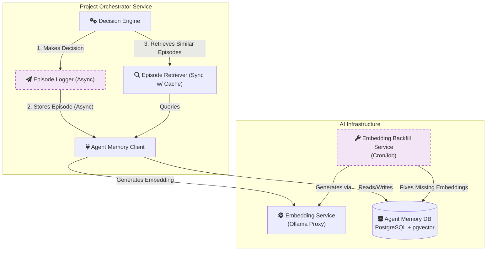

# CR: Agent Memory System - Episodic Memory with pgvector

## 1. Overview

This document provides a detailed technical specification for the **Agent Memory System**, a foundational component of the Project Orchestration Service's "brain." The memory system's primary purpose is to provide the agent with a persistent, long-term memory of its past actions, the context in which they were made, and their ultimate outcomes.

This is achieved by storing "episodes" for every orchestration decision. By leveraging **vector embeddings** and the `pgvector` extension for PostgreSQL, this episodic memory is not just a static log but a dynamic, searchable knowledge base. It allows the agent to perform powerful **semantic searches** to find historical situations that are conceptually similar to its current problem, forming the basis for all advanced learning and reasoning capabilities.

## 2. Architecture and Components

The Agent Memory System is a collection of services and infrastructure components that work together to handle the storage, retrieval, and vectorization of episodes.



### 2.1. Core Components

-   **`agent_memory` Database**: A dedicated PostgreSQL database that serves as the agent's long-term memory store. It is enabled with the `pgvector` extension, which adds the `vector` data type and the ability to perform efficient similarity searches.

-   **Embedding Service**: A lightweight microservice that acts as a proxy to the local Ollama LLM server. Its sole responsibility is to convert chunks of text into high-dimensional vector embeddings. This decouples the main orchestrator from the specifics of the embedding model.

-   **Agent Memory Client**: A client library within the orchestrator that provides a unified interface for all memory operations. It handles database connection pooling, orchestrates calls to the Embedding Service, and exposes simple methods for storing and retrieving episodes.

-   **Episode Logger**: A component responsible for the **asynchronous** storage of new episodes. After the orchestrator makes a decision, it hands the episode off to the logger, which processes it in the background. This ensures that the process of recording memories never blocks or delays the primary orchestration workflow.

-   **Episode Retriever**: A component responsible for the **synchronous** retrieval of historical episodes during the decision-making process. It queries the `agent_memory` database using vector similarity search to find the most relevant past experiences. It includes a cache to speed up repeated queries.

-   **Embedding Backfill Service**: A resilient, scheduled Kubernetes CronJob that periodically scans the database for episodes that may have failed embedding generation (e.g., due to a temporary outage of the Embedding Service). It re-processes these episodes to ensure the memory stays complete.

## 3. Memory Types

The system primarily implements episodic memory, but the underlying database also supports semantic memory.

### 3.1. Episodic Memory
This is the core of the memory system. An "episode" is a comprehensive record of a single orchestration cycle. It captures:
-   **The Context**: The state of the project at the time of the decision.
-   **The Decision**: The final, reasoned decision made by the agent.
-   **The Actions**: The concrete steps taken (e.g., "created sprint S03 with 6 tasks").
-   **The Outcome**: The result of the actions (e.g., sprint completion rate, velocity change).

The textual components of an episode are converted into a single **vector embedding**. This vector represents the episode's semantic meaning in a high-dimensional space, allowing the agent to find similar past episodes by searching for the nearest vectors.

### 3.2. Semantic Memory (Agent Knowledge)
While the focus of this system is episodic memory, the `agent_knowledge` table in the same database is used to store the agent's explicit, learned knowledge in the form of **Strategies**. This is the agent's "playbook" of what it has learned from analyzing patterns across many episodes. For more details, see **[CR_Agent_Strategy_Layer.md](CR_Agent_Strategy_Layer.md)**.

## 4. Data Flow

The flows for writing to and reading from memory are intentionally separated to optimize for performance and reliability.

### 4.1. Episode Storage (Asynchronous)
Storing a memory is a non-critical background task.

1.  The Decision Engine completes its "Act" phase.
2.  It passes the complete episode context to the **Episode Logger**.
3.  The Logger calls the **Agent Memory Client**, which first sends the episode's text to the **Embedding Service** to get a vector.
4.  The client then stores the full episode, including the new vector, in the `agent_episodes` table.
5.  If embedding generation fails, the episode is stored without a vector and flagged for later processing by the **Embedding Backfill Service**.

### 4.2. Episode Retrieval (Synchronous)
Reading from memory is a critical part of the real-time decision-making process.

1.  The Decision Engine begins its "Reason" phase.
2.  It calls the **Episode Retriever** with the current project's context.
3.  The Retriever first checks its local cache for similar recent queries.
4.  On a cache miss, it uses the **Agent Memory Client** to:
    a. Convert the current context into a search vector using the **Embedding Service**.
    b. Query the `agent_episodes` table to find the "k-nearest neighbors" to that search vector, retrieving the most similar past episodes.
5.  The retrieved episodes are returned to the Decision Engine to inform its reasoning.

## 5. Data Model

The `agent_episodes` table is the core of the episodic memory system.

-   **Schema**:
    ```sql
    CREATE TABLE agent_episodes (
      episode_id UUID PRIMARY KEY DEFAULT gen_random_uuid(),
      project_id VARCHAR(50) NOT NULL,
      created_at TIMESTAMP NOT NULL DEFAULT NOW(),
      decision_context JSONB, -- Snapshot of project state, historical patterns, etc.
      decision_and_actions JSONB, -- The final decision, adjustments, and actions taken
      outcome JSONB, -- The eventual outcome of the sprint/actions
      outcome_quality FLOAT, -- A numeric score (0.0 to 1.0) of the outcome's success
      embedding VECTOR(1024), -- Semantic representation of the episode
      requires_embedding BOOLEAN DEFAULT FALSE -- Flag for the backfill service
    );

    -- Index for efficient vector similarity search
    CREATE INDEX ON agent_episodes USING hnsw (embedding vector_l2_ops);
    ```

## 6. Foundational Infrastructure

The reliability of the memory system depends on a solid infrastructure foundation, as implemented in `CR_Agent_04_01`. Key elements include:

-   **Production-Grade Connection Pooling**: The Agent Memory Client uses an asynchronous connection pool to manage connections to the `agent_memory` database efficiently and prevent exhaustion under load.
-   **Comprehensive Monitoring**: All memory components are instrumented with Prometheus metrics (e.g., `embedding_generation_latency`, `db_pool_size`), which are visualized on a dedicated Grafana dashboard.
-   **Resilience Patterns**: The client's interaction with the Embedding Service is protected by a **Circuit Breaker**, preventing cascading failures if the service becomes unavailable.
-   **Feature Flags**: All memory-related capabilities are controlled by feature flags, allowing for safe, gradual rollouts and the ability to disable features in production without a redeployment.

## 7. Conclusion

The Agent Memory System is the foundational component that enables the Project Orchestrator to learn. By providing a robust and efficient mechanism for storing and retrieving past experiences, it transforms the agent from a stateless processor into a stateful, learning entity. The use of vector embeddings for semantic search is a critical technical choice that allows the agent to reason about its history in a nuanced, context-aware manner, setting the stage for all subsequent strategy evolution and intelligent decision-making.
