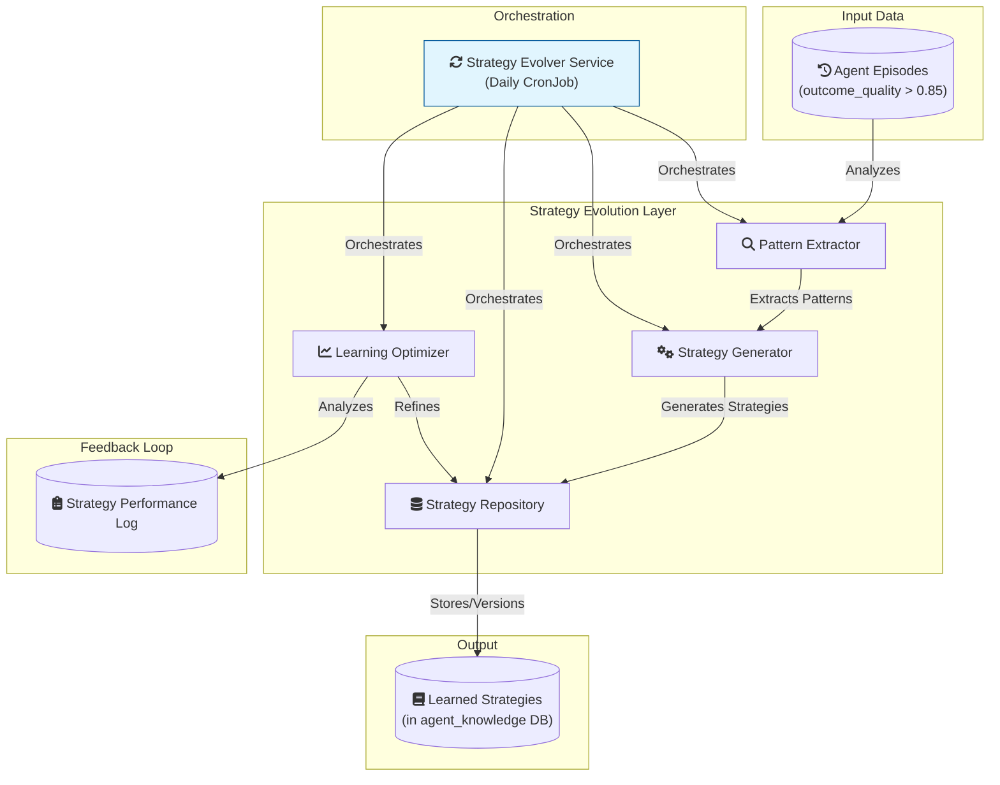
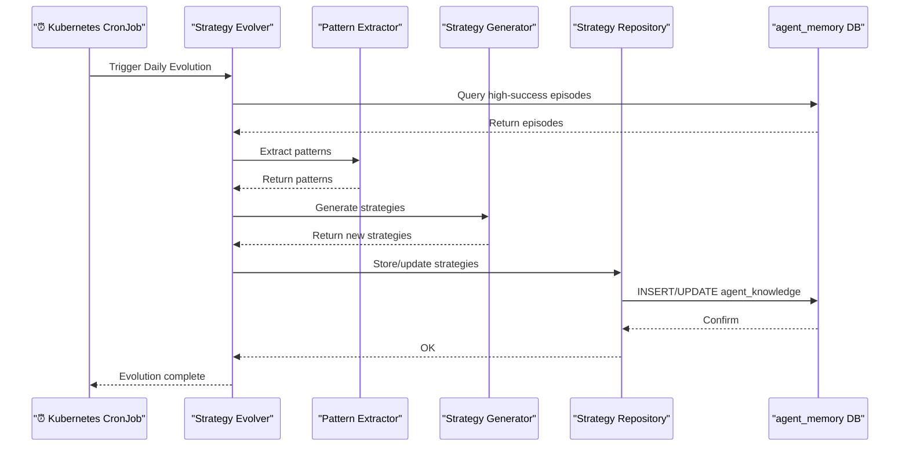
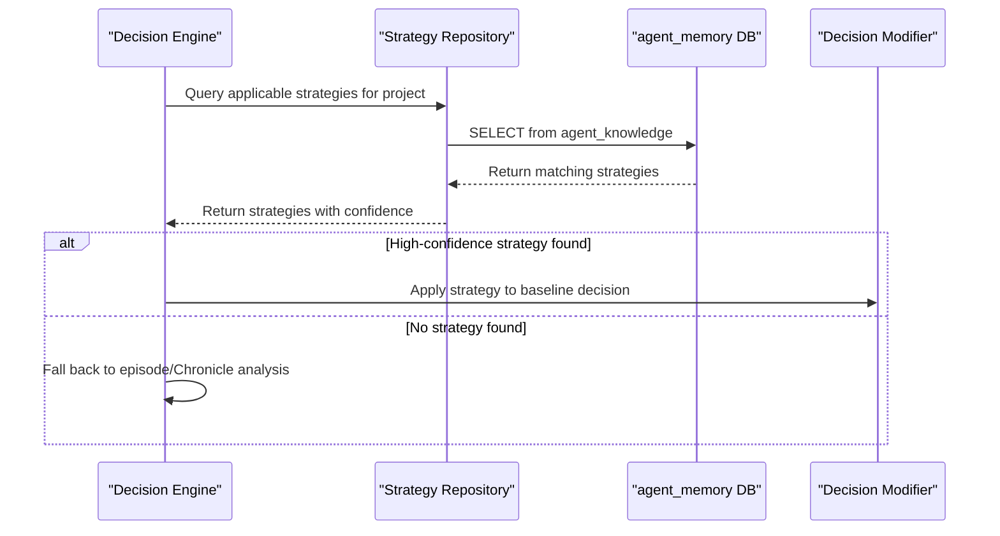

# CR: Agent Strategy Layer - Learning from Experience

## 1. Overview

This document provides a detailed technical specification for the **Strategy Evolution Layer** within the Project Orchestration Service's agent brain. This layer's primary function is to transform the agent from a system that merely recognizes historical patterns into a true learning agent that can **codify successful experiences into explicit, reusable strategies**.

The introduction of this layer enables the orchestrator to move beyond single-use pattern analysis. It establishes a continuous improvement loop where the agent analyzes its successes, generates a "playbook" of what works, and refines that playbook over time based on the real-world outcomes of its decisions. This represents a significant step towards creating a more efficient, adaptive, and intelligent automation system.

## 2. Architecture and Components

The Strategy Evolution Layer is a modular system that orchestrates the entire lifecycle of a strategy, from creation to optimization.



### 2.1. Core Components

-   **Pattern Extractor**: This service is the starting point of the learning process. It queries the `agent_episodes` database for high-quality outcomes (e.g., sprints with `outcome_quality > 0.85`). It then applies statistical analysis to identify common patterns in the decision context (like team size, velocity trends) that consistently lead to success.

-   **Strategy Generator**: Once a statistically significant pattern is identified, this service translates it into a formal, reusable **Strategy object**. This object contains a clear name, a description, specific applicability conditions, a recommended action (e.g., "reduce task count by 25%"), and an initial confidence score based on the strength of the evidence.

-   **Strategy Repository**: This component is responsible for the persistence and management of all learned strategies. It uses the `agent_knowledge` table as a versioned repository, providing CRUD operations, and enabling other services to query for applicable strategies based on a given project context.

-   **Learning Optimizer**: This service closes the continuous improvement loop. It monitors the `strategy_performance_log` to see how well strategies are performing in the real world. Based on this data, it periodically updates the confidence scores of strategies—increasing them for successful outcomes and decreasing or deprecating them for failures.

-   **Strategy Evolver Service**: This is the orchestrator for the entire layer. It is typically run as a daily Kubernetes CronJob. It coordinates the workflow: fetching recent successful episodes, passing them to the Pattern Extractor, feeding the results to the Strategy Generator, storing the output via the Strategy Repository, and finally, triggering the Learning Optimizer to refine all existing strategies.

## 3. Workflow

The layer operates in two distinct modes: an asynchronous evolution mode for learning and a synchronous application mode for decision-making.

### 3.1. Strategy Evolution Workflow (Asynchronous)

This workflow runs daily to generate and refine strategies without impacting real-time orchestration requests.



### 3.2. Strategy Application Workflow (Synchronous)

During a project orchestration request, the Decision Engine queries the Strategy Repository to see if any learned strategies apply.



## 4. Data Models

The Strategy Layer introduces one new table and utilizes the existing `agent_knowledge` table.

### 4.1. `agent_knowledge` Table (Strategy Storage)

-   **Purpose**: Stores the versioned, canonical representation of all learned strategies.
-   **Key Fields**:
    -   `knowledge_type`: Set to `'learned_strategy'`.
    -   `title`: The human-readable name of the strategy (e.g., "Reduce Tasks for Declining Velocity").
    -   `metadata`: A JSONB field containing the full strategy definition, including applicability rules, recommended actions, confidence, and performance metrics.
    -   `confidence_score`: A numeric representation of the strategy's reliability, which is tuned by the Learning Optimizer.

### 4.2. `strategy_performance_log` Table

-   **Purpose**: Creates a detailed, immutable audit trail of every time a strategy is applied, linking the decision to its eventual outcome. This log is the data source for the Learning Optimizer.
-   **Schema**:
    ```sql
    CREATE TABLE strategy_performance_log (
      id UUID PRIMARY KEY DEFAULT gen_random_uuid(),
      strategy_id UUID NOT NULL REFERENCES agent_knowledge(id),
      project_id VARCHAR(50) NOT NULL,
      sprint_id VARCHAR(100),
      applied_at TIMESTAMP NOT NULL DEFAULT NOW(),
      decision_context JSONB, -- The state of the project when the strategy was applied
      outcome VARCHAR(20), -- 'success', 'failure', 'partial'
      outcome_metrics JSONB, -- e.g., completion_rate, velocity_change
      improvement_score DECIMAL(3,2), -- A measure of how much the outcome improved
      created_at TIMESTAMP DEFAULT NOW()
    );
    ```

## 5. API Specification

To provide visibility and control over the learning process, the Strategy Layer exposes several new API endpoints.

### 5.1. New Endpoints

-   **`GET /orchestrate/intelligence/strategies`**: Retrieves a list of all learned strategies, with options to filter by context or confidence.
-   **`POST /orchestrate/intelligence/strategies/evolve`**: Manually triggers the strategy evolution process for testing and debugging.
-   **`GET /orchestrate/intelligence/strategies/{strategy_id}/performance`**: Fetches the detailed performance history for a specific strategy from the `strategy_performance_log`.

### 5.2. Modified Endpoint Responses

The main orchestration endpoint is enriched with a `strategy_context` block when a strategy is used, ensuring transparency.

-   **`POST /orchestrate/project/{project_id}`**:
    ```json
    {
      "decision_source": "strategy_enhanced",
      "strategy_context": {
        "strategies_evaluated": 3,
        "strategies_applied": 1,
        "best_match_strategy": {
          "id": "uuid-123",
          "name": "Reduce Tasks for Declining Velocity",
          "confidence": 0.87,
          "applicability_score": 0.92
        }
      }
    }
    ```

## 6. Conclusion

The Strategy Evolution Layer is the cornerstone of the agent's ability to learn and improve. It provides a robust, automated framework for transforming raw experience into explicit, actionable knowledge. This enables the orchestration service to become more efficient and effective over time, delivering better project outcomes by systematically learning from its own operational history.
