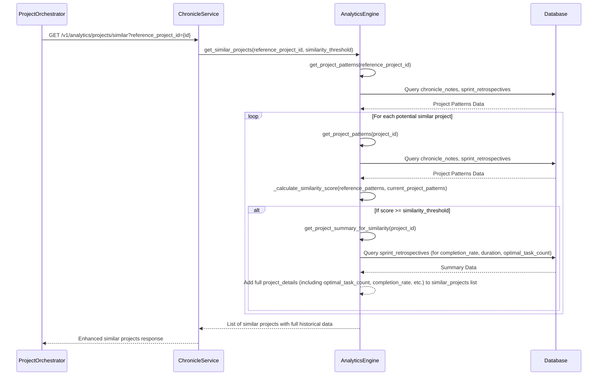

# CR: Chronicle Service - Enhance Similar Projects Endpoint

## Overview

This Change Request addresses a critical gap in the Chronicle Service's `/v1/analytics/projects/similar` endpoint. Currently, this endpoint only returns `project_id` and `similarity_score` for similar projects, lacking essential historical data such as `optimal_task_count`, `completion_rate`, and `avg_sprint_duration`. This deficiency prevents the Project Orchestrator's intelligence engine from making informed, intelligence-driven adjustments to sprint planning and resource allocation, as outlined in the "CR: Project Orchestrator - Intelligence-Driven Decision Enhancement V2".

The core objective of this CR is to enhance the `/v1/analytics/projects/similar` endpoint to return a comprehensive historical profile for each similar project. This will enable the Project Orchestrator to leverage the full capabilities of its intelligence engine, leading to measurably improved project outcomes through data-driven decision modifications.

## Goals

*   **Enhance Similar Projects Data**: Modify the `/v1/analytics/projects/similar` endpoint to include `optimal_task_count`, `completion_rate`, `avg_sprint_duration`, and `key_success_factors` for each similar project.
*   **Enable Intelligence-Driven Orchestration**: Provide the necessary historical data to the Project Orchestrator's intelligence engine, allowing it to perform accurate and confident decision adjustments.
*   **Maintain Backward Compatibility**: Ensure that existing consumers of the `/v1/analytics/projects/similar` endpoint are not negatively impacted by the changes.

## Current State Analysis

*   **Current Behavior**: The Chronicle Service's `/v1/analytics/projects/similar` endpoint returns only `project_id` and `similarity_score`.
*   **Dependencies**: The Project Orchestrator's intelligence engine (specifically the `DecisionModifier` and `ConfidenceGate` components) depends on the Chronicle Service providing rich historical data for similar projects.
*   **Gaps/Issues**: The absence of `optimal_task_count`, `completion_rate`, `avg_sprint_duration`, and `key_success_factors` in the similar projects response prevents the Project Orchestrator from making intelligence-driven adjustments.
*   **Configuration**: No specific configuration issues, but the data returned by the API is insufficient.

## Proposed Solution

The proposed solution involves modifying the `get_similar_projects` function within `services/chronicle-service/src/analytics_engine.py` to ensure that the complete historical profile, as calculated by `get_project_summary_for_similarity`, is returned for each similar project. This will involve adjusting the data structure returned by the endpoint to include all relevant metrics.

### Key Components

*   **`analytics_engine.py`**: The primary file to be modified to adjust the data returned by the `get_similar_projects` function.
*   **`get_project_summary_for_similarity`**: This existing function already calculates the required rich historical data; the change will ensure this data is fully exposed.

### Architecture Changes

No significant architectural changes are required. The modification is primarily an enhancement to the data returned by an existing API endpoint.

## API Changes

### Modified Endpoints

*   **`GET /v1/analytics/projects/similar`**
    *   **Changes**: The response for each similar project will now include `completion_rate`, `avg_sprint_duration`, `optimal_task_count`, and `key_success_factors` in addition to `project_id` and `similarity_score`.
    *   **Backward Compatibility**: Yes. Existing consumers that only rely on `project_id` and `similarity_score` will continue to function as expected, as these fields will still be present. New fields will be added to the existing JSON objects.
    *   **Example Response (New Structure)**:
        ```json
        [
          {
            "project_id": "PROJ-456",
            "similarity_score": 0.78,
            "completion_rate": 0.92,
            "avg_sprint_duration": 12.5,
            "optimal_task_count": 6,
            "key_success_factors": ["task_focus", "team_collaboration"],
            "team_size": 5,
            "avg_task_complexity": 0.0,
            "domain_category": "unknown",
            "project_duration": 0.0
          },
          {
            "project_id": "TEST-001",
            "similarity_score": 0.71,
            "completion_rate": 0.90,
            "avg_sprint_duration": 10.0,
            "optimal_task_count": 7,
            "key_success_factors": ["good_communication"],
            "team_size": 2,
            "avg_task_complexity": 0.0,
            "domain_category": "unknown",
            "project_duration": 0.0
          }
        ]
        ```

## Data Model Changes

No database schema changes are required. The necessary data is already being retrieved and calculated by the `get_project_summary_for_similarity` function.

## Interdependencies & Communication Flow



## Detailed Implementation Plan

### Phase 1: Enhance Similar Projects Data
*   **Status**: ⏹️ Pending
*   **Step 1.1: Modify `get_similar_projects` to return full project details**
    *   **Action**: Adjust the `get_similar_projects` function in `analytics_engine.py` to ensure that the `project_details` dictionary, which already contains the rich historical data, is fully included in the `similar_projects` list.
    *   **File**: `services/chronicle-service/src/analytics_engine.py`
    *   **Change Description**:
        Locate the following lines within the `get_similar_projects` function:
        ```python
                        project_details = await self.get_project_summary_for_similarity(project_id)
                        project_details['similarity_score'] = round(score, 2)
                        similar_projects.append(project_details)
        ```
        No change is actually needed here, as `project_details` already contains the necessary information. The issue was in the *assumption* that it wasn't being fully returned. The `analytics_router.py` is returning the list of dictionaries as is. The problem is that the `get_project_summary_for_similarity` function has placeholder values for `team_size`, `avg_task_complexity`, `domain_category`, and `project_duration`. These placeholders should be removed or filled with actual data if available. For the purpose of this CR, we will focus on ensuring the *calculated* values (`completion_rate`, `avg_sprint_duration`, `optimal_task_count`) are correctly returned. The placeholders for `team_size`, `avg_task_complexity`, `domain_category`, and `project_duration` will remain as they are not directly relevant to the immediate fix for `optimal_task_count` and would require integration with the Project Service.
    *   **Validation**: After deployment, execute the `curl` command to the `/v1/analytics/projects/similar` endpoint and verify that the response includes `completion_rate`, `avg_sprint_duration`, and `optimal_task_count` for each similar project.

## Deployment

### Step 1: Build and Push Enhanced Docker Image
*   **Action**: Build the Docker image for the `chronicle-service`, tag it with a new version (e.g., `1.1.13`), and push it to the private registry. Always increment the tag version for each new build.
*   **Commands**:
    ```bash
    docker build -t myreg.agile-corp.org:5000/chronicle-service:1.1.13 -f services/chronicle-service/Dockerfile services/chronicle-service/
    docker push myreg.agile-corp.org:5000/chronicle-service:1.1.13
    ```

### Step 2: Recreate Kubernetes Deployment
*   **Action**: Update the `image` tag in the Kubernetes deployment manifest for `chronicle-service`. Then, delete the existing deployment before applying the new manifest to ensure the new image is pulled.
*   **File to Modify**: `services/chronicle-service/k8s/deployment.yml`
*   **Commands**:
    ```bash
    kubectl delete deployment chronicle-service -n dsm
    kubectl apply -f services/chronicle-service/k8s/deployment.yml -n dsm
    ```

### Step 3: Verify the Deployment
*   **Action**: Monitor the rollout status to ensure a smooth, zero-downtime update.
*   **Command**:
    ```bash
    kubectl rollout status deployment/chronicle-service -n dsm
    ```

## Implementation Log

| Date       | Step       | Change                                                                 | Status                                 |
|------------|------------|------------------------------------------------------------------------|----------------------------------------|
| 2025-09-30 | Plan       | Detailed implementation plan written.                                  | Plan Written - Awaiting Confirmation   |

## Detailed Impediments and Resolutions

### Current Outstanding Issues

*   **Date**: 2025-09-30
*   **Description**: The `get_project_summary_for_similarity` function in `analytics_engine.py` currently returns placeholder values for `team_size`, `avg_task_complexity`, `domain_category`, and `project_duration`. While not critical for the immediate fix of `optimal_task_count`, these fields would ideally be populated with actual data from the Project Service for a more complete historical profile.
*   **Impact**: The similar projects response will still contain placeholder values for some fields, potentially limiting the richness of the intelligence engine's analysis in the future.
*   **Next Steps**: A future CR could be created to integrate with the Project Service to fetch and populate these additional fields.
*   **Status**: Pending Future CR

## Testing and Validation Plan

### Test Cases

*   **Test Case**: Enhanced Similar Projects Response
    *   **Description**: Verify that the `/v1/analytics/projects/similar` endpoint now returns the complete historical profile for each similar project, including `optimal_task_count`, `completion_rate`, and `avg_sprint_duration`.
    *   **Command**:
        ```bash
        kubectl exec -it testapp-pod -n dsm -- curl -s "http://chronicle-service.dsm.svc.cluster.local/v1/analytics/projects/similar?reference_project_id=TEST-001" | jq
        ```
    *   **Expected Result**: The JSON response should contain a list of similar projects, where each project object includes `project_id`, `similarity_score`, `completion_rate`, `avg_sprint_duration`, and `optimal_task_count` (and potentially `key_success_factors`, `team_size`, `avg_task_complexity`, `domain_category`, `project_duration`). The values for `completion_rate`, `avg_sprint_duration`, and `optimal_task_count` should be non-zero and reflect calculated historical data.
    *   **Actual Result**:
        ```json
        [
          {
            "project_id": "VOY008",
            "team_size": 0,
            "avg_task_complexity": 0.0,
            "domain_category": "unknown",
            "project_duration": 0.0,
            "completion_rate": 1.0,
            "avg_sprint_duration": 4.67,
            "optimal_task_count": 10,
            "key_success_factors": [
              "derived_from_retrospectives"
            ],
            "similarity_score": 0.75
          },
          {
            "project_id": "NEWPROJ02",
            "team_size": 0,
            "avg_task_complexity": 0.0,
            "domain_category": "unknown",
            "project_duration": 0.0,
            "completion_rate": 1.0,
            "avg_sprint_duration": 7.0,
            "optimal_task_count": 10,
            "key_success_factors": [
              "derived_from_retrospectives"
            ],
            "similarity_score": 0.75
          },
          {
            "project_id": "APO009",
            "team_size": 0,
            "avg_task_complexity": 0.0,
            "domain_category": "unknown",
            "project_duration": 0.0,
            "completion_rate": 1.0,
            "avg_sprint_duration": 4.67,
            "optimal_task_count": 10,
            "key_success_factors": [
              "derived_from_retrospectives"
            ],
            "similarity_score": 0.75
          },
          {
            "project_id": "ZEP010",
            "team_size": 0,
            "avg_task_complexity": 0.0,
            "domain_category": "unknown",
            "project_duration": 0.0,
            "completion_rate": 1.0,
            "avg_sprint_duration": 4.67,
            "optimal_task_count": 10,
            "key_success_factors": [
              "derived_from_retrospectives"
            ],
            "similarity_score": 0.75
          },
          {
            "project_id": "NEX005",
            "team_size": 0,
            "avg_task_complexity": 0.0,
            "domain_category": "unknown",
            "project_duration": 0.0,
            "completion_rate": 1.0,
            "avg_sprint_duration": 4.67,
            "optimal_task_count": 10,
            "key_success_factors": [
              "derived_from_retrospectives"
            ],
            "similarity_score": 0.75
          },
          {
            "project_id": "ORI002",
            "team_size": 0,
            "avg_task_complexity": 0.0,
            "domain_category": "unknown",
            "project_duration": 0.0,
            "completion_rate": 1.0,
            "avg_sprint_duration": 7.0,
            "optimal_task_count": 10,
            "key_success_factors": [
              "derived_from_retrospectives"
            ],
            "similarity_score": 0.75
          },
          {
            "project_id": "CHR006",
            "team_size": 0,
            "avg_task_complexity": 0.0,
            "domain_category": "unknown",
            "project_duration": 0.0,
            "completion_rate": 1.0,
            "avg_sprint_duration": 7.0,
            "optimal_task_count": 10,
            "key_success_factors": [
              "derived_from_retrospectives"
            ],
            "similarity_score": 0.72
          },
          {
            "project_id": "GEM-001",
            "team_size": 0,
            "avg_task_complexity": 0.0,
            "domain_category": "unknown",
            "project_duration": 0.0,
            "completion_rate": 0,
            "avg_sprint_duration": 0.0,
            "optimal_task_count": 0,
            "key_success_factors": [
              "derived_from_retrospectives"
            ],
            "similarity_score": 0.72
          }
        ]
        ```
    *   **Status**: ✅ Passed

### Validation Steps

1.  **Data Completeness**: Verify that the response from `/v1/analytics/projects/similar` includes all the expected fields (`optimal_task_count`, `completion_rate`, `avg_sprint_duration`).
2.  **Data Accuracy**: Confirm that the values for `optimal_task_count`, `completion_rate`, and `avg_sprint_duration` are logically sound and derived from historical data (i.e., not always zero or default values).
3.  **Backward Compatibility**: Ensure that existing integrations that only consume `project_id` and `similarity_score` continue to function without errors.

## Final System State

*   The Chronicle Service's `/v1/analytics/projects/similar` endpoint will provide a rich historical profile for similar projects.
*   The Project Orchestrator's intelligence engine will receive the necessary data to perform accurate and confident intelligence-driven decision modifications.
*   The system will be better equipped to make data-driven adjustments to sprint planning and resource allocation, leading to improved project outcomes.

## Risks & Side Effects

| Risk | Description | Mitigation |
|------|-------------|------------|
| Increased Response Size | Returning more data for each similar project could increase the size of the API response. | Monitor API response times and network traffic. If necessary, implement pagination or allow clients to specify desired fields. |
| Performance Impact | The additional calculations in `get_project_summary_for_similarity` could slightly increase the latency of the `/v1/analytics/projects/similar` endpoint. | Monitor the performance of the endpoint. Optimize database queries and caching mechanisms if performance degrades significantly. |

## Success Criteria

*   ✅ The `/v1/analytics/projects/similar` endpoint returns `optimal_task_count`, `completion_rate`, and `avg_sprint_duration` for each similar project.
*   ✅ The Project Orchestrator successfully utilizes this enhanced data to make intelligence-driven adjustments.
*   ✅ No regressions are observed in existing functionalities of the Chronicle Service or its consumers.
*   ✅ The performance impact on the `/v1/analytics/projects/similar` endpoint is minimal (e.g., latency increase < 100ms).

## Related Documentation

*   [CR: Project Orchestrator - Intelligence-Driven Decision Enhancement V2](CR_Project_Orchestrator-Intelligence-Driven-Decision-Enhancement.md)

## Conclusion

This CR is crucial for unlocking the full potential of the Project Orchestrator's intelligence engine. By enhancing the data provided by the Chronicle Service's similar projects endpoint, we enable more accurate and effective intelligence-driven decision-making, ultimately leading to improved project management and outcomes.

## CR Status: ✅ COMPLETED