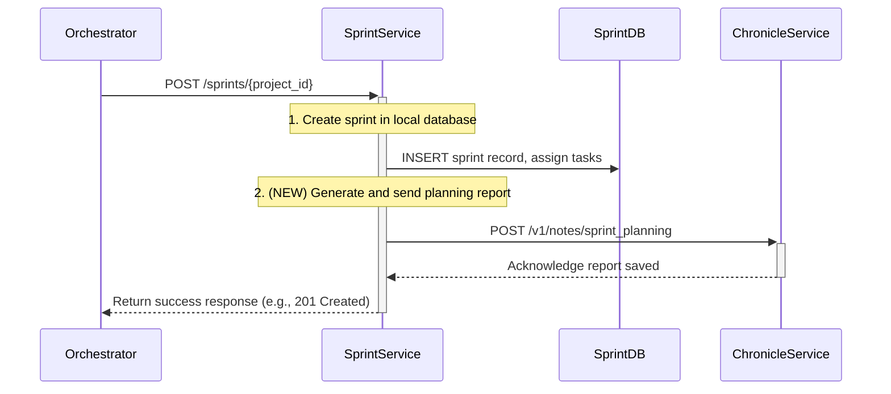

# CR: Sprint Service - Automated Sprint Planning Report Generation

## Overview

This Change Request proposes an enhancement to the Sprint Service to automatically generate and record a "Sprint Planning" report in the Chronicle Service upon the successful creation of a new sprint. Currently, the sprint planning ceremony is orchestrated, but a formal, historical record of the sprint's initial commitments (i.e., the tasks planned at inception) is not created.

This change will improve the system's auditability and data richness by ensuring that every sprint planning event is captured as a historical note. This provides a valuable baseline for retrospectives, velocity calculations, and other analytics.

## Goals

*   **Enhance Auditability**: Create an immutable, historical record of every sprint planning event.
*   **Improve Data Integrity**: Ensure that the tasks assigned at the beginning of a sprint are formally documented.
*   **Automate Reporting**: Integrate sprint planning reporting directly into the sprint creation workflow, requiring no manual intervention.
*   **Decouple Responsibilities**: Ensure the Sprint Service, as the owner of the sprint lifecycle, is responsible for reporting on its own creation events.

## Current State Analysis

*   **Current Behavior**: The Sprint Service's `POST /sprints/{project_id}` endpoint successfully creates a new sprint, assigns tasks from the backlog, and updates the status of those tasks in the Backlog Service. It does not, however, communicate with the Chronicle Service to record this event.
*   **Dependencies**: The Sprint Service currently interacts with the Project Service (for validation) and the Backlog Service (for tasks).
*   **Gaps/Issues**: There is a gap in the system's historical data. While daily scrums and retrospectives are chronicled, the initial sprint plan is not, making it difficult to analyze how a sprint's scope evolved over its lifecycle.
*   **Configuration**: No specific configuration is required for this change, other than the existing service URL for the Chronicle Service.

## Proposed Solution

The business logic of the `POST /sprints/{project_id}` endpoint within the Sprint Service will be modified. After a new sprint is successfully created and its tasks are assigned within the Sprint Service's database, the service will perform an additional, internal action.

### Key Components

*   **Chronicle Service Client**: A new or updated HTTP client within the Sprint Service to facilitate communication with the Chronicle Service.
*   **Report Generation Logic**: Logic to assemble the `sprint_planning` report payload using the data from the newly created sprint (e.g., sprint ID, project ID, planned tasks).
*   **Enhanced `create_sprint` Workflow**: The core sprint creation function will be updated to include a non-blocking call to the Chronicle Service.

### Architecture Changes

This change introduces a new communication path from the Sprint Service to the Chronicle Service. To maintain resilience, the call to the Chronicle Service will be treated as a secondary, non-critical action. A failure to create the planning report should be logged but should **not** cause the entire sprint creation process to fail.

## API Changes

There are **no changes** to the public API contracts of any service. This enhancement is a purely internal implementation detail of the Sprint Service.

## Interdependencies & Communication Flow

The following diagram illustrates the updated communication flow when a new sprint is created.



## Detailed Implementation Plan

## Detailed Functionality

This section details the specific code changes implemented in the Sprint Service to enable automated sprint planning report generation.

### 1. Chronicle Service Client (`sprint-service/src/utils.py`)
- A new asynchronous function `call_chronicle_service_create_sprint_planning_report` was added to `utils.py`. This function is responsible for making the `POST` request to the Chronicle Service's `/v1/notes/sprint_planning` endpoint.
- It includes circuit breaker logic for resilience, ensuring that failures in the Chronicle Service do not halt the Sprint Service's core operations.

### 2. Pydantic Models (`sprint-service/src/app.py`)
- The `SprintPlanningReportTask` model defines the structure for individual tasks within the planning report (task ID, title, assigned team member).
- The `SprintPlanningReport` model defines the overall structure of the sprint planning report payload sent to the Chronicle Service. It now includes:
    - `sprint_id`, `project_id`, `sprint_name` (strings)
    - `sprint_goal` (string): A new required field for the Chronicle Service.
    - `start_date`, `end_date` (strings): Dates are sent as ISO-formatted strings.
    - `planned_tasks` (List[str]): A list of task IDs (strings), as expected by the Chronicle Service's `POST` endpoint.

### 3. Sprint Creation Logic (`sprint-service/src/app.py` - `start_new_sprint` endpoint)
- After a new sprint is successfully created in the Sprint Service's database and tasks are assigned, the `start_new_sprint` function now performs the following additional steps:
    1.  **Prepare `planned_tasks`**: It extracts only the `task_id` from each `unassigned_task` to create a `List[str]` for the `planned_tasks` field in the report payload.
    2.  **Construct Report Payload**: An instance of `SprintPlanningReport` is created, populating fields like `sprint_id`, `project_id`, `sprint_name`, `start_date` (converted to ISO string), `end_date` (converted to ISO string), and a default `sprint_goal` (e.g., "Complete all assigned tasks for sprint {sprint_id}.").
    3.  **Call Chronicle Service**: The `call_chronicle_service_create_sprint_planning_report` function is invoked with the constructed payload.
    4.  **Resilient Error Handling**: The call to the Chronicle Service is wrapped in a `try...except` block. Any exceptions during this call (e.g., network errors, Chronicle Service unavailability) are logged as errors but do **not** cause the overall sprint creation process to fail, adhering to the principle of graceful degradation for non-critical reporting.


### Phase 1: Enhance Sprint Service
*   **Status**: ⏹️ Pending
*   **Step 1.1: Add Chronicle Service Client**
    *   **Action**: Ensure an asynchronous HTTP client for the Chronicle Service is available within the Sprint Service's integration layer.
    *   **File**: `sprint-service/src/service_clients.py` (or equivalent)
    *   **Validation**: The client can successfully connect to the Chronicle Service.
*   **Step 1.2: Modify Sprint Creation Logic**
    *   **Action**: In the function responsible for handling the `POST /sprints/{project_id}` request, add a new step after the sprint is successfully saved to the database.
    *   **File**: `sprint-service/src/main.py` (or equivalent router/logic file)
    *   **Validation**: The new logic path is triggered upon successful sprint creation.
*   **Step 1.3: Implement Report Generation**
    *   **Action**: Add logic to construct the JSON payload for the sprint planning report. This payload should include the `sprint_id`, `project_id`, `sprint_name`, dates, and a list of `planned_tasks` (including task ID, title, and assigned team member).
    *   **Validation**: The generated payload matches the schema expected by the Chronicle Service's `/v1/notes/sprint_planning` endpoint.
*   **Step 1.4: Add Resilient API Call**
    *   **Action**: Make the `POST` request to the Chronicle Service. Wrap this call in a `try...except` block to catch potential `httpx` errors (e.g., timeouts, connection errors).
    *   **File**: `sprint-service/src/main.py` (or equivalent)
    *   **Validation**: A successful call results in a 201 status from Chronicle. A failed call is logged as an error, but the Sprint Service still returns a success response to the original caller (e.g., the Orchestrator).

## Deployment

### Step 1: Build and Push Docker Image
*   **Action**: Build the Docker image for the Sprint Service, tag it with a new version, and push it to the private registry.
*   **Commands**:
    ```bash
    # Example for sprint-service - replace with the actual path and version
    docker build -t myreg.agile-corp.org:5000/sprint-service:1.2.0 -f ./services/sprint-service/Dockerfile ./services/sprint-service/
    docker push myreg.agile-corp.org:5000/sprint-service:1.2.0
    ```

### Step 2: Update Kubernetes Deployment
*   **Action**: Update the `image` tag in the `sprint-service-deployment.yml` manifest to the new version. Apply the changes to the cluster.
*   **File to Modify**: `services/sprint-service/sprint-service-deployment.yml`
*   **Commands**:
    ```bash
    kubectl apply -f services/sprint-service/sprint-service-deployment.yml
    ```

### Step 3: Verify the Deployment
*   **Action**: Monitor the rollout status to ensure a smooth update.
*   **Command**:
    ```bash
    kubectl rollout status deployment/sprint-service -n dsm
    ```

## Testing and Validation Plan

This section details the step-by-step process and expected outcomes for verifying the automated sprint planning report generation using `curl` commands from within the Kubernetes cluster.

### Prerequisites
- A running Kubernetes cluster with `kubectl` configured.
- `testapp-pod` running in the `dsm` namespace.
- Project Service, Backlog Service, Sprint Service, and Chronicle Service are deployed and healthy.

### Test Steps and Responses

1.  **Ensure `testapp-pod` is running:**
    ```bash
    kubectl get pods -n dsm -l app=testapp-pod
    ```
    **Expected Response:**
    ```
    NAME          READY   STATUS    RESTARTS   AGE
    testapp-pod   1/1     Running   0          <age>
    ```

2.  **Create a Project (if 'TEST001' does not exist or is inactive):**
    ```bash
    kubectl exec -it testapp-pod -n dsm -- curl -X POST -H "Content-Type: application/json" -d '{"id": "TEST001", "name": "Test Project for Sprint Planning", "description": "A project for testing sprint planning report generation.", "status": "inactive"}' http://project-service.dsm.svc.cluster.local:80/projects
    ```
    **Expected Response (if created):**
    ```json
    {"message":"Project created successfully","project_id":"TEST001"}
    ```
    **Expected Response (if already exists):**
    ```json
    {"detail":"Database operation failed."}
    ```

3.  **Activate Project 'TEST001':**
    ```bash
    kubectl exec -it testapp-pod -n dsm -- curl -X PUT -H "Content-Type: application/json" -d '{"status": "active"}' http://project-service.dsm.svc.cluster.local:80/projects/TEST001/status
    ```
    **Expected Response:**
    ```json
    {"message":"Project status updated successfully","project_id":"TEST001","status":"active"}
    ```

4.  **Generate Backlog Tasks for 'TEST001':**
    ```bash
    kubectl exec -it testapp-pod -n dsm -- curl -X POST http://backlog-service.dsm.svc.cluster.local:80/backlogs/TEST001
    ```
    **Expected Response:**
    ```json
    {"message":"Backlog generated successfully for project TEST001","tasks_count":10}
    ```

5.  **Get Active Sprint ID for 'TEST001' (to close if necessary):**
    ```bash
    kubectl exec -it testapp-pod -n dsm -- curl -X GET http://sprint-service.dsm.svc.cluster.local:80/sprints/active/TEST001 | jq
    ```
    **Expected Response (if active sprint exists, e.g., S01, S02):**
    ```json
    {
      "sprint_id": "TEST001-S0X"
    }
    ```
    **Expected Response (if no active sprint):**
    ```json
    {
      "detail": "No active sprint found."
    }
    ```

6.  **Close Active Sprint (if one exists from previous runs, replace `TEST001-S0X` with actual ID):**
    ```bash
    kubectl exec -it testapp-pod -n dsm -- curl -X POST http://sprint-service.dsm.svc.cluster.local:80/sprints/TEST001-S0X/close
    ```
    **Expected Response:**
    ```json
    {"message":"Sprint closure processed for TEST001-S0X.","sprint_id":"TEST001-S0X","status_updated_to":"closed_with_pending_tasks","completed_tasks_count":0,"uncompleted_tasks_moved_to_backlog_count":10,"retrospective_report_id":"<UUID>"}
    ```

7.  **Create a New Sprint for 'TEST001':**
    *(This will generate a new sprint ID, e.g., `TEST001-S03` if S01 and S02 were closed)*
    ```bash
    kubectl exec -it testapp-pod -n dsm -- curl -X POST -H "Content-Type: application/json" -d '{"sprint_name": "Test Sprint 3", "duration_weeks": 2}' http://sprint-service.dsm.svc.cluster.local:80/sprints/TEST001
    ```
    **Expected Response:**
    ```json
    {"message":"Sprint 'Test Sprint 3' started successfully for project TEST001","sprint_id":"TEST001-S03","assigned_tasks_count":10}
    ```

8.  **Verify the Sprint Planning Report in Chronicle Service:**
    *(Replace `TEST001-S03` with the actual new sprint ID)*
    ```bash
    kubectl exec -it testapp-pod -n dsm -- curl -X GET -H "Content-Type: application/json" http://chronicle-service.dsm.svc.cluster.local:80/v1/notes/sprint_planning?sprint_id=TEST001-S03 | jq
    ```
    **Expected Response:**
    ```json
    [
      {
        "id": "<UUID>",
        "event_type": "sprint_planning",
        "project_id": "TEST001",
        "sprint_id": "TEST001-S03",
        "note_content": "Goal: Complete all assigned tasks for sprint TEST001-S03.\nPlanned Tasks: TEST001-TASK002, TEST001-TASK001, TEST001-TASK007, TEST001-TASK003, TEST001-TASK004, TEST001-TASK005, TEST001-TASK006, TEST001-TASK009, TEST001-TASK010, TEST001-TASK008",
        "report_date": null,
        "employee_id": null,
        "yesterday_work": null,
        "today_work": null,
        "impediments": null,
        "created_at": "<TIMESTAMP>",
        "summary_metrics": null,
        "additional_data": null,
        "summary": null
      }
    ]
    ```

### Test Cases

| Test | Command | Expected Result |
|------|---------|-----------------|
| Successful Creation | Trigger sprint creation for a project with unassigned tasks. | The sprint is created, and a corresponding sprint planning report appears in the Chronicle Service. |
| Chronicle Unavailable | Stop the Chronicle Service, then trigger sprint creation. | The sprint is still created successfully. An error is logged in the Sprint Service regarding the reporting failure. |

### Validation Steps

1.  **Trigger Sprint Creation**: Use the Project Orchestrator or a direct `curl` call to create a new sprint for a project.
2.  **Verify Sprint Creation**: Check the Sprint Service to confirm the new sprint is active.
3.  **Verify Planning Report**: Query the Chronicle Service's `GET /v1/notes/sprint_planning?sprint_id=<new_sprint_id>` endpoint and confirm that a report for the new sprint exists and contains the correct data.

## Final System State

*   Upon the creation of any new sprint, the Sprint Service will automatically and asynchronously generate a corresponding sprint planning report in the Chronicle Service.
*   The system's historical data will be enriched with a complete record of sprint commitments from the moment of planning.

## Risks & Side Effects

| Risk | Description | Mitigation |
|------|-------------|------------|
| Increased Latency | The additional API call could slightly increase the response time of the sprint creation endpoint. | The call will be made asynchronously (non-blocking), and a reasonable timeout (e.g., 5 seconds) will be configured. |
| Chronicle Service Unavailability | If the Chronicle Service is down, the report cannot be created. | The sprint creation process will **not** fail. The error will be logged, and the sprint will be created successfully. The report can be generated manually later if necessary. |

## Success Criteria

*   ✅ When a new sprint is created, a corresponding sprint planning report is successfully stored in the Chronicle Service.
*   ✅ The sprint creation process remains successful even if the Chronicle Service is temporarily unavailable.
*   ✅ The data in the sprint planning report accurately reflects the initial state of the newly created sprint.

## Related Documentation

*   [DSM Service Specifications](DSM_Service_Specifications.md)

## Conclusion

This enhancement adds a critical layer of auditability and historical context to the DSM system. By automatically chronicling the sprint planning event, we create a richer dataset for future analytics, improve transparency, and ensure that the lifecycle of every sprint is documented from inception to completion. This is a low-risk, high-value change that strengthens the platform's data integrity.

## CR Status: ✅ IMPLEMENTED