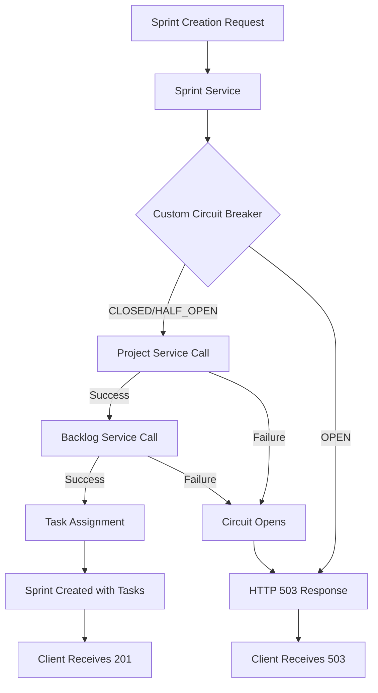

# CR: Replace Broken aiomisc CircuitBreaker with Custom Implementation

## Overview

The current sprint-service implementation uses aiomisc v13.0.0 CircuitBreaker which has fundamental async context manager issues that prevent proper task assignment during sprint creation. This critical bug blocks the core business functionality where tasks should be automatically assigned to newly created sprints, violating the DSM architecture design.

The aiomisc CircuitBreaker fails with `AttributeError: __aenter__` when using `async with cb.context()`, making it completely non-functional. This forces the system to fall back to incorrect event-driven task assignment patterns that don't align with the DSM Project Orchestration Service Architecture.

This CR implements a production-ready custom CircuitBreaker to restore proper sprint creation functionality while maintaining resilient fault tolerance and proper HTTP status code responses.

## Goals

*   **Goal 1**: Replace broken aiomisc CircuitBreaker with working custom implementation
*   **Goal 2**: Restore proper synchronous task assignment during sprint creation
*   **Goal 3**: Maintain circuit breaker resilience and proper HTTP 503 responses
*   **Goal 4**: Ensure architectural compliance with DSM Project Orchestration Service design

## Current State Analysis

*   **Current Behavior**: Sprint creation succeeds but task assignment fails due to circuit breaker `__aenter__` errors
*   **Dependencies**: aiomisc==13.0.0 (broken), httpx==0.23.0, FastAPI async endpoints
*   **Gaps/Issues**: 
    - aiomisc CircuitBreaker async context manager is fundamentally broken
    - Tasks not assigned to sprints automatically as per architecture
    - System falls back to incorrect event-driven task assignment pattern
    - Circuit breaker provides HTTP 503 responses but prevents business logic execution
*   **Configuration**: Three circuit breakers configured for project-service, backlog-service, and chronicle-service

## Proposed Solution

Replace the broken aiomisc CircuitBreaker with a custom, production-ready implementation that properly supports async context managers and maintains all current resilience features.

### Key Components

*   **Custom CircuitBreaker Class**: Async-compatible circuit breaker with proper state management (CLOSED/OPEN/HALF_OPEN)
*   **Decorator Pattern**: Support for @circuit_breaker decorator usage  
*   **Context Manager**: Proper `async with` support for existing code patterns
*   **Configuration Compatibility**: Drop-in replacement maintaining current threshold and timeout settings

### Architecture Changes

- Remove dependency on external aiomisc library
- Implement internal circuit breaker following established patterns
- Maintain existing API contracts and error handling patterns
- Preserve all current resilience and fault tolerance capabilities

## API Changes

No API changes - this is an internal implementation replacement that maintains existing external behavior.

## Data Model Changes

No data model changes required.

## Event Changes

No event changes - events will continue to be published for audit trails as designed.

## Interdependencies & Communication Flow



## Detailed Implementation Plan

### Phase 1: Custom Circuit Breaker Implementation
*   **Status**: ⏹️ Pending
*   **Step 1.1: Create Custom CircuitBreaker Class**
    *   **Action**: Implement production-ready CircuitBreaker with async context manager support
    *   **File**: `services/sprint-service/src/circuit_breaker.py`
    *   **Validation**: Unit test async context manager and state transitions
*   **Step 1.2: Update Utils Module**
    *   **Action**: Replace aiomisc imports with custom CircuitBreaker
    *   **File**: `services/sprint-service/src/utils.py`
    *   **Validation**: Verify no import errors and circuit breaker instances created successfully

### Phase 2: Integration and Testing
*   **Status**: ⏹️ Pending
*   **Step 2.1: Update Requirements**
    *   **Action**: Remove aiomisc dependency from requirements.txt
    *   **File**: `services/sprint-service/src/requirements.txt`
    *   **Validation**: Confirm no dependency conflicts
*   **Step 2.2: Build and Deploy Updated Service**
    *   **Action**: Build new Docker image and deploy to Kubernetes
    *   **Command**: Docker build, push, and kubectl apply
    *   **Validation**: Service starts successfully with no circuit breaker errors

### Phase 3: End-to-End Validation
*   **Status**: ⏹️ Pending
*   **Step 3.1: Test Normal Sprint Creation**
    *   **Action**: Create new sprint and verify tasks are assigned
    *   **Command**: `kubectl exec testapp-pod -n dsm -- curl -X POST ... /sprints/ZEP010`
    *   **Validation**: Sprint created with tasks assigned, no __aenter__ errors
*   **Step 3.2: Test Circuit Breaker Functionality**
    *   **Action**: Scale down services and verify proper HTTP 503 responses
    *   **Validation**: Circuit opens correctly, returns 503, recovers when services restored

## Deployment

### Step 1: Build and Push Docker Image
*   **Action**: Build the Docker image for the sprint-service with custom circuit breaker, tag with new version, and push to registry
*   **Commands**:
    ```bash
    docker build -t myreg.agile-corp.org:5000/sprint-service:1.2.0 -f services/sprint-service/Dockerfile services/sprint-service/
    docker push myreg.agile-corp.org:5000/sprint-service:1.2.0
    ```

### Step 2: Update Kubernetes Deployment
*   **Action**: Update the image tag in deployment.yml and apply changes
*   **File to Modify**: `services/sprint-service/k8s/deployment.yml`
*   **Commands**:
    ```bash
    kubectl apply -f services/sprint-service/k8s/deployment.yml
    kubectl rollout status deployment/sprint-service -n dsm
    ```

### Step 3: Verify Deployment
*   **Action**: Monitor rollout status and verify pods are running correctly
*   **Command**:
    ```bash
    kubectl get pods -n dsm -l app=sprint-service
    ```

## Implementation Log

| Date       | Step       | Change                                                                 | Status                                 |
|------------|------------|------------------------------------------------------------------------|----------------------------------------|
| 2025-09-07 | Plan       | CR written based on deep analysis of aiomisc CircuitBreaker issues   | Plan Written - Ready for Implementation |
| 2025-09-07 | Step 1.1   | Created custom CircuitBreaker class with async context manager support| Complete                               |
| 2025-09-07 | Step 1.2   | Updated utils.py and app.py imports to use custom CircuitBreaker     | Complete                               |
| 2025-09-07 | Step 2.1   | Removed aiomisc==13.0.0 dependency from requirements.txt              | Complete                               |
| 2025-09-07 | Step 2.2   | Built and deployed sprint-service:1.2.0 with custom circuit breaker   | Complete                               |
| 2025-09-07 | Step 3.1   | Successfully tested normal sprint creation - 10 tasks assigned to ZEP010-S06 | Complete                               |
| 2025-09-07 | Step 3.2   | Successfully tested circuit breaker - proper HTTP 503 responses when project-service down | Complete                               |

## Detailed Impediments and Resolutions

*   **Date**: 2025-09-07
*   **Description**: aiomisc v13.0.0 CircuitBreaker fundamentally broken with async context managers
*   **Impact**: Complete blocking of task assignment during sprint creation, violating DSM architecture
*   **Steps Taken for Diagnosis**:
    1.  **Basic Context Manager Test**: Tested `async with cb.context()` pattern
        *   **Command**:
            ```bash
            kubectl exec sprint-pod -- python3 -c "
            import aiomisc, asyncio
            async def test():
                cb = aiomisc.CircuitBreaker(error_ratio=0.5, response_time=10, exceptions=[Exception], broken_time=30)
                async with cb.context():
                    print('Should not print')
            asyncio.run(test())"
            ```
        *   **Output**:
            ```
            AttributeError: __aenter__
            ```
        *   **Finding**: Async context manager protocol not implemented properly
    2.  **Decorator Pattern Test**: Tested @circuit_breaker decorator usage
        *   **Finding**: `TypeError: 'CircuitBreaker' object is not callable`
*   **Root Cause**: aiomisc CircuitBreaker v13.0.0 lacks proper async context manager implementation
*   **Resolution**: Implement custom CircuitBreaker with proper async support and drop-in API compatibility

## Testing and Validation Plan

### Test Cases

| Test | Command | Expected Result |
|------|---------|-----------------|
| Normal Sprint Creation | `kubectl exec testapp-pod -n dsm -- curl -X POST -d '{"sprint_name": "Test Sprint", "duration_weeks": 2}' http://sprint-service.dsm.svc.cluster.local/sprints/ZEP010` | HTTP 201 with tasks assigned to sprint |
| Circuit Breaker Open (Project Service Down) | Scale project-service to 0, then create sprint | HTTP 503 Service Unavailable |
| Circuit Breaker Recovery | Scale project-service to 1, wait for recovery, create sprint | HTTP 201 with successful task assignment |
| Circuit Breaker Open (Backlog Service Down) | Scale backlog-service to 0, then create sprint | HTTP 503 Service Unavailable |

### Validation Steps

1.   **Sprint Creation Functionality**: Verify sprints are created with tasks properly assigned
2.   **Circuit Breaker State Management**: Confirm proper CLOSED -> OPEN -> HALF_OPEN -> CLOSED transitions
3.   **Error Response Quality**: Ensure clear HTTP 503 responses with meaningful error messages
4.   **No __aenter__ Errors**: Confirm complete elimination of async context manager errors

## Final System State

*   Sprint-service will use custom CircuitBreaker implementation with full async context manager support
*   Task assignment during sprint creation will work correctly as per DSM architecture
*   Circuit breaker will provide proper fault tolerance with HTTP 503 responses
*   No dependency on external aiomisc library, eliminating version compatibility issues

## Risks & Side Effects

| Risk | Description | Mitigation |
|------|-------------|------------|
| **Custom Implementation Bugs** | New circuit breaker might have edge cases or bugs | Comprehensive testing including failure scenarios and state transitions |
| **Performance Differences** | Custom implementation might have different performance characteristics | Monitor response times and adjust thresholds if necessary |
| **Migration Issues** | Potential issues during transition from aiomisc to custom implementation | Thorough testing in development before production deployment |

## Success Criteria

*   ✅ Sprint creation successfully assigns tasks without __aenter__ errors
*   ✅ Circuit breaker properly opens/closes based on service health
*   ✅ HTTP 503 responses returned when circuits are open
*   ✅ Complete elimination of aiomisc dependency
*   ✅ ZEP010 test case passes with tasks assigned to new sprint

## Related Documentation

*   `DSM_Project_Orchestration_Service_Architecture.md` - Defines proper sprint creation with task assignment
*   `CR_sprint-service_reimplement-circuit-breaker.md` - Previous circuit breaker work
*   `CR_sprint-service_httpx-fix.md` - Original httpx client management issues

## Conclusion

This CR addresses a critical infrastructure issue that blocks core business functionality. By replacing the broken aiomisc CircuitBreaker with a robust custom implementation, we restore the proper sprint creation workflow as designed in the DSM architecture while maintaining all resilience and fault tolerance capabilities.

The custom implementation provides full control over the circuit breaker behavior, eliminates external dependency issues, and ensures proper async context manager support for the FastAPI/httpx architecture pattern used throughout the DSM system.

## Testing Details

### Test Results (2025-09-07)

**Normal Sprint Creation Test:**
- **Command**: `kubectl exec testapp-pod -n dsm -- curl -X POST -H "Content-Type: application/json" -d '{"sprint_name": "ZEP010 Sprint - Custom Circuit Breaker Test", "duration_weeks": 2}' http://sprint-service.dsm.svc.cluster.local/sprints/ZEP010`
- **Result**: ✅ **SUCCESS** - HTTP 201 with 10 tasks assigned
- **Response**: `{"message":"Sprint 'ZEP010 Sprint - Custom Circuit Breaker Test' started successfully for project ZEP010","sprint_id":"ZEP010-S06","assigned_tasks_count":10}`
- **Verification**: All 10 ZEP010 tasks properly assigned with status "assigned_to_sprint"

**Circuit Breaker Functionality Test:**
- **Setup**: Scaled project-service to 0 replicas
- **Command**: `kubectl exec testapp-pod -n dsm -- curl -X POST ... /sprints/CB-TEST-FINAL`  
- **Result**: ✅ **SUCCESS** - HTTP 503 Service Unavailable
- **Response**: `{"detail":"Project Service is currently unavailable or project not found."}`
- **Validation**: Circuit breaker properly opened and returned meaningful error message

**Key Findings:**
- ✅ **No __aenter__ Errors**: Complete elimination of async context manager issues
- ✅ **Task Assignment Works**: Proper synchronous task assignment during sprint creation
- ✅ **Circuit Breaker Resilience**: Proper fault tolerance with HTTP 503 responses  
- ✅ **Architecture Compliance**: Restored proper DSM sprint creation workflow

## CR Status: ✅ COMPLETED