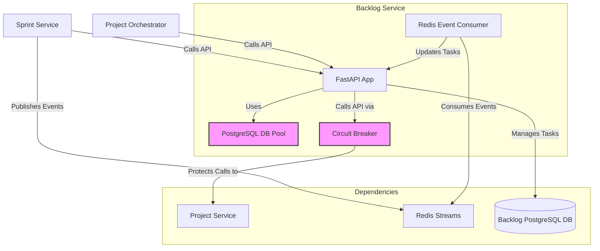
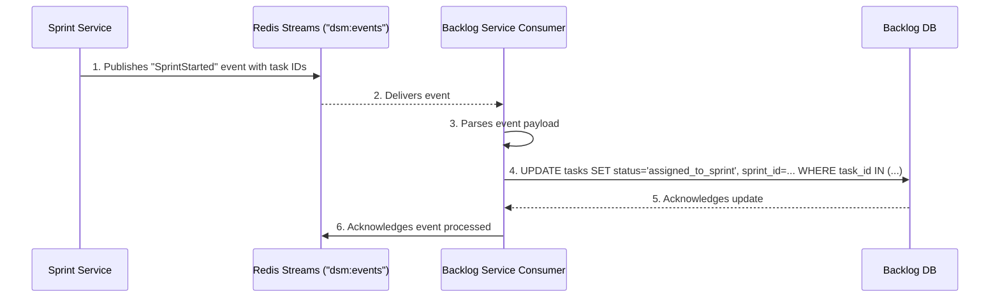

# Backlog Service Setup Guide

## 1. Overview

The Backlog Service is a crucial microservice in the DSM ecosystem responsible for managing the master task backlog for every project. It serves as the central repository for all project-related tasks, providing a transactional, API-driven interface for other services to create, retrieve, and update task statuses.

The service is built with Python and FastAPI, uses a dedicated PostgreSQL database for data persistence, and integrates with other services both synchronously via REST APIs and asynchronously through a Redis event stream.

## 2. Architecture

The service is designed for resilience and scalability, incorporating several key architectural patterns.

-   **Technology Stack**:
    -   **Framework**: FastAPI (Python) for high-performance, asynchronous API endpoints.
    -   **Database**: Dedicated PostgreSQL instance for data ownership and integrity.
    -   **Caching & Messaging**: Redis for event-driven communication with other services.
-   **Key Design Patterns**:
    -   **Database Connection Pooling**: Utilizes a `psycopg2` connection pool to efficiently manage database connections, reducing latency and resource overhead under load.
    -   **Circuit Breaker**: Implements a custom, resilient circuit breaker pattern for all outgoing API calls to the Project Service. This prevents cascading failures and allows the service to fail fast when dependencies are unavailable.
    -   **Event-Driven Updates**: Consumes events from Redis Streams (`SprintStarted` and `TASK_UPDATED`) to ensure eventual consistency with the Sprint Service, decoupling the services and improving system resilience.

### Architecture Diagram

The following diagram illustrates the Backlog Service's position within the DSM ecosystem, highlighting its key interactions.



## 3. API Endpoints

The service exposes a RESTful API for managing project backlogs and tasks.

#### Health & Status

-   **`GET /health`**
    -   **Purpose**: A lightweight health check for Kubernetes liveness probes.
    -   **Response**: `{"status": "ok"}`

-   **`GET /health/ready`**
    -   **Purpose**: A comprehensive readiness probe that validates connectivity to PostgreSQL, Redis, and the Project Service.
    -   **Response (Success)**: `200 OK` with a JSON body detailing the "ok" status of each dependency.
    -   **Response (Failure)**: `503 Service Unavailable` if any dependency check fails.

#### Backlog Management

-   **`POST /backlogs/{project_id}`**
    -   **Purpose**: Generates an initial, simulated task backlog for a new project after verifying the project exists via the Project Service.
    -   **Response**: `{"message": "Backlog generated successfully...", "tasks_count": 10}`

-   **`GET /backlogs/{project_id}`**
    -   **Purpose**: Retrieves the list of all tasks for a specific project.
    -   **Query Parameters**: `status` (optional) - Filter tasks by their status (e.g., `unassigned`, `in_progress`).
    -   **Response**: An array of task objects.

-   **`GET /backlogs/summary`**
    -   **Purpose**: Retrieves a summary of all backlogs across all projects, including total task counts and status breakdowns.
    -   **Response**: An array of project summary objects.

-   **`GET /backlogs/{project_id}/summary`**
    -   **Purpose**: Returns detailed summary statistics for a single project's backlog.
    -   **Response**: A summary object with total tasks and status counts.

#### Task Management

-   **`PUT /tasks/{task_id}`**
    -   **Purpose**: Updates the details of a specific task. This is heavily used by the Sprint Service to synchronize task status, progress, and assignments back to the master backlog.
    -   **Request Body**:
        ```json
        {
          "status": "in_progress",
          "progress_percentage": 50,
          "assigned_to": "E001",
          "sprint_id": "PROJ-001-S01"
        }
        ```
    -   **Response**: `{"message": "Task {task_id} updated successfully"}`

## 4. Event-Driven Integration

The Backlog Service relies on asynchronous event processing to maintain data consistency without tight coupling.

-   **`TASK_UPDATED` Event (Consumer)**: The service listens to a dedicated `task_update_events` stream. When the Sprint Service updates a task's progress during a daily scrum, it publishes an event that this consumer processes to update the master task record in the backlog database.
-   **`SprintStarted` Event (Consumer)**: The service also listens to the main `dsm:events` stream. When a new sprint is planned, the Sprint Service publishes a `SprintStarted` event containing the list of tasks included in the sprint. This consumer processes the event and updates the `status` and `sprint_id` for each of those tasks in the backlog.

### Event Processing Flow (`SprintStarted`)



## 5. Dependencies

-   **Project Service**: For validating project existence and retrieving project details.
-   **PostgreSQL**: For persistent storage of all task and backlog data.
-   **Redis**: For asynchronous event consumption.

## 6. Configuration

The service is configured via Kubernetes environment variables, secrets, and configmaps.

-   **`POSTGRES_HOST`, `POSTGRES_DB`, `POSTGRES_USER`, `POSTGRES_PASSWORD`**: Database connection credentials (from Secret).
-   **`PROJECT_SERVICE_URL`**: The cluster-internal URL for the Project Service (e.g., `http://project-service.dsm.svc.cluster.local`).
-   **`REDIS_HOST`**, **`REDIS_PORT`**: Redis connection details.

## 7. Build and Deployment

### 7.1. Build Docker Image

Run this command from the project's root directory to build the image and push it to the private registry.

```bash
# 1. Build the Docker image
docker build -t myreg.agile-corp.org:5000/backlog-service:1.2.4 -f services/backlog-service/Dockerfile services/backlog-service/

# 2. Push the Docker image
docker push myreg.agile-corp.org:5000/backlog-service:1.2.4
```

### 7.2. Kubernetes Deployment

The service is deployed using two manifests: a Deployment and a Service.

#### Deployment Manifest

**File:** `k8s/deployment.yml`
```yaml
apiVersion: apps/v1
kind: Deployment
metadata:
  name: backlog-service
  namespace: dsm
  labels:
    app: backlog-service
spec:
  replicas: 1
  selector:
    matchLabels:
      app: backlog-service
  template:
    metadata:
      labels:
        app: backlog-service
    spec:
      imagePullSecrets:
      - name: agile-corp-reg-secret
      containers:
      - name: backlog-service
        image: myreg.agile-corp.org:5000/backlog-service:1.2.4
        workingDir: /app
        command: ["python", "-B", "-m", "uvicorn", "app:app", "--host", "0.0.0.0", "--port", "80"]
        ports:
        - containerPort: 80
        startupProbe:
          httpGet:
            path: /health/ready
            port: 80
          initialDelaySeconds: 5
          periodSeconds: 5
          failureThreshold: 12 # 1 minute (12 * 5 seconds)
        readinessProbe:
          httpGet:
            path: /health
            port: 80
          initialDelaySeconds: 10
          periodSeconds: 5
        livenessProbe:
          httpGet:
            path: /health
            port: 80
          initialDelaySeconds: 15
          periodSeconds: 10
        resources:
          requests:
            memory: "200Mi"
            cpu: "200m"
          limits:
            memory: "400Mi"
            cpu: "400m"
        envFrom:
        - secretRef:
            name: backlog-db-secret
        - configMapRef:
            name: backlog-db-config
        env:
        - name: PROJECT_SERVICE_URL
          value: "http://project-service.dsm.svc.cluster.local"
        - name: PYTHONUNBUFFERED
          value: "1"
        - name: REDIS_HOST
          value: "redis"
        - name: REDIS_PORT
          value: "6379"
```

#### Service Manifest

**File:** `k8s/service.yml`
```yaml
apiVersion: v1
kind: Service
metadata:
  name: backlog-service
  namespace: dsm
spec:
  selector:
    app: backlog-service
  ports:
    - protocol: TCP
      port: 80
      targetPort: 80
  type: ClusterIP
```

### 7.3. Deployment Steps

Apply the Kubernetes manifests to deploy the service.

```bash
# 1. Apply the Deployment
kubectl apply -f services/backlog-service/k8s/deployment.yml

# 2. Apply the Service
kubectl apply -f services/backlog-service/k8s/service.yml
```

## 8. Verification

After applying the manifests, use these commands to verify that the deployment is successful.

```bash
# Check if the pod is running
kubectl get pods -n dsm -l app=backlog-service
# Expected STATUS: Running

# Check the logs to ensure it started without errors and connected to dependencies
POD_NAME=$(kubectl get pods -n dsm -l app=backlog-service -o jsonpath='{.items[0].metadata.name}')
kubectl logs -f $POD_NAME -n dsm
# Expected output: "Backlog Service starting up...", "Database connection pool initialized...", "Successfully connected to Redis"

# Check if the service is created
kubectl get svc backlog-service -n dsm
# Expected: A ClusterIP service is listed on port 80
```
