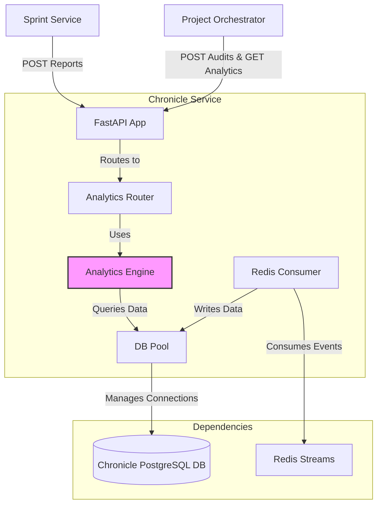

# Chronicle Service Setup Guide

## 1. Overview

The Chronicle Service is the central nervous system for historical data and analytics within the DSM ecosystem. Its primary function is to act as a persistent, append-only ledger for significant events and reports generated by other services. It stores various "chronicles," including daily scrum reports, sprint planning notes, sprint retrospectives, and detailed orchestration decision audits.

Beyond simple storage, the service exposes a powerful analytics engine that derives insights from this historical data, calculating project velocity, identifying common impediments, and even finding projects with similar historical patterns. It is built with Python/FastAPI and uses a dedicated PostgreSQL database with flexible JSONB columns to store rich, structured data.

## 2. Architecture

The service is designed as a robust data repository and analytics engine.

-   **Technology Stack**:
    -   **Framework**: FastAPI (Python) for a high-performance, asynchronous API.
    -   **Database**: Dedicated PostgreSQL instance, leveraging JSONB columns for flexible and structured data storage.
    -   **Messaging**: A Redis consumer listens to the main DSM event stream for specific events to chronicle, such as `SprintStarted`.
-   **Key Design Patterns**:
    -   **Repository Pattern**: Acts as a central repository for historical data, decoupling data storage from the services that generate it.
    -   **Database Connection Pooling**: Utilizes a `psycopg2` connection pool for efficient and scalable database interactions.
    -   **Analytics Engine**: A dedicated module (`analytics_engine.py`) encapsulates all the logic for querying and processing historical data to generate insights.

### Architecture Diagram

This diagram shows how the Chronicle Service interacts with other DSM services and its own components.



## 3. Key Functionalities

### 3.1. Note Management

The core function is to record structured notes from various scrum ceremonies and system events.
-   **Sprint Planning**: Stores the goal and planned tasks for a new sprint.
-   **Daily Scrums**: Archives detailed daily progress reports from each team member.
-   **Sprint Retrospectives**: Records what went well, what could be improved, action items, and attendees for each sprint.
-   **Decision Audits**: Logs the complete reasoning behind every decision made by the Project Orchestrator, providing full transparency.

### 3.2. Analytics Engine

The service's advanced capability is its analytics engine, which provides deep insights into project and system health.
-   **Velocity Tracking**: Calculates team velocity trends over time for any project.
-   **Impediment Analysis**: Identifies and aggregates common impediments reported in daily scrums and retrospectives.
-   **Pattern Recognition**: Extracts historical patterns and key insights for a specific project.
-   **Similarity Matching**: Finds other projects with similar historical characteristics (e.g., common impediments, task patterns).
-   **Decision Impact Analysis**: Correlates orchestration decisions with sprint outcomes to measure the effectiveness of AI-driven enhancements.

## 4. API Endpoints

The service exposes two main sets of endpoints under the `/v1/` prefix.

### 4.1. Note Management (`/v1/notes`)

-   **`POST /daily_scrum_report`**: Records a daily scrum update.
-   **`POST /sprint_planning`**: Records a sprint planning note.
-   **`POST /sprint_retrospective`**: Records a full sprint retrospective.
-   **`POST /decision_audit`**: Records a detailed audit trail of an orchestration decision.
-   **`GET /...`**: Corresponding `GET` endpoints are available to retrieve all of the above note types, with filtering by `project_id` or `sprint_id`.

### 4.2. Analytics (`/v1/analytics`)

-   **`GET /metrics/summary`**: Provides a system-wide summary of key metrics (total projects, sprints, reports, etc.).
-   **`GET /project/{project_id}/patterns`**: Extracts historical patterns for a specific project.
-   **`GET /project/{project_id}/velocity`**: Calculates and returns team velocity trends.
-   **`GET /project/{project_id}/impediments`**: Analyzes and aggregates common impediments.
-   **`GET /projects/similar`**: Finds projects with similar characteristics to a reference project.
-   **`GET /decisions/impact/{project_id}`**: Retrieves a report correlating orchestration decisions with sprint outcomes.

## 5. Data Models & Persistence

The service uses a combination of structured relational tables and flexible JSONB columns to store data efficiently.

-   **`chronicle_notes`**: A central table for storing general event-based notes like daily scrums, planning, and decision audits. It uses an `additional_data` JSONB column to store the rich, nested JSON payloads for these events.
-   **`sprint_retrospectives`**: A dedicated table with structured columns for retrospective data (`what_went_well`, etc.).
-   **`retrospective_action_items`** & **`retrospective_attendees`**: Child tables linked to the `sprint_retrospectives` table.

This hybrid approach allows for efficient querying on structured data while maintaining the flexibility to store complex, evolving event payloads without schema migrations.

## 6. Build and Deployment

### 6.1. Build Docker Image

Run this command from the project's root directory to build the image and push it to the private registry.

```bash
# 1. Build the Docker image
docker build -t myreg.agile-corp.org:5000/chronicle-service:1.1.14 -f services/chronicle-service/Dockerfile services/chronicle-service/

# 2. Push the Docker image
docker push myreg.agile-corp.org:5000/chronicle-service:1.1.14
```

### 6.2. Kubernetes Deployment

The service is deployed using a Deployment and a Service manifest.

#### Deployment Manifest

**File:** `k8s/deployment.yml`
```yaml
apiVersion: apps/v1
kind: Deployment
metadata:
  name: chronicle-service
  namespace: dsm
  labels:
    app: chronicle-service
spec:
  replicas: 1
  selector:
    matchLabels:
      app: chronicle-service
  template:
    metadata:
      labels:
        app: chronicle-service
    spec:
      imagePullSecrets:
        - name: agile-corp-reg-secret
      containers:
      - name: chronicle-service
        image: myreg.agile-corp.org:5000/chronicle-service:1.1.14
        imagePullPolicy: Always
        workingDir: /app
        command: ["uvicorn", "app:app", "--host", "0.0.0.0", "--port", "80", "--log-level", "debug"]
        ports:
        - containerPort: 80
        startupProbe:
          httpGet:
            path: /health/ready
            port: 80
          initialDelaySeconds: 5
          periodSeconds: 5
          failureThreshold: 12
        readinessProbe:
          httpGet:
            path: /health/ready
            port: 80
          initialDelaySeconds: 10
          periodSeconds: 5
        livenessProbe:
          httpGet:
            path: /health
            port: 80
          initialDelaySeconds: 15
          periodSeconds: 10
        resources:
          requests:
            memory: "200Mi"
            cpu: "200m"
          limits:
            memory: "400Mi"
            cpu: "400m"
        envFrom:
        - secretRef:
            name: postgres-chronicle-secret
        - configMapRef:
            name: postgres-chronicle-config
        env:
        - name: REDIS_HOST
          value: redis
        - name: REDIS_PORT
          value: "6379"
```

#### Service Manifest

**File:** `k8s/service.yml`
```yaml
apiVersion: v1
kind: Service
metadata:
  name: chronicle-service
  namespace: dsm
spec:
  selector:
    app: chronicle-service
  ports:
    - protocol: TCP
      port: 80
      targetPort: 80
  type: ClusterIP
```

### 6.3. Deployment Steps

Apply the Kubernetes manifests to deploy the service.

```bash
# 1. Apply the Deployment
kubectl apply -f services/chronicle-service/k8s/deployment.yml

# 2. Apply the Service
kubectl apply -f services/chronicle-service/k8s/service.yml
```

## 7. Verification

After applying the manifests, use these commands to verify that the deployment is successful.

```bash
# Check if the pod is running
kubectl get pods -n dsm -l app=chronicle-service
# Expected STATUS: Running

# Check the logs to ensure it started without errors and connected to dependencies
POD_NAME=$(kubectl get pods -n dsm -l app=chronicle-service -o jsonpath='{.items[0].metadata.name}')
kubectl logs -f $POD_NAME -n dsm
# Expected output: "Chronicle Service starting up...", "Database connection pool initialized.", "Starting SprintStarted event consumer..."

# Check if the service is created
kubectl get svc chronicle-service -n dsm
# Expected: A ClusterIP service is listed on port 80
```
