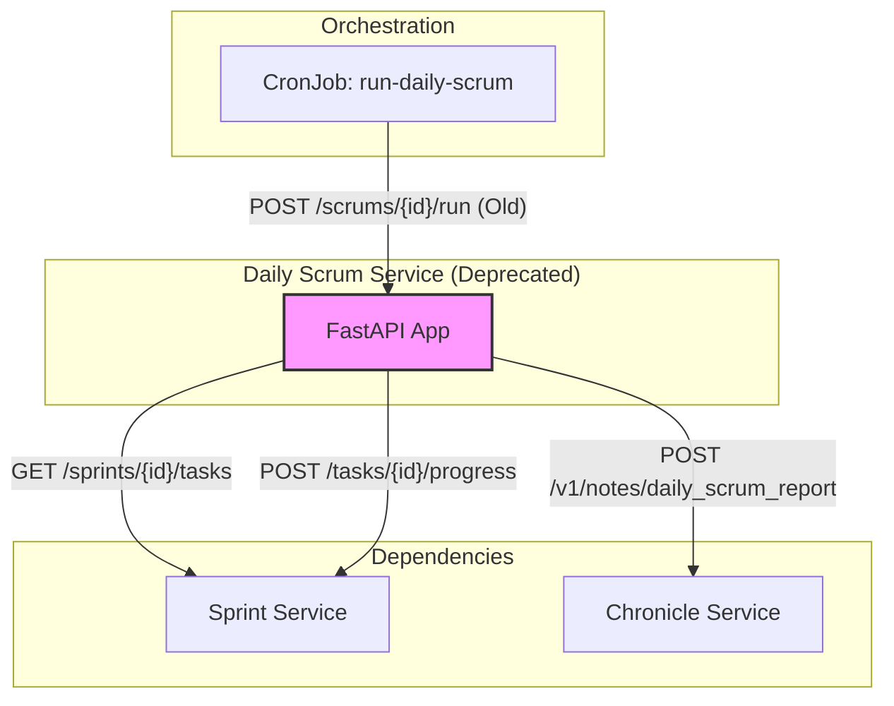
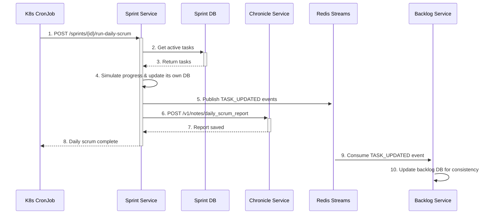

# Daily Scrum Service Setup Guide

## 1. Overview

**[DEPRECATED]**

The Daily Scrum Service was originally designed to simulate the daily scrum process by generating task progress updates for active sprints. It would fetch tasks from the Sprint Service, simulate work being done, and then publish these updates as events.

**IMPORTANT**: The core functionality of this service has been **deprecated and absorbed by the Sprint Service**. The active Kubernetes CronJob (`run-daily-scrum`) now directly calls the Sprint Service (`POST /sprints/{sprint_id}/run-daily-scrum`) to perform a more integrated and efficient daily scrum simulation and reporting workflow. This service is kept for historical reference and potential rollback scenarios but is no longer the primary actor in the daily scrum process.

## 2. Architecture

The service was designed as a stateless event producer.

-   **Technology Stack**:
    -   **Framework**: FastAPI (Python) for a lightweight, asynchronous API.
    -   **Communication**: Originally designed to publish events to Redis Streams, the implementation evolved to make direct API calls to the Sprint Service and Chronicle Service.
-   **Key Design Patterns**:
    -   **Stateless Service**: Does not maintain its own database, relying on other services as the source of truth.
    -   **Event Producer (Original Intent)**: Designed to generate `TASK_PROGRESSED` events.

### Original Component Interaction Diagram

This diagram shows the originally intended workflow where this service acted as the primary simulator.



### Current (New) Workflow Diagram

This diagram illustrates the current, more streamlined workflow where the Sprint Service has absorbed the daily scrum responsibilities.



## 3. API Endpoints

### 3.1. Daily Scrum Operations

#### `POST /scrums/{sprint_id}/run`
-   **Status**: `DEPRECATED`
-   **Purpose**: Executes the daily scrum simulation for a given sprint. It fetches tasks, simulates progress, and calls other services to persist the updates.
-   **Response**: `200 OK` with a summary of the simulation.
    ```json
    {
      "message": "Daily scrum simulation completed for sprint {sprint_id}",
      "tasks_updated_count": 5,
      "updates": [
        {
          "task_id": "TASK001",
          "progress_made": "25%",
          "new_status": "75%"
        }
      ]
    }
    ```

## 4. Build and Deployment

### 4.1. Build Docker Image

Run this command from the project's root directory to build the image.

```bash
# 1. Build the Docker image
docker build -t myreg.agile-corp.org:5000/daily-scrum-service:1.0.0 -f services/daily-scrum-service/Dockerfile services/daily-scrum-service/

# 2. Push the Docker image
docker push myreg.agile-corp.org:5000/daily-scrum-service:1.0.0
```

### 4.2. Kubernetes Deployment

The service is deployed using a standard Deployment and Service manifest.

#### Deployment Manifest

**File:** `k8s/deployment.yml`
```yaml
apiVersion: apps/v1
kind: Deployment
metadata:
  name: daily-scrum-service
  namespace: dsm
  labels:
    app: daily-scrum-service
spec:
  replicas: 1
  selector:
    matchLabels:
      app: daily-scrum-service
  template:
    metadata:
      labels:
        app: daily-scrum-service
    spec:
      containers:
      - name: daily-scrum-service
        image: myreg.agile-corp.org:5000/daily-scrum-service:1.0.0
        ports:
        - containerPort: 80
        resources:
          requests:
            memory: "200Mi"
            cpu: "200m"
          limits:
            memory: "400Mi"
            cpu: "400m"
        env:
        - name: SPRINT_SERVICE_URL
          value: "http://sprint-service.dsm.svc.cluster.local"
        - name: CHRONICLE_SERVICE_URL
          value: "http://chronicle-service.dsm.svc.cluster.local"
        - name: REDIS_HOST
          value: "redis"
        - name: REDIS_PORT
          value: "6379"
      imagePullSecrets:
      - name: agile-corp-reg-secret
```

#### Service Manifest

**File:** `k8s/service.yml`
```yaml
apiVersion: v1
kind: Service
metadata:
  name: daily-scrum-service
  namespace: dsm
spec:
  selector:
    app: daily-scrum-service
  ports:
    - protocol: TCP
      port: 80
      targetPort: 80
```

### 4.3. Deployment Steps

```bash
# 1. Apply the Deployment
kubectl apply -f services/daily-scrum-service/k8s/deployment.yml

# 2. Apply the Service
kubectl apply -f services/daily-scrum-service/k8s/service.yml
```
