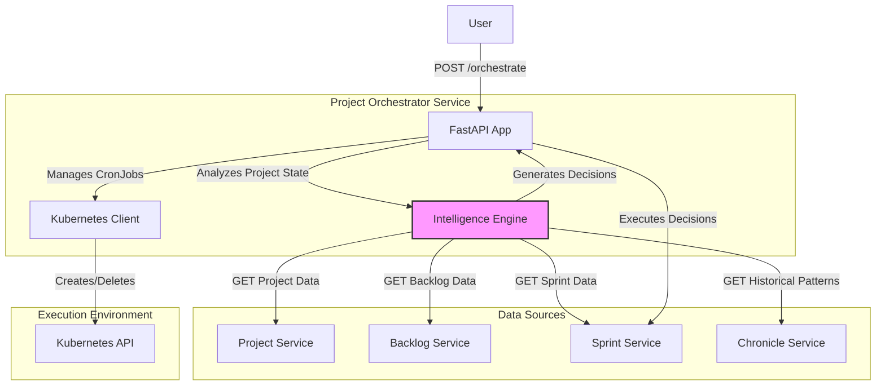
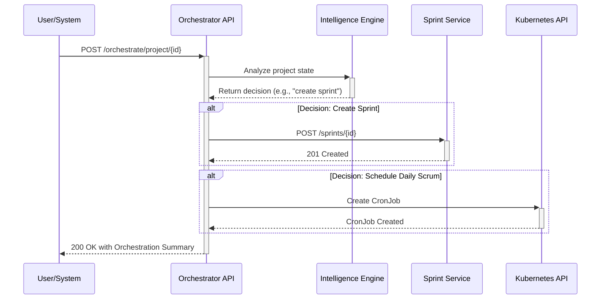

# Project Orchestrator Service Setup Guide

## 1. Overview

The Project Orchestration Service is the intelligence-driven coordinator for the DSM system. It analyzes project states, predicts outcomes, and automates key workflows like sprint creation and daily scrum scheduling. It uses a hybrid intelligence model, combining rule-based logic with learned patterns from historical data to make optimized decisions. Its goal is to ensure projects are managed efficiently, proactively addressing potential issues like declining velocity or unbalanced workloads.

 For a more in-depth look at the service's architecture, components, and data flows, please refer to the [Project Orchestration Service Architecture &  Design Specification](../../docs/DSM_Project_Orchestration_Service_Architecture.md).
## 2. Architecture

The service is designed as a stateless, intelligence-driven workflow engine that interacts with other DSM services to gather data and execute decisions.

-   **Technology Stack**:
    -   **Framework**: FastAPI (Python) for a high-performance, asynchronous API.
    -   **Database**: While the service is stateless, it relies on other services' databases for data and the `agent_memory` PostgreSQL database for its intelligence features.
    -   **Integration**: Communicates via REST APIs with the Project, Backlog, Sprint, and Chronicle services.
-   **Key Design Patterns**:
    -   **Orchestration Engine**: Acts as a central coordinator for complex, multi-service workflows.
    -   **Intelligence Core**: A dedicated module responsible for analyzing data, applying learned strategies, and generating actionable decisions.
    -   **Kubernetes-Native**: Directly interacts with the Kubernetes API to manage `CronJobs` for scheduling daily scrums.

### Component Interaction Diagram

This diagram shows how the Project Orchestrator Service interacts with other DSM services to make and execute decisions.



### Decision Workflow



## 3. API Endpoints

The service exposes endpoints for triggering and managing orchestration workflows.

### 3.1. Orchestration Management

#### `POST /orchestrate/project/{project_id}`
-   **Purpose**: Triggers the intelligence-driven orchestration workflow for a project.
-   **Request Body**:
    ```json
    {
        "action": "analyze_and_orchestrate",
        "options": {
            "create_sprint_if_needed": true,
            "assign_tasks": true,
            "create_cronjob": true,
            "schedule": "0 14 * * 1-5",
            "sprint_duration_weeks": 2,
            "max_tasks_per_sprint": 10
        }
    }
    ```
-   **Response**: `200 OK` with a detailed JSON object providing a full audit of the decision-making process.

#### `GET /orchestrate/project/{project_id}/status`
-   **Purpose**: Retrieves the current orchestration status for a project, including historical trends and predictive insights.
-   **Response**: `200 OK` with a JSON object containing the project's status, backlog details, and active cronjobs.

### 3.2. CronJob Management

#### `DELETE /orchestrate/project/{project_id}/cronjob/{cronjob_name}`
-   **Purpose**: Removes a specific daily scrum cronjob for a project.
-   **Response**: `200 OK` with a success message.

### 3.3. Intelligence Endpoints

#### `GET /orchestrate/intelligence/strategies`
-   **Purpose**: Retrieves all active learned strategies or filters them by context.
-   **Response**: `200 OK` with a list of learned strategy objects.

#### `GET /orchestrate/intelligence/data-quality/{project_id}`
-   **Purpose**: Assesses the historical data availability and quality for a project to determine the reliability of intelligence-driven decisions.
-   **Response**: `200 OK` with a data quality report and recommendations.

## 4. Build and Deployment

### 4.1. Build Docker Image

Run this command from the project's root directory to build the image and push it to the private registry.

```bash
# 1. Build the Docker image
docker build -t myreg.agile-corp.org:5000/project-orchestrator:1.0.0 -f services/project-orchestrator/Dockerfile services/project-orchestrator/

# 2. Push the Docker image
docker push myreg.agile-corp.org:5000/project-orchestrator:1.0.0
```

### 4.2. Kubernetes Deployment

The service is deployed using a Deployment and a Service manifest. It also requires a Service Account with permissions to manage CronJobs.

#### Deployment Manifest (Simplified)

**File:** `services/project-orchestrator/k8s/deployment.yml`
```yaml
apiVersion: apps/v1
kind: Deployment
metadata:
  name: project-orchestrator
  namespace: dsm
spec:
  replicas: 1
  selector:
    matchLabels:
      app: project-orchestrator
  template:
    metadata:
      labels:
        app: project-orchestrator
    spec:
      serviceAccountName: dsm-job-runner-sa # Important for K8s permissions
      imagePullSecrets:
      - name: agile-corp-reg-secret
      containers:
      - name: project-orchestrator
        image: myreg.agile-corp.org:5000/project-orchestrator:1.0.0
        imagePullPolicy: Always
        ports:
        - containerPort: 80
        env:
        - name: PYTHONUNBUFFERED
          value: "1"
```

#### Service Manifest

**File:** `services/project-orchestrator/k8s/service.yml`
```yaml
apiVersion: v1
kind: Service
metadata:
  name: project-orchestrator
  namespace: dsm
spec:
  selector:
    app: project-orchestrator
  ports:
    - protocol: TCP
      port: 80
      targetPort: 80
  type: ClusterIP
```

### 4.3. Deployment Steps

Apply the Kubernetes manifests to deploy the service.

```bash
# NOTE: Ensure the Service Account (dsm-job-runner-sa.yml) is applied first.
# kubectl apply -f dsm-job-runner-sa.yml

# 1. Apply the Deployment
kubectl apply -f services/project-orchestrator/k8s/deployment.yml

# 2. Apply the Service
kubectl apply -f services/project-orchestrator/k8s/service.yml
```

## 5. Verification

After applying the manifests, use these commands to verify that the deployment is successful.

```bash
# Check if the pod is running
kubectl get pods -n dsm -l app=project-orchestrator
# Expected STATUS: Running

# Check the logs to ensure it started without errors
POD_NAME=$(kubectl get pods -n dsm -l app=project-orchestrator -o jsonpath='{.items[0].metadata.name}')
kubectl logs -f $POD_NAME -n dsm

# Check if the service is created
kubectl get svc project-orchestrator -n dsm
# Expected: A ClusterIP service is listed on port 80
```
