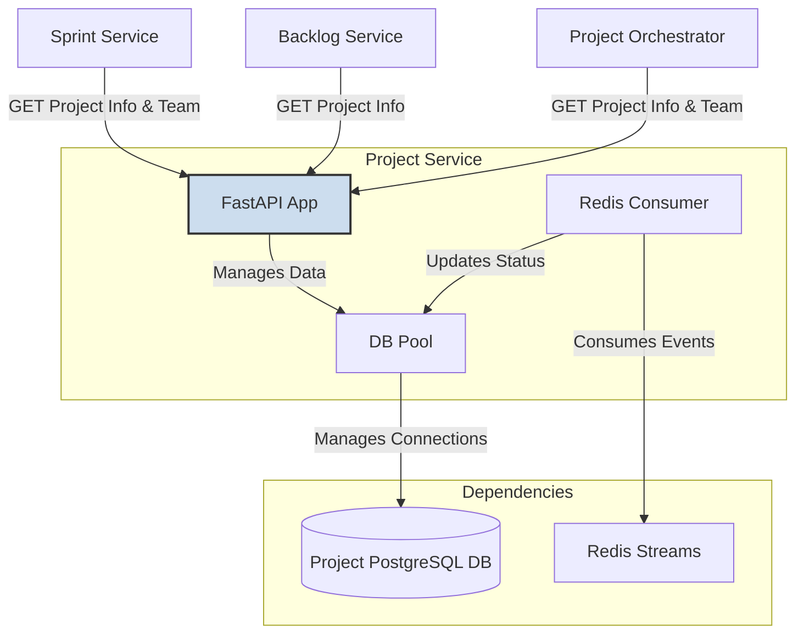

# Project Service Setup Guide

## 1. Overview

The Project Service is a core microservice in the DSM ecosystem, acting as the single source of truth for all project-related data, team management, and calendar operations. Previously split across three separate services (Project, Calendar, and Team Management), this unified service now provides a consolidated API for managing projects, team assignments, holiday calendars, and PTO tracking. It exposes a comprehensive, API-driven interface for other services while ensuring data integrity through a dedicated PostgreSQL database.

## 2. Architecture

The service is designed as a robust and centralized data hub for foundational project data.

-   **Technology Stack**:
    -   **Framework**: FastAPI (Python) for a high-performance, asynchronous API.
    -   **Database**: Dedicated PostgreSQL instance for complete data ownership.
    -   **Messaging**: A Redis consumer listens to the main DSM event stream for `SprintStarted` events to automatically update project statuses.
-   **Key Design Patterns**:
    -   **Centralized Repository**: Acts as the single source of truth for project, team, and calendar data.
    -   **Database Connection Pooling**: Utilizes a `psycopg2` connection pool for efficient and scalable database interactions, managed via `utils.py`.
    -   **Event-Driven Updates**: Consumes events from Redis to keep project statuses synchronized with sprint activities.

### Component Interaction Diagram

This diagram shows how the Project Service interacts with other DSM services and its own components.



## 3. API Endpoints

The service exposes several endpoints under various prefixes.

### 3.1. Project Management (`/projects`)

#### `POST /projects`
-   **Purpose**: Creates a new project.
-   **Request Body**:
    ```json
    {
      "id": "PROJ001",
      "name": "New Project",
      "description": "A description of the new project.",
      "status": "inactive"
    }
    ```
-   **Response**: `201 Created` with `{"message": "Project created successfully", "project_id": "..."}`

#### `GET /projects`
-   **Purpose**: Retrieves a list of all projects.
-   **Response**: `200 OK` with an array of project objects.

#### `GET /projects/{project_id}`
-   **Purpose**: Retrieves details for a single project by its ID.
-   **Response**: `200 OK` with a project object.

#### `PUT /projects/{project_id}/status`
-   **Purpose**: Updates the status of a project (e.g., "active", "inactive").
-   **Request Body**:
    ```json
    {
      "status": "active"
    }
    ```
-   **Response**: `200 OK` with a success message.

### 3.2. Team Management (`/employees`, `/teams`, `/projects/{project_id}/team-members...`)

#### `POST /employees`
-   **Purpose**: Creates a new employee.
-   **Request Body**:
    ```json
    {
      "employee_id": "E001",
      "name": "John Doe",
      "gender": "Male",
      "state": "CA",
      "age": 30
    }
    ```
-   **Response**: `201 Created` with the new employee's ID and name.

#### `GET /employees/{employee_id}`
-   **Purpose**: Retrieves details for a specific employee.
-   **Response**: `200 OK` with an employee object.

#### `GET /teams`
-   **Purpose**: Retrieves all teams (employees).
-   **Response**: `200 OK` with an array of team member objects.

#### `POST /projects/{project_id}/team-members-assign`
-   **Purpose**: Assigns one or more team members to a project.
-   **Request Body**:
    ```json
    {
      "employee_ids": ["E001", "E002"]
    }
    ```
-   **Response**: `200 OK` with a success message.

#### `GET /projects/{project_id}/team-members`
-   **Purpose**: Retrieves all team members assigned to a specific project.
-   **Response**: `200 OK` with the project ID and a list of team members.

### 3.3. Calendar Management (`/calendar`, `/projects/{project_id}/calendar/...`)

#### `GET /calendar/holidays`
-   **Purpose**: Retrieves all defined US holidays.
-   **Response**: `200 OK` with a list of holiday objects.

#### `POST /projects/{project_id}/calendar/pto`
-   **Purpose**: Adds a Paid Time Off (PTO) entry for an employee on a project.
-   **Query Parameters**: `employee_id` (required).
-   **Request Body**:
    ```json
    {
      "start_date": "2025-12-24",
      "end_date": "2025-12-25",
      "reason": "Holiday vacation"
    }
    ```
-   **Response**: `201 Created` with the created PTO entry details.

#### `GET /projects/{project_id}/calendar/pto`
-   **Purpose**: Retrieves all PTO entries for a project's team.
-   **Response**: `200 OK` with a list of PTO objects.

#### `GET /projects/{project_id}/availability/check`
-   **Purpose**: Checks team availability for a given date range, identifying conflicts with holidays or PTO.
-   **Query Parameters**: `start_date`, `end_date` (required, YYYY-MM-DD).
-   **Response**: `200 OK` with an availability status and a list of any conflicts found.

## 4. Data Models & Persistence

The service's data is stored in a dedicated PostgreSQL database. Key tables include:
-   **`projects`**: Stores core project details, including ID, name, description, and status.
-   **`teams`**: Contains information about all employees (team members).
-   **`project_team_mapping`**: A join table linking employees from the `teams` table to projects in the `projects` table.
-   **`us_holidays`**: A reference table for all US holidays.
-   **`pto_calendar`**: Stores all Paid Time Off entries for employees.

This relational model ensures data integrity and provides a solid foundation for project and team management.

## 5. Build and Deployment

### 5.1. Build Docker Image

Run this command from the project's root directory to build the image and push it to the private registry.

```bash
# 1. Build the Docker image
docker build -t myreg.agile-corp.org:5000/project-service:1.0.0 -f services/project-service/Dockerfile services/project-service/

# 2. Push the Docker image
docker push myreg.agile-corp.org:5000/project-service:1.0.0
```

### 5.2. Kubernetes Deployment

The service is deployed using a Deployment and a Service manifest.

#### Deployment Manifest

**File:** `services/project-service/k8s/deployment.yml`
```yaml
apiVersion: apps/v1
kind: Deployment
metadata:
  name: project-service
  namespace: dsm
  labels:
    app: project-service
spec:
  replicas: 1
  selector:
    matchLabels:
      app: project-service
  template:
    metadata:
      labels:
        app: project-service
    spec:
      imagePullSecrets:
      - name: agile-corp-reg-secret
      containers:
      - name: project-service
        image: myreg.agile-corp.org:5000/project-service:1.0.0
        imagePullPolicy: Always
        command: ["uvicorn", "app:app", "--host", "0.0.0.0", "--port", "80"]
        ports:
        - containerPort: 80
        startupProbe:
          httpGet:
            path: /health/ready
            port: 80
          initialDelaySeconds: 5
          periodSeconds: 5
          failureThreshold: 12
        readinessProbe:
          httpGet:
            path: /health/ready
            port: 80
          initialDelaySeconds: 10
          periodSeconds: 5
        livenessProbe:
          httpGet:
            path: /health
            port: 80
          initialDelaySeconds: 15
          periodSeconds: 10
        resources:
          requests:
            memory: "200Mi"
            cpu: "200m"
          limits:
            memory: "400Mi"
            cpu: "400m"
        envFrom:
        - secretRef:
            name: project-db-secret
        - configMapRef:
            name: project-db-config
        env:
        - name: REDIS_HOST
          value: redis
        - name: REDIS_PORT
          value: "6379"
```

#### Service Manifest

**File:** `services/project-service/k8s/service.yml`
```yaml
apiVersion: v1
kind: Service
metadata:
  name: project-service
  namespace: dsm
spec:
  selector:
    app: project-service
  ports:
    - protocol: TCP
      port: 80
      targetPort: 80
  type: ClusterIP
```

### 5.3. Deployment Steps

Apply the Kubernetes manifests to deploy the service.

```bash
# 1. Apply the Deployment
kubectl apply -f services/project-service/k8s/deployment.yml

# 2. Apply the Service
kubectl apply -f services/project-service/k8s/service.yml
```

## 6. Verification

After applying the manifests, use these commands to verify that the deployment is successful.

```bash
# Check if the pod is running
kubectl get pods -n dsm -l app=project-service
# Expected STATUS: Running

# Check the logs to ensure it started without errors and connected to dependencies
POD_NAME=$(kubectl get pods -n dsm -l app=project-service -o jsonpath='{.items[0].metadata.name}')
kubectl logs -f $POD_NAME -n dsm
# Expected output: "Project Service starting up...", "Database connection pool initialized successfully.", "Starting SprintStarted event consumer..."

# Check if the service is created
kubectl get svc project-service -n dsm
# Expected: A ClusterIP service is listed on port 80
```
