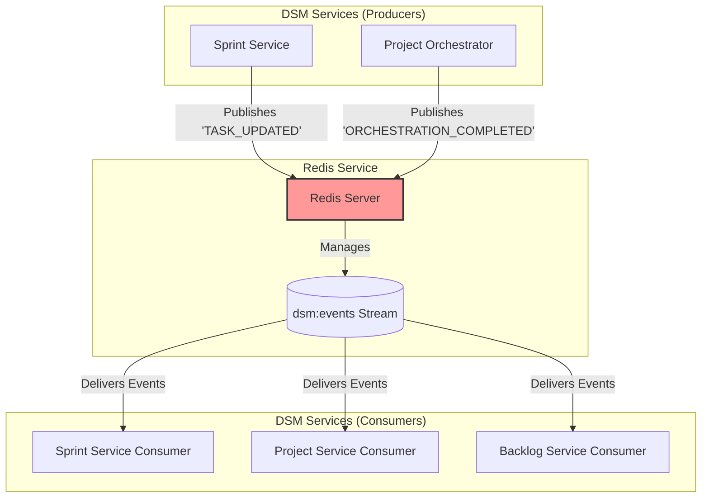
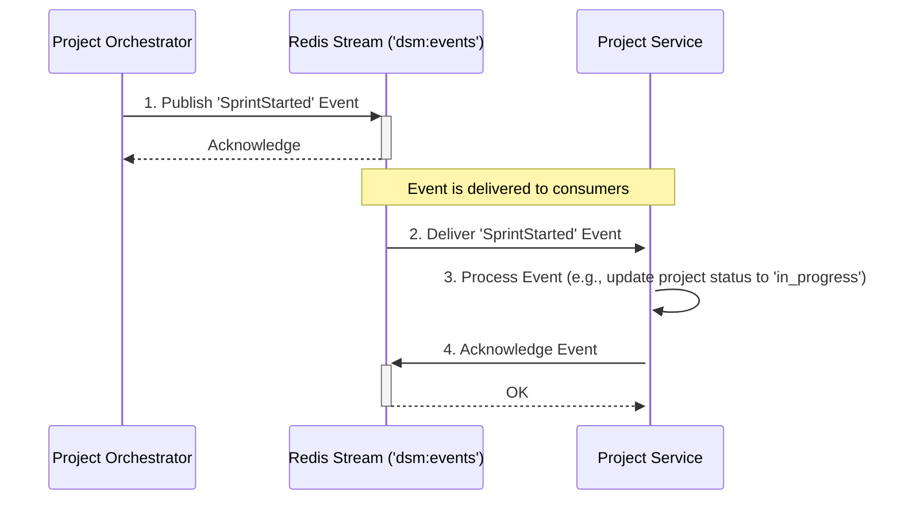

# Redis Service Setup Guide

## 1. Overview

Redis serves as the high-performance, in-memory data store and message broker for the entire DSM (Digital Scrum Master) ecosystem. It is a critical component of the system's infrastructure, enabling asynchronous communication and event-driven workflows between microservices. Its primary function is to host Redis Streams, which act as a central event bus for services to publish and consume events, ensuring loose coupling and high resilience.

## 2. Role in the DSM Architecture

Redis is the backbone of the event-driven architecture within the DSM platform. It is not just a cache but a core service that facilitates communication and data consistency.

-   **Technology Stack**:
    -   **Image**: Official `redis:7.2-alpine` Docker image.
    -   **Primary Feature**: Redis Streams for persistent, append-only event logs.
-   **Key Design Patterns**:
    -   **Message Broker**: Acts as a central hub for all inter-service events, decoupling producers from consumers.
    -   **Event Sourcing**: Services publish events (e.g., `SprintStarted`, `TASK_UPDATED`) to a stream. Other services consume these events to update their own state, ensuring eventual consistency.
    -   **Consumer Groups**: Services like the Sprint Service and Project Service use consumer groups to process messages from the stream reliably and track their progress.

### Event-Driven Communication Diagram

This diagram illustrates how various microservices interact with Redis to publish and consume events, making it the central nervous system for asynchronous communication.



### Event Flow Example (`SprintStarted`)



## 3. Deployment

Redis is deployed as a standard Kubernetes Deployment and exposed within the cluster via a ClusterIP Service.

### 3.1. Kubernetes Deployment Manifest

**File:** `services/redis/redis-deployment.yml`
```yaml
apiVersion: apps/v1
kind: Deployment
metadata:
  name: redis
  namespace: dsm
spec:
  replicas: 1
  selector:
    matchLabels:
      app: redis
  template:
    metadata:
      labels:
        app: redis
    spec:
      containers:
      - name: redis
        image: redis:7.2-alpine
        ports:
        - containerPort: 6379
        resources:
          requests:
            memory: "100Mi"
            cpu: "100m"
          limits:
            memory: "200Mi"
            cpu: "200m"
```

### 3.2. Kubernetes Service Manifest

**File:** `services/redis/redis-service.yml`
```yaml
apiVersion: v1
kind: Service
metadata:
  name: redis
  namespace: dsm
spec:
  selector:
    app: redis
  ports:
    - protocol: TCP
      port: 6379
      targetPort: 6379
  type: ClusterIP
```

### 3.3. Deployment Steps

Apply the Kubernetes manifests from the project root to deploy the service.

```bash
# 1. Apply the Deployment
kubectl apply -f services/redis/redis-deployment.yml

# 2. Apply the Service
kubectl apply -f services/redis/redis-service.yml
```

## 4. Verification

After applying the manifests, use these commands to verify that the Redis instance is running correctly.

```bash
# 1. Check if the Redis pod is running
kubectl get pods -n dsm -l app=redis
# Expected STATUS: Running

# 2. Check the logs to ensure Redis started without errors
POD_NAME=$(kubectl get pods -n dsm -l app=redis -o jsonpath='{.items[0].metadata.name}')
kubectl logs -f $POD_NAME -n dsm
# Expected output: "Ready to accept connections"

# 3. Check if the service is created and has a ClusterIP
kubectl get svc redis -n dsm
# Expected: A ClusterIP service is listed on port 6379

# 4. (Optional) Connect using a debug pod and redis-cli
# Run a temporary pod with redis-tools to connect to the service
kubectl run -it --rm --image=redis:7.2-alpine redis-cli -n dsm -- redis-cli -h redis

# Once connected, you can ping the server or inspect streams
# redis:6379> PING
# Expected output: PONG
# redis:6379> XINFO STREAM dsm:events
# (This will show information about the event stream if it has been created by a producer)
```
