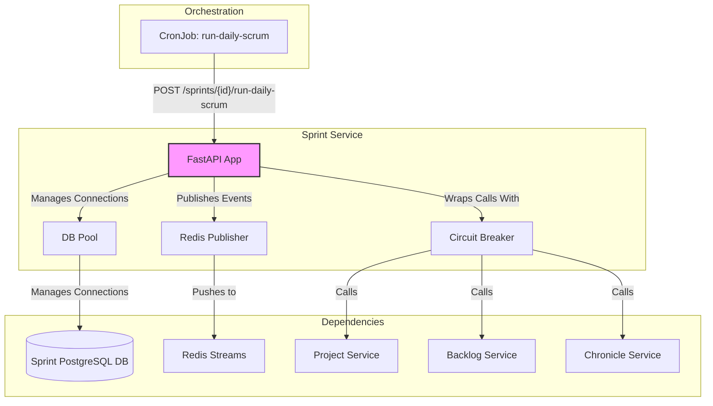
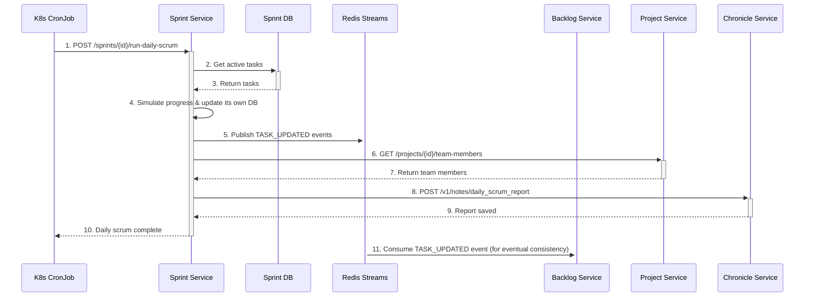

# Sprint Service Setup Guide

## 1. Overview

The Sprint Service is a cornerstone of the DSM ecosystem, responsible for managing the entire lifecycle of a sprint. It orchestrates sprint planning by selecting tasks from the backlog, handles automatic task assignment to team members, tracks sprint progress, and manages sprint completion.

Crucially, this service has also **absorbed the daily scrum simulation and reporting logic**, making it the central hub for daily progress updates. It is designed for high availability, deployed with multiple replicas and protected by a Pod Disruption Budget (PDB) to ensure resilience.

## 2. Architecture

The service is a stateful, API-driven component that acts as the source of truth for all sprint-related activities.

-   **Technology Stack**:
    -   **Framework**: FastAPI (Python) for a high-performance, asynchronous API.
    -   **Database**: Dedicated PostgreSQL instance for storing sprint and task data.
    -   **Messaging**: Publishes `TASK_UPDATED` events to Redis Streams to ensure eventual consistency with the Backlog Service.
-   **Key Design Patterns**:
    -   **Aggregate Pattern**: Manages the `Sprint` aggregate, which includes sprint details and its associated tasks.
    -   **Database Connection Pooling**: Utilizes a `psycopg2` connection pool for efficient and scalable database interactions.
    -   **Circuit Breaker**: Implements a custom circuit breaker to protect against cascading failures when communicating with other services.

### Component Interaction Diagram

This diagram shows how the Sprint Service interacts with other DSM services and its own components.



### Daily Scrum Workflow Diagram

The daily scrum process is now fully encapsulated within the Sprint Service, triggered by a Kubernetes CronJob.



## 3. API Endpoints

### 3.1. Sprint Management

#### `POST /sprints/{project_id}`
-   **Purpose**: Starts a new sprint for a project, assigns unassigned tasks from the backlog, and reports the plan to the Chronicle Service.
-   **Request Body**:
    ```json
    {
      "sprint_name": "Sprint 1",
      "duration_weeks": 2
    }
    ```
-   **Response**: `201 Created` with a confirmation message and the new sprint ID.

#### `GET /sprints/active`
-   **Purpose**: Retrieves the ID of the first active sprint found across all projects.
-   **Response**: `200 OK` with `{"sprint_id": "<active-sprint-id>"}` or `404 Not Found`.

#### `GET /sprints/by-project/{project_id}`
-   **Purpose**: Lists all sprints for a specific project. Can be filtered by status.
-   **Response**: `200 OK` with an array of sprint objects.

#### `GET /sprints/{sprint_id}`
-   **Purpose**: Retrieves detailed information for a single sprint, including its tasks.
-   **Response**: `200 OK` with a sprint object and a list of task objects.

#### `POST /sprints/{sprint_id}/close`
-   **Purpose**: Closes a sprint, moves any unfinished tasks back to the backlog, and generates a retrospective report in the Chronicle Service.
-   **Response**: `200 OK` with a summary of the closure process.

### 3.2. Task Management

#### `POST /tasks/{task_id}/progress`
-   **Purpose**: Updates the progress of a task within a sprint. This is typically called internally or by a trusted service.
-   **Request Body**:
    ```json
    {
      "status": "in_progress",
      "progress_percentage": 50
    }
    ```
-   **Response**: `200 OK` with a success message.

#### `GET /sprints/{sprint_id}/task-summary`
-   **Purpose**: Provides a quick summary of task statistics for a sprint.
-   **Response**: `200 OK` with counts of total, completed, and pending tasks.

### 3.3. Daily Scrum Operations

#### `POST /sprints/{sprint_id}/run-daily-scrum`
-   **Purpose**: The primary endpoint for the daily scrum process. It simulates progress, updates the database, publishes events, and sends a detailed report to the Chronicle Service.
-   **Triggered by**: The `run-daily-scrum` Kubernetes CronJob.
-   **Response**: `200 OK` with a summary of the simulation and the ID of the report created in the Chronicle Service.

## 4. Build and Deployment

### 4.1. Build Docker Image

```bash
# 1. Build the Docker image
docker build -t myreg.agile-corp.org:5000/sprint-service:1.0.7 -f services/sprint-service/Dockerfile services/sprint-service/

# 2. Push the Docker image
docker push myreg.agile-corp.org:5000/sprint-service:1.0.7
```

### 4.2. Kubernetes Deployment

The service is deployed with a Deployment, Service, and is protected by a Pod Disruption Budget.

#### Deployment Manifest

**File:** `k8s/deployment.yml`
```yaml
apiVersion: apps/v1
kind: Deployment
metadata:
  name: sprint-service
  namespace: dsm
  labels:
    app: sprint-service
spec:
  replicas: 2
  selector:
    matchLabels:
      app: sprint-service
  template:
    metadata:
      labels:
        app: sprint-service
    spec:
      containers:
      - name: sprint-service
        image: myreg.agile-corp.org:5000/sprint-service:1.0.7
        imagePullPolicy: Always
        ports:
        - containerPort: 80
        startupProbe:
          httpGet:
            path: /health/ready
            port: 80
          initialDelaySeconds: 5
          periodSeconds: 5
          failureThreshold: 12
        livenessProbe:
          httpGet:
            path: /health
            port: 80
          initialDelaySeconds: 15
          periodSeconds: 10
        resources:
          requests:
            memory: "200Mi"
            cpu: "200m"
          limits:
            memory: "400Mi"
            cpu: "400m"
        envFrom:
        - secretRef:
            name: sprint-db-secret
        - configMapRef:
            name: sprint-db-config
        env:
        - name: PROJECT_SERVICE_URL
          value: "http://project-service:80"
        - name: BACKLOG_SERVICE_URL
          value: "http://backlog-service:80"
        - name: CHRONICLE_SERVICE_URL
          value: "http://chronicle-service.dsm.svc.cluster.local:80"
        - name: REDIS_HOST
          value: "redis"
        - name: REDIS_PORT
          value: "6379"
      imagePullSecrets:
      - name: agile-corp-reg-secret
```

#### Service Manifest

**File:** `k8s/service.yml`
```yaml
apiVersion: v1
kind: Service
metadata:
  name: sprint-service
  namespace: dsm
spec:
  selector:
    app: sprint-service
  ports:
    - protocol: TCP
      port: 80
      targetPort: 80
  type: ClusterIP
```

### 4.3. Deployment Steps

```bash
# 1. Apply the Deployment
kubectl apply -f services/sprint-service/k8s/deployment.yml

# 2. Apply the Service
kubectl apply -f services/sprint-service/k8s/service.yml
```
