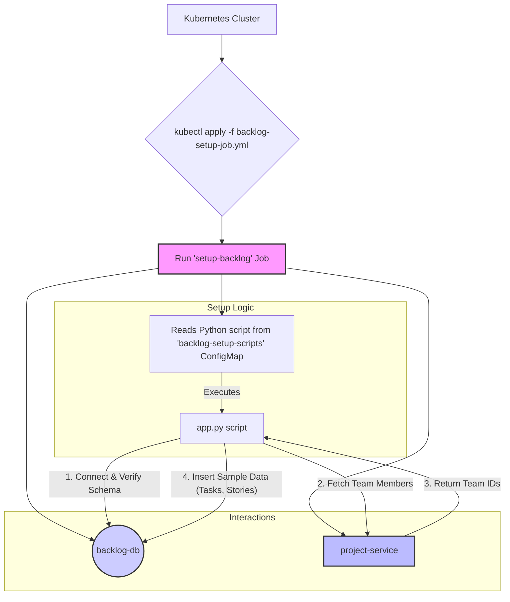

# Backlog Setup Job

## 1. Overview

The Backlog Setup Job is a one-time Kubernetes Job responsible for initializing the **Backlog Service** with a predefined set of sample data. It populates the `backlog-db` PostgreSQL database with sample tasks, stories, and their relationships for a test project (`TEST-001`).

This job is a critical component of the DSM (Digital Scrum Master) system's bootstrap process, enabling developers and testers to have a ready-to-use environment without manually creating backlog items. The job is designed to be **idempotent**, meaning it can be run multiple times without creating duplicate entries.

### Key Responsibilities:
- Connect to the `backlog-db` database.
- Verify that the required database tables (created by migration jobs) exist.
- Communicate with the **Project Service** API to fetch team member details for task assignments.
- Insert a standard set of sample tasks and stories into the database.
- Link tasks to stories to create a coherent sample backlog.

---

## 2. Architecture and Flow

The setup process involves the Kubernetes Job, a ConfigMap holding the application logic, the Backlog database, and the Project Service.



---

## 3. Prerequisites

Before running the Backlog Setup Job, ensure the following components are deployed and running within the `dsm` namespace:

1.  **Kubernetes Namespace:** The `dsm` namespace must exist.
2.  **Database Migrations:** All database migration jobs must have completed successfully, creating the necessary tables (`tasks`, `stories`, `story_tasks`) in the `backlog-db`.
3.  **Backlog Database:** The `postgres-backlog` deployment and its corresponding service (`backlog-db`) must be running and accessible.
4.  **Project Service:** The `project-service` deployment and service must be running and accessible, as the setup job depends on its API to retrieve team member data for task assignments.

---

## 4. How It Works

The setup process is orchestrated by a Kubernetes Job defined in `k8s/backlog-setup-job.yml`.

1.  **Configuration as Code:** The core Python application logic (`app.py`), utility functions (`utils.py`), and dependencies (`requirements.txt`) are stored in Kubernetes ConfigMaps (`backlog-setup-scripts`). This approach avoids the need to build a separate Docker image for this simple, one-off task.
2.  **Job Execution:** When the job is applied, a pod is created using a standard `python:3.10` image.
3.  **Initialization:** The pod's entrypoint command first installs the required Python libraries (`psycopg2-binary`, `httpx`, `structlog`) from the mounted `requirements.txt`.
4.  **Script Execution:** It then executes the `app.py` script.
5.  **Data Seeding Logic (`app.py`):
    - It connects to the `backlog-db` using credentials and connection details sourced from ConfigMaps and Secrets.
    - It calls the `project-service` API endpoint (`/projects/TEST-001/team-members`) to get a list of team members. If the service is unavailable, it falls back to a default list of employee IDs.
    - To ensure idempotency, it first deletes any sample data that might exist from a previous run.
    - It inserts a predefined list of sample tasks and stories. Tasks are assigned to the fetched team members in a round-robin fashion.
    - Finally, it creates relationships between stories and tasks in the `story_tasks` table.

---

## 5. Deployment

To run the Backlog Setup Job, follow the steps outlined in the main **[DSM Deployment & Operations Guide](../../docs/DSM_Deployment_Operations.md#42-backlog-setup-job)**.

1.  **Create the ConfigMap:**
    The first step is to create a ConfigMap that bundles all the necessary Python scripts and dependencies.

    ```bash
    kubectl -n dsm create configmap backlog-setup-scripts \
      --from-file=src/app.py \
      --from-file=src/utils.py \
      --from-file=src/requirements.txt \
      --dry-run=client -o yaml | kubectl apply -f -
    ```

2.  **Apply the Job:**
    Once the ConfigMap is created, apply the Kubernetes Job manifest.

    ```bash
    kubectl apply -f k8s/backlog-setup-job.yml
    ```

---

## 6. Verification

You can monitor the job's execution and verify its completion.

1.  **Check Job Status:**
    Watch the job until its status is `Completed`.

    ```bash
    # Check the job's status
    kubectl get jobs -n dsm setup-backlog

    # Expected output:
    # NAME            COMPLETIONS   DURATION   AGE
    # setup-backlog   1/1           25s        ...
    ```

2.  **Inspect Logs:**
    Check the logs of the pod created by the job to see the script's output and confirm that sample data was created successfully.

    ```bash
    # Find the pod name associated with the job
    POD_NAME=$(kubectl get pods -n dsm -l job-name=setup-backlog -o jsonpath='{.items[0].metadata.name}')

    # View the logs
    kubectl logs -n dsm $POD_NAME

    # Expected log output snippet:
    # {"level": "info", "event": "Starting backlog setup job...", ...}
    # {"level": "info", "event": "Backlog database connection successful.", ...}
    # {"level": "info", "event": "Retrieved team members for project", "count": 4, "project_id": "TEST-001"}
    # {"level": "info", "event": "Created 8 tasks, 4 stories, and 8 story-task mappings"}
    # {"level": "info", "event": "Backlog setup completed successfully. Created 8 backlog items for project TEST-001"}
    ```

3.  **Query the Database (Optional):**
    For a definitive check, you can `exec` into the `postgres-backlog` pod and query the `tasks` table to see the newly inserted data.

---

## 7. Configuration

The job's behavior is configured through environment variables defined in `k8s/backlog-setup-job.yml`. These variables are sourced from other Kubernetes resources:

| Environment Variable  | Source                | Key                  | Description                                      |
| --------------------- | --------------------- | -------------------- | ------------------------------------------------ |
| `POSTGRES_HOST`       | Value                 | -                    | The service name of the Backlog database.        |
| `POSTGRES_PORT`       | Value                 | -                    | The port for the Backlog database.               |
| `POSTGRES_USER`       | ConfigMap (`backlog-db-config`) | `POSTGRES_USER`      | The username for the database connection.        |
| `POSTGRES_PASSWORD`   | Secret (`backlog-db-secret`) | `POSTGRES_PASSWORD`  | The password for the database connection.        |
| `POSTGRES_DB`         | ConfigMap (`backlog-db-config`) | `POSTGRES_DB`        | The name of the database to connect to.          |
| `PROJECT_SERVICE_URL` | Value                 | -                    | The internal cluster URL for the Project Service. |
| `PROJECT_ID`          | Value                 | -                    | The hardcoded project ID for which to create data. |
| `SPRINT_ID`           | Value                 | -                    | A hardcoded sprint ID (currently unused in script).|
