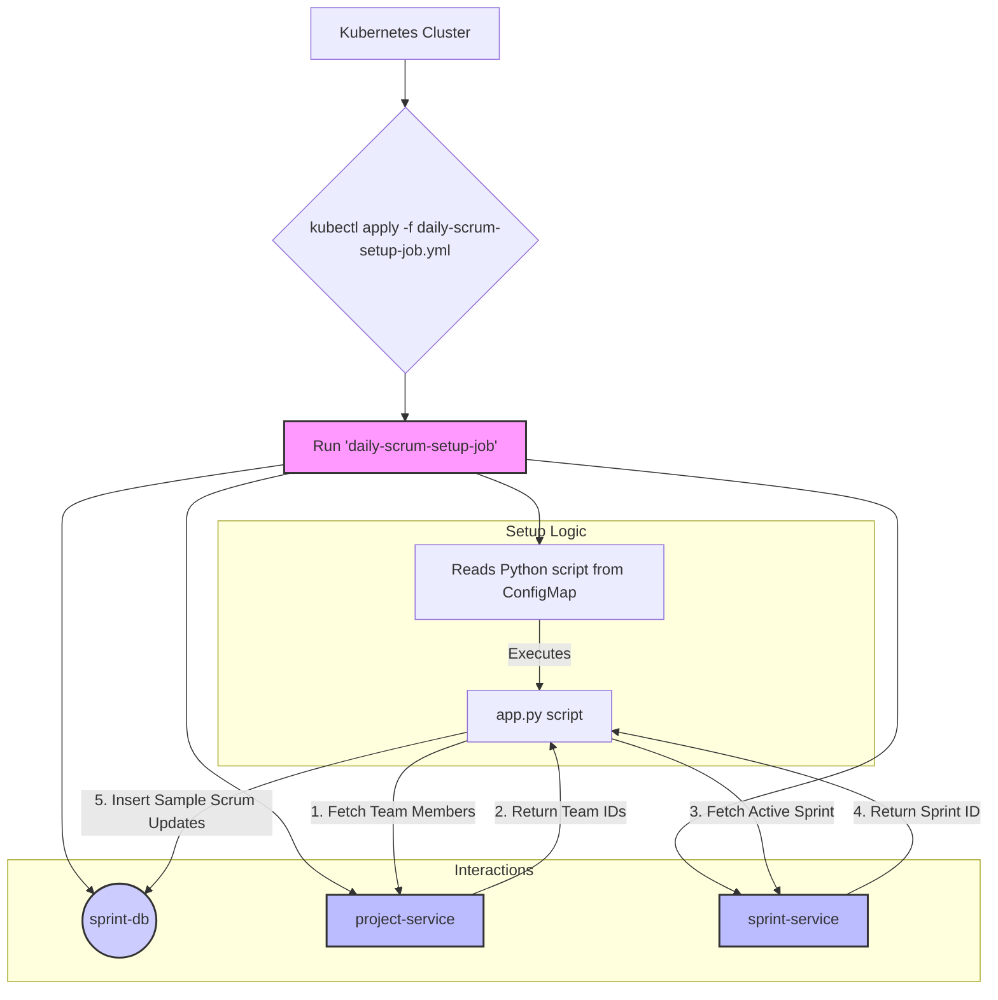

# Daily Scrum Setup Job

> **DEPRECATION NOTICE**
>
> This setup job is considered **deprecated** and is no longer a required part of the standard DSM system bootstrap process.
>
> The responsibility for simulating and managing daily scrums has been consolidated into the **Sprint Service**. The automated execution of the daily scrum process is now dynamically managed by the **Project Orchestration Service**, which creates on-demand Kubernetes CronJobs.
>
> This documentation is preserved for historical context and for environments that may still be using the older architecture. **Do not run this job in a modern DSM deployment.**

## 1. Overview

The Daily Scrum Setup Job was a one-time Kubernetes Job designed to populate the `sprint-db` with sample daily scrum updates for a test project (`TEST-001`). Its primary goal was to provide initial data for the now-deprecated `Daily Scrum Service`, allowing for immediate testing of daily scrum simulations and reporting features.

The job was designed to be **idempotent**, checking for existing entries before inserting new ones to avoid duplication.

### Original Key Responsibilities:
- Connect to the `sprint-db` PostgreSQL database.
- Ensure the `daily_scrum_updates` table exists.
- Communicate with the **Project Service** to get team members for the test project.
- Communicate with the **Sprint Service** to identify the currently active sprint.
- Insert several days of simulated daily scrum updates for each team member.

---

## 2. Original Architecture and Flow

The job would run after the core services were deployed. It interacted with multiple services to gather context before writing data directly to the Sprint database.



---

## 3. Prerequisites (Historical)

Before running this job, the following components were required to be running in the `dsm` namespace:

1.  **Sprint Database:** The `postgres-sprint` deployment and its service.
2.  **Project Service:** The `project-service` deployment and service.
3.  **Sprint Service:** The `sprint-service` deployment and service, with an active sprint already created for project `TEST-001`.

---

## 4. How It Worked

The setup process was orchestrated by a Kubernetes Job defined in `k8s/daily-scrum-setup-job.yml`.

1.  **Configuration as Code:** The Python application logic (`app.py`) and its dependencies (`requirements.txt`) were stored in Kubernetes ConfigMaps (`daily-scrum-setup-code-cm`, `daily-scrum-setup-requirements-cm`).
2.  **Job Execution:** When applied, the job created a pod using a `python:3.10` image.
3.  **Initialization:** The pod's entrypoint command first installed the required Python libraries (`psycopg2-binary`, `httpx`, `structlog`).
4.  **Script Execution:** It then executed the `app.py` script.
5.  **Data Seeding Logic (`app.py`):**
    - It connected to the `sprint-db` using credentials from the `postgres-sprint-secret`.
    - It called the `project-service` to get the list of team members for `TEST-001`.
    - It called the `sprint-service` to find the ID of the currently active sprint for `TEST-001`.
    - If a team and an active sprint were found, it would loop through each team member and generate three days of historical daily scrum updates (e.g., "what I did yesterday," "what I'll do today," "any impediments").
    - Before inserting, it checked if an update for a specific employee on a specific date already existed, thus ensuring idempotency.

---

## 5. Deployment (Historical)

To run the Daily Scrum Setup Job, the following commands were used.

1.  **Create the ConfigMaps:**

    ```bash
    # ConfigMap for the Python script
    kubectl apply -f k8s/daily-scrum-setup-code-cm.yml

    # ConfigMap for the requirements.txt
    kubectl apply -f k8s/daily-scrum-setup-requirements-cm.yml
    ```

2.  **Apply the Job:**

    ```bash
    kubectl apply -f k8s/daily-scrum-setup-job.yml
    ```

---

## 6. Verification (Historical)

1.  **Check Job Status:**

    ```bash
    kubectl get jobs -n dsm daily-scrum-setup-job
    ```

2.  **Inspect Logs:**

    ```bash
    # Find the pod name associated with the job
    POD_NAME=$(kubectl get pods -n dsm -l job-name=daily-scrum-setup-job -o jsonpath='{.items[0].metadata.name}')

    # View the logs
    kubectl logs -n dsm $POD_NAME

    # Expected log output snippet:
    # {"event": "Starting Daily Scrum Setup Job...", "level": "info"}
    # {"event": "Database connection established.", "level": "info"}
    # {"event": "Populated daily scrum update for EMP001 in sprint TEST-001-S01 on 2025-11-27.", "level": "info"}
    # {"event": "Daily scrum data population completed successfully.", "level": "info"}
    # {"event": "Daily Scrum Setup Job completed successfully.", "level": "info"}
    ```
