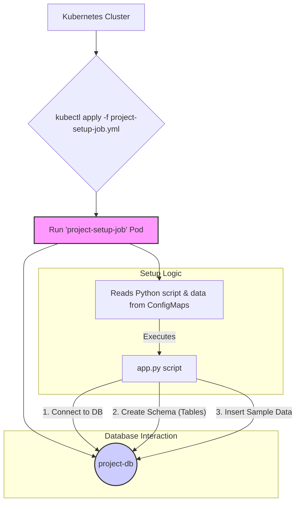

# Project Setup Job

## 1. Overview

The Project Setup Job is a foundational, one-time Kubernetes Job that initializes the **Project Service's** database (`project-db`) with essential master data. It is one of the first setup jobs to be run, as many other services and setup jobs depend on the data it creates.

This job is responsible for creating the database schema and populating it with a comprehensive set of sample data, including projects, teams, employee roles, designations, and US holidays. This ensures that the entire DSM (Digital Scrum Master) ecosystem has a consistent and ready-to-use dataset for development, testing, and demonstration purposes. The job is designed to be **idempotent**; it uses `CREATE TABLE IF NOT EXISTS` and `INSERT ... ON CONFLICT` statements, allowing it to be run multiple times without causing errors or creating duplicate data.

### Key Responsibilities:
- Connect directly to the `project-db` PostgreSQL database.
- Create all necessary tables (`projects`, `teams`, `roles`, `designations`, `pto_calendar`, `us_holidays`, and various mapping tables).
- Populate the tables with a rich set of sample data:
    - A predefined list of projects.
    - 100 randomly generated team members using the `mimesis` library.
    - Predefined roles and designations.
    - A list of US holidays for the year 2025, loaded from a JSON file.
- Create initial relationships between projects, teams, roles, and designations.

---

## 2. Architecture and Flow

The Project Setup Job is self-contained. It runs within the Kubernetes cluster and interacts directly with the Project database without calling any service APIs.



---

## 3. Prerequisites

Before running the Project Setup Job, ensure the following components are deployed and running within the `dsm` namespace:

1.  **Kubernetes Namespace:** The `dsm` namespace must exist.
2.  **Project Database:** The `postgres-project` deployment and its corresponding service (`project-db`) must be running and accessible.
3.  **Database Credentials:** The `project-db-secret` (for the password) and `project-db-config` (for username, host, etc.) must exist in the `dsm` namespace.

---

## 4. How It Works

The setup process is orchestrated by a Kubernetes Job defined in `k8s/project-setup-job.yml`.

1.  **Configuration as Code:** The core Python application logic (`app.py`), dependencies (`requirements.txt`), and holiday data (`us-holiday.json`) are stored in Kubernetes ConfigMaps. This strategy avoids the need to build a custom Docker image for this initialization task.
2.  **Job Execution:** When the job is applied, a pod is created using a standard `python:3.10` image.
3.  **Initialization:** The pod's entrypoint command first installs the required Python libraries (including `psycopg2`, `pandas`, and `mimesis`) from the mounted `requirements.txt`.
4.  **Script Execution:** It then executes the `app.py` script.
5.  **Data Seeding Logic (`app.py`):
    - The script establishes a direct connection to the `project-db` using credentials passed as environment variables.
    - It runs a series of `CREATE TABLE IF NOT EXISTS` SQL commands to build the entire database schema.
    - It populates the `projects`, `roles`, and `designations` tables from hardcoded lists.
    - It uses the `mimesis` library to generate 100 realistic but fake employee records for the `teams` table.
    - It reads the `us-holiday.json` file (mounted from a ConfigMap) and populates the `us_holidays` table. The script includes logic to adjust holidays that fall on a weekend to the nearest weekday (Friday or Monday).
    - Finally, it creates a few sample mappings in the `project_team_mapping` and related tables to link the generated data together.

---

## 5. Deployment

To run the Project Setup Job, follow the steps outlined in the main **[DSM Deployment & Operations Guide](../../docs/DSM_Deployment_Operations.md#41-project-setup-job)**.

1.  **Create the ConfigMaps:**
    This single command bundles the Python script, requirements, and holiday data into a ConfigMap.

    ```bash
    kubectl -n dsm create configmap project-setup-scripts \
      --from-file=src/app.py \
      --from-file=src/us-holiday.json \
      --from-file=src/requirements.txt \
      --dry-run=client -o yaml | kubectl apply -f -
    ```

2.  **Apply the Job:**
    Once the ConfigMap is created, apply the Kubernetes Job manifest.

    ```bash
    kubectl apply -f k8s/project-setup-job.yml
    ```

---

## 6. Verification

You can monitor the job's execution and verify its completion.

1.  **Check Job Status:**
    Watch the job until its status shows `1/1` under the `COMPLETIONS` column.

    ```bash
    # Check the job's status
    kubectl get jobs -n dsm project-setup-job

    # Expected output:
    # NAME                COMPLETIONS   DURATION   AGE
    # project-setup-job   1/1           45s        ...
    ```

2.  **Inspect Logs:**
    Check the logs of the pod created by the job to see the script's output and confirm successful data population.

    ```bash
    # Find the pod name associated with the job
    POD_NAME=$(kubectl get pods -n dsm -l job-name=project-setup-job -o jsonpath='{.items[0].metadata.name}')

    # View the logs
    kubectl logs -n dsm $POD_NAME

    # Expected log output snippet:
    # {"event": "Creating tables...", "level": "info"}
    # {"event": "Tables created successfully.", "level": "info"}
    # {"event": "Populating projects table...", "level": "info"}
    # {"event": "Projects table populated.", "level": "info"}
    # ... (similar messages for teams, roles, etc.) ...
    # {"event": "us_holidays table populated.", "level": "info"}
    # {"event": "Project setup completed successfully", "level": "info"}
    ```

3.  **Query the Database (Optional):**
    For a definitive check, you can `exec` into the `postgres-project` pod and query a table (e.g., `SELECT COUNT(*) FROM projects;`) to verify that the data has been inserted.
