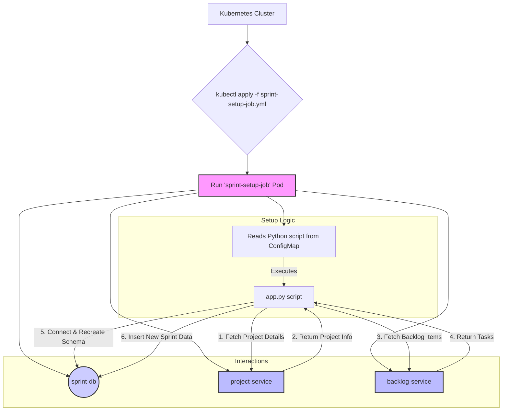

# Sprint Setup Job

## 1. Overview

The Sprint Setup Job is a one-time Kubernetes Job that initializes the **Sprint Service** ecosystem. Its primary function is to create a sample sprint for the test project (`TEST-001`), making the system ready for end-to-end testing of the sprint lifecycle, including daily scrum simulations.

This job interacts with multiple services to gather necessary context before writing to the `sprint-db`. It is designed to be repeatable, but it's important to note its behavior: the script **drops and recreates** the `sprints` and `daily_scrum_updates` tables upon execution to ensure a clean state. This is a destructive action intended for non-production environments.

### Key Responsibilities:
- Connect to the `sprint-db` PostgreSQL database.
- Drop and recreate the core sprint-related tables.
- Communicate with the **Project Service** to verify the existence of the test project.
- Communicate with the **Backlog Service** to fetch backlog items (though not currently used for task assignment in the script, this demonstrates the intended data flow).
- Create a new, two-week, `in_progress` sprint for the `TEST-001` project.
- Populate the `daily_scrum_updates` table with a few days of sample data for the newly created sprint.

---

## 2. Architecture and Flow

The Sprint Setup Job acts as a coordinator, fetching information from upstream services before populating the Sprint database.



---

## 3. Prerequisites

Before running the Sprint Setup Job, ensure the following components are deployed and running within the `dsm` namespace:

1.  **Kubernetes Namespace:** The `dsm` namespace must exist.
2.  **Sprint Database:** The `postgres-sprint` deployment and its service must be running.
3.  **Project Service:** The `project-service` must be running and accessible. The `Project Setup Job` must have been completed successfully.
4.  **Backlog Service:** The `backlog-service` must be running and accessible. The `Backlog Setup Job` must have been completed successfully.
5.  **Database Credentials:** The `postgres-sprint-secret` must exist in the `dsm` namespace.

---

## 4. How It Works

The setup process is orchestrated by a Kubernetes Job defined in `k8s/sprint-setup-job.yml`.

1.  **Configuration as Code:** The Python application logic (`app.py`) and its dependencies (`requirements.txt`) are stored in Kubernetes ConfigMaps. This avoids the need to build a dedicated Docker image for this setup task.
2.  **Job Execution:** When the job is applied, a pod is created using a standard `python:3.10` image.
3.  **Initialization:** The pod's entrypoint command first installs the required Python libraries (`psycopg2-binary`, `httpx`, `structlog`) from the mounted `requirements.txt`.
4.  **Script Execution:** It then executes the `app.py` script.
5.  **Data Seeding Logic (`app.py`):
    - It connects to the `sprint-db` using credentials from the `postgres-sprint-secret`.
    - **Warning:** It executes `DROP TABLE` on `sprints` and `daily_scrum_updates` before recreating them. This clears all existing sprint data.
    - It calls the `project-service` API to ensure the `TEST-001` project exists.
    - It calls the `backlog-service` API to fetch unassigned tasks for the project.
    - It clears any previous sprint data for `TEST-001` and creates a new sprint record with a two-week duration and a status of `in_progress`.
    - It populates the `daily_scrum_updates` table with three days of sample updates for a hardcoded list of employees, associating them with the newly created sprint.

---

## 5. Deployment

To run the Sprint Setup Job, follow the steps outlined in the main **[DSM Deployment & Operations Guide](../../docs/DSM_Deployment_Operations.md#43-sprint-setup-job)**.

1.  **Create the ConfigMaps:**
    Create the ConfigMaps containing the Python script and its requirements.

    ```bash
    # This command can be adapted to create the necessary ConfigMaps from the src/ and k8s/ directories.
    # For example:
    kubectl -n dsm create configmap sprint-setup-scripts \
      --from-file=src/app.py \
      --from-file=src/requirements.txt \
      --dry-run=client -o yaml | kubectl apply -f -
    ```

2.  **Apply the Job:**
    Once the ConfigMaps are in place, apply the Kubernetes Job manifest.

    ```bash
    kubectl apply -f k8s/sprint-setup-job.yml
    ```

---

## 6. Verification

You can monitor the job's execution and verify its completion.

1.  **Check Job Status:**
    Watch the job until its status is `Completed`.

    ```bash
    # Check the job's status
    kubectl get jobs -n dsm sprint-setup-job

    # Expected output:
    # NAME               COMPLETIONS   DURATION   AGE
    # sprint-setup-job   1/1           30s        ...
    ```

2.  **Inspect Logs:**
    Check the logs of the pod created by the job to confirm successful execution.

    ```bash
    # Find the pod name associated with the job
    POD_NAME=$(kubectl get pods -n dsm -l job-name=sprint-setup-job -o jsonpath='{.items[0].metadata.name}')

    # View the logs
    kubectl logs -n dsm $POD_NAME

    # Expected log output snippet:
    # {"event": "Starting Sprint Setup Job...", "level": "info"}
    # {"event": "Database connection established.", "level": "info"}
    # {"event": "Sprint tables created or already exist.", "level": "info"}
    # {"event": "Created sprint SPRINT-1 for project TEST-001.", "level": "info"}
    # {"event": "Populated sample daily scrum updates for sprint SPRINT-1.", "level": "info"}
    # {"event": "Sprint Setup Job completed successfully.", "level": "info"}
    ```

3.  **Query the Database (Optional):**
    You can `exec` into the `postgres-sprint` pod and query the `sprints` table to see the newly created sprint for `TEST-001`.
